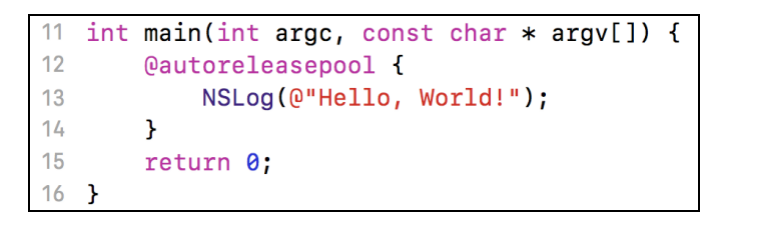
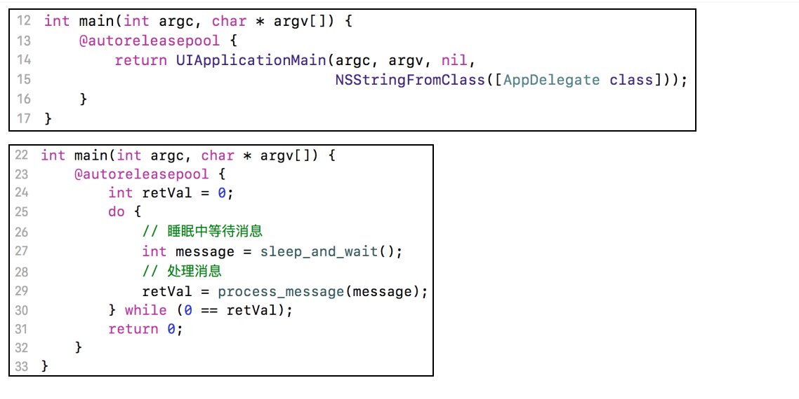
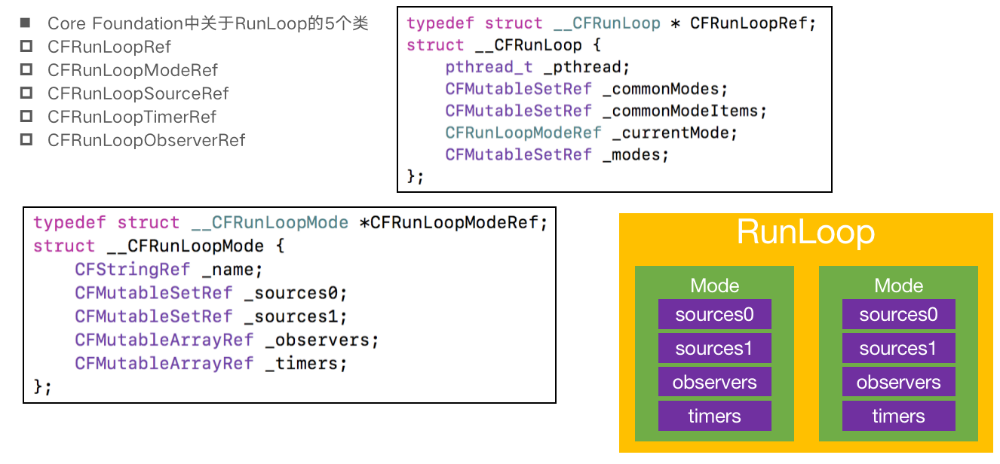
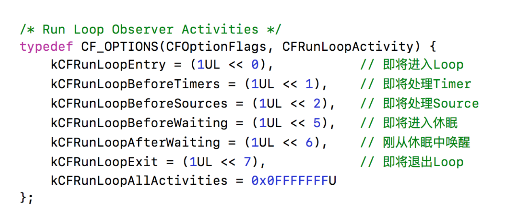
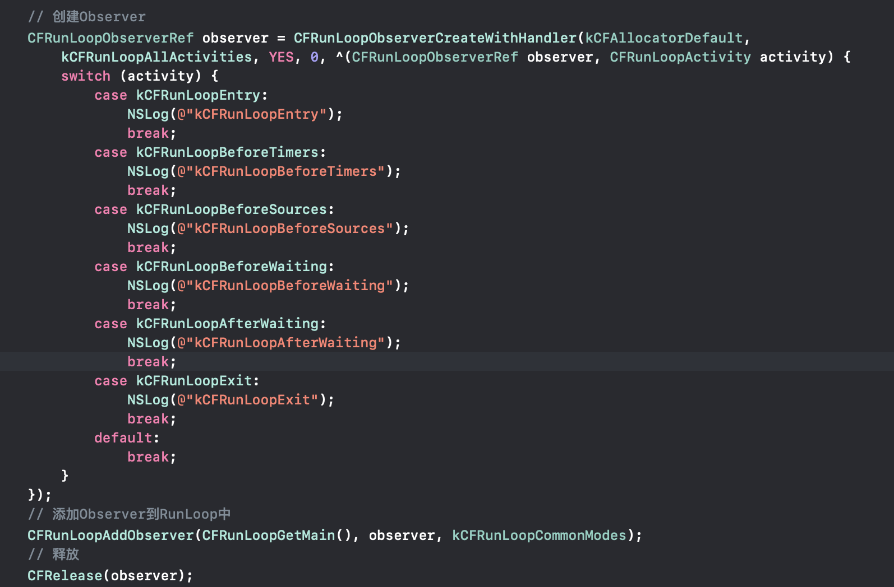
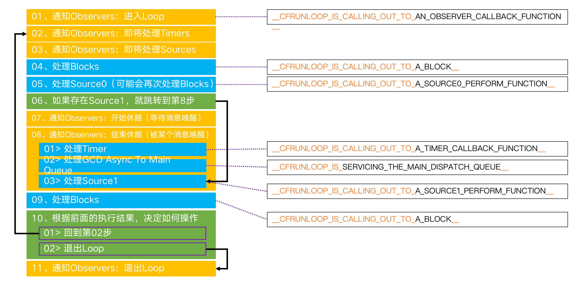
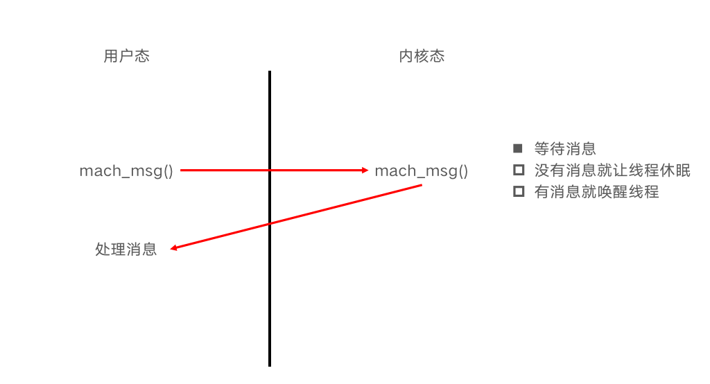
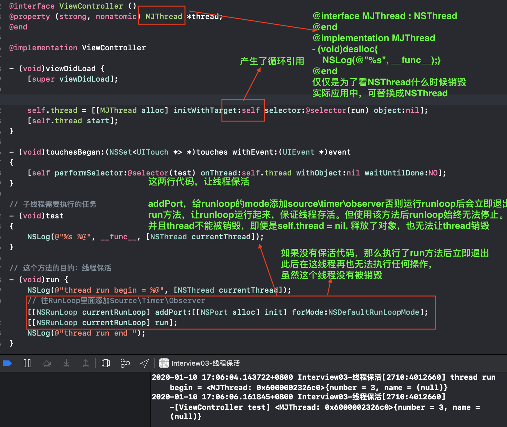
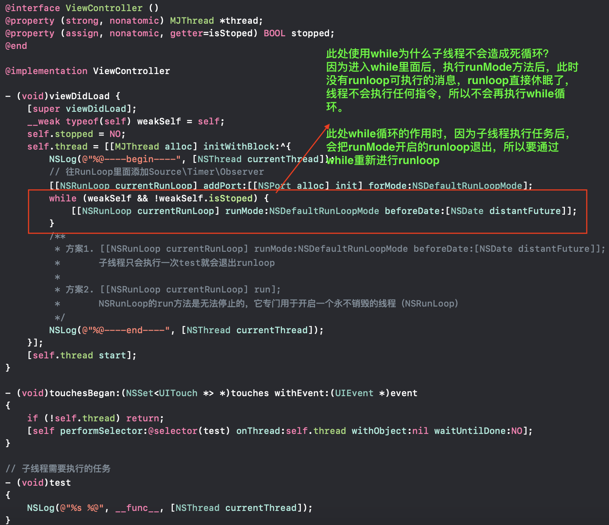
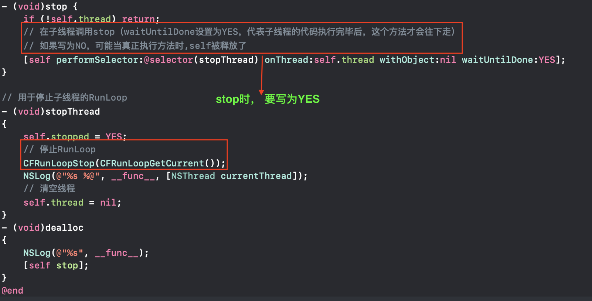

## Runloop

### 基本认识

+ 顾名思义

  - 运行循环

  - 在程序运行过程中循环做一些事情

    

+ 应用范畴

  - 定时器（Timer）、PerformSelector
  - GCD Async Main Queue
  - 事件响应、手势识别、界面刷新
  - 网络请求
  - AutoreleasePool


+ 如果没有runloop

  

  + 执行完13行代码后，即将退出程序

+ 如果有了RunLoop

  

  - 程序并不会马上退出，而是保持运行状态

+ RunLoop的基本作用
  - 保持程序的持续运行
  - 处理App中的各种事件（比如触摸事件、定时器事件等）
  - 节省CPU资源，提高程序性能：该做事时做事，该休息时休息


### Runloop对象

+ iOS中有2套API来访问和使用RunLoop
  - Foundation：NSRunLoop
  - Core Foundation：CFRunLoopRef
+ NSRunLoop和CFRunLoopRef都代表着RunLoop对象
  - NSRunLoop是基于CFRunLoopRef的一层OC包装
  - CFRunLoopRef是开源的
    - https://opensource.apple.com/tarballs/CF/

### RunLoop与线程

+ 每条线程都有唯一的一个与之对应的RunLoop对象
+ RunLoop保存在一个全局的Dictionary里，线程作为key，RunLoop作为value
+ 线程刚创建时并没有RunLoop对象，RunLoop会在第一次获取它时创建
+ RunLoop会在线程结束时销毁
+ 主线程的RunLoop已经自动获取（创建），子线程默认没有开启RunLoop

### 获取RunLoop对象

+ Foundation
  - [NSRunLoop currentRunLoop]; // 获得当前线程的RunLoop对象
  - [NSRunLoop mainRunLoop]; // 获得主线程的RunLoop对象

+ Core Foundation
  - CFRunLoopGetCurrent(); // 获得当前线程的RunLoop对象
  - CFRunLoopGetMain(); // 获得主线程的RunLoop对象

### RunLoop相关的类



### CFRunLoopModeRef

+ CFRunLoopModeRef代表RunLoop的运行模式
+ 一个RunLoop包含若干个Mode，每个Mode又包含若干个Source0/Source1/Timer/Observer
+ RunLoop启动时只能选择其中一个Mode，作为currentMode
+ 如果需要切换Mode，只能退出当前Loop，再重新选择一个Mode进入
  - 不同组的Source0/Source1/Timer/Observer能分隔开来，互不影响
+ 如果Mode里没有任何Source0/Source1/Timer/Observer，RunLoop会立马退出

+ 常见的2种Mode
  - kCFRunLoopDefaultMode（NSDefaultRunLoopMode）：App的默认Mode，通常主线程是在这个Mode下运行
  - UITrackingRunLoopMode：界面跟踪 Mode，用于 ScrollView 追踪触摸滑动，保证界面滑动时不受其他 Mode 影响

### Runloop的运行逻辑

+ Source0
  - 触摸事件处理
  - performSelector:onThread:
+ Source1
  - 基于Port的**线程间**通信
  - 系统事件捕捉
+ Timers
  - NSTimer
  - performSelector:withObject:afterDelay:
+ Observers
  - 用于监听RunLoop的状态
  - UI刷新（BeforeWaiting）
  - Autorelease pool（BeforeWaiting）
+ 流程
  - 01、通知Observers：进入Loop
  - 02、通知Observers：即将处理Timers
  - 03、通知Observers：即将处理Sources
  - 04、处理Blocks
  - 05、处理Source0（可能会再次处理Blocks）
  - 06、如果存在Source1，就跳转到第8步
  - 07、通知Observers：开始休眠（等待消息唤醒）
  - 08、通知Observers：结束休眠（被某个消息唤醒）
    - 01> 处理Timer
    - 02> 处理GCD Async To Main Queue
    - 03> 处理Source1
  - 09、处理Blocks
  - 10、根据前面的执行结果，决定如何操作
    - 01> 回到第02步
    - 02> 退出Loop
  - 11、通知Observers：退出Loop

### CFRunLoopObserverRef



+ 使用CFRunLoopObserverRef

  

  

### Runloop执行流程图



+ 上面的处理block指的是

  ````objective-c
   CFRunLoopPerformBlock(CFRunLoopRef rl, CFTypeRef mode, ^(void)block)
  ````

+ 但gcd被放到主队类时，是依赖于主线的runloop的，其他gcd不依赖于主线程runloop

  ```objc
  dispatch_async(dispatch_get_main_queue(), ^{});
  ```

+ 当线程进入休眠后不做任何事情，相当于阻塞

  - 休眠时，该线程不会再执行汇编指令

  - 当前线程不占用cpu资源，节省cpu资源

  - 调用内核函数mach_msg()，从用户态进入内核态，从而让线程进行休眠

  - 当有消息时，线程被唤醒切换回用户态后，处理消息

    

### 源码分析

1. CFRunLoopRun函数

   ```c
   void CFRunLoopRun(void) {	/* DOES CALLOUT */
       int32_t result;
       do {
           result = CFRunLoopRunSpecific(CFRunLoopGetCurrent(), kCFRunLoopDefaultMode, 1.0e10, false);
           CHECK_FOR_FORK();
       } while (kCFRunLoopRunStopped != result && kCFRunLoopRunFinished != result);
     
   }
   ```

2. CFRunLoopRunSpecific函数

   ```objc
   SInt32 CFRunLoopRunSpecific(CFRunLoopRef rl, CFStringRef modeName, CFTimeInterval seconds, Boolean returnAfterSourceHandled) {     /* DOES CALLOUT */
       ....
      //核心逻辑
      //1. 通知observers进入runloop
   	__CFRunLoopDoObservers(rl, currentMode, kCFRunLoopEntry);
      //2. 运行runloop
   	result = __CFRunLoopRun(rl, currentMode, seconds, returnAfterSourceHandled,previousMode);
      //3.  通知observers退出runloop
   	 __CFRunLoopDoObservers(rl, currentMode, kCFRunLoopExit)
   	 ....
       return result;
   }
   ```

3. __CFRunLoopRun：核心运行循环的简化代码

   ```c
   static int32_t __CFRunLoopRun(CFRunLoopRef rl, CFRunLoopModeRef rlm, CFTimeInterval seconds, Boolean stopAfterHandle, CFRunLoopModeRef previousMode) {
       int32_t retVal = 0;
       do {
           // 通知observers: 将要处理Timers
           __CFRunLoopDoObservers(rl, rlm, kCFRunLoopBeforeTimers)
           // 通知observers: 将要处理Sources
           __CFRunLoopDoObservers(rl, rlm, kCFRunLoopBeforeSources)
           // 处理blocks
           __CFRunLoopDoBlocks(rl, rlm);
           // 处理source0
           if (__CFRunLoopDoSources0(rl, rlm, stopAfterHandle);) {
               //处理blocks
               __CFRunLoopDoBlocks(rl, rlm);
           }
            //判断有没有source1
           if (__CFRunLoopServiceMachPort(dispatchPort, &msg, sizeof(msg_buffer), &livePort, 0, &voucherState, NULL)) {
               //如果有source1，则跳转到handle_msg
               goto handle_msg;
           }
   
           //通知observers runloop将要进入休眠之前
           __CFRunLoopDoObservers(rl, rlm, kCFRunLoopBeforeWaiting);
           __CFRunLoopSetSleeping(rl);
           
           // 等待别的消息来唤醒当前线程
           __CFRunLoopServiceMachPort(waitSet, &msg, sizeof(msg_buffer), &livePort, poll ? 0 : TIMEOUT_INFINITY, &voucherState, &voucherCopy);
         
           __CFRunLoopUnsetSleeping(rl);
           //通知observers: 结束休眠
           __CFRunLoopDoObservers(rl, rlm, kCFRunLoopAfterWaiting);
       handle_msg:
           __CFRunLoopSetIgnoreWakeUps(rl);
           if (被timer唤醒) {
               //处理timers
               __CFRunLoopDoTimers(rl, rlm, mach_absolute_time())
           else if (被gcd唤醒) { //dispatch_main
               //处理gcd
               __CFRUNLOOP_IS_SERVICING_THE_MAIN_DISPATCH_QUEUE__(msg);
           } else {//被source1唤醒
                //处理source1
               __CFRunLoopDoSource1(rl, rlm, rls, msg, msg->msgh_size, &reply) || sourceHandledThisLoop;
               
           }
   
           // 处理blocks
           __CFRunLoopDoBlocks(rl, rlm);
           // 设置返回值
           if (sourceHandledThisLoop && stopAfterHandle) {
               retVal = kCFRunLoopRunHandledSource;
           } else if (timeout_context->termTSR < mach_absolute_time()) {
               retVal = kCFRunLoopRunTimedOut;
           } else if (__CFRunLoopIsStopped(rl)) {
               __CFRunLoopUnsetStopped(rl);
               retVal = kCFRunLoopRunStopped;
           } else if (rlm->_stopped) {
               rlm->_stopped = false;
               retVal = kCFRunLoopRunStopped;
           } else if (__CFRunLoopModeIsEmpty(rl, rlm, previousMode)) {
               retVal = kCFRunLoopRunFinished;
           }
       } while (0 == retVal);
       return retVal;
   }
   ```

4. __CFRunLoopDoObservers:通知observers的处理

   ```c
   static void __CFRunLoopDoObservers(CFRunLoopRef rl, CFRunLoopModeRef rlm, CFRunLoopActivity activity) {	/* DOES CALLOUT */
      
       //collectedObservers 存放监视该activity的observers
       CFRunLoopObserverRef *collectedObservers = []
       CFIndex obs_cnt = 0;
       for (CFIndex idx = 0; idx < cnt; idx++) {
           //rlm从runloop的mode中获取obsersers
           CFRunLoopObserverRef rlo = (CFRunLoopObserverRef)CFArrayGetValueAtIndex(rlm->_observers, idx);
           if (0 != (rlo->_activities & activity) && __CFIsValid(rlo) && !__CFRunLoopObserverIsFiring(rlo)) {
               collectedObservers[obs_cnt++] = (CFRunLoopObserverRef)CFRetain(rlo);
           }
       }
     
       //遍历符合要求的observers
       for (CFIndex idx = 0; idx < obs_cnt; idx++) {
           CFRunLoopObserverRef rlo = collectedObservers[idx];
           // 调用observer的回调函数
           __CFRUNLOOP_IS_CALLING_OUT_TO_AN_OBSERVER_CALLBACK_FUNCTION__(rlo->_callout, rlo, activity, rlo->_context.info);
               
       }
      
   }
   
   static void __CFRUNLOOP_IS_CALLING_OUT_TO_AN_OBSERVER_CALLBACK_FUNCTION__(CFRunLoopObserverCallBack func, CFRunLoopObserverRef observer, CFRunLoopActivity activity, void *info) {
       if (func) {
           //调用函数
           func(observer, activity, info);
       }
   }
   ```

5. __CFRunLoopDoBlocks：处理所有`CFRunLoopPerformBlock(CFRunLoopRef rl, CFTypeRef mode, ^(void)block)`创建的block

   ```objc
   //简化后的代码
   //遍历调用blocks
   static Boolean __CFRunLoopDoBlocks(CFRunLoopRef rl, CFRunLoopModeRef rlm) { // Call with rl and rlm locked
       struct _block_item *head = rl->_blocks_head;
       struct _block_item *tail = rl->_blocks_tail;
       rl->_blocks_head = NULL;
       rl->_blocks_tail = NULL;
       CFSetRef commonModes = rl->_commonModes;
       CFStringRef curMode = rlm->_name;
       __CFRunLoopModeUnlock(rlm);
       __CFRunLoopUnlock(rl);
       struct _block_item *prev = NULL;
       struct _block_item *item = head;
       while (item) {
           struct _block_item *curr = item;
           item = item->_next;
   
   
   	    if (prev) prev->_next = item;
   	    if (curr == head) head = item;
   	    if (curr == tail) tail = prev;
   	      //调用block
           __CFRUNLOOP_IS_CALLING_OUT_TO_A_BLOCK__(block);
       }
   	  tail->_next = rl->_blocks_head;
   	  rl->_blocks_head = head;
     
       return did;
   }
   
   static void __CFRUNLOOP_IS_CALLING_OUT_TO_A_BLOCK__(void (^block)(void)) {
       if (block) {
           block();
       }
       asm __volatile__(""); // thwart tail-call optimization
   }
   ```

6. __CFRunLoopDoSources0: 处理所有的source0

   ```c
   static Boolean __CFRunLoopDoSources0(CFRunLoopRef rl, CFRunLoopModeRef rlm, Boolean stopAfterHandle) {	/* DOES CALLOUT */
      
      //获取所有的soruce0, 然后遍历进行处理
       __CFRUNLOOP_IS_CALLING_OUT_TO_A_SOURCE0_PERFORM_FUNCTION__(rls->_context.version0.perform, rls->_context.version0.info);
   
   }
   
   static void __CFRUNLOOP_IS_CALLING_OUT_TO_A_SOURCE0_PERFORM_FUNCTION__(void (*perform)(void *), void *info) {
       if (perform) {
           perform(info);
       }
   }
   
   ```

7. __CFRunLoopDoSource1:处理所有的source1

   ```c
   static Boolean __CFRunLoopDoSource1(CFRunLoopRef rl, CFRunLoopModeRef rlm, CFRunLoopSourceRef rls , mach_msg_header_t *msg, CFIndex size, mach_msg_header_t **reply                                    ) {	
      
           __CFRUNLOOP_IS_CALLING_OUT_TO_A_SOURCE1_PERFORM_FUNCTION__(rls->_context.version1.perform,
   
   }
                                                                       
                                                                       
                                                                       static void __CFRUNLOOP_IS_CALLING_OUT_TO_A_SOURCE1_PERFORM_FUNCTION__(
           void *(*perform)(void *msg, CFIndex size, CFAllocatorRef allocator, void *info),
           mach_msg_header_t *msg, CFIndex size, mach_msg_header_t **reply,
           void *info) {
       if (perform) {
           *reply = perform(msg, size, kCFAllocatorSystemDefault, info);
       }
   }
   
   ```

8. __CFRunLoopDoTimers:处理Timers

   ```objc
   
   static Boolean __CFRunLoopDoTimers(CFRunLoopRef rl, CFRunLoopModeRef rlm, uint64_t limitTSR) {	
       ......
       //遍历Timers
       for (CFIndex idx = 0, cnt = timers ? CFArrayGetCount(timers) : 0; idx < cnt; idx++) {
           CFRunLoopTimerRef rlt = (CFRunLoopTimerRef)CFArrayGetValueAtIndex(timers, idx);
           Boolean did = __CFRunLoopDoTimer(rl, rlm, rlt);
           timerHandled = timerHandled || did;
       }
       if (timers) CFRelease(timers);
       ......
       return timerHandled;
   }
   
   static Boolean __CFRunLoopDoTimer(CFRunLoopRef rl, CFRunLoopModeRef rlm, CFRunLoopTimerRef rlt) {	
       .....
       //时间到达的触发
   	__CFRUNLOOP_IS_CALLING_OUT_TO_A_TIMER_CALLBACK_FUNCTION__(rlt->_callout, rlt, context_info);
       .....
   }
   
   static void __CFRUNLOOP_IS_CALLING_OUT_TO_A_TIMER_CALLBACK_FUNCTION__(CFRunLoopTimerCallBack func, CFRunLoopTimerRef timer, void *info) {
       if (func) {
           func(timer, info);
       }
   }
   ```

### NSTimer失效的问题

```objc
     NSTimer *timer = [NSTimer timerWithTimeInterval:1.0 repeats:YES block:^(NSTimer * _Nonnull timer) {
        NSLog(@"%d", ++count);
    }];
    // NSDefaultRunLoopMode、UITrackingRunLoopMode才是真正存在的模式
    // NSRunLoopCommonModes并不是一个真的模式，它只是一个标记
    // timer能在_commonModes数组中存放的模式下工作
    [[NSRunLoop currentRunLoop] addTimer:timer forMode:NSRunLoopCommonModes];
    
```

### 线程保活

+ 简单的线程保活

  

+ 比较完善的线程保活

  

  

### 线程的封装

+ runloop随着线程的存活而存活，随着线程的销毁而销毁

- 方案1

  ```objc
  /** MJPermenantThread.h **/
  #import <Foundation/Foundation.h>
  typedef void (^MJPermenantThreadTask)(void);
  @interface MJPermenantThread : NSObject
  
  /**
   开启线程
   */
  //- (void)run;
  
  /**
   在当前子线程执行一个任务
   */
  - (void)executeTask:(MJPermenantThreadTask)task;
  /**
   结束线程
   */
  - (void)stop;
  
  @end
  
  #import "MJPermenantThread.h"
  /** MJThread **/
  @interface MJThread : NSThread
  @end
  @implementation MJThread
  - (void)dealloc
  {
      NSLog(@"%s", __func__);
  }
  @end
  
  /** MJPermenantThread.m **/
  @interface MJPermenantThread()
  @property (strong, nonatomic) MJThread *innerThread;
  @property (assign, nonatomic, getter=isStopped) BOOL stopped;
  @end
  
  @implementation MJPermenantThread
  #pragma mark - public methods
  - (instancetype)init
  {
      if (self = [super init]) {
          self.stopped = NO;
          
          __weak typeof(self) weakSelf = self;
          
          self.innerThread = [[MJThread alloc] initWithBlock:^{
              [[NSRunLoop currentRunLoop] addPort:[[NSPort alloc] init] forMode:NSDefaultRunLoopMode];
              while (weakSelf && !weakSelf.isStopped) {
                  [[NSRunLoop currentRunLoop] runMode:NSDefaultRunLoopMode beforeDate:[NSDate distantFuture]];
              }
            /**
              // 创建上下文（要初始化一下结构体）
              CFRunLoopSourceContext context = {0};
              // 创建source
              CFRunLoopSourceRef source = CFRunLoopSourceCreate(kCFAllocatorDefault, 0, &context);
              // 往Runloop中添加source
              CFRunLoopAddSource(CFRunLoopGetCurrent(), source, kCFRunLoopDefaultMode);
              // 销毁source
              CFRelease(source);
              // 启动
               while (weakSelf && !weakSelf.isStopped) {
               // 第3个参数：returnAfterSourceHandled，设置为true，代表执行完source后就会退出当前loop
               CFRunLoopRunInMode(kCFRunLoopDefaultMode, 1.0e10, true);
               }
              */
            
            
            
          }];
          
          [self.innerThread start];
      }
      return self;
  }
  
  //- (void)run
  //{
  //    if (!self.innerThread) return;
  //
  //    [self.innerThread start];
  //}
  - (void)executeTask:(MJPermenantThreadTask)task
  {
      if (!self.innerThread || !task) return;
      
      [self performSelector:@selector(__executeTask:) onThread:self.innerThread withObject:task waitUntilDone:NO];
  }
  - (void)stop
  {
      if (!self.innerThread) return;
      
      [self performSelector:@selector(__stop) onThread:self.innerThread withObject:nil waitUntilDone:YES];
  }
  - (void)dealloc
  {
      NSLog(@"%s", __func__);
      [self stop];
  }
  #pragma mark - private methods
  - (void)__stop
  {
      self.stopped = YES;
      CFRunLoopStop(CFRunLoopGetCurrent());
      self.innerThread = nil;
  }
  - (void)__executeTask:(MJPermenantThreadTask)task
  {
      task();
  }
  @end
  ```

+ 方案2

  ```objc
  
  #import <Foundation/Foundation.h>
  
  typedef void (^MJPermenantThreadTask)(void);
  
  @interface MJPermenantThread : NSObject
  
  /**
   开启线程
   */
  //- (void)run;
  
  /**
   在当前子线程执行一个任务
   */
  - (void)executeTask:(MJPermenantThreadTask)task;
  
  /**
   结束线程
   */
  - (void)stop;
  
  @end
  
  #import "MJPermenantThread.h"
  
  /** MJThread **/
  @interface MJThread : NSThread
  @end
  @implementation MJThread
  - (void)dealloc
  {
      NSLog(@"%s", __func__);
  }
  @end
  
  /** MJPermenantThread **/
  @interface MJPermenantThread()
  @property (strong, nonatomic) MJThread *innerThread;
  @end
  
  @implementation MJPermenantThread
  #pragma mark - public methods
  - (instancetype)init
  {
      if (self = [super init]) {
    
          self.innerThread = [[MJThread alloc] initWithBlock:^{
              NSLog(@"begin----");
              
              // 创建上下文（要初始化一下结构体）
              CFRunLoopSourceContext context = {0};
              // 创建source
              CFRunLoopSourceRef source = CFRunLoopSourceCreate(kCFAllocatorDefault, 0, &context);
              // 往Runloop中添加source
              CFRunLoopAddSource(CFRunLoopGetCurrent(), source, kCFRunLoopDefaultMode);
              // 销毁source
              CFRelease(source);
              // 启动
              // 能够被CFRunLoopStop停止掉，并且不会执行1次子线程方法就退出
              CFRunLoopRunInMode(kCFRunLoopDefaultMode, 1.0e10, false);
              NSLog(@"end----");
          }];
          
          [self.innerThread start];
      }
      return self;
  }
  
  //- (void)run
  //{
  //    if (!self.innerThread) return;
  //
  //    [self.innerThread start];
  //}
  
  - (void)executeTask:(MJPermenantThreadTask)task
  {
      if (!self.innerThread || !task) return;
      
      [self performSelector:@selector(__executeTask:) onThread:self.innerThread withObject:task waitUntilDone:NO];
  }
  
  - (void)stop
  {
      if (!self.innerThread) return;
      
      [self performSelector:@selector(__stop) onThread:self.innerThread withObject:nil waitUntilDone:YES];
  }
  
  - (void)dealloc
  {
      NSLog(@"%s", __func__);
      
      [self stop];
  }
  
  #pragma mark - private methods
  - (void)__stop
  {
      CFRunLoopStop(CFRunLoopGetCurrent());
      self.innerThread = nil;
  }
  
  - (void)__executeTask:(MJPermenantThreadTask)task
  {
      task();
  }
  
  @end
  
  ```

+ 使用

  ```objc
  @interface ViewController ()
  @property (strong, nonatomic) MJPermenantThread *thread;
  @end
  
  @implementation ViewController
  - (void)viewDidLoad {
      [super viewDidLoad];
      self.thread = [[MJPermenantThread alloc] init];
  }
  
  - (void)touchesBegan:(NSSet<UITouch *> *)touches withEvent:(UIEvent *)event
  {
      [self.thread executeTask:^{
          NSLog(@"执行任务 - %@", [NSThread currentThread]);
      }];
  }
  - (IBAction)stop {
      [self.thread stop];
  }
  - (void)dealloc
  {
      NSLog(@"%s", __func__);
  }
  
  ```

### RunLoop在实际开中的应用

+ 控制线程生命周期（线程保活）
+ 解决NSTimer在滑动时停止工作的问题
+ 监控应用卡顿
+ 性能优化
+ [AFNetworking通过runloop让线程不死?]()(https://www.jianshu.com/p/64b8f511cf29)

### 面试题

+ 讲讲 RunLoop，项目中有用到吗？
+ runloop内部实现逻辑？
+ runloop和线程的关系？
+ timer 与 runloop 的关系？
+ 程序中添加每3秒响应一次的NSTimer，当拖动tableview时timer可能无法响应要怎么解决？

+ runloop 是怎么响应用户操作的， 具体流程是什么样的？
  - 触摸时，由source1捕捉系统的屏幕事件
  - source1将触摸事件包装成EventQueue
  - 然后放到source0中处理
+ 说说runLoop的几种状态
+ runloop的mode作用是什么？

