## 内存管理

### CADisplayLink、NSTimer使用问题

+ CADisplayLink、NSTimer会对target产生强引用，如果target又对它们产生强引用，那么就会引发循环引用

  ```objc
  @interface ViewController ()
  @property (strong, nonatomic) CADisplayLink *link;
  @property (strong, nonatomic) NSTimer *timer;
  @end
  
  @implementation ViewController
  
  - (void)viewDidLoad {
      [super viewDidLoad];
      
      // 保证调用频率和屏幕的刷帧频率一致，60FPS
      self.link = [CADisplayLink displayLinkWithTarget:[MJProxy proxyWithTarget:self] selector:@selector(linkTest)];
      //要加到runloop中
      [self.link addToRunLoop:[NSRunLoop mainRunLoop] forMode:NSDefaultRunLoopMode];
      
      self.timer = [NSTimer scheduledTimerWithTimeInterval:1.0 target:[MJProxy proxyWithTarget:self] selector:@selector(timerTest) userInfo:nil repeats:YES];
      
  //    __weak typeof(self) weakSelf = self;
  //    self.timer = [NSTimer scheduledTimerWithTimeInterval:1.0 repeats:YES block:^(NSTimer * _Nonnull timer) {
  //        [weakSelf timerTest];
  //    }];
  }
  
  - (void)timerTest
  {
      NSLog(@"%s", __func__);
  }
  
  - (void)linkTest
  {
      NSLog(@"%s", __func__);
  }
  
  - (void)dealloc
  {
      NSLog(@"%s", __func__);
      [self.link invalidate];
      [self.timer invalidate];
  }
  
  @end
  
  ```

### 解决方案

- 使用block

  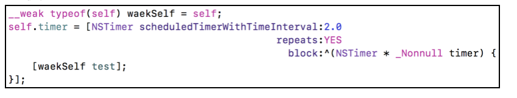

- 使用代理对象（Proxy)

  - 继承于NSObject的代理对象:需走消息转发机制

    ```objc
    @interface MJProxy : NSObject
    + (instancetype)proxyWithTarget:(id)target;
    @property (weak, nonatomic) id target;
    @end
    
    @implementation MJProxy
    + (instancetype)proxyWithTarget:(id)target
    {
        MJProxy *proxy = [[MJProxy alloc] init];
        proxy.target = target;
        return proxy;
    }
    
    - (id)forwardingTargetForSelector:(SEL)aSelector
    {
        return self.target;
    }
    @end
    ```

  - 继承于NSProxy的代理对象:不需走消息转发机制,专门用来做代理

    ```objc
    @interface MJProxy : NSProxy
    + (instancetype)proxyWithTarget:(id)target;
    @property (weak, nonatomic) id target;
    @end
    import "MJProxy.h"
    @implementation MJProxy
    + (instancetype)proxyWithTarget:(id)target
    {
        //NSProxy对象不需要调用init，因为它本来就没有init方法
        MJProxy *proxy = [MJProxy alloc];
        proxy.target = target;
        return proxy;
    }
    - (NSMethodSignature *)methodSignatureForSelector:(SEL)sel
    {
        return [self.target methodSignatureForSelector:sel];
    }
    
    - (void)forwardInvocation:(NSInvocation *)invocation
    {
        [invocation invokeWithTarget:self.target]
    }
    @end
    ```

  - 使用示例

    ```objc
    @interface ViewController ()
    @property (strong, nonatomic) NSTimer *timer;
    @end
    
    @implementation ViewController
    
    - (void)viewDidLoad {
        [super viewDidLoad];
        
        self.timer = [NSTimer scheduledTimerWithTimeInterval:1.0 target:[MJProxy proxyWithTarget:self] selector:@selector(timerTest) userInfo:nil repeats:YES];
    }
    - (void)timerTest
    {
        NSLog(@"%s", __func__);
    }
    - (void)dealloc
    {
        NSLog(@"%s", __func__);
        [self.timer invalidate];
    }
    @end
    
    ```

### GCD定时器

+ NSTimer依赖于RunLoop，如果RunLoop的任务过于繁重，可能会导致NSTimer不准时

  ```
  NSTimer是加到runloop中执行的，因为runloop跑一圈的时间是不定的。
  ```

  

+ 而GCD的定时器会更加准时， GCD定时器和系统内核挂钩，不受runloop影响

  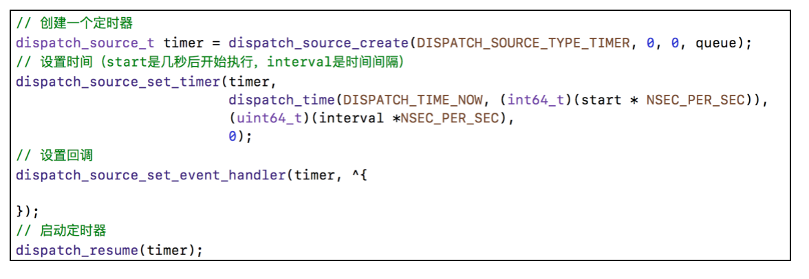

+ 代码测试

  ```objc
  - (void)test
  {
      // 队列
      // dispatch_queue_t queue = dispatch_get_main_queue();
      dispatch_queue_t queue = dispatch_queue_create("timer", DISPATCH_QUEUE_SERIAL);
      
      // 创建定时器
      dispatch_source_t timer = dispatch_source_create(DISPATCH_SOURCE_TYPE_TIMER, 0, 0, queue);
      
      // 设置时间
      uint64_t start = 2.0; // 2秒后开始执行
      uint64_t interval = 1.0; // 每隔1秒执行
      dispatch_source_set_timer(timer,
                                dispatch_time(DISPATCH_TIME_NOW, start * NSEC_PER_SEC),
                                interval * NSEC_PER_SEC, 0);
      
      // 设置回调
      //    dispatch_source_set_event_handler(timer, ^{
      //        NSLog(@"1111");
      //    });
      dispatch_source_set_event_handler_f(timer, timerFire);
      
      // 启动定时器
      dispatch_resume(timer);
      self.timer = timer;
  }
  
   //在子线程执行
  void timerFire(void *param)
  {  
      NSLog(@"2222 - %@", [NSThread currentThread]);
  }
  
  ```

+ GCD定时器封装

  ```objc
  //MJTimer.h
  @interface MJTimer : NSObject
  
  + (NSString *)execTask:(void(^)(void))task
             start:(NSTimeInterval)start
          interval:(NSTimeInterval)interval
           repeats:(BOOL)repeats
             async:(BOOL)async;
  
  + (NSString *)execTask:(id)target
                selector:(SEL)selector
                   start:(NSTimeInterval)start
                interval:(NSTimeInterval)interval
                 repeats:(BOOL)repeats
                   async:(BOOL)async;
  
  + (void)cancelTask:(NSString *)name;
  
  @end
  
    
  //MJTimer.m
  #import "MJTimer.h"
  @implementation MJTimer
  //存放所有的定时器
  static NSMutableDictionary *timers_;
  //保证操作timers_是线程安全的
  dispatch_semaphore_t semaphore_;
  + (void)initialize
  {
      static dispatch_once_t onceToken;
      dispatch_once(&onceToken, ^{
          timers_ = [NSMutableDictionary dictionary];
          semaphore_ = dispatch_semaphore_create(1);
      });
  }
  
  + (NSString *)execTask:(void (^)(void))task start:(NSTimeInterval)start interval:(NSTimeInterval)interval repeats:(BOOL)repeats async:(BOOL)async
  {
      if (!task || start < 0 || (interval <= 0 && repeats)) return nil;
      
      // 队列
      dispatch_queue_t queue = async ? dispatch_get_global_queue(0, 0) : dispatch_get_main_queue();
      
      // 创建定时器
      dispatch_source_t timer = dispatch_source_create(DISPATCH_SOURCE_TYPE_TIMER, 0, 0, queue);
      
      // 设置时间
      dispatch_source_set_timer(timer,
                                dispatch_time(DISPATCH_TIME_NOW, start * NSEC_PER_SEC),
                                interval * NSEC_PER_SEC, 0);
      
      
      //操作timers_时保证线程安全
      dispatch_semaphore_wait(semaphore_, DISPATCH_TIME_FOREVER);
      // 定时器的唯一标识
      NSString *name = [NSString stringWithFormat:@"%zd", timers_.count];
      // 存放到字典中
      timers_[name] = timer;
      dispatch_semaphore_signal(semaphore_);
      
      // 设置回调
      dispatch_source_set_event_handler(timer, ^{
          task();
          
          if (!repeats) { // 不重复的任务
              [self cancelTask:name];
          }
      });
      
      // 启动定时器
      dispatch_resume(timer);
      
      return name;
  }
  
  + (NSString *)execTask:(id)target selector:(SEL)selector start:(NSTimeInterval)start interval:(NSTimeInterval)interval repeats:(BOOL)repeats async:(BOOL)async
  {
      if (!target || !selector) return nil;
      
      return [self execTask:^{
          if ([target respondsToSelector:selector]) {
  #pragma clang diagnostic push
  #pragma clang diagnostic ignored "-Warc-performSelector-leaks"
              [target performSelector:selector];
  #pragma clang diagnostic pop
          }
      } start:start interval:interval repeats:repeats async:async];
  }
  
  + (void)cancelTask:(NSString *)name
  {
      if (name.length == 0) return;
      
      //操作timers_时保证线程安全
      dispatch_semaphore_wait(semaphore_, DISPATCH_TIME_FOREVER);
      
      dispatch_source_t timer = timers_[name];
      if (timer) {
          dispatch_source_cancel(timer);
          [timers_ removeObjectForKey:name];
      }
  
      dispatch_semaphore_signal(semaphore_);
  }
  
  @end
  ```

### 内存布局

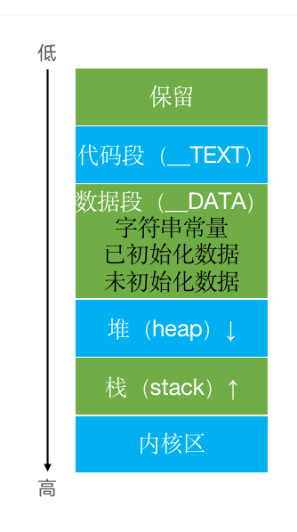

+ 代码段：编译之后的代码

+ 数据段
  - 字符串常量：比如NSString *str = @"123"
  - 已初始化数据：已初始化的全局变量、静态变量等
  - 未初始化数据：未初始化的全局变量、静态变量等
  
+ 栈：函数调用开销，比如局部变量。分配的内存空间地址越来越小

+ 堆：通过alloc、malloc、calloc等动态分配的空间，分配的内存空间地址越来越大

+ 测试

  ```objc
  int a = 10;
  int b;
  int main(int argc, char * argv[]) {
      @autoreleasepool {
          static int c = 20;
          static int d;
          int e;
          int f = 20;
          NSString *str = @"123";
          NSObject *obj = [[NSObject alloc] init];
          NSLog(@"\n&a=%p\n&b=%p\n&c=%p\n&d=%p\n&e=%p\n&f=%p\nstr=%p\nobj=%p\n",
                &a, &b, &c, &d, &e, &f, str, obj);
          return UIApplicationMain(argc, argv, nil, NSStringFromClass([AppDelegate class]));
      }
  }
  
  /*
   字符串常量
   str=0x10dfa0068
   
   已初始化的全局变量、静态变量
   &a =0x10dfa0db8
   &c =0x10dfa0dbc
   
   未初始化的全局变量、静态变量
   &d =0x10dfa0e80
   &b =0x10dfa0e84
   堆
   obj=0x608000012210
   栈
   &f =0x7ffee1c60fe0
   &e =0x7ffee1c60fe4
   */
   
   数据区: 字符串常量, 已初始化的全局变量、静态变量,  未初始化的全局变量、静态变量地址比较接近
   堆区: 对象类型
   栈: 临时变量
  
  ```

  

### Tagged Pointer

+ 从64bit开始，iOS引入了Tagged Pointer技术，用于优化NSNumber、NSDate、NSString等小对象的存储
+ 在没有使用Tagged Pointer之前， NSNumber等对象需要动态分配内存、维护引用计数等，NSNumber指针存储的是堆中NSNumber对象的地址值
+ 使用Tagged Pointer之后，NSNumber指针里面存储的数据变成了：Tag + Data，也就是将数据直接存储在了指针中
+ 当指针不够存储数据时，才会使用动态分配内存的方式来存储数据
+ objc_msgSend能识别Tagged Pointer，比如NSNumber的intValue方法，直接从指针提取数据，节省了以前的调用开销
+ 如何判断一个指针是否为Tagged Pointer？
  - iOS平台，最高有效位是1（第64bit）
  
  - Mac平台，最低有效位是1
  
    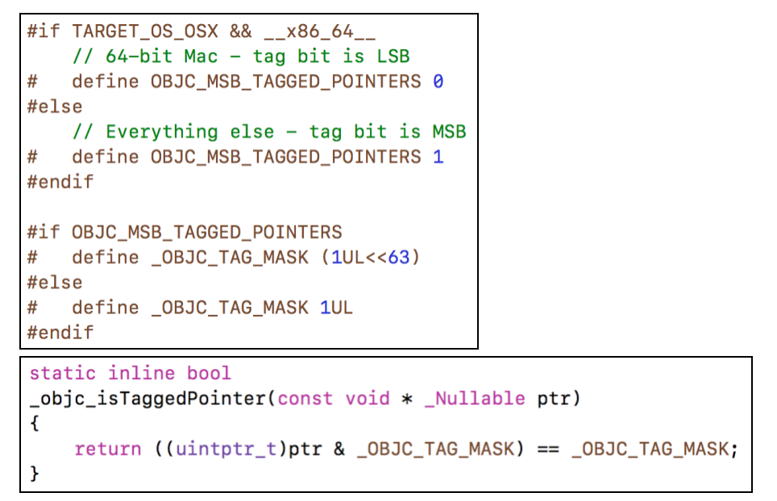

+ 测试NSNumber

  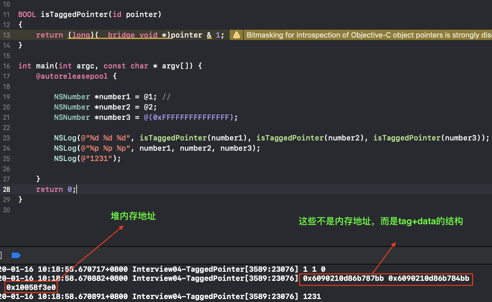

### OC对象的内存管理

+ 在iOS中，使用引用计数来管理OC对象的内存

+ 内存管理的黄金法则

  ```
  如果一个对象使用了alloc，[mutable] copy，retain，那么你必须使用相应的release或autonrelease
  ```

+ 一个新创建的OC对象引用计数默认是1，当引用计数减为0，OC对象就会销毁，释放其占用的内存空间

+ 调用retain会让OC对象的引用计数+1，调用release会让OC对象的引用计数-1

+ 内存管理的经验总结

  - 当调用alloc、new、copy、mutableCopy方法返回了一个对象，在不需要这个对象时，要调用release或者autorelease来释放它
  - 想拥有某个对象，就让它的引用计数+1；不想再拥有某个对象，就让它的引用计数-1

+ 可以通过以下私有函数来查看自动释放池的情况

  - extern void _objc_autoreleasePoolPrint(void);

###  MRC环境

+ MRC下autorelease的使用

  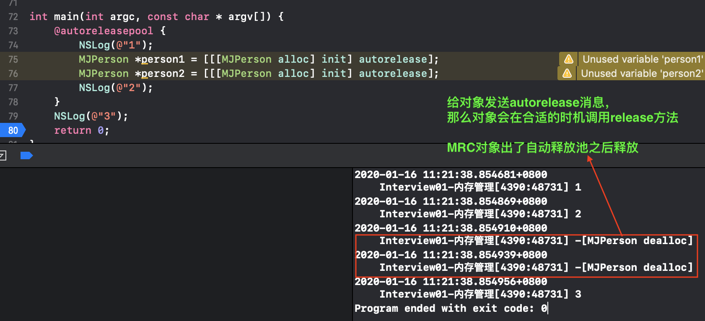

+ 通过alloc、new、copy、mutableCopy创建的对象最好直接给它发送一条autorelease消息

  ```objc
    self.tabBarController = [[[UITabBarController alloc] init] autorelease];
    self.data = [[[NSMutableArray alloc] init] autorelease];    
  ```

+ 系统通过类方法直接创建的对象，其内部已经发送了autorelease消息

  ```objc
  //系统的类方法创建的实例对象不用给它发送autorelease消息
  self.data = [NSMutableArray array];
  
  //自定的类，通过类方法创建的实例对象时，内部自动发送autorelease消息
  @interface MJPerson : NSObject
  + (instancetype)person;
  @end
    
  @implementation MJPerson
  + (instancetype)person
  {
      return [[[self alloc] init] autorelease];
  }
  @end
  
  ```

+ 对引用计数的管理

  ```objc
  @interface MJPerson : NSObject
  {
      MJDog *_dog;
      MJCar *_car;
      int _age;
  }
  - (void)setAge:(int)age;
  - (int)age;
  - (void)setDog:(MJDog *)dog;
  - (MJDog *)dog;
  - (void)setCar:(MJCar *)car;
  - (MJCar *)car;
  
  @end
  
  #import "MJPerson.h"
  
  @implementation MJPerson
  
  - (void)setAge:(int)age
  {
      _age = age;
  }
  - (int)age
  {
      return _age;
  }
  
  - (void)setDog:(MJDog *)dog
  {
      if (_dog != dog) {
         //使旧的对象引用计数减1
          [_dog release];
          //使新的对象引用计数加1
          _dog = [dog retain];
      }
  }
  - (MJDog *)dog
  {
      return _dog;
  }
  - (void)setCar:(MJCar *)car
  {
      if (_car != car) {
          [_car release];
          _car = [car retain];
      }
  }
  - (MJCar *)car
  {
      return _car;
  }
  
  - (void)dealloc
  {
      /**
        当对象本身进行释放时，也要对它持有的对象的引用计数减1
        [_dog release]；
        _dog = nil;
      */
      self.dog = nil;
      self.car = nil;
      NSLog(@"%s", __func__);
      // 父类的dealloc放到最后
      [super dealloc];
  }
  
  @end
  
  void test()
  {
      MJDog *dog = [[MJDog alloc] init]; // 创建对象，dog引用计数为1
      MJPerson *person1 = [[MJPerson alloc] init];
      [person1 setDog:dog]; //setDog内部对dog进行retain操作，dog引用计数为2
      MJPerson *person2 = [[MJPerson alloc] init];
      [person2 setDog:dog]; // setDog内部对dog进行retain操作，dog引用计数为3
      [dog release]; // dog调用release方法，-1后， 引用计数为2
      [person1 release]; // person调用release方法后，引用计数为0，进行释放，在dealloc中，[dog release], 此时dog引用计数为1
  
      [[person2 dog] run];
      [person2 release]; // person2调用release方法后，引用计数为0，进行释放，在dealloc中，[dog release], 此时dog引用计数为0。dog也调用自身的dealloc方法，进行释放。
  }
  
  void test2()
  {
      MJDog *dog1 = [[MJDog alloc] init]; // dog1 : 1
      MJDog *dog2 = [[MJDog alloc] init]; // dog2 : 1
      
      MJPerson *person = [[MJPerson alloc] init];
      [person setDog:dog1]; // dog1 : 2
      [person setDog:dog2]; // dog2 : 2  [dog2 retain], dog1 : 1  [dog1 release] 
      
      [dog1 release]; // dog1 : 0
      [dog2 release]; // dog2 : 1
      [person release]; // dog2 : 0
  }
  
  void test3()
  {
      MJDog *dog = [[MJDog alloc] init]; // dog:1
      MJPerson *person = [[MJPerson alloc] init];
      [person setDog:dog]; // dog:2
      [dog release]; // dog:1
      [person setDog:dog]; // dog:1
      [person setDog:dog]; // dog:1
      
      [person release]; // dog:0
  }
  ```

### copy和mutablecopy

+ 拷贝的目的：产生一个副本对象，跟源对象互不影响

  - 修改了源对象，不会影响副本对象
  - 修改了副本对象，不会影响源对象

+ iOS提供了2个拷贝方法

  + copy，不可变拷贝，产生不可变副本

  + mutableCopy，可变拷贝，产生可变副本

+  深拷贝和浅拷贝

  - 深拷贝：内容拷贝，产生新的对象
  - 浅拷贝：指针拷贝，没有产生新的对象

+ 不可变字符串进行copy和mutablecopy

  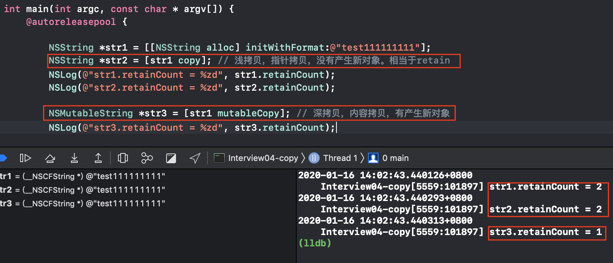

+ 常见系统对象的copy和mutablecopy的总结

  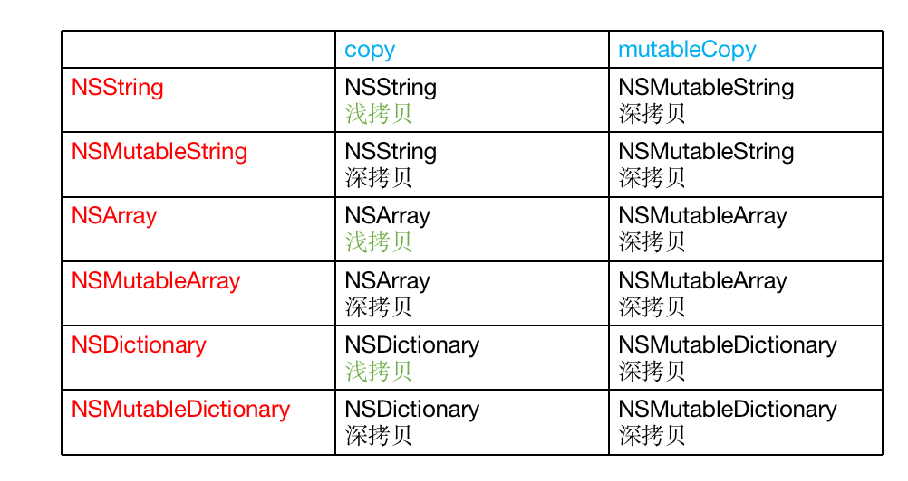

+ 总结copy,mutablecopy到底是深拷贝，还是浅拷贝

  ```objc
  以NSString, NSMutableString为例
  
   //情形1
   NSString *str1 = [[NSString alloc] initWithFormat:@"test"];
   NSString *str2 = [str1 copy];
   
  当字符串是不可变字符串时，对它进行copy，产生一个不可变副本对像。原字符串和新字符串都是不可变的，所以根本没必要重新开辟一块新的内存。所以只需要进行指针拷贝，即为浅拷贝
  
   //情形2
  NSString *str1 = [[NSString alloc] initWithFormat:@"test"];
  NSMutableString为例 *str2 = [str1 mutablecopy];
  
  当字符串是不可变字符串时，对它进行mutablecopy，产生一个可变副本对像。新字符串是可变的，所以必须与原对象放在不同的内存中。所以必须进行内存拷贝，即为深拷贝
    
  
   //情形3
   NSMutableString *str1 = [NSMutableString stringWithFormat:@"test"];
   NSString *str2 = [str1 copy];
  
  当字符串是可变字符串时，对它进行copy，产生一个不可变副本对像。原字符串是可变的，所以新字符串必须与原对象放在不同的内存中。所以必须进行内存拷贝，即为深拷贝。
    
  //情形4
   NSMutableString *str1 = [NSMutableString stringWithFormat:@"test"];
   NSString *str2 = [str1 mutablecopy];
  
  当字符串是可变字符串时，对它进行mutablecopy，产生一个可变副本对像。原字符串和新字符串都是可变的，所以新字符串必须与原对象放在不同的内存中。所以必须进行内存拷贝，即为深拷贝。
  ```

  + 只有不可变对象调用copy产生的对象，才是浅拷贝。
  + 其他的都是深拷贝。

### 使用copy属性

+ 使用copy属性相当于在setter方法内部调用copy方法

  ```objc
  @interface MJPerson : NSObject
  @property (copy, nonatomic) NSArray *data;
  @end
  @implementation MJPerson
  - (void)setData:(NSArray *)data
  {
      if (_data != data) {
          [_data release];
          //调用copy方法，返回不可变的对象
          _data = [data copy];
      }
  }
  - (void)dealloc
  {
      self.data = nil;
      [super dealloc];
  }
  
  @end
  ```

+ 使用copy属性, 内部对应的成员变量对象一定是不可变的，如果外部使用可变类型修饰变量，那么容易使用出错。

  ```objc
  @interface MJPerson : NSObject
  @property (copy, nonatomic) NSMutableArray *data;
  /**
  当外界传入的是可变数组时，data本质上是一个可变数组。因为strong自动生成的setter方法其内部是调用retain方法
  @property (strong, nonatomic) NSArray *data;
  */
  
  @end
  
  @implementation MJPerson
    
  - (void)setData:(NSMutableArray *)data
  {
      if (_data != data) {
          [_data release];
          //_data本质上是个不可变数组，所以不能在外部不能往内部添加对象
          _data = [data copy];
      }
  }
  
  - (void)dealloc
  {
      self.data = nil;
      [super dealloc];
  }
  
  @end
  
  ```

  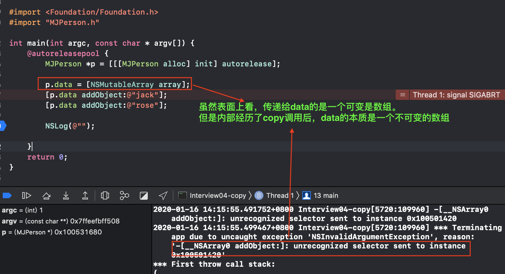

+ 很多系统的类，都使用copy来修饰字符串属性。来保证该属性在使用过程中是不能在其他地方被修改

### 自定义对象实现copy,mutablecopy

+ 遵守NSCopying， NSMutableCopying协议，并实现对应的方法

  ```objc
  @protocol NSCopying
  
  - (id)copyWithZone:(nullable NSZone *)zone;
  
  @end
  
  @protocol NSMutableCopying
  
  - (id)mutableCopyWithZone:(nullable NSZone *)zone;
  
  @end
  ```

+ 示例

  ```objc
  @interface MJPerson : NSObject <NSCopying>
  @property (assign, nonatomic) int age;
  @property (assign, nonatomic) double weight;
  @end
  
  @implementation MJPerson
  - (id)copyWithZone:(NSZone *)zone
  {
      MJPerson *person = [[MJPerson allocWithZone:zone] init];
      person.age = self.age;
      person.weight = self.weight;
      return person;
  }
  - (NSString *)description
  {
      return [NSString stringWithFormat:@"age = %d, weight = %f", self.age, self.weight];
  }
  @end
  
  ```

  

### 引用计数的存储

+ 从arm64架构开始，对isa进行了优化，变成了一个共用体（union）结构，还使用位域来存储更多的信息

  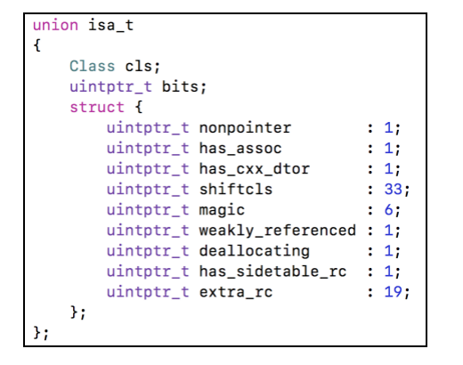

  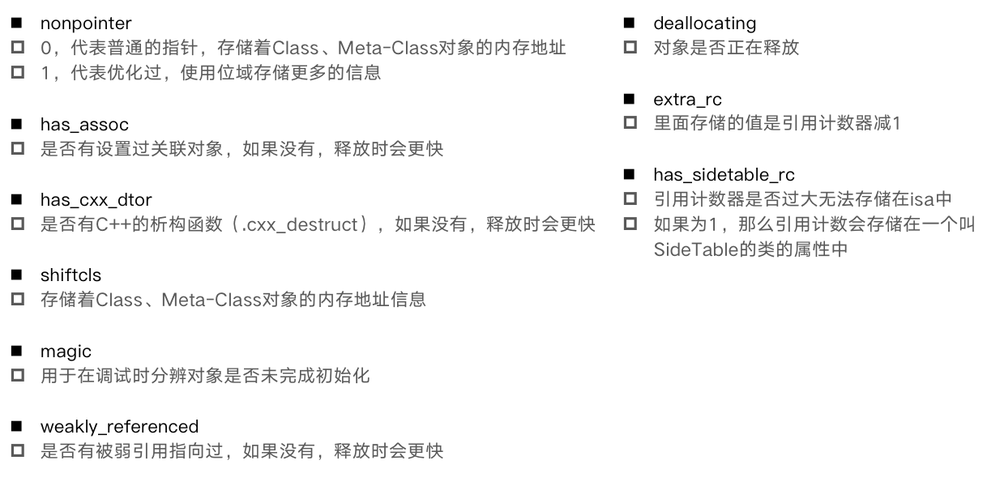

+ 在64bit中，引用计数可以直接存储在优化过的isa指针中，也可能存储在SideTable类中

  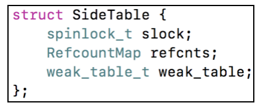

+ refcnts是一个存放着对象引用计数的散列表

+ 当引用计数没有特别大时， isa_t的共用体中的extra_rc内存储值是引用计数-1

  ```objc
  //对于类和元类，其引用计数是一个非常大的值
  + (NSUInteger)retainCount {
      return ULONG_MAX;
  }
  
  - (NSUInteger)retainCount {
      return ((id)self)->rootRetainCount();
  }
  
  inline uintptr_t 
  objc_object::rootRetainCount()
  {
      //如果使用TaggedPointer技术，则直接返回对象指针
      if (isTaggedPointer()) return (uintptr_t)this;
      sidetable_lock();
      isa_t bits = LoadExclusive(&isa.bits);
      ClearExclusive(&isa.bits);
      
      if (bits.nonpointer) { //优化过isa
          //rc即为retainCount的值
          uintptr_t rc = 1 + bits.extra_rc;
          if (bits.has_sidetable_rc) {
             //如果retainCount值比较大，则存储在SideTable中
              rc += sidetable_getExtraRC_nolock();
          }
          sidetable_unlock();
          return rc;
      }
      sidetable_unlock();
      return sidetable_retainCount();
  }
  
  
  size_t 
  objc_object::sidetable_getExtraRC_nolock()
  {
      assert(isa.nonpointer);
      SideTable& table = SideTables()[this];
      //根据this在RefcountMap中找到对应的应用计数
      RefcountMap::iterator it = table.refcnts.find(this);
      if (it == table.refcnts.end()) return 0;
      else return it->second >> SIDE_TABLE_RC_SHIFT;
  }
  ```

### weak指针的原理

[iOS 底层解析weak的实现原理](https://www.jianshu.com/p/13c4fb1cedea)

+ weak是弱引用，用weak来修饰、描述所引用对象的计数器并不会加1，而且weak会在引用对象被释放的时候自动置为nil，这也就避免了野指针访问坏内存而引起奔溃的情况，另外weak也可以解决循环引用。

+ **为什么修饰代理使用weak而不是用assign？**

  ```
  assign可用来修饰基本数据类型，也可修饰OC的对象，但如果用assign修饰对象类型指向的是一个强指针，当指向的这个指针释放之后，它仍指向这块内存，必须要手动给置为nil，否则会产生野指针，如果还通过此指针操作那块内存，会导致EXC_BAD_ACCESS错误，调用了已经被释放的内存空间；而weak只能用来修饰OC对象，而且相比assign比较安全，如果指向的对象消失了，那么它会自动置为nil，不会导致野指针。
  ```

+ weak原理

  ```
  weak表其实是一个哈希表，key是所指对象的指针，value是weak指针的地址数组。（value是数组的原因是：因为一个对象可能被多个弱引用指针指向）
  
  Runtime维护了一张weak表，用来存储某个对象的所有的weak
  
  当对象的应用计算为0时，调用dealloc释放对象，将该对象对应的weak指针变为nil, 防止野指针，同时移除该条键值对记录
  ```

### dealloc

+ 当一个对象要释放时，会自动调用dealloc，接下的调用轨迹是

  - dealloc

  - _objc_rootDealloc

  - rootDealloc

  - object_dispose

  - objc_destructInstance、free

    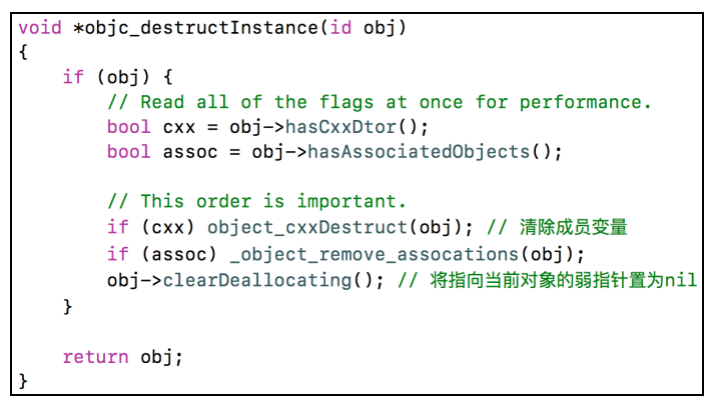

+ 源码分析

  ```objc
  // Replaced by NSZombies
  - (void)dealloc {
      _objc_rootDealloc(self);
  }
  
  void _objc_rootDealloc(id obj)
  {
      assert(obj);
      obj->rootDealloc();
  }
  
  inline void objc_object::rootDealloc()
  {
      if (isTaggedPointer()) return;  // fixme necessary?
  
      
      if (fastpath(isa.nonpointer  &&  
                   !isa.weakly_referenced  &&  
                   !isa.has_assoc  &&  
                   !isa.has_cxx_dtor  &&  
                   !isa.has_sidetable_rc))
      {
        //没有弱引用，没有关联对象，没有c++析构函数, 引用计数没有存在SideTable中
          assert(!sidetable_present());
          //销毁对象的内存
          free(this);
      } 
      else {
          //释放对象
          object_dispose((id)this);
      }
  }
  
  id object_dispose(id obj)
  {
      if (!obj) return nil;
      //销毁对象但不销毁内存
      objc_destructInstance(obj);   
      //销毁对象的内存
      free(obj);
  
      return nil;
  }
  
  
  void *objc_destructInstance(id obj) 
  {
      if (obj) {
          // Read all of the flags at once for performance.
          bool cxx = obj->hasCxxDtor();
          bool assoc = obj->hasAssociatedObjects();
  
          // This order is important.
          //清除成员变量
          if (cxx) object_cxxDestruct(obj);
          //移除关联对象
          if (assoc) _object_remove_assocations(obj);
          //将当前对象的弱指针置为nil
          obj->clearDeallocating();
      }
      return obj;
  }
  
  inline void 
  objc_object::clearDeallocating()
  {
      if (slowpath(!isa.nonpointer)) {
          // Slow path for raw pointer isa.
          //未使用rsa优化
          sidetable_clearDeallocating();
      }
      else if (slowpath(isa.weakly_referenced  ||  isa.has_sidetable_rc)) {
          // Slow path for non-pointer isa with weak refs and/or side table data.
          //如果有弱引用指向，或者使用了sidetable存储引用计数
          clearDeallocating_slow();
      }
  
      assert(!sidetable_present());
  }
  
  NEVER_INLINE void
  objc_object::clearDeallocating_slow()
  {
      assert(isa.nonpointer  &&  (isa.weakly_referenced || isa.has_sidetable_rc));
  
      SideTable& table = SideTables()[this];
      table.lock();
      if (isa.weakly_referenced) {
         //假如有弱引用指向，则将弱引用指针置为nil
          weak_clear_no_lock(&table.weak_table, (id)this);
      }
      if (isa.has_sidetable_rc) {
          //从表中移除对应的应用计数
          table.refcnts.erase(this);
      }
      table.unlock();
  }
  
  
  void 
  objc_object::sidetable_clearDeallocating()
  {
      SideTable& table = SideTables()[this];
  
      // clear any weak table items
      // clear extra retain count and deallocating bit
      // (fixme warn or abort if extra retain count == 0 ?)
      table.lock();
      RefcountMap::iterator it = table.refcnts.find(this);
      if (it != table.refcnts.end()) {
          if (it->second & SIDE_TABLE_WEAKLY_REFERENCED) {
              //将对象对应的weak指针置为nil
              weak_clear_no_lock(&table.weak_table, (id)this);
          }
          table.refcnts.erase(it);
      }
      table.unlock();
  }
  
  ```

### autorelease原理

+ 自动释放池的主要底层数据结构是：__AtAutoreleasePool、AutoreleasePoolPage

+ 调用了autorelease的对象最终都是通过AutoreleasePoolPage对象来管理的

+ 源码分析

  - clang重写@autoreleasepool

    - clang编译下面的代码

      ```objc
      int main(int argc, const char * argv[]) {
          @autoreleasepool {
              MJPerson *person = [[[MJPerson alloc] init] autorelease];
          }
          return 0;
      }
      ```

    - 得到编译后的核心代码

      ```objc
      
      struct __AtAutoreleasePool {
        void * atautoreleasepoolobj;
        //构造函数
        __AtAutoreleasePool() {atautoreleasepoolobj = objc_autoreleasePoolPush();}
        //析构函数
        ~__AtAutoreleasePool() {objc_autoreleasePoolPop(atautoreleasepoolobj);}
        
      };
      
      int main(int argc, const char * argv[]) {
          /* @autoreleasepool */ 
        {
           //默认调用构造函数 objc_autoreleasePoolPush
            __AtAutoreleasePool __autoreleasepool; 
              MJPerson *person = ((MJPerson *(*)(id, SEL))(void *)objc_msgSend)((id)((MJPerson *(*)(id, SEL))(void *)objc_msgSend)((id)((MJPerson *(*)(id, SEL))(void *)objc_msgSend)((id)objc_getClass("MJPerson"), sel_registerName("alloc")), sel_registerName("init")), sel_registerName("autorelease"));
          //出了大括号后，__autoreleasepool释放，调用析构函数objc_autoreleasePoolPop
         }
          return 0;
      }
      
      
      //简化后的代码为
      int main(int argc, const char * argv[]) {
          /* @autoreleasepool */ 
        {
           void * atautoreleasepoolobj = objc_autoreleasePoolPush();
           MJPerson *person = [[[MJPerson alloc] init] autorelease];
           objc_autoreleasePoolPop(atautoreleasepoolobj)
         }
          return 0;
      }
      
    ```
  
- objc4源码：NSObject.mm
  
  

### autoreleasePoolPage的结构

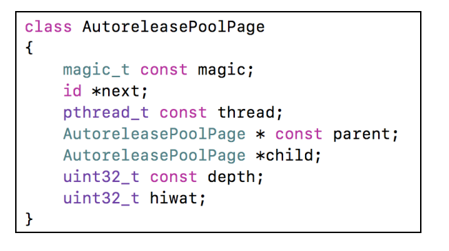

+ 每个AutoreleasePoolPage对象占用4096字节内存，除了用来存放它内部的成员变量，剩下的空间用来存放autorelease对象的地址

+ 所有的AutoreleasePoolPage对象通过双向链表的形式连接在一起

+ 调用push方法会将一个POOL_BOUNDARY入栈，并且返回其存放的内存地址

+ 每当有一个对象接收autorelease消息，就把该对象的地址放进去

+ 调用pop方法时传入一个`POOL_BOUNDARY`的内存地址，会从最后一个入栈的对象开始发送release消息，直到遇到这个`POOL_BOUNDARY`

+ id *next指向了下一个能存放autorelease对象地址的区域  

+ child指向下一页，parent指向上一页

+ 假设循环为1000个对象调用autorelease方法, page结构如下

  ```objc
  @autoreleasepool {
        //void *atautoreleasepoolobj = objc_autoreleasePoolPush();
        for (int i = 0; i < 1000; i++) {
            MJPerson *person = [[[MJPerson alloc] init] autorelease];
        } // 8000个字节
        
       //objc_autoreleasePoolPop(atautoreleasepoolobj);
  }
  ```

  

  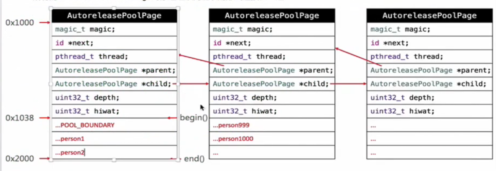

  ```
  1. 首先调用push将POOL_BUNDARY入栈，并返回其地址给atautoreleasepoolobj
  2. 将person对象的地址依次放到page中，容量不够时创建新的页
  3. 当调用pop时，从person1000开始调用release方法，直到遇到POOL_BOUNDARY
  ```

+ 多个@autoreleasepool嵌套的情况

  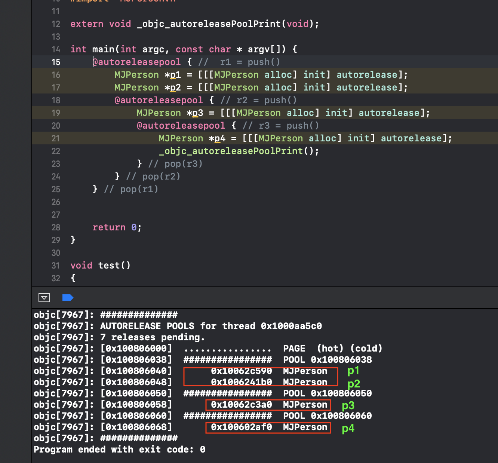

  - 可以通过以下私有函数来查看自动释放池的情况

    ```objc
    extern void _objc_autoreleasePoolPrint(void);
    ```

+ autorelease源码分析

  ```objc
  inline id objc_object::autorelease()
  {
      if (isTaggedPointer()) return (id)this;
      if (fastpath(!ISA()->hasCustomRR())) return rootAutorelease();
  
      return ((id(*)(objc_object *, SEL))objc_msgSend)(this, SEL_autorelease);
  }
  
  inline id objc_object::rootAutorelease()
  {
      if (isTaggedPointer()) return (id)this;
      if (prepareOptimizedReturn(ReturnAtPlus1)) return (id)this;
  
      return rootAutorelease2();
  }
  
  
  id objc_object::rootAutorelease2()
  {
      assert(!isTaggedPointer());
      //调用AutoreleasePoolPage的autorelease方法
      return AutoreleasePoolPage::autorelease((id)this);
  }
  
   static inline id autorelease(id obj)
      {
          assert(obj);
          assert(!obj->isTaggedPointer());
          //处理autorelease消息
          id *dest __unused = autoreleaseFast(obj);
          assert(!dest  ||  dest == EMPTY_POOL_PLACEHOLDER  ||  *dest == obj);
          return obj;
      }
  
  static inline id *autoreleaseFast(id obj)
      {
          //获取当前页
          AutoreleasePoolPage *page = hotPage();
          if (page && !page->full()) {
              //当前页不满的时候，将对象添加到当前页
              return page->add(obj);
          } else if (page) {
              //当前页满的时候，创建新的页面
              return autoreleaseFullPage(obj, page);
          } else {
              return autoreleaseNoPage(obj);
          }
      }
  
  id *autoreleaseFullPage(id obj, AutoreleasePoolPage *page)
      {
          // The hot page is full. 
          // Step to the next non-full page, adding a new page if necessary.
          // Then add the object to that page.
          assert(page == hotPage());
          assert(page->full()  ||  DebugPoolAllocation);
    
          //在最后创建一页
          do {
              if (page->child) page = page->child;
              else page = new AutoreleasePoolPage(page);
          } while (page->full());
          //将该页设置为当前页，并将对象添加进去
          setHotPage(page);
          return page->add(obj);
      }
  
  id *autoreleaseNoPage(id obj)
      {
          // "No page" could mean no pool has been pushed
          // or an empty placeholder pool has been pushed and has no contents yet
          assert(!hotPage());
  
          bool pushExtraBoundary = false;
          if (haveEmptyPoolPlaceholder()) {
              // We are pushing a second pool over the empty placeholder pool
              // or pushing the first object into the empty placeholder pool.
              // Before doing that, push a pool boundary on behalf of the pool 
              // that is currently represented by the empty placeholder.
              pushExtraBoundary = true;
          }
          else if (obj != POOL_BOUNDARY  &&  DebugMissingPools) {
              // We are pushing an object with no pool in place, 
              // and no-pool debugging was requested by environment.
              _objc_inform("MISSING POOLS: (%p) Object %p of class %s "
                           "autoreleased with no pool in place - "
                           "just leaking - break on "
                           "objc_autoreleaseNoPool() to debug", 
                           pthread_self(), (void*)obj, object_getClassName(obj));
              objc_autoreleaseNoPool(obj);
              return nil;
          }
          else if (obj == POOL_BOUNDARY  &&  !DebugPoolAllocation) {
              // We are pushing a pool with no pool in place,
              // and alloc-per-pool debugging was not requested.
              // Install and return the empty pool placeholder.
              return setEmptyPoolPlaceholder();
          }
         //创建第一页
          AutoreleasePoolPage *page = new AutoreleasePoolPage(nil);
          setHotPage(page);
          //先添加pushExtraBoundary
          if (pushExtraBoundary) {
              page->add(POOL_BOUNDARY);
          }
          // 将对象添加到第一页中
          return page->add(obj);
      }
  
  ```

+ objc_autoreleasePoolPush源码分析

  ```objc
  //push
  void *objc_autoreleasePoolPush(void)
  {
      return AutoreleasePoolPage::push();
  }
  
  static inline void *push() 
   {
          id *dest;
          if (DebugPoolAllocation) {
              // Each autorelease pool starts on a new pool page.
              dest = autoreleaseNewPage(POOL_BOUNDARY);
          } else {
              //每次push都先把POOL_BOUNDARY入栈，然后返回POOL_BOUNDARY此时的地址
              dest = autoreleaseFast(POOL_BOUNDARY);
          }
          assert(dest == EMPTY_POOL_PLACEHOLDER || *dest == POOL_BOUNDARY);
          return dest;
    }
  ```

+ objc_autoreleasePoolPop源码分析

  ```objc
  void objc_autoreleasePoolPop(void *ctxt)
  {
      AutoreleasePoolPage::pop(ctxt);
  }
  
   static inline void pop(void *token) 
   {
          AutoreleasePoolPage *page;
          id *stop;
          if (token == (void*)EMPTY_POOL_PLACEHOLDER) {
              // Popping the top-level placeholder pool.
              if (hotPage()) {
                  // Pool was used. Pop its contents normally.
                  // Pool pages remain allocated for re-use as usual.
                  pop(coldPage()->begin());
              } else {
                  // Pool was never used. Clear the placeholder.
                  setHotPage(nil);
              }
              return;
          }
  
          page = pageForPointer(token);
          stop = (id *)token;
          if (*stop != POOL_BOUNDARY) {
              if (stop == page->begin()  &&  !page->parent) {
                  // Start of coldest page may correctly not be POOL_BOUNDARY:
                  // 1. top-level pool is popped, leaving the cold page in place
                  // 2. an object is autoreleased with no pool
              } else {
                  // Error. For bincompat purposes this is not 
                  // fatal in executables built with old SDKs.
                  return badPop(token);
              }
          }
  
          if (PrintPoolHiwat) printHiwat();
      
          //一直释放，直到POOL_BOUNDARY停止
          page->releaseUntil(stop);
  
          // memory: delete empty children
          if (DebugPoolAllocation  &&  page->empty()) {
              // special case: delete everything during page-per-pool debugging
              AutoreleasePoolPage *parent = page->parent;
              page->kill();
              setHotPage(parent);
          } else if (DebugMissingPools  &&  page->empty()  &&  !page->parent) {
              // special case: delete everything for pop(top) 
              // when debugging missing autorelease pools
              page->kill();
              setHotPage(nil);
          } 
          else if (page->child) {
              // hysteresis: keep one empty child if page is more than half full
              if (page->lessThanHalfFull()) {
                  page->child->kill();
              }
              else if (page->child->child) {
                  page->child->child->kill();
              }
          }
   }
  
  void releaseUntil(id *stop) 
      {
          // Not recursive: we don't want to blow out the stack 
          // if a thread accumulates a stupendous amount of garbage
          
          //next指针一直向上遍历，直到遇到直到POOL_BOUNDARY停止
          while (this->next != stop) {
              // Restart from hotPage() every time, in case -release 
              // autoreleased more objects
              AutoreleasePoolPage *page = hotPage();
              // fixme I think this `while` can be `if`, but I can't prove it
              while (page->empty()) {
                  page = page->parent;
                  setHotPage(page);
              }
              page->unprotect();
              id obj = *--page->next;
              memset((void*)page->next, SCRIBBLE, sizeof(*page->next));
              page->protect();
  
              if (obj != POOL_BOUNDARY) {
                  //对遍历的每个对象发送release消息
                  objc_release(obj);
              }
          }
          //设置新的当前页
          setHotPage(this);
  }
  
  
  
  ```


### autorelease对象在什么时机会被调用release?

+ MRC环境下

  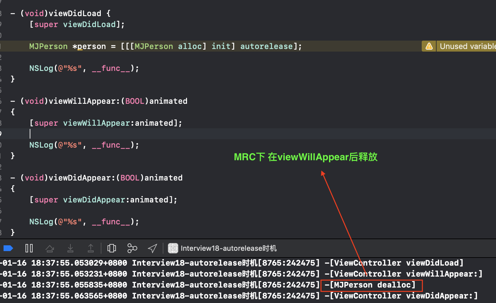

+ ARC环境下

  

  

###runLoop与autorelease

+ iOS在主线程的Runloop中注册了2个Observer

  - 第1个Observer监听了kCFRunLoopEntry事件，会调用objc_autoreleasePoolPush()
  - 第2个Observer
    - 监听了kCFRunLoopBeforeWaiting事件，会调用objc_autoreleasePoolPop()、objc_autoreleasePoolPush()
    - 监听了kCFRunLoopBeforeExit事件，会调用objc_autoreleasePoolPop()

+ 打印主线程查看这2个Observer

  ```objc
  /*
   typedef CF_OPTIONS(CFOptionFlags, CFRunLoopActivity) {
   kCFRunLoopEntry = (1UL << 0),  1
   kCFRunLoopBeforeTimers = (1UL << 1), 2
   kCFRunLoopBeforeSources = (1UL << 2), 4
   kCFRunLoopBeforeWaiting = (1UL << 5), 32
   kCFRunLoopAfterWaiting = (1UL << 6), 64
   kCFRunLoopExit = (1UL << 7), 128
   kCFRunLoopAllActivities = 0x0FFFFFFFU
   };
   */
  /*
  
   监听进入runloop
   activities = 0x1 = 1 =  kCFRunLoopEntry 
   <CFRunLoopObserver 0x60000013f220 [0x1031c8c80]>{valid = Yes, activities = 0x1, repeats = Yes, order = -2147483647, callout = _wrapRunLoopWithAutoreleasePoolHandler (0x103376df2), context = <CFArray 0x60000025aa00 [0x1031c8c80]>{type = mutable-small, count = 1, values = (\n\t0 : <0x7fd0bf802048>\n)}}
  
   
   监听runloop将要进入休眠和runloop退出
   activities = 0xa0 = 160 = 32 + 128 =  kCFRunLoopBeforeWaiting | kCFRunLoopBeforeWaiting 
   <CFRunLoopObserver 0x60000013f0e0 [0x1031c8c80]>{valid = Yes, activities = 0xa0, repeats = Yes, order = 2147483647, callout = _wrapRunLoopWithAutoreleasePoolHandler (0x103376df2), context = <CFArray 0x60000025aa00 [0x1031c8c80]>{type = mutable-small, count = 1, values = (\n\t0 : <0x7fd0bf802048>\n)}}
   */
  
  ```

### 面试题

+ 思考以下2段代码能发生什么事?有什么区别?

  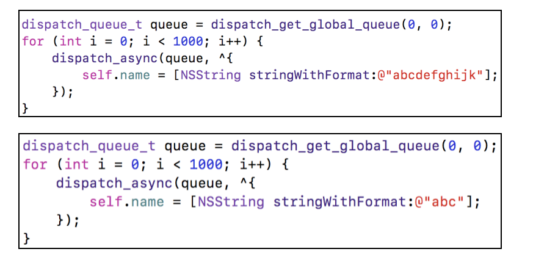

  ```objc
  第一段代码会crash，因为多线程并发调用setName方法, _name重复被释放，造成crash。要想不crash，需要在调用setName方法时加锁/解锁
  - (void)setName:(NSString *)name {
      if (_name != name) {
         [_name release];
         _name = [name retain];
      }
  }
  
  第二段代码不会crash，因为它字符串比较短，能存储在指针里，使用TaggedPointer技术。
  self.name的指针里存储了字符串的信息，不会再走setter方法了
  ```

+ ARC帮我们做了什么?

  + ARC是LLVM编译器和 Runtime系统相互协作的一个结果
  + LLVM帮我们补上了autorelease
  + runtime支持__weak机制等

+ 方法里有局部对象出了方法后会立即释放吗?

  - 跟runloop相关，一般是runloop进入即将进入休眠时，释放旧的自动释放池，创建新的自动释放池

