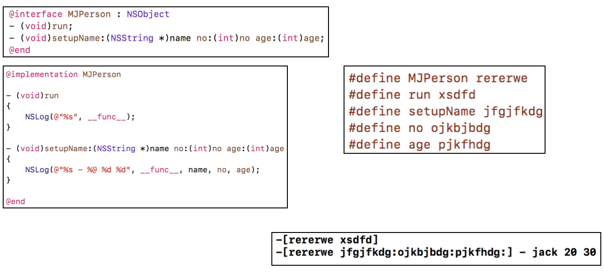

## 代码混淆

### 基本概念

+ 什么是加固
  - 加固是为了增加应用的安全性，防止应用被破解、盗版、二次打包、注入、反编译等
+ 常见的加固方式有
  - 数据加密（字符串、网络数据、敏感数据等）
  - 应用加壳（二进制加密）
  - 代码混淆（类名、方法名、代码逻辑等）
  - ......（不同平台还有不同的做法）

### 代码混淆

+ iOS程序可以通过class-dump、Hopper、IDA等获取类名、方法名、以及分析程序的执行逻辑
  - 如果进行代码混淆，可以加大别人的分析难度
+ iOS的代码混淆方案
  - 源码的混淆
    - 类名
    - 方法名
    - 协议名
    - ....
+ LLVM中间代码IR的混淆（容易产生BUG）
  - 自己编写Pass
  - ollvm：https://github.com/obfuscator-llvm/obfuscator

###   宏定义混淆

- 此时通用class-dump，hopper查看，只能看到混淆的方法名
- 注意点
  - 不能混淆系统方法
  - 不能混淆init开头的等初始化方法
  - 混淆属性时需要额外注意set方法
  - 如果xib、storyboard中用到了混淆的内容，需要手动修正
  - 可以考虑把需要混淆的符号都加上前缀，跟系统自带的符号进行区分
  - 混淆过多可能会被AppStore拒绝上架，需要说明用途
- 建议
  - 给需要混淆的符号加上了一个特定的前缀
  - 只混淆关键的类和方法

### 字符串加密

+ 很多时候，可执行文件中的字符串信息，对破解者来说，非常关键，是破解的捷径之一
+ 为了加大破解、逆向难度，可以考虑对字符串进行加密
+ 字符串的加密技术有很多种，可以根据自己的需要自行制定算法
+ 这里举一个简单的例子
  - 对每个字符进行异或（^）处理
  - 需要使用字符串时，对异或（^）过的字符再进行一次异或（^），就可以获得原字符

###小工具 

+ MJCodeObfuscation
  -  https://github.com/CoderMJLee/MJCodeObfuscation
+ 可以非常方便的进行宏定义混淆，字符串加密
+ 具体用法可以参考该项目的`README.md`文件

