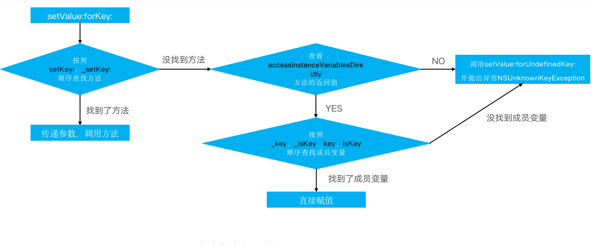

## KVC

### 基本使用

+ KVC的全称是Key-Value Coding，俗称“键值编码”，可以通过一个key来访问某个属性

+ 常见的API有

  ```objective-c
  - (void)setValue:(id)value forKeyPath:(NSString *)keyPath;
  - (void)setValue:(id)value forKey:(NSString *)key;
  - (id)valueForKeyPath:(NSString *)keyPath;
  - (id)valueForKey:(NSString *)key; 
  ```

+ 简单使用

  ```objective-c
    MJPerson *person = [[MJPerson alloc] init];
    MJCat *cat = [[MJCat alloc] init];
    person.cat = cat;
  
    [person setValue:@10 forKey:@"age"];
    [person setValue:@20 forKeyPath:@"cat.weight"];
    NSLog(@"%@", [person valueForKey:@"age"]);
    NSLog(@"%@", [person valueForKeyPath:@"cat.weight"]);
          
  ```

### 设值原理



+ accessInstanceVariablesDirectly方法的默认返回值是YES

### 取值原理


### KVC触发KVO监听

```objective-c
int main(int argc, const char * argv[]) {
    @autoreleasepool {
        MJPerson *person = [[MJPerson alloc] init];
        MJObserver *observer = [[MJObserver alloc] init];
        
        //添加KVO监听
        [person addObserver:observer forKeyPath:@"age" options:NSKeyValueObservingOptionNew | NSKeyValueObservingOptionOld context:NULL];
        
         //通过KVC修改age属性
         //[person setValue:@10 forKey:@"age"];
         [person willChangeValueForKey:@"age"];
         person->_age = 10;
         [person didChangeValueForKey:@"age"];
         // 移除KVO监听
         [person removeObserver:observer forKeyPath:@"age"];
    }
    return 0;
}

```

+ 方法1：MJPerson有属性age, 通过`setValue:forKey`触发set方法来触发KVO监听

+ 方法2: MJPerson有公开的成员变量_age， 手动触发KVO

  ```objective-c
   [person willChangeValueForKey:@"age"];
   person->_age = 10;
   [person didChangeValueForKey:@"age"];
  ```

### 面试题

+ 通过KVC修改**属性**会触发KVO么？
  - 会触发KVO，因为会默认调用set方法