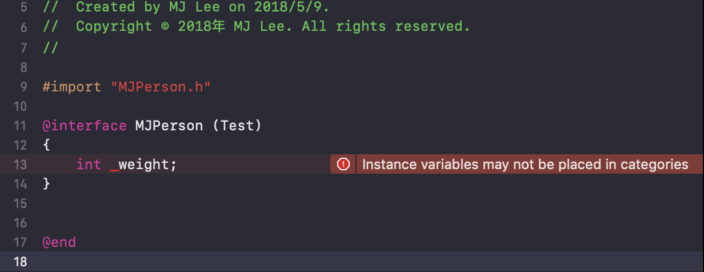
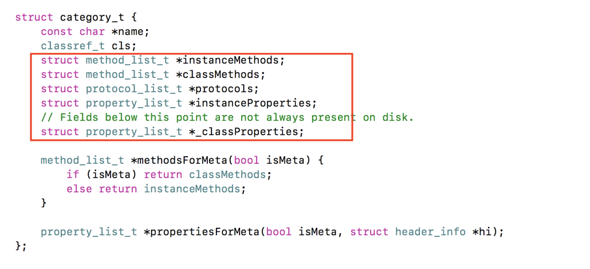
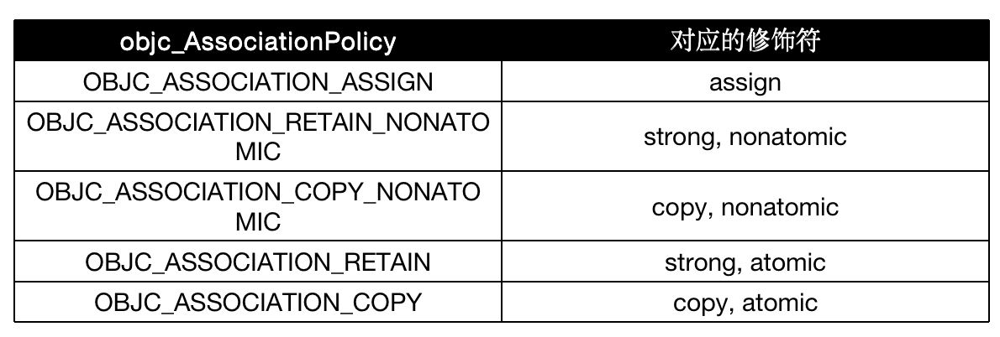
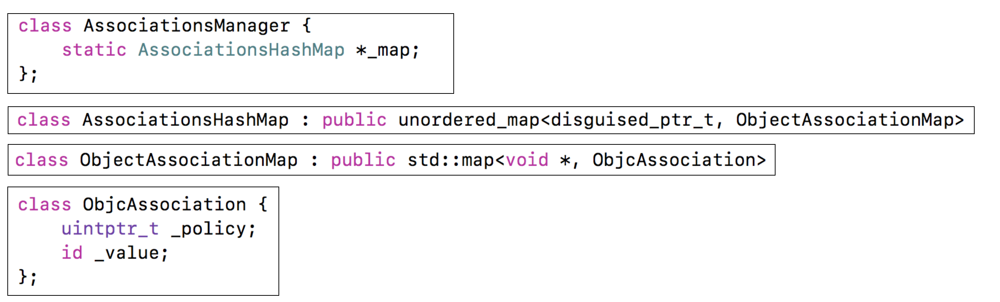
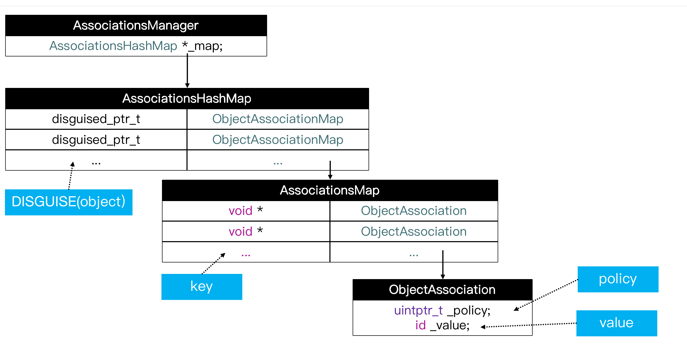

## 关联对象

###分类添加属性 

+ 类里添加属性，相当于添加一个成员变量，同时声明getter, setter方法 并实现getter, setter方法

+ 分类里，添加属性，只是相当于声明getter, setter方法

+ 分类里不能直接添加成员变量

  

+ 通过查看分类的底层结构可知, 分类中没有存放成员变量的位置

  

+ 默认情况下，因为分类底层结构的限制，不能添加成员变量到分类中。但可以通过关联对象来间接实现

- 关联对象属性的值不像正常类的属性一样存储在实例变量中，而是单独存储的。
- 如果关联的对象销毁时，那么其在AssociationsHashMap中对应的key,value同样被移除

### 关联对象基本用法

- 添加关联对象

  ```objc
  void objc_setAssociatedObject(id object, const void * key,
                                  id value, objc_AssociationPolicy policy)
  ```

- 获得关联对象

  ```objc
  id objc_getAssociatedObject(id object, const void * key)
  ```

- 移除所有的关联对象

  ```objc
  void objc_removeAssociatedObjects(id object)
  ```

+ objc_AssociationPolicy含义

  

+ 基本用法

  ```objc
  
  @interface MJPerson (Test)
  @property (copy, nonatomic) NSString *name;
  @end
  
  @implementation MJPerson (Test)
  
  - (void)setName:(NSString *)name
  {
      objc_setAssociatedObject(self, @selector(name), name, OBJC_ASSOCIATION_COPY_NONATOMIC);
  }
  
  - (NSString *)name
  {
      // 隐式参数 _cmd == @selector(name)
      return objc_getAssociatedObject(self, _cmd);
  }
  @end
  ```

  

### key的基本用法

+ static void *MyKey = &MyKey;

  ```objc
  objc_setAssociatedObject(obj, MyKey, value, OBJC_ASSOCIATION_RETAIN_NONATOMIC)
  objc_getAssociatedObject(obj, MyKey)
  ```

+ static char MyKey;

  ```objc
  objc_setAssociatedObject(obj, &MyKey, value, OBJC_ASSOCIATION_RETAIN_NONATOMIC)
  objc_getAssociatedObject(obj, &MyKey)
  ```

+ 使用属性名作为key

  ```objc
  objc_setAssociatedObject(obj, @"property", value, OBJC_ASSOCIATION_RETAIN_NONATOMIC);
  objc_getAssociatedObject(obj, @"property");
  ```

+ 使用get方法的@selecor作为key

  ```objc
  objc_setAssociatedObject(obj, @selector(getter), value,OBJC_ASSOCIATION_RETAIN_NONATOMIC)
  objc_getAssociatedObject(obj, @selector(getter))
  ```

### 关联对象的原理

+ objc4源码解读：objc-references.mm

+ objc_setAssociatedObject源码

  ```objc
  void objc_setAssociatedObject(id object, const void *key, id value, objc_AssociationPolicy policy) {
      _object_set_associative_reference(object, (void *)key, value, policy);
  }
  ```

  ```objc
  void _object_set_associative_reference(id object, void *key, id value, uintptr_t policy) {
      // retain the new value (if any) outside the lock.
      ObjcAssociation old_association(0, nil);
      id new_value = value ? acquireValue(value, policy) : nil;
      {
          AssociationsManager manager;
          AssociationsHashMap &associations(manager.associations());
          disguised_ptr_t disguised_object = DISGUISE(object);
          if (new_value) {
              // break any existing association.
              AssociationsHashMap::iterator i = associations.find(disguised_object);
              if (i != associations.end()) {
                  // secondary table exists
                  ObjectAssociationMap *refs = i->second;
                  ObjectAssociationMap::iterator j = refs->find(key);
                  if (j != refs->end()) {
                      old_association = j->second;
                      j->second = ObjcAssociation(policy, new_value);
                  } else {
                      (*refs)[key] = ObjcAssociation(policy, new_value);
                  }
              } else {
                  // create the new association (first time).
                  ObjectAssociationMap *refs = new ObjectAssociationMap;
                  associations[disguised_object] = refs;
                  (*refs)[key] = ObjcAssociation(policy, new_value);
                  object->setHasAssociatedObjects();
              }
          } else {
              // setting the association to nil breaks the association.
              AssociationsHashMap::iterator i = associations.find(disguised_object);
              if (i !=  associations.end()) {
                  ObjectAssociationMap *refs = i->second;
                  ObjectAssociationMap::iterator j = refs->find(key);
                  if (j != refs->end()) {
                      old_association = j->second;
                      refs->erase(j);
                  }
              }
          }
      }
      // release the old value (outside of the lock).
      if (old_association.hasValue()) ReleaseValue()(old_association);
  }
  ```

+ objc_getAssociatedObject源码

  ```objc
  id objc_getAssociatedObject(id object, const void *key) {
      return _object_get_associative_reference(object, (void *)key);
  }
  ```

  ```objc
  id _object_get_associative_reference(id object, void *key) {
      id value = nil;
      uintptr_t policy = OBJC_ASSOCIATION_ASSIGN;
      {
          AssociationsManager manager;
          AssociationsHashMap &associations(manager.associations());
          disguised_ptr_t disguised_object = DISGUISE(object);
          AssociationsHashMap::iterator i = associations.find(disguised_object);
          if (i != associations.end()) {
              ObjectAssociationMap *refs = i->second;
              ObjectAssociationMap::iterator j = refs->find(key);
              if (j != refs->end()) {
                  ObjcAssociation &entry = j->second;
                  value = entry.value();
                  policy = entry.policy();
                  if (policy & OBJC_ASSOCIATION_GETTER_RETAIN) {
                      objc_retain(value);
                  }
              }
          }
      }
      if (value && (policy & OBJC_ASSOCIATION_GETTER_AUTORELEASE)) {
          objc_autorelease(value);
      }
      return value;
  }
  ```

+ 实现关联对象技术的核心对象有

  - AssociationsManager
  - AssociationsHashMap
  - ObjectAssociationMap
  - ObjcAssociation

  

+ 对象之间的关系

  

  - objc_setAssociatedObject传入了四个参数

    1. `id object`

    2. `const void * key`
    3. ` id value`
    4. `objc_AssociationPolicy policy`

  - AssociationsManager

    - 所有的关联对象都由AssociationsManager进行管理

  - AssociationsHashMap

    - key为`disguised_ptr_t`， 是objc_setAssociatedObject传入的`object`参数经过`DISGUISE(object)`运算得到的值
    - value为ObjectAssociationMap

  - ObjectAssociationMap

    + key为 `void*`,是objc_setAssociatedObject传入的`key`参数
    + value为ObjcAssociation

  - ObjcAssociation

    - ` uintptr_t _policy`参数，即为objc_setAssociatedObject传入的`policy`参数
    - `value`, 即为objc_setAssociatedObject传入的`value`参数

  - 关联对象并不是存储在被关联对象本身内存中

  - 关联对象存储在全局的统一的一个AssociationsManager中

  - 设置关联对象为nil，就相当于是移除关联对象

    

    

    

    

    

    