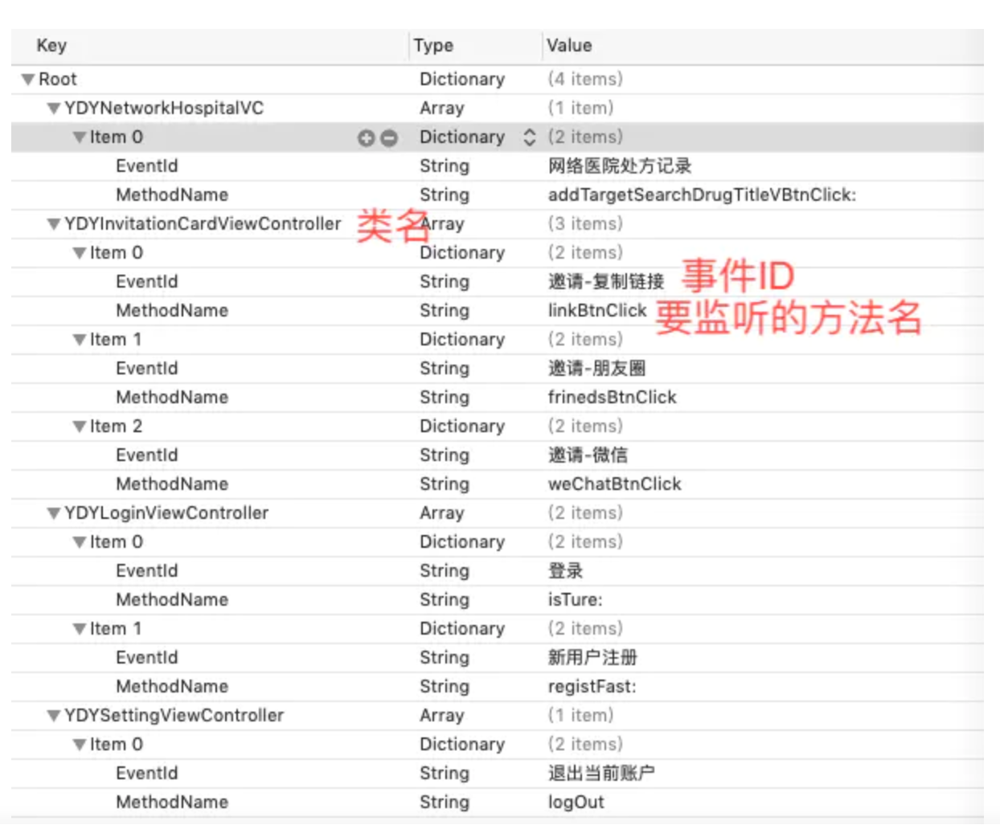

## AOP

### API接口

```objc
/**
作用域：针对所有对象生效
selector: 需要hook的方法
options：是个枚举，主要定义了切面的时机（调用前、替换、调用后）
block: 需要在selector前后插入执行的代码块
error: 错误信息
*/
+ (id<AspectToken>)aspect_hookSelector:(SEL)selector
                           withOptions:(AspectOptions)options
                            usingBlock:(id)block
                                 error:(NSError **)error;
/**
作用域：针对当前对象生效
*/
- (id<AspectToken>)aspect_hookSelector:(SEL)selector
                           withOptions:(AspectOptions)options
                            usingBlock:(id)block
                                 error:(NSError **)error
```

### 原理

1. 利用runtime的消息转发机制，可以说下runtime消息发送obj_msgSend的三个阶段

2. 将要调用的selector对应的imp替换为`_objc_msgForward` ,触发消息转发阶段

3. 把 `forwardInvocation`方法的imp替换成`__ASPECTS_ARE_BEING_CALLED__`

4. 在`__ASPECTS_ARE_BEING_CALLED__`中，拿到AspectContainer，其包含

   1. 根据调用的`selector`，获取容器对象`AspectsContainer`，这里面存储了这个类或对象的所有切面信息
   2. `AspectInfo`会存储当前的参数信息，用于传递
   3. 先触发函数调用前的block，存储在容器的`beforeAspects`对象中
   4. 接下来如果存在替换原有函数的block，即`insteadAspects`不为空，则触发它，如果不存在则调用原来的函数
   5. 触发函数调用后的block，存在在容器的`afterAspects`对象中

   

### 埋点统计，日志使用示例

1. 页面使用时长统计，这个比较简单，只需要在Controller页面中监听viewDidAppear和viewWillDisappear方法的执行情况就行了。

   ```objc
   #pragma mark -- 监控统计用户进入此界面的时长，频率等信息
   + (void)trackViewAppear{
       [UIViewController aspect_hookSelector:@selector(viewDidAppear:)
                                 withOptions:AspectPositionBefore
                                  usingBlock:^(id<AspectInfo> info){
                                      //用户统计代码写在此处
                                      UIViewController *currentVC = (UIViewController *)info.instance;
                                      [TalkingData trackPageBegin:currentVC.title];
                                      
   #ifdef DEBUG
                                      NSLog(@"VC: %@ -- %@---title:%@",  NSStringFromClass([info.instance class]), @"viewDidAppear",currentVC.title);
   #endif
                                  }
                                       error:NULL];
       
       
       [UIViewController aspect_hookSelector:@selector(viewWillDisappear:)
                                 withOptions:AspectPositionBefore
                                  usingBlock:^(id<AspectInfo> info){
                                      //用户统计代码写在此处
                                      UIViewController *currentVC = (UIViewController *)info.instance;
                                      [TalkingData trackPageEnd:currentVC.title];
                                      
   #ifdef DEBUG
                                      NSLog(@"VC: %@ -- %@---title:%@",  NSStringFromClass([info.instance class]), @"viewWillDisappear",currentVC.title);
   #endif
                                      
                                  }
                                       error:NULL];
   ```

2. 按钮点击事件，这个稍微复杂一点。我们可以新建一个plist文件来保存需要统计的点击事件方法和其所在的Controller。

   

   ```objc
   + (void)trackParameterEventWithClass:(Class)klass selector:(SEL)selector eventID:(NSString*)eventID{
       
       [klass aspect_hookSelector:selector withOptions:AspectPositionAfter usingBlock:^(id<AspectInfo> aspectInfo) {
           
           NSLog(@"统计事件参数个数:%lu",(unsigned long)[aspectInfo arguments].count);
           NSLog(@"统计事件参数---->%@",[aspectInfo arguments]);
           NSString *className = NSStringFromClass([aspectInfo.instance class]);
           NSLog(@"统计事件所属类名className--->%@",className);
           NSLog(@"统计事件名称event----->%@",eventID);
           if ([aspectInfo arguments].count == 0) {//无参数
               [TalkingData trackEvent:eventID];
           }else{//有参数
           //我们可以通过事件参数的值和类名来进行自定义操作
          }
   }]
   ```

   以上是目前所用的AOP编程中的实践，当后续需要更改统计数据时只需要改动plist文件和这个YDYStatisticalAnalysisManager类就行了，不会破坏原有的代码结构，减轻后续代码的维护工作。


数组,字典,集合的安全性校验


OC中任何以NSMutable开头的类都是可变容器，它们一般都具有（insert 、remove、replace）等操作，所以我们经常需要判断容器是否为空，以及指针越界等问题。为了避免我们在每次操作这些容器的时候都去判断，一般有以下几种

```objective-c
#import "NSMutableArray+SafeArray.h"
#import <objc/runtime.h>

@implementation NSMutableArray (SafeArray)

+ (void)load {
    [[self class] swizzleMethod:@selector(addObject:) withMethod:@selector(safeAddObject:)];
    [[self class] swizzleMethod:@selector(objectAtIndex:) withMethod:@selector(safeObjectAtIndex:)];
    [[self class] swizzleMethod:@selector(insertObject:atIndex:) withMethod:@selector(safeInsertObject:atIndex:)];
    [[self class] swizzleMethod:@selector(removeObjectAtIndex:) withMethod:@selector(safeRemoveObjectAtIndex:)];
    [[self class] swizzleMethod:@selector(replaceObjectAtIndex:withObject:) withMethod:@selector(safeReplaceObjectAtIndex:withObject:)];
    NSLog(@"%@ %@", @"SafeArray", [self class]);
}

#pragma mark - magic

- (void)safeAddObject:(id)anObject {
    //do safe operate
    if (anObject) {
        [self safeAddObject:anObject];
    } else {
        NSLog(@"safeAddObject: anObject is nil");
    }
}

- (id)safeObjectAtIndex:(NSInteger)index {
    //do safe operate
    if (index >= 0 && index <= self.count) {
        return [self safeObjectAtIndex:index];
    }
    NSLog(@"safeObjectAtIndex: index is invalid");
    return nil;
}

- (void)safeInsertObject:(id)anObject
                 atIndex:(NSUInteger)index {
   //do safe operate
    if (anObject && index >= 0 && index <= self.count) {
        [self safeInsertObject:anObject atIndex:index];
    } else {
        NSLog(@"safeInsertObject:atIndex: anObject or index is invalid");
    }
}

- (void)safeRemoveObjectAtIndex:(NSUInteger)index {
  //do safe operate
    if (index >= 0 && index <= self.count) {
        [self safeRemoveObjectAtIndex:index];
    } else {
        NSLog(@"safeRemoveObjectAtIndex: index is invalid");
    }
}

- (void)safeReplaceObjectAtIndex:(NSUInteger)index
                      withObject:(id)anObject {
   //do safe operate
    if (anObject && index >= 0 && index <= self.count) {
        [self safeReplaceObjectAtIndex:index withObject:anObject];
    } else {
        NSLog(@"safeReplaceObjectAtIndex:withObject: anObject or index is invalid");
    }
}

- (void)swizzleMethod:(SEL)origSelector
           withMethod:(SEL)newSelector {
    Class class = [self class];
    
    Method originalMethod = class_getInstanceMethod(class, origSelector);
    Method swizzledMethod = class_getInstanceMethod(class, newSelector);
    
    BOOL didAddMethod = class_addMethod(class,
                                        origSelector,
                                        method_getImplementation(swizzledMethod),
                                        method_getTypeEncoding(swizzledMethod));
    if (didAddMethod) {
        class_replaceMethod(class,
                            newSelector,
                            method_getImplementation(originalMethod),
                            method_getTypeEncoding(originalMethod));
    } else {
        method_exchangeImplementations(originalMethod, swizzledMethod);
    }
}
```


### 参考

+ [AOP面向切面编程在iOS中的实践](https://www.jianshu.com/p/c783fb20a905)
+ [Aspects深度解析-iOS面向切面编程](https://juejin.im/post/5e13c4366fb9a047f42e6406#heading-18)

