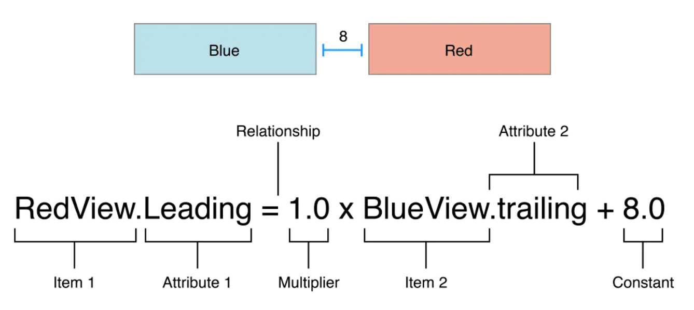
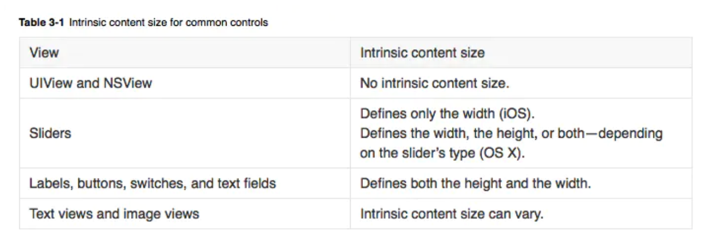

## AutoLayout


### Content的两个优先级

#### Content Hugging Priority

直译成中文就是“**内容拥抱优先级**”，从字面意思上来看就是两个视图，谁的“内容拥抱优先级”高，谁就优先环绕其内容。

```objective-c
label.text = @"label";
label2.text = @"label2";

[label setContentHuggingPriority:UILayoutPriorityRequired forAxis:UILayoutConstraintAxisHorizontal];
 [label2 setContentHuggingPriority:UILayoutPriorityDefaultLow forAxis:UILayoutConstraintAxisHorizontal];
 
[label mas_makeConstraints:^(MASConstraintMaker *make) {
       
        make.left.equalTo(@10);
        make.top.equalTo(@10);
        make.right.equalTo(label2.mas_left).offset(-20);
    }];
    
[label2 mas_makeConstraints:^(MASConstraintMaker *make) {
       
        make.left.equalTo(label.mas_right).offset(20);
        make.top.equalTo(label);
        make.right.equalTo(@(-10));
    }];

1. 设置label2的contentHuggingPriority的优先级低，那么label是内容被环抱的
```



#### Content Compression Resistance Priority

该优先级直译成中文就是“**内容压缩阻力优先级**”。也就是视图的“内容压缩阻力优先级”越大，那么该视图中的内容越难被压缩。而该优先级小的视图，则内容优先被压缩。

```objective-c
label.text = @"hello，我是第一个label，请多多！";
label2.text = @"hello，我是第二个label，谢谢";
[label setContentCompressionResistancePriority:UILayoutPriorityDefaultLow forAxis:UILayoutConstraintAxisHorizontal];
 [label2 setContentCompressionResistancePriority:UILayoutPriorityDefaultHigh forAxis:UILayoutConstraintAxisHorizontal];
 
[label mas_makeConstraints:^(MASConstraintMaker *make) {
        make.left.equalTo(@10);
        make.top.equalTo(@10);
        make.right.equalTo(label2.mas_left).offset(-20);
    }];
[label2 mas_makeConstraints:^(MASConstraintMaker *make) {
        make.left.equalTo(label.mas_right).offset(20);
        make.top.equalTo(label);
        make.right.equalTo(@(-10));
    }];

1. label2的优先级高，所以label2的内容压缩的阻力更大，所以label2完整显示，label的内容被压缩
```



这两个优先级都是跟view的intrinsicContentSize(内在内容的大小)属性相关的 


### VFL语法(了解)

VFL: `Visual Format Language`简化autolayout写法

### UIStackView(了解)

ios端的类似于flexbox布局, 用来提高ios开发响应式布局的易用性。

基本用法参考: [UIStackView的基本使用](<https://www.jianshu.com/p/213702004d0d>)

### 参考资料

* [Content两个优先级设置](<https://www.jianshu.com/p/5cf559435eb9>)
* [UIStackView的基本使用](<https://www.jianshu.com/p/213702004d0d>)
* [等间距布局 - 从0开始说一下masonry的使用](<https://www.jianshu.com/p/2c7a5ba73fc2>)
* [iOS学习之VFL语言简介](https://www.cnblogs.com/chars/p/5146607.html)

