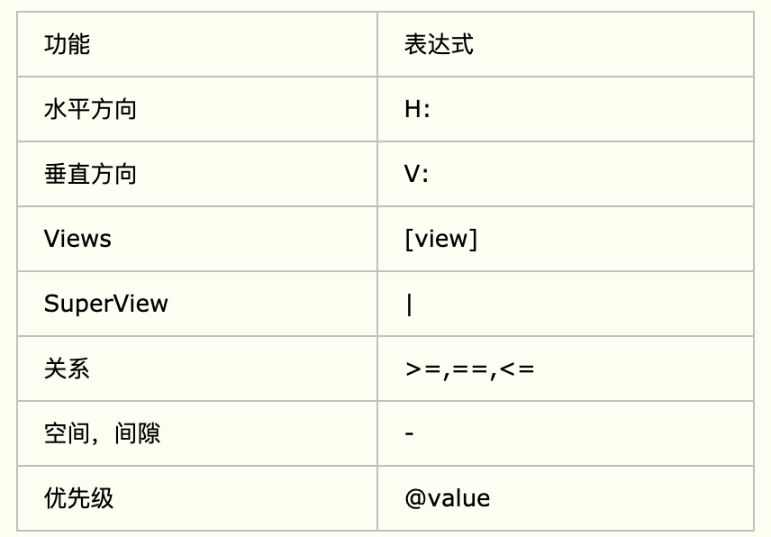
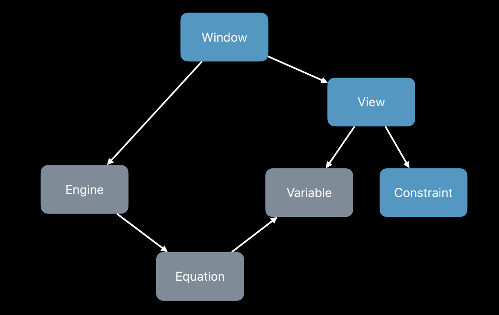
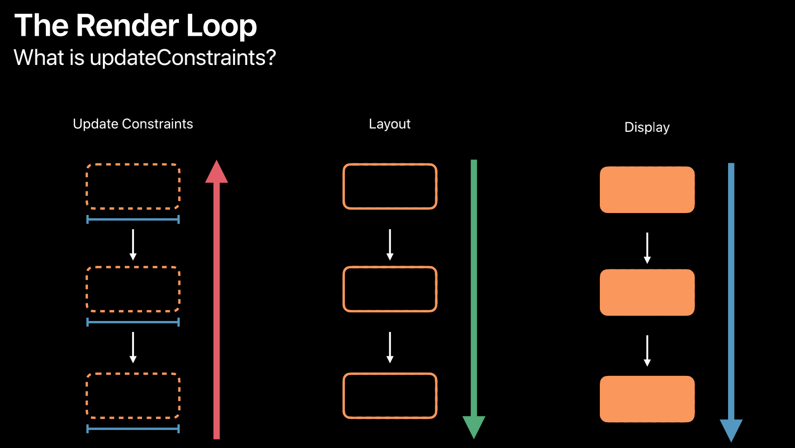
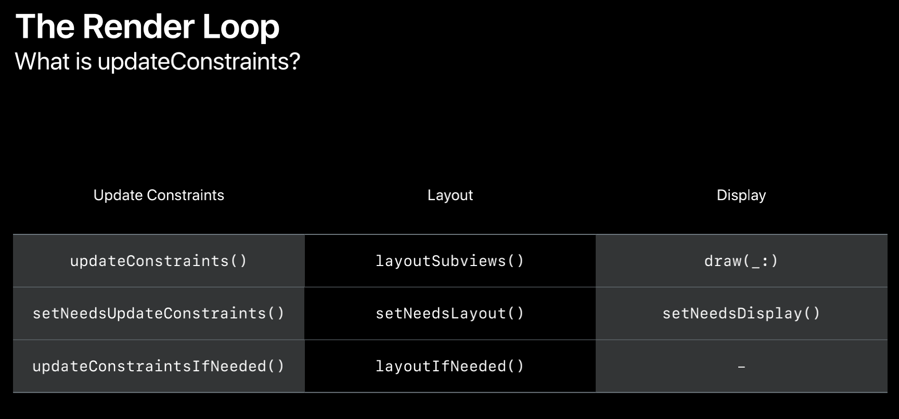
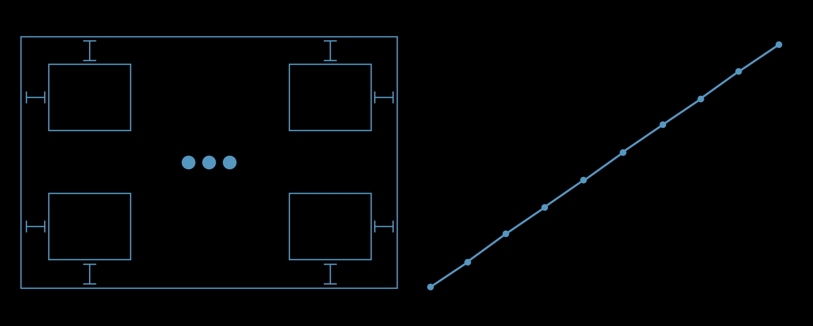
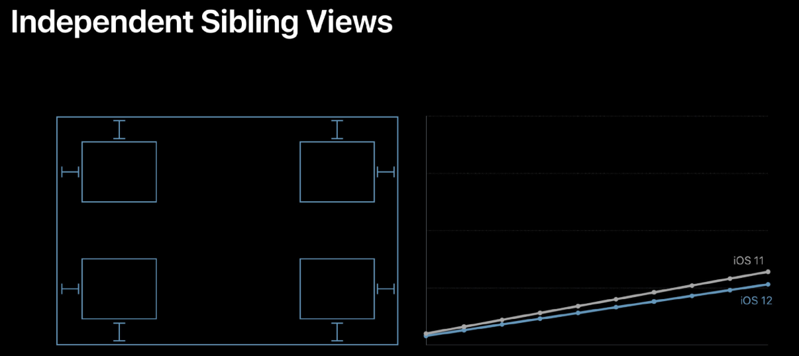
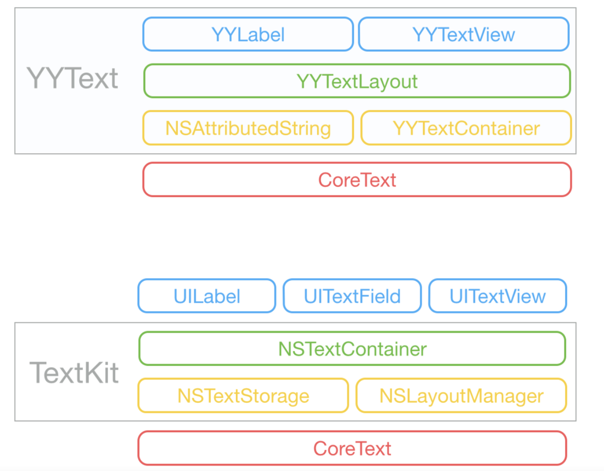
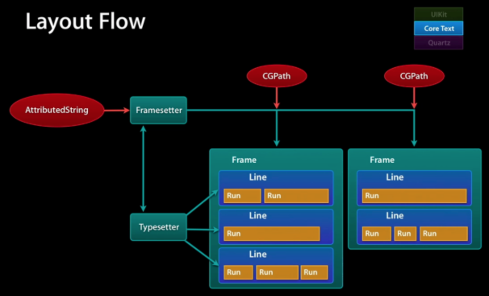

## AutoLayout

Auto Layout ，是苹果公司提供的一个基于约束布局，动态计算视图大小和位置的库，并且已经集成到了 Xcode 开发环境里。

在引入 Auto Layout 这种自动布局方式之前，iOS 开发都是采用手动布局的方式。而手动布局的方式，原始落后、界面开发维护效率低. 所以，苹果需要提供更好的界面引擎来提升开发者的体验，Auto Layout 随之出现。

### NSLayoutConstraint的使用

```
+(instancetype)constraintWithItem:(id)view1 
                      attribute:(NSLayoutAttribute)attr1 
                      relatedBy:(NSLayoutRelation)relation 
                      toItem:(nullable id)view2 
                      attribute:(NSLayoutAttribute)attr2 
                      multiplier:(CGFloat)multiplier 
                      constant:(CGFloat)c;
1.第一个参数view1:要设置的视图
2.第二个参数attr1:是个枚举,表示view1要设置的属性
3.第三个参数relation:是个枚举,表示视图view1和view2的指定属性之间的关系
4.第四个参数view2:参照的视图,可以为空
5.第五个参数attr2:是个枚举,表示view2的属性
6.第六个参数multipler:视图view1的指定属性是参照视图view2指定属性的多少倍
7.第七个参数c:视图view1的指定属性需要加的浮点数
根据参数的讲解,得出计算公式如下
view1.attr1 [=,>=,<=] view2.attr2 * multipler + c;
```


```objc
- (void)viewDidLoad {
    [super viewDidLoad];
    
    //创建红色的view
    UIView *redView = [[UIView alloc] init];
    redView.translatesAutoresizingMaskIntoConstraints = NO;
    redView.backgroundColor = [UIColor redColor];
    [self.view addSubview:redView];
    self.redView = redView;
     
    //宽度约束
    NSLayoutConstraint *width = [NSLayoutConstraint constraintWithItem:redView attribute:NSLayoutAttributeWidth relatedBy:NSLayoutRelationEqual toItem:nil attribute:NSLayoutAttributeNotAnAttribute multiplier:0 constant:100];
    //高度约束
     NSLayoutConstraint *height = [NSLayoutConstraint constraintWithItem:redView attribute:NSLayoutAttributeHeight relatedBy:NSLayoutRelationEqual toItem:nil attribute:NSLayoutAttributeNotAnAttribute multiplier:0 constant:100];
    //left约束
    NSLayoutConstraint *left = [NSLayoutConstraint constraintWithItem:redView attribute:NSLayoutAttributeLeft relatedBy:NSLayoutRelationEqual toItem:self.view attribute:NSLayoutAttributeLeft multiplier:1 constant:100];
    //top约束
     NSLayoutConstraint *top = [NSLayoutConstraint constraintWithItem:redView attribute:NSLayoutAttributeTop relatedBy:NSLayoutRelationEqual toItem:self.view attribute:NSLayoutAttributeTop multiplier:1 constant:100];

    [self.view addConstraint:left];
    [self.view addConstraint:top];
    [self.view addConstraint:width];
    [self.view addConstraint:height];
    self.widthConstraint = width;
}

- (void)touchesBegan:(NSSet<UITouch *> *)touches withEvent:(UIEvent *)event {
    //直接修改constant即可更新视图, 这样更高效
    self.widthConstraint.constant = 200;
}
```


### 几个基本概念

1. `Constraint equalities`（暂且叫做约束等式）：这个就是常见的约束类型。不再赘述，举几个例子：

   ```
   Red.top = 1.0 * Superview.top + 20.0
   Superview.bottom = 1.0 * Red.bottom + 20.0
   Red.top = 1.0 * Blue.top + 0.0
   Red.bottom = 1.0 * Blue.bottom + 0.0
   ```

2.  `Constraint Inequalities`（暂且叫做约束不等式）：它指定一个区域而不是一个确切的值。

   ```
   // Setting the minimum width
   View.width >= 0.0 * NotAnAttribute + 40.0
    
   // Setting the maximum width
   View.width <= 0.0 * NotAnAttribute + 280.0
   ```

3. `Constraint Priorities`约束优先级 ： 约束优级是一个0-1000的数值。当两个约束出现冲突时，优先级高的约束将保留，优先级低的约束失效。

4. `Intrinsic Content Size`内在内容size： 有些view 可以根据其内容设定其size。比如说UILabel,UIButton等，他们的size刚好能够容纳其内容支持`Intrinsic Content Size`的view如下

   

5. `content-hugging priorities`    抗拉伸优先级（默认250） ：这个优先级与 `Intrinsic Content Size`相关。假如一个Label的`Intrinsic Content Size`     width=50,  现在添加一个width=60的约束（默认优先级是1000）现在Label就会拉伸 。如果将 约束width=60的优先级设置成小于250的值，Label就不会被拉伸。

6.  `compression-resistance priorities` 抗压缩优先级（默认750）：这个优先级也与 `Intrinsic Content Size`相关。假如一个Label的`Intrinsic Content Size`     width=50,  现在添加一个width=40的约束（默认优先级是1000）现在Label就会压缩 。如果将 约束width=40的优先级设置成小于750的值，Label就不会被压缩。      可以看出   `content-hugging priorities`   和`compression-resistance priorities`用于抵抗其他约束对view`Intrinsic Content Size`的改变。


### VFL语法(了解)

+ VFL: `Visual Format Language`简化autolayout写法

+ 语法说明

  ```
  H:[cancelButton(72)]-12-[acceptButton(50)]
  cancelButton宽72，acceptButton宽50，它们之间间距12
   
  H:[wideView(>=60@700)]
  wideView宽度大于等于60point，该约束条件优先级为700（优先级最大值为1000，优先级越高的约束条件越先被满足）
    
  V:[redBox][yellowBox(==redBox)]
  垂直方向上，先有一个redBox，其下方紧接一个高度等于redBox高度的yellowBox
    
  H:|-10-[Find]-[FindNext]-[FindField(>=20)]-|
  水平方向上，Find距离父view左边缘间隔10，之后是FindNext距离Find间隔默认宽度；再之后是宽度不小于20的FindField，它和FindNext以及父view右边边缘的间距都是默认宽度。（竖线“|”表示superview的边缘）。
  ```

  

### UIStackView(了解)

ios端的类似于flexbox布局, 用来提高ios开发响应式布局的易用性。

基本用法参考: [UIStackView的基本使用](<https://www.jianshu.com/p/213702004d0d>)

### autolayout原理

+ 其位置的计算，采用cassowary算法， Cassowary 能够有效解析线性等式系统和线性不等式系统，用来表示用户界面中那些相等关系和不等关系。苹果基于此，开发了一种规则系统，通过约束来描述视图间的关系。约束就是规则，这个规则能够表示出一个视图相对于另一个视图的位置

+ 实际上当给一个view添加约束时，这个view最终是在window上，而在window存在一个layout engine(布局引擎)，这个engine就是autolayout的计算核心。我们所添加的每一条约束都会转化为一个等式或不等式equation，这个等式描述的就是如何求得Variables对应的值。当我们求得对应的Variables，就可以得到view对应的frame了。

+ 等式和不等式本质的区别是，不等式比等式多了一个变量，因为性能消耗几乎没有什么变化

  

+ layout engine计算view对应位置的过程其实一个render loop, 其每秒运行120次。每次分为三个阶段:

    

  

  - updateConstraints 约束更新
    + 所有需要的view，都会调用updateConstraints方法，从子视图，一直向上传递到window
    + 并且对superView调用 setNeedsLayout,从而在下个阶段触发layoutSubviews
  - layout 布局
    + 每一个接收到的view，都会调用layoutSubviews方法, 从window开始，一直到最下
    + 在layoutSubviews阶段，view会询问engine，将计算的对应的variable，copy出来，设置给subview的frame。从而确定子视图的位置
  - display 显示
    - 每一个接收到的view，都会调用drawRect方法, 从window开始，一直到最下

+ render loop主要是用来避免重复的工作

  ```
  例如对应一个label，可能设置多个属性都会引起其大小的改变，这个时候，我们为了避免重复渲染。
  就在所有的属性都设置好之后，再调用updateConstraints,一次性更新大小
  ```

+ 对于相互独立的区域， 在engine内部会有对应的相互独立等式块。每个等式块都需要花费一定的时间进行处理，所以相互独立view与性能之间的关系是线性的

  

+ layout engine可以理解为一个布局缓存和依赖关系追踪器。

  - 布局缓存: 它内部用来计算并缓存对应view真正的位置信息
  - 它非常具有针对性，它了解哪些约束会影响哪些视图，它只会更新需要修改的内容

### 使用注意点

+ 避免删除所有的约束

+ 不要重复创建添加约束, 对于静态约束，只需要添加一次

+ 只改变需要改变的约束

+ 尽量用hide()方法隐藏view，而不是remove然后add

+ 重写intrinsicContentSize 

  ```
  text的计算是成本很高的，所以UIlabel的size通过text去控制计算开销成本会很高。这个时候我们可以 通过重写 UILabel 的 intrinsicContentSize 来直接控制它的固有尺寸。如果已知一个UILabel的展示size，直接重写其属性，其他情况使用UIView.noIntrinsicMetric。
  
  override var intrinsicContentSize: CGSize {
      return CGSize(width: UIView.noIntrinsicMetric, height: UIView.noIntrinsicMetric)
  }
  ```

### ios12对autolayout的性能优化

+ 在view之间是相互独立的时候ios11和ios12，消耗的性能都是随着view的规模线性增加的

  

+ 但是对于嵌套的视图，在ios11上消耗的性能是指数型增长的，在ios12上优化成了线性增长

  

  iOS 12 之前，很多约束变化时都会重新创建一个计算引擎 **NSISEnginer** 将约束关系重新加进来，然后重新计算。结果就是，涉及到的约束关系变多时，新的计算引擎需要重新计算，最终导致计算量呈指数级增加。

### Masonry

+ 采用了函数式编程的思想，返回值为一个block，从而构成了链式调用

+ 其本质是封装了NSLayoutConstraint的API

  ```objective-c
  //创建约束 MASLayoutConstraint即为NSLayoutConstraint的子类
  MASLayoutConstraint *layoutConstraint
          = [MASLayoutConstraint constraintWithItem:firstLayoutItem
                                          attribute:firstLayoutAttribute
                                          relatedBy:self.layoutRelation
                                             toItem:secondLayoutItem
                                          attribute:secondLayoutAttribute
                                         multiplier:self.layoutMultiplier
                                           constant:self.layoutConstant];
  ....
  ....
  [self.installedView addConstraint:layoutConstraint];                  
  ```

+ 分析mas_makeConstraints的过程

  ```objective-c
     UIView *testView = [[UIView alloc] init];
     testView.backgroundColor = [UIColor redColor];
     [self.view addSubview:testView];
     [testView mas_makeConstraints:^(MASConstraintMaker *make) {
          //在block内部创建约束, MASViewConstraint类型
          make.center.mas_equalTo(self.view);
          make.width.mas_equalTo(100);
          make.height.mas_equalTo(100);
      }];
  ```

  1. mas_makeConstraints内部创建了一个maker，用来创建和保存所有的约束

     ```objc
     - (NSArray *)mas_makeConstraints:(void(^)(MASConstraintMaker *))block {
         self.translatesAutoresizingMaskIntoConstraints = NO;
         MASConstraintMaker *constraintMaker = [[MASConstraintMaker alloc] initWithView:self];
         block(constraintMaker);
         return [constraintMaker install];
     }
     ```

  2. maker进行install的过程，其实是把所有的自定义的约束(**MASViewConstraint**)循环遍历进行install

     ```objective-c
     //MASConstraintMaker
     - (NSArray *)install {
         if (self.removeExisting) {
             NSArray *installedConstraints = [MASViewConstraint installedConstraintsForView:self.view];
             for (MASConstraint *constraint in installedConstraints) {
                 [constraint uninstall];
             }
         }
         NSArray *constraints = self.constraints.copy;
         for (MASConstraint *constraint in constraints) {
             constraint.updateExisting = self.updateExisting;
            //对每个自定义的约束进行install
             [constraint install];
         }
         [self.constraints removeAllObjects];
         return constraints;
     }
     ```

  3. MASViewConstraint进行install的过程，本质上是生成对应的NSLayoutConstraint，然后再找到父视图，添加约束

     ```objective-c
     - (void)install {
         ...
         ...
         MAS_VIEW *firstLayoutItem = self.firstViewAttribute.item;
         NSLayoutAttribute firstLayoutAttribute = self.firstViewAttribute.layoutAttribute;
         MAS_VIEW *secondLayoutItem = self.secondViewAttribute.item;
         NSLayoutAttribute secondLayoutAttribute = self.secondViewAttribute.layoutAttribute;
     
     
         if (!self.firstViewAttribute.isSizeAttribute && !self.secondViewAttribute) {
             secondLayoutItem = self.firstViewAttribute.view.superview;
             secondLayoutAttribute = firstLayoutAttribute;
         }
         //MASLayoutConstraint是NSLayoutConstraint的子类
         //1. 转化生成NSLayoutConstraint
         MASLayoutConstraint *layoutConstraint
             = [MASLayoutConstraint constraintWithItem:firstLayoutItem
                                             attribute:firstLayoutAttribute
                                             relatedBy:self.layoutRelation
                                                toItem:secondLayoutItem
                                             attribute:secondLayoutAttribute
                                            multiplier:self.layoutMultiplier
                                              constant:self.layoutConstant];
         
         layoutConstraint.priority = self.layoutPriority;
         layoutConstraint.mas_key = self.mas_key;
         
         if (self.secondViewAttribute.view) {
             MAS_VIEW *closestCommonSuperview = [self.firstViewAttribute.view mas_closestCommonSuperview:self.secondViewAttribute.view];
             NSAssert(closestCommonSuperview,
                      @"couldn't find a common superview for %@ and %@",
                      self.firstViewAttribute.view, self.secondViewAttribute.view);
             self.installedView = closestCommonSuperview;
         } else if (self.firstViewAttribute.isSizeAttribute) {
             self.installedView = self.firstViewAttribute.view;
         } else {
             self.installedView = self.firstViewAttribute.view.superview;
         }
     
     
         MASLayoutConstraint *existingConstraint = nil;
         if (self.updateExisting) {
             //3. 在约束数组(self.installedView.constraints)中寻找对应存在的元存在的约束
             existingConstraint = [self layoutConstraintSimilarTo:layoutConstraint];
         }
         if (existingConstraint) {
             //更新存在的元素
             existingConstraint.constant = layoutConstraint.constant;
             self.layoutConstraint = existingConstraint;
         } else {
             //2. 找到installedView，然后添加约束
             [self.installedView addConstraint:layoutConstraint];
             self.layoutConstraint = layoutConstraint;
             [firstLayoutItem.mas_installedConstraints addObject:self];
         }
     }
     ```

### YYText的基本概述

+ [YYText](https://link.jianshu.com/?t=https://github.com/ibireme/YYText) 是YYKit中的一个富文本显示,编辑组件，拥有YYLabel，YYTextView 两个控件
+ 其中YYLabel类似于UILabel，但功能更为强大，支持**异步文本渲染**，更丰富的效果显示，支持UIImage，UIView, CALayer 文本附件，自定义强调文本范围，支持垂直文本显示等等
+ YYTextView 类似UITextView，除了兼容UITextView API，扩展了更多的CoreText 效果属性，支持高亮链接，支持自定义内部文本路径形状，支持图片拷贝，粘贴等等

+ 下面是YYText 与 TextKit 的比较图：

  

+ **YYLabel**：是基于`CoreText` 框架 在 `Context` 上进行绘制，通过设置`NSMutableAttributedString`实现文本各种效果属性的展现

  - YYAsyncLayer: YYLabel的异步渲染，通过YYAsyncLayerDisplayTask 回调渲染
  - YYTextLayout: YYLabel的布局管理类，也负责绘制
  - YYTextContainer: YYLabel的布局类
  - NSAttributedString+YYText: YYLabel 所有效果属性设置

+ #### YYAsyncLayer 的异步实现

  - `YYAsyncLayer` 是 CALayer的子类

  - 通过设置 YYLabel 类方法 `layerClass`，返回自定义的 `YYAsyncLayer`，重写了父类的 `setNeedsDisplay` , `display` 实现 `contents` 自定义刷新。在task.display执行之后，通过UIGraphicsGetImageFromCurrentImageContext得到image，并将image复制给layer.content，

    `self.contents = (__bridge id)(image.CGImage);` 

    ```objc
    
    //重写setNeedsDisplay
    - (void)setNeedsDisplay {
        [self _cancelAsyncDisplay];//先取消异步绘制
        [super setNeedsDisplay];
    }
    //重写display方法
    - (void)display {
        //_displaysAsynchronously默认为true
        super.contents = super.contents;
        [self _displayAsync:_displaysAsynchronously];
    }
    
    #pragma mark - Private
    - (void)_displayAsync:(BOOL)async {
        __strong id<YYAsyncLayerDelegate> delegate = (id)self.delegate;
        YYAsyncLayerDisplayTask *task = [delegate newAsyncDisplayTask];
        if (!task.display) {
            if (task.willDisplay) task.willDisplay(self);
            self.contents = nil;
            if (task.didDisplay) task.didDisplay(self, YES);
            return;
        }
        
        if (async) {
            //主线程中，willDisplay将要绘制
            if (task.willDisplay) task.willDisplay(self);
            
            dispatch_async(YYAsyncLayerGetDisplayQueue(), ^{
                //查看 sentinel.value的值是否有改变，来决定是否取消绘制
                if (isCancelled()) {
                    CGColorRelease(backgroundColor);
                    return;
                }
                .....
                ....
                //在子线程的中进行display
                task.display(context, size, isCancelled);
                
                //绘制得到的内容image
                UIImage *image = UIGraphicsGetImageFromCurrentImageContext();
                UIGraphicsEndImageContext();
                ...
                ....
                dispatch_async(dispatch_get_main_queue(), ^{
                    if (isCancelled()) {
                        if (task.didDisplay) task.didDisplay(self, NO);
                    } else {
                        //didDisplay, 绘制结束返回主线程
                        self.contents = (__bridge id)(image.CGImage);
                        if (task.didDisplay) task.didDisplay(self, YES);
                    }
                });
            });
        } else {
            //主线程中绘制
            if (task.willDisplay) task.willDisplay(self);
            task.display(context, self.bounds.size, ^{return NO;});
            UIImage *image = UIGraphicsGetImageFromCurrentImageContext();
            UIGraphicsEndImageContext();
            self.contents = (__bridge id)(image.CGImage);
            if (task.didDisplay) task.didDisplay(self, YES);
        }
    }
    //取消绘制时,让_sentinel值增加
    - (void)_cancelAsyncDisplay {
        [_sentinel increase];
    }
    
    ```

  - `YYAsyncLayerDelegate`返回新的刷新任务 `newAsyncDisplayTask` 用于更新过程回调，返回到 YYLabel 进行文本渲染

  - 其中 `YYSentinel`是一个线程安全的原子递增计数器，用于判断更新是否取消。

  - `YYLabel` 实现了 `YYAsyncLayerDelegate` 代理方法 `newAsyncDisplayTask`，回调处理3种文本渲染状态willDisplay ，display，didDisplay

  - 在display回调里方法里面进行绘制

    ```objc
    //YYLable.m
    #pragma mark - YYAsyncLayerDelegate
    
    //遵守AsyncLayer的代理
    - (YYAsyncLayerDisplayTask *)newAsyncDisplayTask {
        ...
        ...
        __block YYTextLayout *layout = (_state.showingHighlight && _highlightLayout) ? self._highlightLayout : self._innerLayout;
       
        //创建task
        YYTextAsyncLayerDisplayTask *task = [YYTextAsyncLayerDisplayTask new];
        
        task.willDisplay = ^(CALayer *layer) {
            //在willDisplay时，移除不需要的文本附件
            [layer removeAnimationForKey:@"contents"];
            ...
            ...
            [attachmentViews removeAllObjects];
            [attachmentLayers removeAllObjects];
        };
    
        task.display = ^(CGContextRef context, CGSize size, BOOL (^isCancelled)(void)) {
            if (isCancelled()) return;
            if (text.length == 0) return;
            //在display里进行绘制（默认是异步的，由YYAsyncLayer来指定）
            YYTextLayout *drawLayout = layout;
            ...
            ...
            [drawLayout drawInContext:context size:size point:point view:nil layer:nil debug:debug cancel:isCancelled];
        };
    
        task.didDisplay = ^(CALayer *layer, BOOL finished) {
            //在didDisplay里, 渲染完成后添加所需要的附件
        };
        return task;
    }
    ```

  - YYTransaction

    - 添加一个observer到主线程的runloop中，当将要进入休眠kCFRunLoopBeforeWaiting或退出runloop时kCFRunLoopExit,回调执行方法

      ```objc
      @interface YYTransaction()
      @property (nonatomic, strong) id target;
      @property (nonatomic, assign) SEL selector;
      @end
      
      static NSMutableSet *transactionSet = nil;
      
      static void YYRunLoopObserverCallBack(CFRunLoopObserverRef observer, CFRunLoopActivity activity, void *info) {
          if (transactionSet.count == 0) return;
          NSSet *currentSet = transactionSet;
          transactionSet = [NSMutableSet new];
          [currentSet enumerateObjectsUsingBlock:^(YYTransaction *transaction, BOOL *stop) {
      #pragma clang diagnostic push
      #pragma clang diagnostic ignored "-Warc-performSelector-leaks"
              [transaction.target performSelector:transaction.selector];
      #pragma clang diagnostic pop
          }];
      }
      
      static void YYTransactionSetup() {
          static dispatch_once_t onceToken;
          dispatch_once(&onceToken, ^{
              transactionSet = [NSMutableSet new];
              CFRunLoopRef runloop = CFRunLoopGetMain();
              CFRunLoopObserverRef observer;
              //0xFFFFFF
              observer = CFRunLoopObserverCreate(CFAllocatorGetDefault(),
                                                 kCFRunLoopBeforeWaiting | kCFRunLoopExit,
                                                 true,      // repeat
                                                 0xFFFFFF,  // after CATransaction(2000000)
                                                 YYRunLoopObserverCallBack, NULL);
              CFRunLoopAddObserver(runloop, observer, kCFRunLoopCommonModes);
              CFRelease(observer);
          });
      }
      
      
      @implementation YYTransaction
      
      + (YYTransaction *)transactionWithTarget:(id)target selector:(SEL)selector{
          if (!target || !selector) return nil;
          YYTransaction *t = [YYTransaction new];
          t.target = target;
          t.selector = selector;
          return t;
      }
      
      - (void)commit {
          if (!_target || !_selector) return;
          YYTransactionSetup();
          [transactionSet addObject:self];
      }
      
      @end
      
      ```

+ #### YYTextLayout

  - YYLabel的布局管理类，也负责绘制
  - 包含YYTextContainer负责布局，NSAttributedString负责文本内容

+ ### CoreText

  - `CoreText`是iOS/OSX里的文字渲染引擎，在iOS/OSX上看到的所有文字在底层都是由CoreText去渲染。

    

      一个 `NSAttributeString`通过CoreText的`CTFramesetterCreateWithAttributedString`生成`CTFramesetter`,它是创建 `CTFrame`的工厂，为 `CTFramesetter` 提供一个 `CGPath`，它就会通过它持有的 `CTTypesetter`生成 `CTFrame`，`CTFrame`里面包含了 `CTLine` `CTLine` 中包含了此行所有的 `CTRun`，然后就可以绘制到画布上。`CTFrame`,`CTLine`,`CTRun`都提供了渲染接口，但前两者是封装，最后实际都是调用到 `CTRun`的渲染接口去绘制。

  - `CTFramesetterCreateWithAttributedString`

  - `CTFramesetter`

  - `CTFrame`

  - `CTLine`

  - `CTRun`

  

​        

​         


作者：一口气全念完
链接：https://www.jianshu.com/p/e214b3793005
来源：简书
著作权归作者所有。商业转载请联系作者获得授权，非商业转载请注明出处。

### 参考资料

* [iOS学习之VFL语言简介](https://www.cnblogs.com/chars/p/5146607.html)
* [iOS AutoLayout还可以这样玩](https://juejin.im/post/5a30c999f265da431523e628)
* [AutoLayout 的原理性能](https://www.dazhuanlan.com/2019/10/05/5d97e8f15427d/#1)
* [深入理解 Autolayout 与列表性能 -- 背锅的 Cassowary 和偷懒的 CPU](https://juejin.im/post/5bd5a546f265da0af033cee6#Textlayout)
* [WWDC2018  高性能 AutoLayout High Performance Auto Layout](https://www.jianshu.com/p/9ba1344d9670)
* [YYText源码分析](https://www.jianshu.com/p/e214b3793005)

