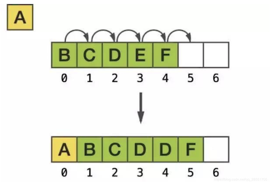
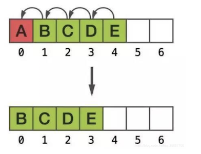
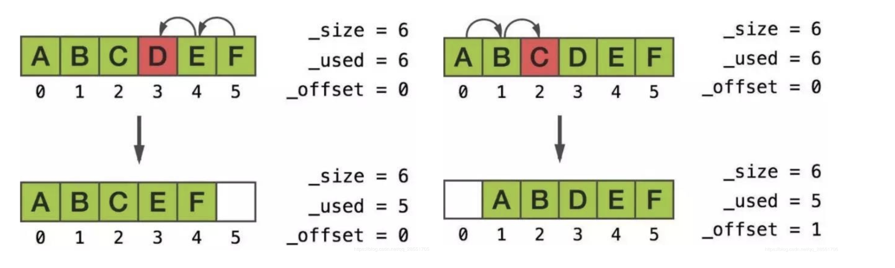
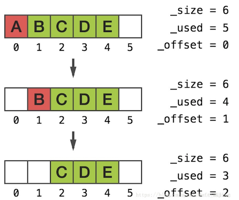

## iOS集合类型的底层结构

### NSMutableArray原理

+ 对于普通的C数组， 和java的ArrayList一样，当进行插入，删除时，可能涉及到元素的挪动

  + 当在0位置插入元素时

    

  + 当在0位置删除元素时

    

  + 数组非常大时，进行插入和删除时，可能会涉及到元素的大量挪动

+ NSMutableArray其本质上是_NSArrayM， 内部用的是环形缓冲区实现的。通过环形缓冲区，来达到降低数据的时间复杂度，优化性能的目的

+ 使用唤醒缓冲区的NSMutableArray进行插入和删除时

  - 在中间进行插入删除时，只会移动最少的一边的元素

    

  - 在头部删除元素

    

    

  

### NSSet原理

```java
struct __CFSet {
    CFRuntimeBase _base;
    CFIndex _count;     /* number of values */
    CFIndex _capacity;      /* maximum number of values */
    CFIndex _bucketsNum;    /* number of slots */
    uintptr_t _marker;
    void *_context;     /* private */
    CFIndex _deletes;
    CFOptionFlags _xflags;      /* bits for G
    //用来存储对象
    const void **_keys;     /* can be NULL if not allocated yet */
};
```

NSSet添加key，key值会根据特定的hash函数算出hash值，然后存储数据的时候，会根据hash函数算出来的值，找到对应的下标，如果该下标下已有数据，`开放定址法后`移动插入，如果数组到达阈值，这个时候就会进行扩容，然后重新hash插入。查询速度就可以和连续性存储的数据一样接近O(1)了


### NSDictionary原理

```java
struct __CFDictionary {
    CFRuntimeBase _base;
    CFIndex _count;     /* number of values */
    CFIndex _capacity;      /* maximum number of values */
    CFIndex _bucketsNum;    /* number of slots */
    uintptr_t _marker;
    void *_context;     /* private */
    CFIndex _deletes;
    CFOptionFlags _xflags;      /* bits for GC */
    //用来存储key
    const void **_keys;     /* can be NULL if not allocated yet */
    //用来存储对应的values
    const void **_values;   /* can be NULL if not allocated yet */
};
```

和上面的集合NSSet相比较，多了一个指针数组values。

通过比较集合NSSet和字典NSDictionary的[源码](https://links.jianshu.com/go?to=https%3A%2F%2Fopensource.apple.com%2Fsource%2FCF%2FCF-368%2FCollections.subproj%2FCFDictionary.c.auto.html)可以知道两者实现的原理差不多，而字典则用了两个数组keys和values，说明这两个数据是被分开存储的。

同样的也是利用开放定址法来动态扩容数组来解决数组满了无法插入的问题


首先**key利用hash函数算出hash值，然后对数组的长度取模，得到数组下标的位置，同样将这个地址对应到values数组的下标，就匹配到相应的value**。 注意到上面的这句话，要保证一点，就是**keys和values这两个数组的长度要一致**。所以扩容的时候，需要对keys和values两个数组一起扩容。


字典把无序和庞大的数据进行了空间hash表对应，下次查找的复杂度接近于O(1)，但是不断扩容的空间就是其弊端，因此开放地址法最好存储的是临时需要，尽快的释放资源。


**对于字典NSDictionary设置的key和value，key值会根据特定的hash函数算出hash值，keys和values同样多，利用hash值对数组长度取模，得到其对应的下标index，如果下标已有数据，开放定址法后移插入，如果数组达到阈值，就扩容，然后重新hash插入。这样的机制就把一些不连续的key-value值插入到能建立起关系的hash表中。**   
 **查找的时候，key根据hash函数以及数组长度，得到下标，然后根据下标直接访问hash表的keys和values，这样查询速度就可以和连续线性存储的数据一样接近O(1)了。**

