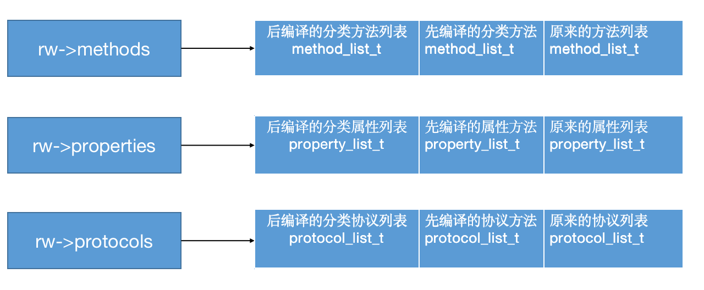
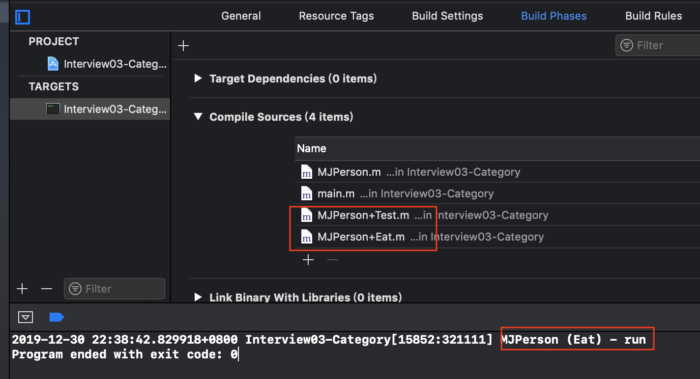
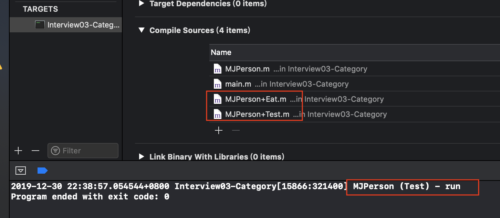

## Category

### 基本使用

+ 代码如下

  ```objective-c
  //MJPerson
  @interface MJPerson : NSObject
  - (void)run;
  @end
  
  @implementation MJPerson
  - (void)run
  {
      NSLog(@"MJPerson - run");
  }
  @end
  
  // MJPerson+Test
  @interface MJPerson (Test) 
  
  - (void)test;
  
  @end
  
  @implementation MJPerson (Test)
  - (void)test
  {
      NSLog(@"test");
  }
  + (void)test2
  {
      
  }
  @end
  
  //MJPerson+Eat
  @interface MJPerson (Eat) <NSCopying, NSCoding>
  - (void)eat;
  @property (assign, nonatomic) int weight;
  @property (assign, nonatomic) double height;
  @end
  
  
  #import "MJPerson+Eat.h"
  
  @implementation MJPerson (Eat)
  - (void)eat {
   NSLog(@"eat");
  }
  - (void)eat1
  {}
  + (void)eat2
  {}
  + (void)eat3
  {}
  @end
  ```

  ```objective-c
  int main(int argc, const char * argv[]) {
      @autoreleasepool {
          MJPerson *person = [[MJPerson alloc] init];
          [person run];
          [person test];
          [person eat];
      }
      return 0;
  }
  ```

  + person调用run, test ,eat方法实质上是objc_msgSend(person. @selector(xxx))
  +  通过runtime动态将分类的方法合并到类对象、元类对象中

### 底层结构

+ 编译`MJPerson+Eat.m`文件

  ```shell
  $ xcrun  -sdk  iphoneos  clang  -arch  arm64  -rewrite-objc MJPerson+Eat.m -o MJPerson+Eat.cpp
  ```

+ 底层代码

  ```objc
  struct _category_t {
  	const char *name; //类名
  	struct _class_t *cls; //类指针
  	const struct _method_list_t *instance_methods; //实例方法列表
  	const struct _method_list_t *class_methods;    //类方法列表
  	const struct _protocol_list_t *protocols;      //协议列表
  	const struct _prop_list_t *properties;         //属性列表
  };
  
  //MJPerson+Eat所有分类信息
  static struct _category_t _OBJC_$_CATEGORY_MJPerson_$_Eat __attribute__ ((used, section ("__DATA,__objc_const"))) = 
  {
  	"MJPerson",
  	0, // &OBJC_CLASS_$_MJPerson,
  	(const struct _method_list_t *)&_OBJC_$_CATEGORY_INSTANCE_METHODS_MJPerson_$_Eat,
  	(const struct _method_list_t *)&_OBJC_$_CATEGORY_CLASS_METHODS_MJPerson_$_Eat,
  	(const struct _protocol_list_t *)&_OBJC_CATEGORY_PROTOCOLS_$_MJPerson_$_Eat,
  	(const struct _prop_list_t *)&_OBJC_$_PROP_LIST_MJPerson_$_Eat,
  };
  
  //实例方法列表
  static struct /*_method_list_t*/ {
  	unsigned int entsize;  // sizeof(struct _objc_method)
  	unsigned int method_count;
  	struct _objc_method method_list[2];
  } _OBJC_$_CATEGORY_INSTANCE_METHODS_MJPerson_$_Eat __attribute__ ((used, section ("__DATA,__objc_const"))) = {
  	sizeof(_objc_method),
  	2,
  	{{(struct objc_selector *)"eat", "v16@0:8", (void *)_I_MJPerson_Eat_eat},
  	{(struct objc_selector *)"eat1", "v16@0:8", (void *)_I_MJPerson_Eat_eat1}}
  };
  
  //类方法列表
  static struct /*_method_list_t*/ {
  	unsigned int entsize;  // sizeof(struct _objc_method)
  	unsigned int method_count;
  	struct _objc_method method_list[2];
  } _OBJC_$_CATEGORY_CLASS_METHODS_MJPerson_$_Eat __attribute__ ((used, section ("__DATA,__objc_const"))) = {
  	sizeof(_objc_method),
  	2,
  	{{(struct objc_selector *)"eat2", "v16@0:8", (void *)_C_MJPerson_Eat_eat2},
  	{(struct objc_selector *)"eat3", "v16@0:8", (void *)_C_MJPerson_Eat_eat3}}
  };
  
  //协议列表
  static struct /*_protocol_list_t*/ {
  	long protocol_count;  // Note, this is 32/64 bit
  	struct _protocol_t *super_protocols[2];
  } _OBJC_CATEGORY_PROTOCOLS_$_MJPerson_$_Eat __attribute__ ((used, section ("__DATA,__objc_const"))) = {
  	2,
  	&_OBJC_PROTOCOL_NSCopying,
  	&_OBJC_PROTOCOL_NSCoding
  };
  
  //属性列表
  static struct /*_prop_list_t*/ {
  	unsigned int entsize;  // sizeof(struct _prop_t)
  	unsigned int count_of_properties;
  	struct _prop_t prop_list[2];
  } _OBJC_$_PROP_LIST_MJPerson_$_Eat __attribute__ ((used, section ("__DATA,__objc_const"))) = {
  	sizeof(_prop_t),
  	2,
  	{{"weight","Ti,N"},
  	{"height","Td,N"}}
  };
  ```

### 源码分析

+ 源码阅读顺序
  - objc-os.mm
    - _objc_init
    - map_images
    - map_images_nolock
  - objc-runtime-new.mm
    - _read_images
    - remethodizeClass
    - attachCategories
    - attachLists
    - realloc、memmove、 memcpy
+ Category的加载处理过程
  1. 通过Runtime加载某个类的所有Category数据
  2. 把所有Category的方法、属性、协议数据，合并到一个大数组中
     - 后面参与编译的Category数据，会在数组的前面
     - 因此分类中的方法，会覆盖原来类中的方法。
     - 如果多个分类中都有同样的方法，最终调用的是最后参与编译的分类中的方法
  3. 将合并后的分类数据（方法、属性、协议），插入到类原来数据的前面

+ 源码

  ```objective-c
  void _objc_init(void)
  {
      static bool initialized = false;
      if (initialized) return;
      initialized = true;
      
      // fixme defer initialization until an objc-using image is found?
      environ_init();
      tls_init();
      static_init();
      lock_init();
      exception_init();
  
      _dyld_objc_notify_register(&map_images, load_images, unmap_image);
  }
  ```

  ```objc
  void map_images(unsigned count, const char * const paths[],
             const struct mach_header * const mhdrs[])
  {
      mutex_locker_t lock(runtimeLock);
      return map_images_nolock(count, paths, mhdrs);
  }
  ```

  ```objc
  void 
  map_images_nolock(unsigned mhCount, const char * const mhPaths[],
                    const struct mach_header * const mhdrs[])
  {
      .....
      if (hCount > 0) {
          _read_images(hList, hCount, totalClasses, unoptimizedTotalClasses);
      }
      ....
  }
  ```

  ```objc
  void _read_images(header_info **hList, uint32_t hCount, int totalClasses, int unoptimizedTotalClasses)
  {
      .....
              if (cat->instanceMethods ||  cat->protocols  
                  ||  cat->instanceProperties) 
              {
                  addUnattachedCategoryForClass(cat, cls, hi);
                  if (cls->isRealized()) {
                    //重新组织类
                    remethodizeClass(cls);
                      classExists = YES;
                  }
                  if (PrintConnecting) {
                      _objc_inform("CLASS: found category -%s(%s) %s", 
                                   cls->nameForLogging(), cat->name, 
                                   classExists ? "on existing class" : "");
                  }
              }
  
              if (cat->classMethods  ||  cat->protocols  
                  ||  (hasClassProperties && cat->_classProperties)) 
              {
                  addUnattachedCategoryForClass(cat, cls->ISA(), hi);
                  if (cls->ISA()->isRealized()) {
                      //重新组织元类
                      remethodizeClass(cls->ISA());
                  }
              }
          }
      }
  
      .....
  }
  
  ```

  ```objc
  static void remethodizeClass(Class cls)
  {
      category_list *cats;
      bool isMeta;
  
      runtimeLock.assertLocked();
  
      isMeta = cls->isMetaClass();
  
      // Re-methodizing: check for more categories
      if ((cats = unattachedCategoriesForClass(cls, false/*not realizing*/))) {
          if (PrintConnecting) {
              _objc_inform("CLASS: attaching categories to class '%s' %s", 
                           cls->nameForLogging(), isMeta ? "(meta)" : "");
          }
          
          attachCategories(cls, cats, true /*flush caches*/);        
          free(cats);
      }
  }
  ```

  ```objective-c
  //cls: [MJPerson class]
  //cats: [category_t,category_t]
  static void 
  attachCategories(Class cls, category_list *cats, bool flush_caches)
  {
      if (!cats) return;
      if (PrintReplacedMethods) printReplacements(cls, cats);
  
      bool isMeta = cls->isMetaClass();
  
      /*
       方法数组
       [
         [method_t,method_t,...],
         [method_t,method_t,...],
          ...
       ]
       */
      method_list_t **mlists = (method_list_t **)
          malloc(cats->count * sizeof(*mlists));
      /*
       属性数组
       [
         [property_t,property_t,...],
         [property_t,property_t,...],
         ...
       ]
       */
      property_list_t **proplists = (property_list_t **)
          malloc(cats->count * sizeof(*proplists));
      /*
       协议数组
       [
          [protocol_t,protocol_t,...],
          [protocol_t,protocol_t,...],
          ...
       ]
       */
      protocol_list_t **protolists = (protocol_list_t **)
          malloc(cats->count * sizeof(*protolists));
  
    int mcount = 0;
      int propcount = 0;
      int protocount = 0;
      int i = cats->count;
      bool fromBundle = NO;
      while (i--) { //按分类的编译顺序倒序取出分类信息
          //取出某个分类
          auto& entry = cats->list[i];
          //取出分类中的方法列表
          method_list_t *mlist = entry.cat->methodsForMeta(isMeta);
          if (mlist) {
              mlists[mcount++] = mlist;
              fromBundle |= entry.hi->isBundle();
          }
          //取出分类中的属性列表
          property_list_t *proplist = 
              entry.cat->propertiesForMeta(isMeta, entry.hi);
          if (proplist) {
              proplists[propcount++] = proplist;
          }
          //取出分类中的属性列表
          protocol_list_t *protolist = entry.cat->protocols;
          if (protolist) {
              protolists[protocount++] = protolist;
          }
      }
      //得到类对象里的数据
      auto rw = cls->data();
  
      prepareMethodLists(cls, mlists, mcount, NO, fromBundle);
      //将所有分类的方法列表附加到类的方法列表
      rw->methods.attachLists(mlists, mcount);
      free(mlists);
      if (flush_caches  &&  mcount > 0) flushCaches(cls);
      //将所有分类的属性列表附加到类的属性列表
      rw->properties.attachLists(proplists, propcount);
      free(proplists);
      //将所有分类的协议列表附加到类的协议列表
      rw->protocols.attachLists(protolists, protocount);
      free(protolists);
  }
  ```

  ```objc
  addedLists:
   [
       [method_t,method_t,...],
       [method_t,method_t,...],
       ...
   ]
  或
   [
       [property_t,property_t,...],
       [property_t,property_t,...],
       ...
   ]
  或
   [
        [protocol_t,protocol_t,...],
        [protocol_t,protocol_t,...],
        ...
   ]
  
  addedCount: 分类的数量
  将分类的列表addedLists，放到原来类对应的列表之前。
    
  void attachLists(List* const * addedLists, uint32_t addedCount) {
          if (addedCount == 0) return;
  
          if (hasArray()) {
              // many lists -> many lists
              uint32_t oldCount = array()->count;
              uint32_t newCount = oldCount + addedCount;
              setArray((array_t *)realloc(array(), array_t::byteSize(newCount)));
              array()->count = newCount;
              //array()->lists 原来的方法列表
              memmove(array()->lists + addedCount, array()->lists, 
                      oldCount * sizeof(array()->lists[0]));
              //addedLists 所有分类的方法列表
              memcpy(array()->lists, addedLists, 
                     addedCount * sizeof(array()->lists[0]));
          }
          else if (!list  &&  addedCount == 1) {
              // 0 lists -> 1 list
              list = addedLists[0];
          } 
          else {
              // 1 list -> many lists
              List* oldList = list;
              uint32_t oldCount = oldList ? 1 : 0;
              uint32_t newCount = oldCount + addedCount;
              setArray((array_t *)malloc(array_t::byteSize(newCount)));
              array()->count = newCount;
              if (oldList) array()->lists[addedCount] = oldList;
              memcpy(array()->lists, addedLists, 
                     addedCount * sizeof(array()->lists[0]));
          }
      }
  ```

+ 最终合并后的方法，属性，协议列表

  ```objc
  //Eat先编译，Test后编译
  methods: method_array_t
  
  [
    method_list_t(MJPerson+Test), 后编译
    method_list_t(MJPerson+Eat),  先编译
    method_list_t(MJPerson)
  ]
  
  [
    [method_t,method_t,...](MJPerson+Test), 后编译
    [method_t,method_t,...](MJPerson+Eat) , 先编译
    [method_t,method_t,...](MJPerson)
  ]
  
  properties: property_array_t
  
  [
    property_list_t(MJPerson+Test),  后编译
    property_list_t(MJPerson+Eat),   先编译
    property_list_t(MJPerson)
  ]
  
  [
    [property_t,property_t,...](MJPerson+Test), 后编译
    [property_t,property_t,...](MJPerson+Eat) , 先编译
    [property_t,property_t,...](MJPerson)
  ]
  
  protocols: protocol_array_t
  
  [
    protocol_list_t(MJPerson+Test),  后编译
    protocol_list_t(MJPerson+Eat),   先编译
    protocol_list_t(MJPerson)
  ]
  
  [
    [protocol_t,protocol_t,...](MJPerson+Test), 后编译
    [protocol_t,protocol_t,...](MJPerson+Eat) , 先编译
    [protocol_t,protocol_t,...](MJPerson)
  ]
  ```

  

+ 分类中的对象方法放在类对象中，分类中的类方法放在元类中


### 方法调用顺序

+ 如果多个分类中都有同样的方法，最终调用的是最后参与编译的分类中的方法

+ 如果MJPerson， MJPerson+Test, MJPerson+Eat分类都有run方法

  - 如果MJPerson+Eat后编译，则调用MJPerson+Eat的run方法

    

  - 如果MJPerson+Test后编译，则调用MJPerson+Test的run方法

    


### load基本使用

+ +load方法会在runtime加载类、分类时自动调用
+ 每个类、分类的+load，在程序运行过程中只调用一次

+ 测试代码

  1. MJPerson， MJPerson+Test1分类， MJPerson+Test2分类分别实现+load方法

     ```objc
     @implementation MJPerson
     
     + (void)load
     {
         NSLog(@"MJPerson +load");
     }
     @end
     
     @implementation MJPerson (Test1)
     
     + (void)load
     {
         NSLog(@"MJPerson (Test1) +load");
     }
     
     
     @end
     
     @implementation MJPerson (Test2)
     
     + (void)load
     {
         NSLog(@"MJPerson (Test2) +load");
     }
     @end
     ```

  2. 直接运行工程，查看调用结果

     ```
      MJPerson +load
      MJPerson (Test1) +load
      MJPerson (Test2) +load
     ```

### load调用原理

+ +load方法是根据方法地址直接调用，并不是经过objc_msgSend函数调用

+ 源码分析过程

  ```objc
  void _objc_init(void)
  {
      static bool initialized = false;
      if (initialized) return;
      initialized = true;
      
      // fixme defer initialization until an objc-using image is found?
      environ_init();
      tls_init();
      static_init();
      lock_init();
      exception_init();
  
      _dyld_objc_notify_register(&map_images, load_images, unmap_image);
  }
  
  ```

  ```objc
  void
  load_images(const char *path __unused, const struct mach_header *mh)
  {
      if (!hasLoadMethods((const headerType *)mh)) return;
  
      recursive_mutex_locker_t lock(loadMethodLock);
  
      {
          mutex_locker_t lock2(runtimeLock);
          //关键函数: 准备loadable_class和loadable_category
          prepare_load_methods((const headerType *)mh);
      }
  
      //关键函数: 让loadable_class和loadable_category调用+load方法
      call_load_methods();
  }
  ```

  ```objc
  //准备可调用load方法的类和分类
  void prepare_load_methods(const headerType *mhdr)
  {
      size_t count, i;
  
      runtimeLock.assertLocked();
  
      classref_t *classlist = 
          _getObjc2NonlazyClassList(mhdr, &count);
      for (i = 0; i < count; i++) {
          //关键函数: 准备loadable_class
          schedule_class_load(remapClass(classlist[i]));
      }
  
      category_t **categorylist = _getObjc2NonlazyCategoryList(mhdr, &count);
      for (i = 0; i < count; i++) {
          category_t *cat = categorylist[i];
          Class cls = remapClass(cat->cls);
          if (!cls) continue;  // category for ignored weak-linked class
          if (cls->isSwiftStable()) {
              _objc_fatal("Swift class extensions and categories on Swift "
                          "classes are not allowed to have +load methods");
          }
          realizeClassWithoutSwift(cls);
          assert(cls->ISA()->isRealized());
          //关键函数: 准备loadable_category
          add_category_to_loadable_list(cat);
      }
  }
  
  
  ```

  ```objc
  //准备可调用load方法的类列表
  static void schedule_class_load(Class cls)
  {
      if (!cls) return;
      assert(cls->isRealized());  // _read_images should realize
  
      if (cls->data()->flags & RW_LOADED) return;
      //先准备父类
      schedule_class_load(cls->superclass);
      //将类添加loadable_classes中
      add_class_to_loadable_list(cls);
      cls->setInfo(RW_LOADED); 
  }
  ```

  ```objc
  //可调用load方法的类列表
  void add_class_to_loadable_list(Class cls)
  {
      IMP method;
  
      loadMethodLock.assertLocked();
  
      method = cls->getLoadMethod();
      if (!method) return;  // Don't bother if cls has no +load method
      
      if (PrintLoading) {
          _objc_inform("LOAD: class '%s' scheduled for +load", 
                       cls->nameForLogging());
      }
      
      if (loadable_classes_used == loadable_classes_allocated) {
          loadable_classes_allocated = loadable_classes_allocated*2 + 16;
          loadable_classes = (struct loadable_class *)
              realloc(loadable_classes,
                                loadable_classes_allocated *
                                sizeof(struct loadable_class));
      }
      
      loadable_classes[loadable_classes_used].cls = cls;
      loadable_classes[loadable_classes_used].method = method;
      loadable_classes_used++;
  }
  ```

  ```objc
  //可调用load方法的分类列表
  void add_category_to_loadable_list(Category cat)
  {
      IMP method;
  
      loadMethodLock.assertLocked();
  
      method = _category_getLoadMethod(cat);
  
      // Don't bother if cat has no +load method
      if (!method) return;
  
      if (PrintLoading) {
          _objc_inform("LOAD: category '%s(%s)' scheduled for +load", 
                       _category_getClassName(cat), _category_getName(cat));
      }
      
      if (loadable_categories_used == loadable_categories_allocated) {
          loadable_categories_allocated = loadable_categories_allocated*2 + 16;
          loadable_categories = (struct loadable_category *)
              realloc(loadable_categories,
                                loadable_categories_allocated *
                                sizeof(struct loadable_category));
      }
  
      loadable_categories[loadable_categories_used].cat = cat;
      loadable_categories[loadable_categories_used].method = method;
      loadable_categories_used++;
  }
  ```

  ```objc
  //调用load方法
  void call_load_methods(void)
  {
      static bool loading = NO;
      bool more_categories;
  
      loadMethodLock.assertLocked();
  
      // Re-entrant calls do nothing; the outermost call will finish the job.
      if (loading) return;
      loading = YES;
  
      void *pool = objc_autoreleasePoolPush();
      do {
          // 1. Repeatedly call class +loads until there aren't any more
          while (loadable_classes_used > 0) {
              //先调用类的load方法
              call_class_loads();
          }
  
          // 2. Call category +loads ONCE
          //再先调用类的load方法
          more_categories = call_category_loads();
  
          // 3. Run more +loads if there are classes OR more untried categories
      } while (loadable_classes_used > 0  ||  more_categories);
  
      objc_autoreleasePoolPop(pool);
  
      loading = NO;
  }
  ```

  ```objc
  //调用类的load方法
  static void call_class_loads(void)
  {
      int i;
      
      // Detach current loadable list.
      struct loadable_class *classes = loadable_classes;
      int used = loadable_classes_used;
      loadable_classes = nil;
      loadable_classes_allocated = 0;
      loadable_classes_used = 0;
      
      // Call all +loads for the detached list.
      for (i = 0; i < used; i++) {
          Class cls = classes[i].cls;
          load_method_t load_method = (load_method_t)classes[i].method;
          if (!cls) continue; 
  
          if (PrintLoading) {
              _objc_inform("LOAD: +[%s load]\n", cls->nameForLogging());
          }
          //直接找到load方法的地址进行调用
          (*load_method)(cls, SEL_load);
      }
      
      // Destroy the detached list.
      if (classes) free(classes);
  }
  
  ```

  ```objc
  static bool call_category_loads(void)
  {
      int i, shift;
      bool new_categories_added = NO;
      
      // Detach current loadable list.
      struct loadable_category *cats = loadable_categories;
      int used = loadable_categories_used;
      int allocated = loadable_categories_allocated;
      loadable_categories = nil;
      loadable_categories_allocated = 0;
      loadable_categories_used = 0;
  
      // Call all +loads for the detached list.
      for (i = 0; i < used; i++) {
          Category cat = cats[i].cat;
          load_method_t load_method = (load_method_t)cats[i].method;
          Class cls;
          if (!cat) continue;
  
          cls = _category_getClass(cat);
          if (cls  &&  cls->isLoadable()) {
              if (PrintLoading) {
                  _objc_inform("LOAD: +[%s(%s) load]\n", 
                               cls->nameForLogging(), 
                               _category_getName(cat));
              }
              //直接找到load方法的地址进行调用
              (*load_method)(cls, SEL_load);
              cats[i].cat = nil;
          }
      }
  
      .....
      .....
  }
  
  
  ```

+ 源码分析顺序
  - objc-os.mm
    - _objc_init
    - load_images
  - prepare_load_methods: 准备可调用load方法的类和分裂
    - schedule_class_load: 准备可调用load方法的类，先准备父类，再准备子类
    - add_class_to_loadable_list: 将可调用load方法的类加入到[loadable_class]数组中
    - add_category_to_loadable_list:将可调用load方法的分类加入到[loadable_category]数组中
  - call_load_methods:调用load方法
    - call_class_loads: 先调用类的load方法, 直接找到load方法进行调用
    - call_category_loads:再调用分类的load方法，直接找到load方法进行调用
  - (*load_method)(cls, SEL_load)

### load调用顺序

+ 先调用类的+load

  + 按照编译先后顺序调用（先编译，先调用）

  + 调用子类的+load之前会先调用父类的+load

+ 再调用分类的+load

  + 按照编译先后顺序调用（先编译，先调用）

+ 如果手动主动调用+load方法时

  - 其实质就是通过objc_msgSend进行调用
  - 此时调用顺序就是普通分类方法的调用顺序

### initialize方法

+ +initialize方法会在类第一次接收到消息时调用
+ 调用顺序
  - 先调用父类的+initialize，再调用子类的+initialize
  - (先初始化父类，再初始化子类，每个类只会初始化1次)

+ +initialize和+load的很大区别是，+initialize是通过objc_msgSend进行调用的，所以有以下特点
  - 如果子类没有实现+initialize，会调用父类的+initialize（所以父类的+initialize可能会被调用多次）
  - 如果分类实现了+initialize，就覆盖类本身的+initialize调用

+ 源码分析

  ```objc
  Method class_getClassMethod(Class cls, SEL sel)
  {
      if (!cls  ||  !sel) return nil;
  
      return class_getInstanceMethod(cls->getMeta(), sel);
  }
  ```

  ```objc
  Method class_getInstanceMethod(Class cls, SEL sel)
  {
      if (!cls  ||  !sel) return nil;
  
      // This deliberately avoids +initialize because it historically did so.
  
      // This implementation is a bit weird because it's the only place that 
      // wants a Method instead of an IMP.
  
  #warning fixme build and search caches
          
      // Search method lists, try method resolver, etc.
      lookUpImpOrNil(cls, sel, nil, 
                     NO/*initialize*/, NO/*cache*/, YES/*resolver*/);
  
  #warning fixme build and search caches
  
      return _class_getMethod(cls, sel);
  }
  ```

  ```objc
  IMP lookUpImpOrNil(Class cls, SEL sel, id inst, 
                     bool initialize, bool cache, bool resolver)
  {
      IMP imp = lookUpImpOrForward(cls, sel, inst, initialize, cache, resolver);
      if (imp == _objc_msgForward_impcache) return nil;
      else return imp;
  }
  ```

  ```objc
  IMP lookUpImpOrForward(Class cls, SEL sel, id inst, 
                         bool initialize, bool cache, bool resolver)
  {
     ....
     ....
      if (initialize  &&  !cls->isInitialized()) {
          runtimeLock.unlockRead();
          _class_initialize (_class_getNonMetaClass(cls, inst));
          runtimeLock.read();
      }
      ....
      ....
  }
  
  ```

  ```objc
  void _class_initialize(Class cls)
  {
      assert(!cls->isMetaClass());
  
      Class supercls;
      bool reallyInitialize = NO;
      
      //先初始化父类，再初始化子类
      supercls = cls->superclass;
      if (supercls  &&  !supercls->isInitialized()) {
          _class_initialize(supercls);
      }
      ....
      ....
      callInitialize(cls);
      ....
      ....
  }
  
  ```

  ```objc
  void callInitialize(Class cls)
  {
      ((void(*)(Class, SEL))objc_msgSend)(cls, SEL_initialize);
      asm("");
  }
  ```

  + _class_initialize:先初始化父类，再初始化子类
  + callInitialize: 通过objc_msgSend,调用+initialize方法

+ 先初始化父类，再初始化子类

  ```objc
  //情形1
  @implementation MJPerson
  
  + (void)initialize
  {
      NSLog(@"MJPerson +initialize");
  }
  @end
  
  @interface MJStudent : MJPerson
  @end
    
  @implementation MJStudent
  + (void)initialize
  {
      NSLog(@"MJStudent +initialize");
  }
  @end
    
  //调用
  [MJStudent alloc];
  
  //结果
  MJPerson +initialize
  MJPerson +initialize
    
    
  //情形2
  @implementation MJPerson
  
  + (void)initialize
  {
      NSLog(@"MJPerson +initialize");
  }
  @end
  
  @implementation MJStudent
  @end
    
  //调用
  [MJStudent alloc];
  
  //结果
  MJPerson  +initialize
  MJStudent +initialize
  ```

  

+ MJPerson, MJStudent是MJPerson的子类, MJTeacher是MJPerson的子类，+initialize调用顺序

  ```objective-c
          BOOL sutdentInitialized = NO;
          BOOL personInitialized = NO;
          BOOL teacherInitialized = NO;
  
          [MJStudent alloc];
  
          if (!sutdentInitialized) {
              if (!personInitialized) {
                  objc_msgSend([MJPerson class], @selector(initialize));
                  personInitialized = YES;
              }
  
              objc_msgSend([MJStudent class], @selector(initialize));
              sutdentInitialized = YES;
          }
  
          [MJTeacher alloc];
  
          if (!teacherInitialized) {
              if (!personInitialized) {
                  objc_msgSend([MJPerson class], @selector(initialize));
                  personInitialized = YES;
              }
  
              objc_msgSend([MJTeacher class], @selector(initialize));
              teacherInitialized = YES;
          }
  
  ```


### 面试题

+ Category的实现原理?
  - Category编译之后的底层结构是struct category_t，里面存储着分类的对象方法、类方法、属性、协议信息
  - 在程序运行的时候，runtime会将Category的数据，合并到类信息中（类对象、元类对象中）
+ Category和Class Extension的区别是什么？
  - Class Extension在编译的时候，它的数据就已经包含在类信息中
  - Category是在运行时，才会将数据合并到类信息中
+ Category中有load方法吗？load方法是什么时候调用的？load 方法能继承吗？
  - 有load方法
  - load方法在runtime加载类、分类的时候调用
  - load方法可以继承，但是一般情况下不会主动去调用load方法，都是让系统自动调用
+ load、initialize方法的区别什么？
  + 调用方式
    - load是根据函数地址直接调用
    - initialize是通过objc_msgSend调用
  + 调用时刻
    -  load是runtime加载类、分类的时候调用（只会调用1次）
    - initialize是类第一次接收到消息的时候调用，每一个类只会initialize一次（父类的initialize方法可能会被调用多次）
+ load、initialize的调用顺序？
  - load
    - 先调用类的load
      - 先编译的类，优先调用load
      - 调用子类的load之前，会先调用父类的load
    - 再调用分类的load
      -  先编译的分类，优先调用load
  - initialize
    -  先初始化父类
    - 再初始化子类（可能最终调用的是父类的initialize方法）
+ Category能否添加成员变量？如果可以，如何给Category添加成员变量？
  - 不能直接给Category添加成员变量，但是可以间接实现Category有成员变量的效果


