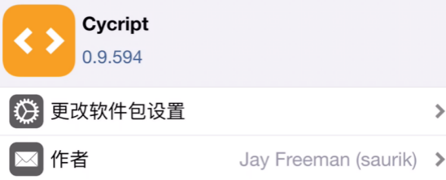
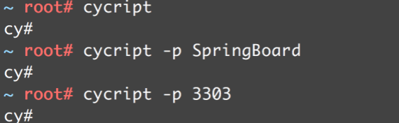
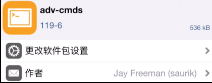
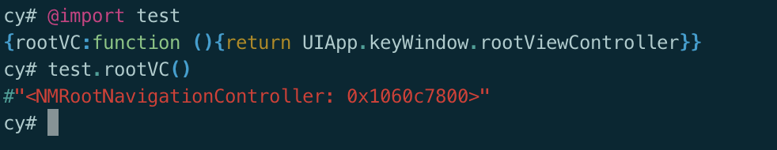

## Cycript

### Cycript概述

+ Cycript是Objective-C++、ES6（JavaScript）、Java等语法的混合物

+ 可以用来探索、修改、调试正在运行的Mac\iOS APP

+ 官网： http://www.cycript.org/

+ 文档： http://www.cycript.org/manual/

+ 通过Cydia安装Cycript，即可在iPhone上调试运行中的APP

  

### Cycript的开启和关闭

+ 开启

  + cycript

  + cycript -p 进程名称

  + cycript -p 进程ID

    

+ 取消输入：Ctrl + C
+ 退出：Ctrl + D
+ 清屏：Command + R

### ps命令

+ 安装adv-cmds

  

+ ps命令是process status的缩写，使用ps命令可以列出系统当前的进程

  + 列出所有的进程

    ```shell
    $ ps –A
    $ ps aux
    ```

  + 搜索关键词

    ```shell
    $ ps –A | grep 关键词
    ```

### 常用语法

+ UIApp
  + [UIApplication sharedApplication]

+ 定义变量
  + var 变量名 = 变量值
+ 用内存地址获取对象
  + `#内存地址`
+ ObjectiveC.classes
  + 已加载的所有OC类
+ 递归打印view的所有子控件（跟LLDB一样的函数）
  + view.recursiveDescription().toString()
+ 筛选出某种类型的对象
  + choose(UIViewController)
  + choose(UITableViewCell)

### 封装Cycript文件

+ 我们可以将常用的Cycript代码封装在一个.cy文件中

+ exports参数名固定，用于向外提供接口

  ```js
  (function(exports){
  	exports.rootVC = function() {
  		return UIApp.keyWindow.rootViewController;
  	};
  
  	keyWindow = function() {
  		return UIApp.keyWindow
  	};
  })(exports);
  ```

### Cycript文件存放和使用

+ 将.cy文件存放到手机的/usr/lib/cycript0.9目录下

+ 在Cycript中引用.cy文件，并使用它提供的接口

  

### Cycript库

+ https://github.com/CoderMJLee/mjcript
+ 将mjcript.cy放到/usr/lib/cycript0.9目录下
+ 使用时，@import mjcript
+ 用法参考mjcript.cy文件

