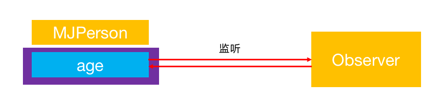
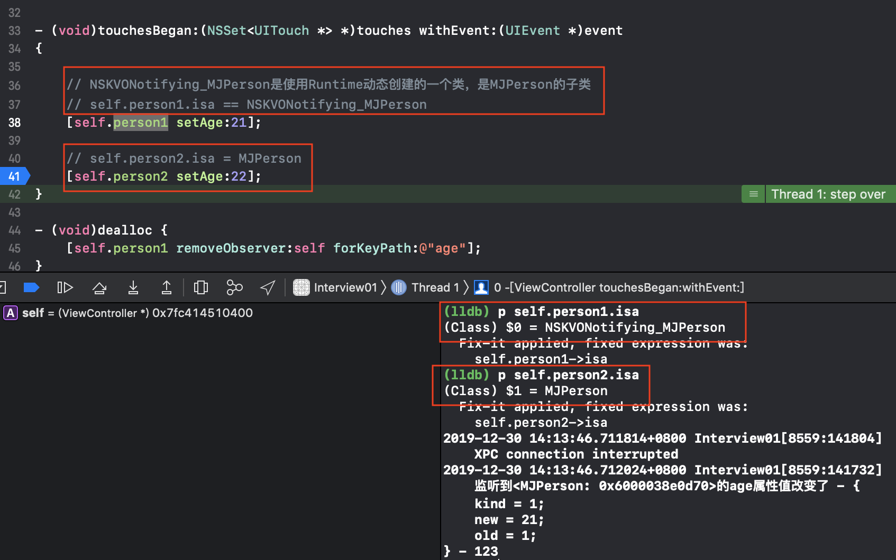
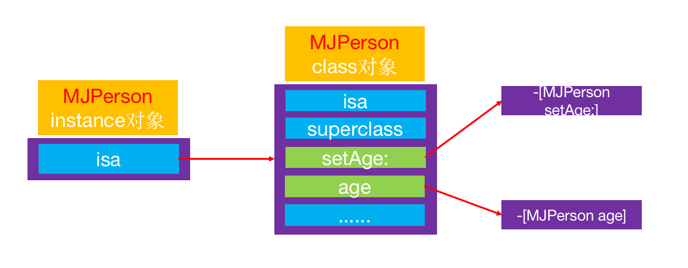
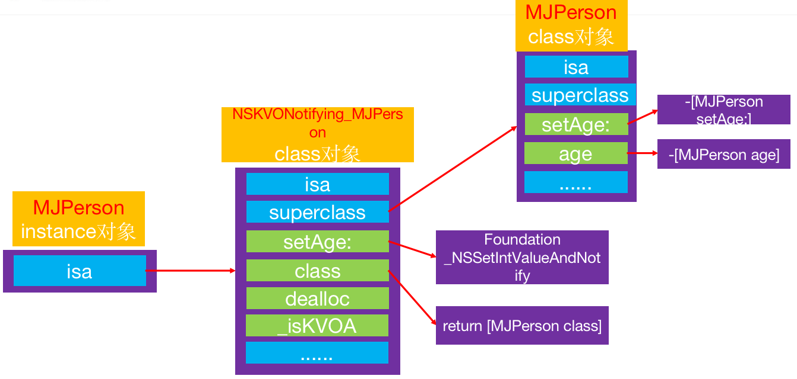
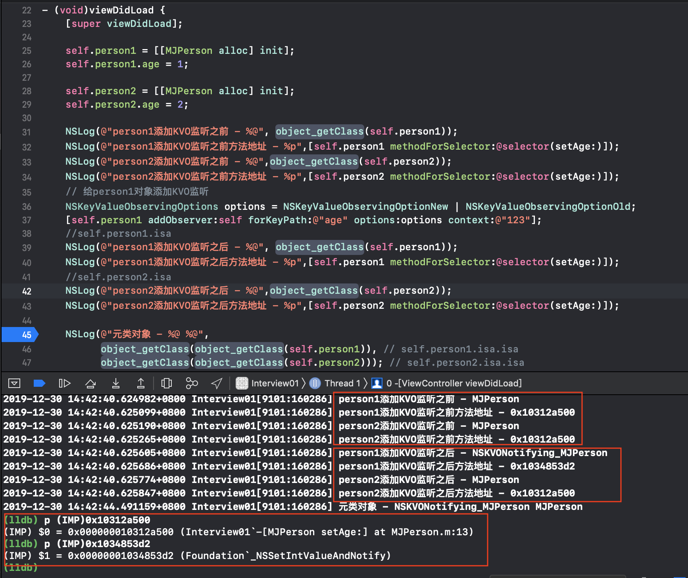
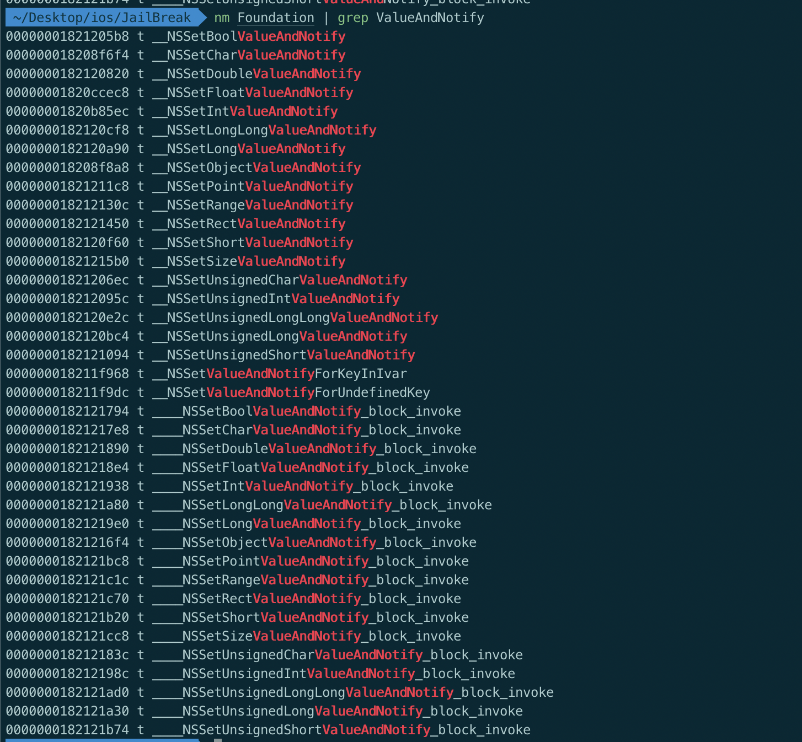
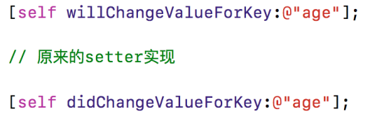
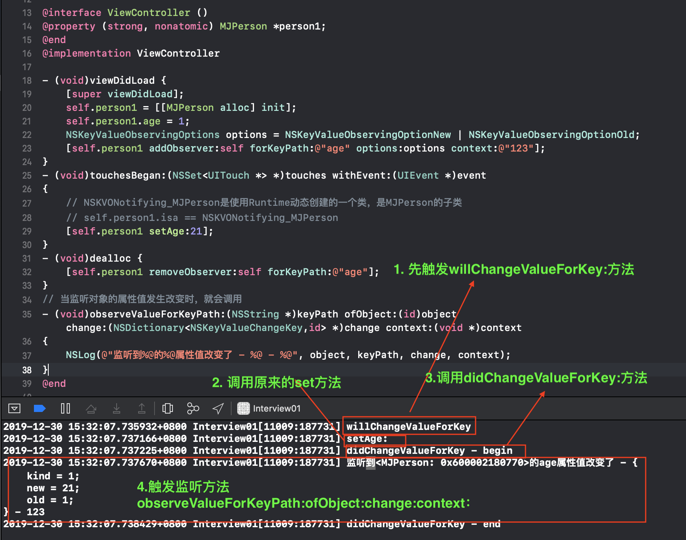

##KVO

### 基本使用

+ KVO的全称是Key-Value Observing，俗称“键值监听”，可以用于监听某个对象属性值的改变

  

+ 测试代码

  ```objective-c
  #import "ViewController.h"
  #import "MJPerson.h"
  
  @interface ViewController ()
  @property (strong, nonatomic) MJPerson *person1;
  @property (strong, nonatomic) MJPerson *person2;
  @end
  
  @implementation ViewController
  
  - (void)viewDidLoad {
      [super viewDidLoad];
      
      self.person1 = [[MJPerson alloc] init];
      self.person1.age = 1;
      
      self.person2 = [[MJPerson alloc] init];
      self.person2.age = 2;
      
      // 给person1对象添加KVO监听
      NSKeyValueObservingOptions options = NSKeyValueObservingOptionNew | NSKeyValueObservingOptionOld;
      [self.person1 addObserver:self forKeyPath:@"age" options:options context:@"123"];
  }
  
  - (void)touchesBegan:(NSSet<UITouch *> *)touches withEvent:(UIEvent *)event
  {
   
      self.person1.age = 21
      self.person2.age = 22
  
      //[self.person1 setAge:21];
      //[self.person2 setAge:22];
  }
  
  - (void)dealloc {
      [self.person1 removeObserver:self forKeyPath:@"age"];
  }
  
  // 当监听对象的属性值发生改变时，就会调用
  - (void)observeValueForKeyPath:(NSString *)keyPath ofObject:(id)object change:(NSDictionary<NSKeyValueChangeKey,id> *)change context:(void *)context
  {
      NSLog(@"监听到%@的%@属性值改变了 - %@ - %@", object, keyPath, change, context);
  }
  
  @end
  
  
  
  //结果如下
   监听到<MJPerson: 0x600001b9c260>的age属性值改变了 - {
      kind = 1;
      new = 21;
      old = 1;
  } - 123
   123
  ```

  - 只有person1的age的改变被监听到
  - 只有被添加监听的属性值，通过set方法改变时被触发KVO方法


### 存在的疑问

+ 为什么都是调用set方法，添加监听和未添加监听行为不同?

  

  - 从上图可知，添加了KVO的对象，其isa指针指向的类是runtime动态创建出的类NSKVONotifying_XXX
  - 因此虽然表面上看它调用原来的setAge方法，实际上它调用的是自己的setAge方法，并最终调用person类中的setAge方法

### 本质分析

+ 未使用KVO监听的对象

  

+ 使用了KVO监听的对象

  

  

  - 添加了KVO之后，实例对象的isa指针指向NSKVONotifying_XXX
  - 其set方法真正的实现为Fundation框架的` _NSSetxxValueAndNotify()`方法

  

+ 查看Foundation中_NSSet*AndNotify

  

### _NSSet*AndNotify内部实现



+ 调用willChangeValueForKey:
+ 调用原来的setter实现
+ 调用didChangeValueForKey:
  - didChangeValueForKey:内部会调用observer的observeValueForKeyPath:ofObject:change:context:方法


### NSKVONotifying_XXX实现

+ 查看其内部方法

  ```objective-c
  @implementation ViewController
  - (void)printMethodNamesOfClass:(Class)cls
  {
      unsigned int count;
      // 获得方法数组
      Method *methodList = class_copyMethodList(cls, &count);
      // 存储方法名
      NSMutableString *methodNames = [NSMutableString string];
      // 遍历所有的方法
      for (int i = 0; i < count; i++) {
          // 获得方法
          Method method = methodList[i];
          // 获得方法名
          NSString *methodName = NSStringFromSelector(method_getName(method));
          // 拼接方法名
          [methodNames appendString:methodName];
          [methodNames appendString:@", "];
      }
      // 释放
      free(methodList);
      // 打印方法名
      NSLog(@"%@方法\n %@", cls, methodNames);
  }
  
  - (void)viewDidLoad {
      [super viewDidLoad];
      
      self.person1 = [[MJPerson alloc] init];
      self.person1.age = 1;
      
      self.person2 = [[MJPerson alloc] init];
      self.person2.age = 2;
      // 给person1对象添加KVO监听
      NSKeyValueObservingOptions options = NSKeyValueObservingOptionNew | NSKeyValueObservingOptionOld;
      [self.person1 addObserver:self forKeyPath:@"age" options:options context:@"123"];
      
      [self printMethodNamesOfClass:object_getClass(self.person1)];
      [self printMethodNamesOfClass:object_getClass(self.person2)];
  }
  
  //结果
  NSKVONotifying_MJPerson方法 
     setAge:, class, dealloc, _isKVOA,
  MJPerson方法
    setAge:, age,
  ```

+ 伪代码

  ```objective-c
  @implementation NSKVONotifying_MJPerson
  
  - (void)setAge:(int)age
  {
      _NSSetIntValueAndNotify();
  }
  // 伪代码
  void _NSSetIntValueAndNotify()
  {
      [self willChangeValueForKey:@"age"];
      [super setAge:age];
      [self didChangeValueForKey:@"age"];
  }
  
  - (void)didChangeValueForKey:(NSString *)key
  {
      // 通知监听器，某某属性值发生了改变
      [oberser observeValueForKeyPath:key ofObject:self change:nil context:nil];
  }
  
  // 屏蔽内部实现，隐藏了NSKVONotifying_MJPerson类的存在
  - (Class)class
  {
      return [MJPerson class];
  }
  
  - (void)dealloc
  {
      // 收尾工作
  }
  
  - (BOOL)_isKVOA
  {
      return YES;
  }
  @end
  
  ```

  

### 被监听的类内部方法调用顺序

1. 测试代码如下

   ```objective-c
   @implementation MJPerson
   
   - (void)setAge:(int)age
   {
       _age = age;
       
       NSLog(@"setAge:");
   }
   
   - (void)willChangeValueForKey:(NSString *)key
   {
       [super willChangeValueForKey:key];
       
       NSLog(@"willChangeValueForKey");
   }
   
   - (void)didChangeValueForKey:(NSString *)key
   {
       NSLog(@"didChangeValueForKey - begin");
       
       [super didChangeValueForKey:key];
       
       NSLog(@"didChangeValueForKey - end");
   }
   
   @end
   ```

2. 内部调用顺序

   

   

### 面试题

+ iOS用什么方式实现对一个对象的KVO？(KVO的本质是什么？)
  - 利用RuntimeAPI动态生成一个子类，并且让instance对象的isa指向这个全新的子类
  - 当修改instance对象的属性时，会调用Foundation的_NSSetXXXValueAndNotify函数
    - willChangeValueForKey:
    - 父类原来的setter
    - didChangeValueForKey:
      - 内部会触发监听器（Oberser）的监听方法( observeValueForKeyPath:ofObject:change:context:）
+ 如何手动触发KVO？
  - 手动调用willChangeValueForKey:和didChangeValueForKey:
+ 直接修改成员变量会触发KVO么？
  - 不会触发KVO