## LLDB

### 指令格式

```
<command> [<subcommand> [<subcommand> ...]] <action> [-options [option-value]] [argument [argument ...]]
```

- `<command>`:命令
- `<subcommand> `:子命令
- `<action>`: 命令操作
- `<options>`: 命令选项
- `<argument>`:命令参数 
- 例如 `breakpoint set -n test `
  - `beakpoint`是<command>
  - `set`是<action>
  - `-n`是<options>
  - `test`是<argument>

+ 一般而言`[]`里面的都是可省略的，命令格式可简化为`<command>  <action>  `

### 查看指令用法

```
(lldb) help 要查看的指令
```

- 查看`breakpoint`用法

  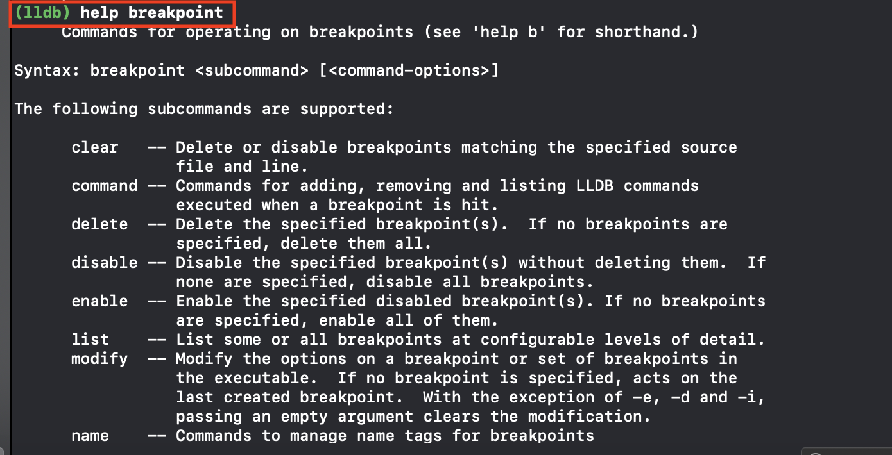

+ 查看`breakpoint set`用法

  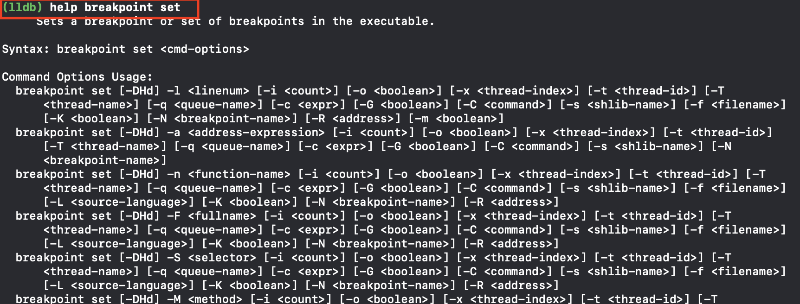


### expression

+ 命令格式`expression <cmd-options> -- <expr>`

+ 执行一个表达式

  - `<cmd-options>`:命令选项

  - `--`:命令选项结束符,表示所有的命令选项已经设置完毕。(如果`<cmd-options>`，`--`可省略)

  - `<expr>`:需要执行的表达式

  - 可以不需编译，就执行一个表达式，测试某些效果

    ```
    expression self.view.backgroundColor = [UIColor redColor]
    ```

+ `expression`, `expression -- `和指令`print` , `p`, `call`的效果是一样的

+ `expression -O --`指令和`po`的效果是一样的

  

+ 所以以后执行表达式可以直接用`p <expr>`,打印变量可以直接用 `po 变量名`

### thread

+ thread backtrace

  - 打印线程的堆栈信息

  - 和指令bt的效果是一样的

    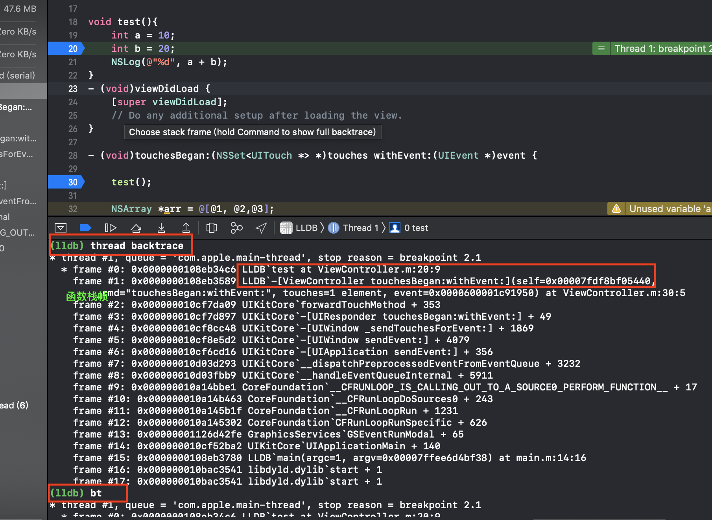

+ thread return [value]

  - 让函数直接返回某个值，不会执行后面的代码

    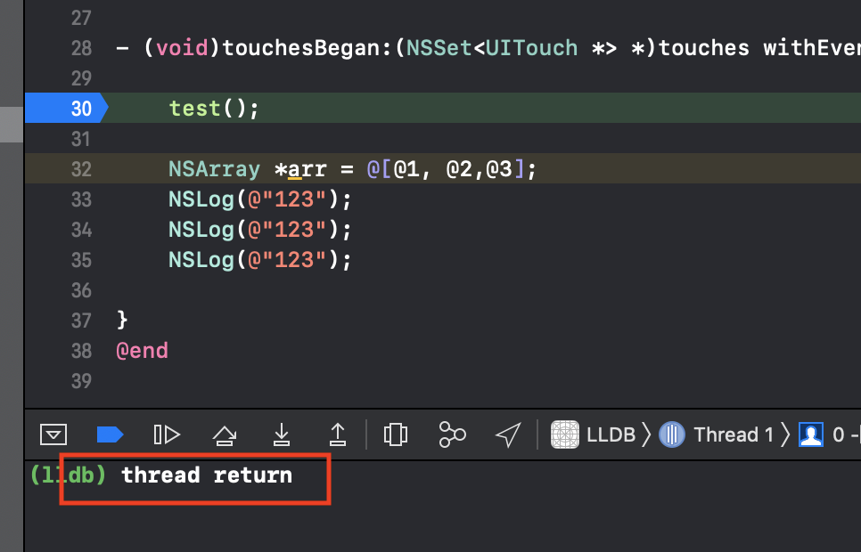

    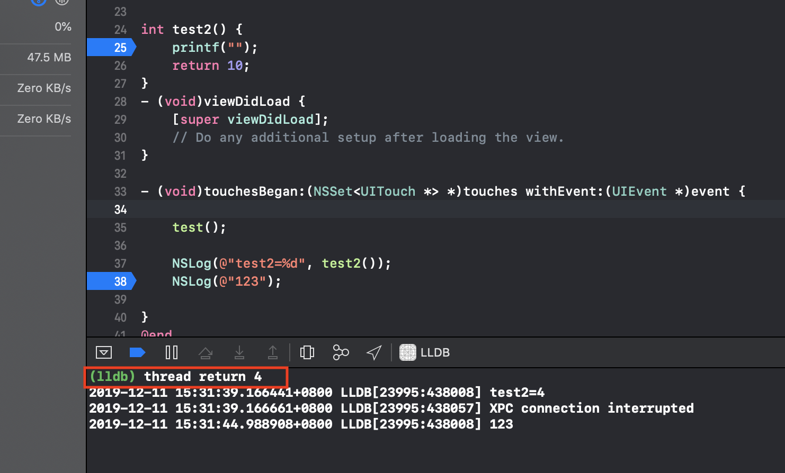

    - 函数直接返回，不会执行断点以及断点之后的代码

    

+ thread continue、continue、c: 程序继续运行
+ thread step-over、next、n : 单步运行,把子函数当做一个整体
+ thread step-in、step、s:单步运行,遇到子函数会进入子函数
+ thread step-out、finish: 直接执行完当前函数的所有代码,返回上一个函数
+ thread step-inst-over、nexti, ni:指令级别的单步执行, 把子函数当做一个整体
+ thread step-inst、stepi, si:指令级别的单步执行, 遇到子函数会进入子函数
+ si,ni和s,n的区别
  - s,n是源码级别
  - si,ni是汇编指令级别

### frame

- frame variable [] 打印当前栈帧的变量

  

### breakpoint

1. 设置断点

   - breakpoint set -a 函数地址

     ```
     这个常应用于调试别人的app, 关键在于找到函数正确的地址。
     ```

   - breakpoint set -n 函数名

     - 给某个c函数设置断点

       ```
       breakpoint set -n test
       ```

       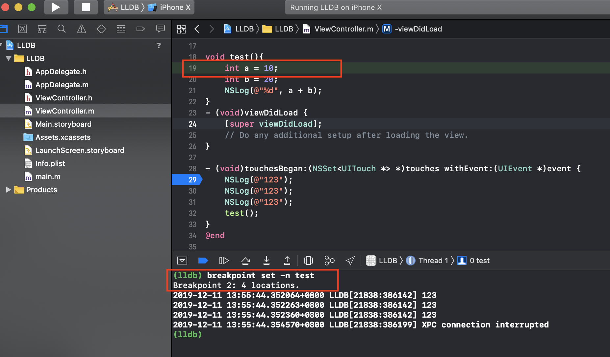

     - 给系统中某个名字的所有函数设置断点

       ```
       breakpoint  set -n touchesBegan:withEvent  
       ```

     - 给某个对象的函数设置上断点

       ```
       break set -n "-[ViewController touchesBegan:withEvent:]"
       ```

       

   - breakpoint set -r 正则表达式

     

     - 有59435个位置被打断点

   - breakpoint set -s 动态库 -n 函数名

2. 列出所有的断点

   ```
   ## 每个断点都有自己的编号
   breakpoint list 
   ```

   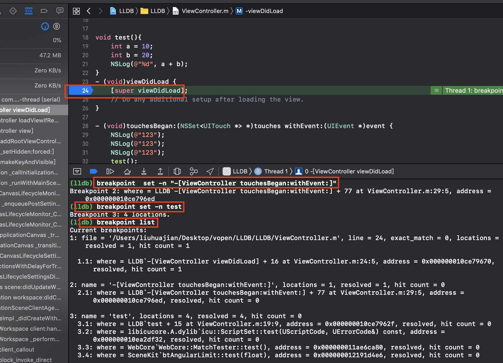

​        

3. 禁用/启用/删除断点
   - `breakpoint disable 断点编号`: 禁用断点
   - `breakpoint enable 断点编号`: 启用断点
   - `breakpoint delete 断点编号`: 删除断点

4. 断点命令

   - 给断点预先设置需要执行的命令,到触发断点时，就会按顺序执行

     ```
     breakpoint command add 断点编号
     ```

     

   - 查看某个断点设置的命令

     ```
     breakpoint command list 断点编号
     ```

     

   - 删除某个断点设置的命令

     ```
     breakpoint command delete 断点编号
     ```

### watchpoint

内存断点，在内存数据发生改变的时候触发

+ 观察某个变量: `watchpoint set variable 变量`

  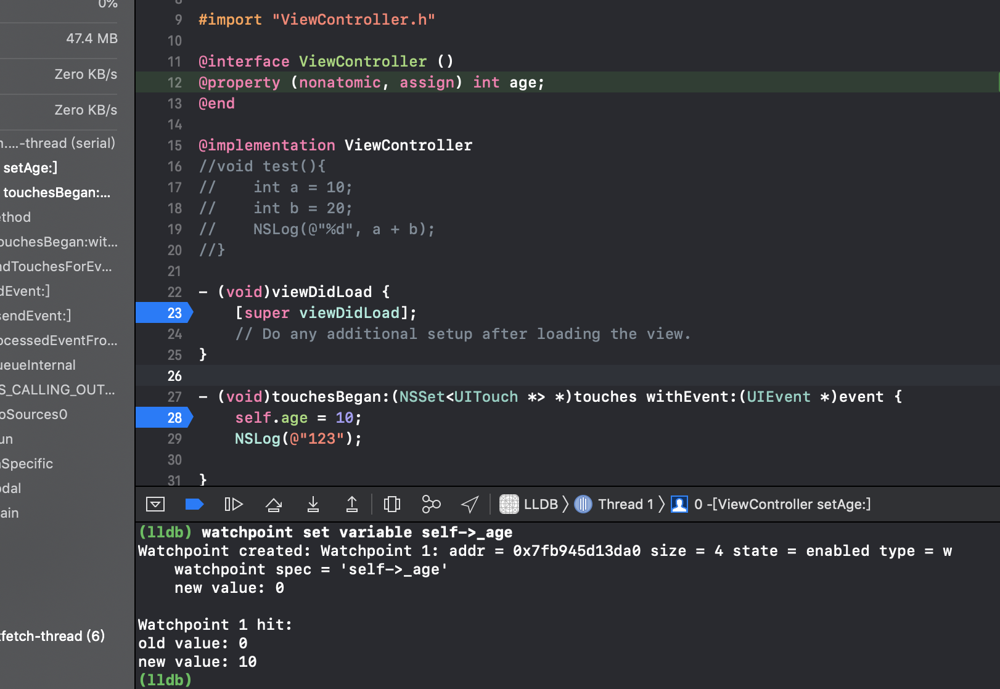

+ 观察某个内存地址: `watchpoint set expression 地址`

  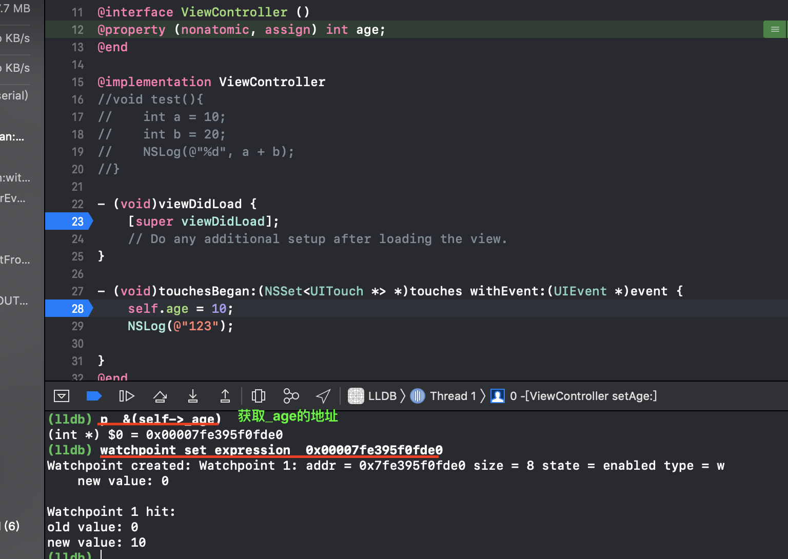

+ 查看内存断点的数量: `watchpoint list`
+ 禁用内存断点: `watchpoint disable 断点编号`
+ 启用内存断点: `watchpoint enable 断点编号`
+ 删除内存断点: `watchpoint delete 断点编号`
+ 给内存断点添加命令： `watchpoint command add 断点编号`
+ 查看给内存断点添加的命令： `watchpoint command list 断点编号`
+ 删除给内存断点添加的命令： `watchpoint command delete 断点编号`

### image

>  image在此处理解为模块，镜像

+ **image list**

  + 列出加载的模块信息
  + `image list -o -f` ： 还会打印出模块的偏移地址和全路径

  

  - 从上图可知，第一个加载的模块是`可执行文件`
  - 第二个被加载的模块是`dyld`(动态链接加载器)
  - 后面加载的是一系列的动态库

+ **image lookup**

  - `image lookup -t 类型`：查找某个类型信息

    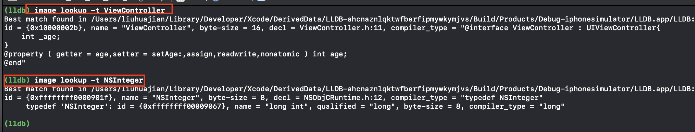

  - `image lookup -a 地址`: 根据内存地址查找在模块中的位置

    1. 在ViewController中，定义数组越界

       

    2. crash后界面跳转到main函数处，查看crash信息如下

       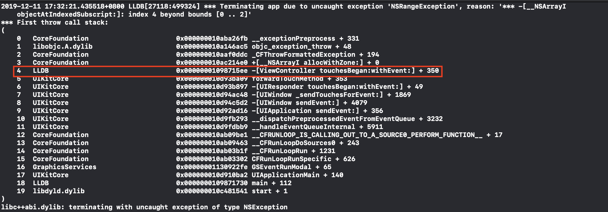

    3. 通过`image lookup -a 地址`定位具体的位置

       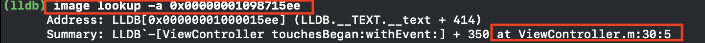

       - 定位到crash具体位置在ViewController.m的第30行第5列
       - 该地址为已经偏移过的的虚拟内存地址

  - `image loopup -n 符号或者函数名`: 查找某个符号或函数的位置

    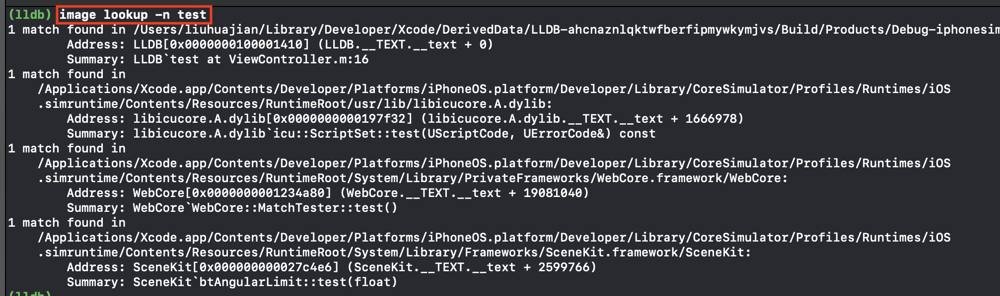


### 方法调用时，打印相关参数

+ 因为oc是通过objc_msgSend(self, cmd, argm1, argm2...)调用,x0~x7都可传递参数，更多的参数用内存栈来传递。

+ `po $x0`:打印方法调用者

  ```shell
  (lldb) po vc
  <ViewController: 0x101311ea0>
  
  (lldb) register write x1 0x101311ea0
  (lldb) po $x1
  <ViewController: 0x101311ea0>
  ```

+ `x/s $x1`:打印方法名
+ `po $x2`: 打印参数。（以此类推，x3，x4也是参数）
+ 如果是非arm64, 寄存器就是r0, r1, r2

### register

+ `register read`:读所有的寄存器
+ `register read 某个寄存器`:读某个寄存器的值
+ `register write 某个寄存器 值`:往某个寄存器的写值


### 操作内存

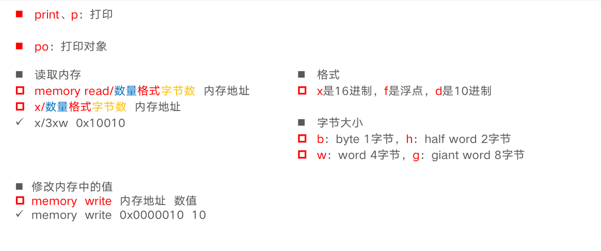

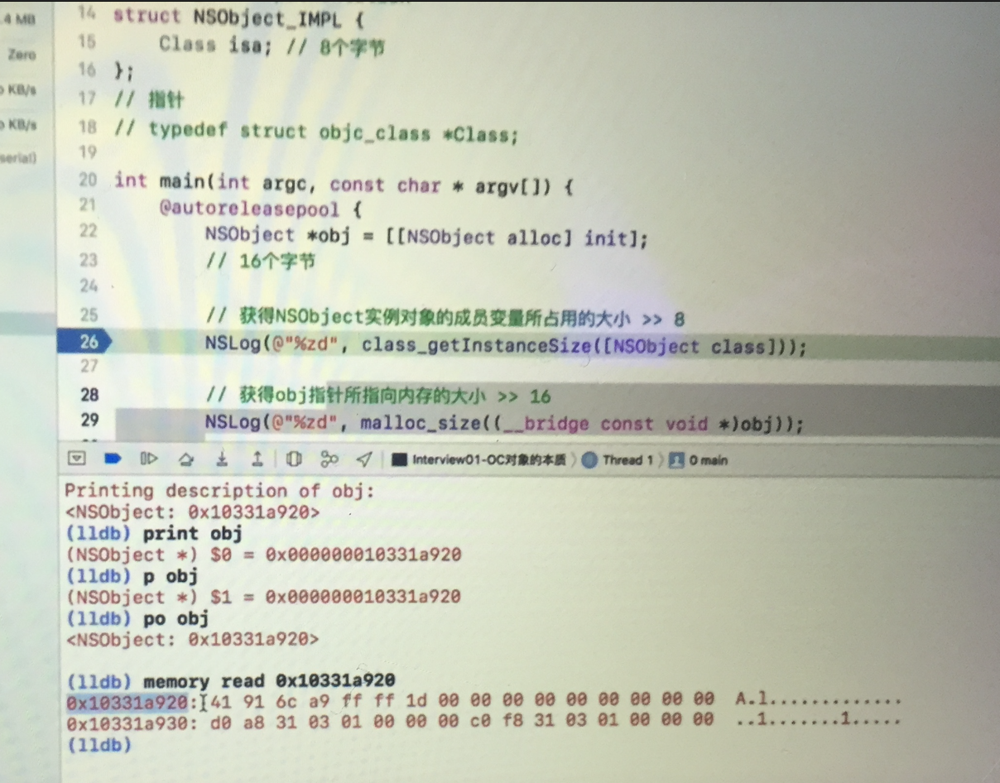

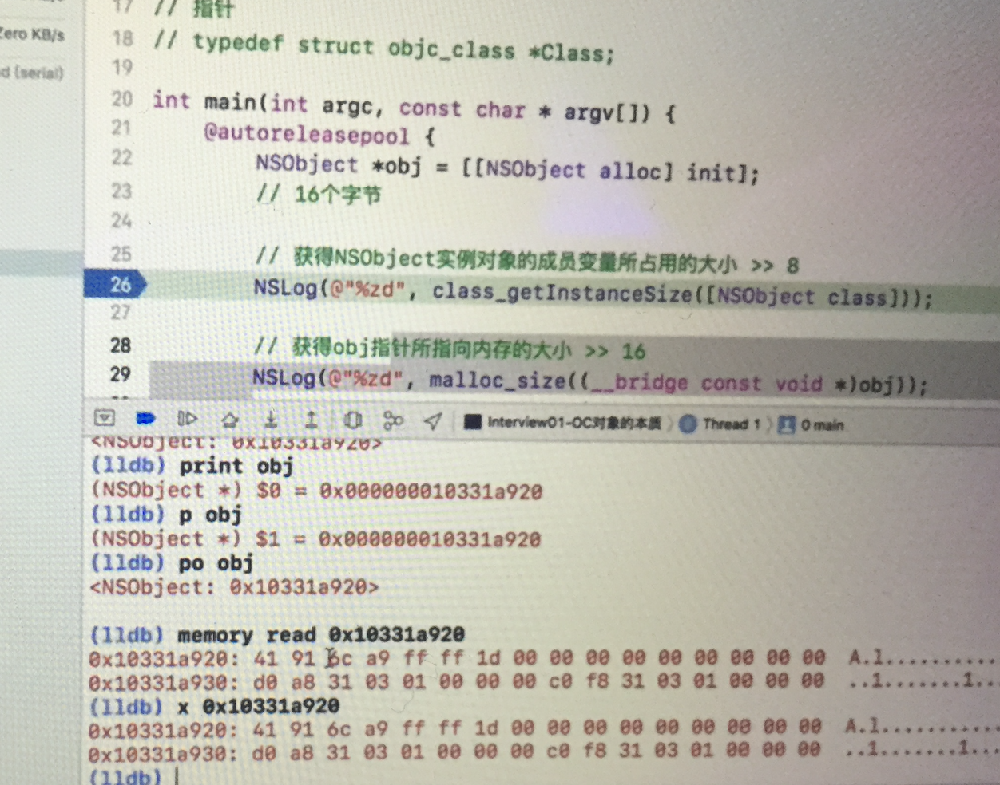

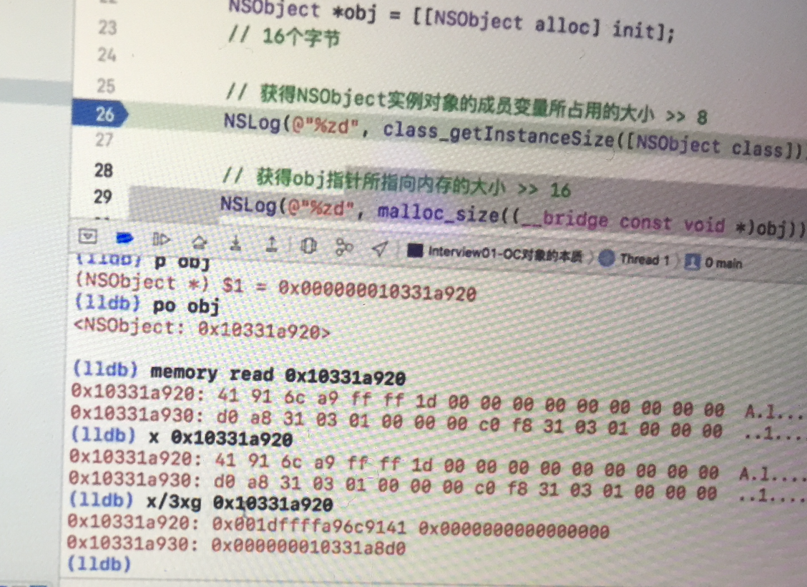

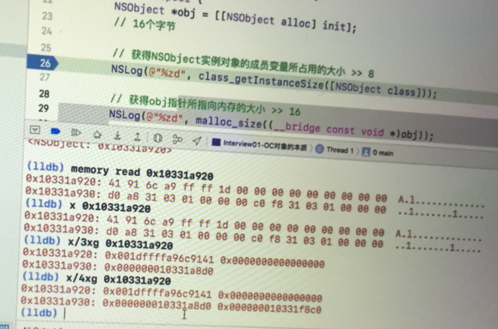


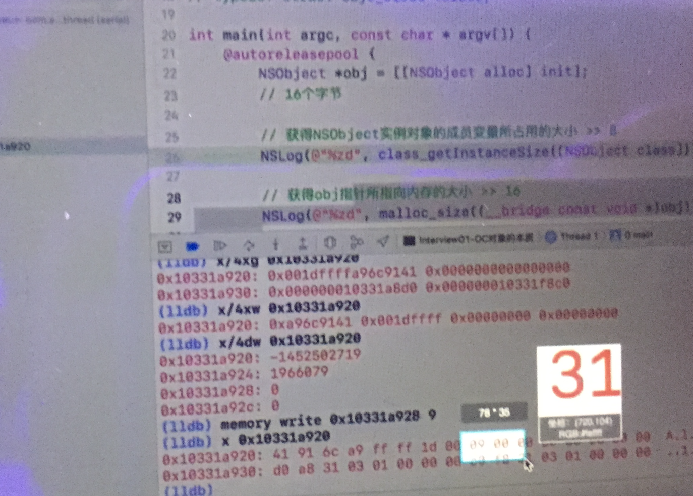


### 小技巧

+ 敲Enter, 会自动执行上次的命令
+ 绝大部分指令都可以使用缩写