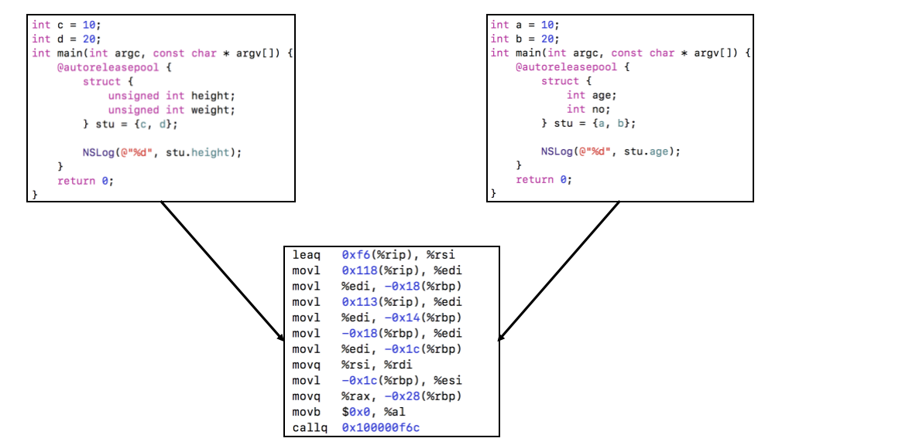
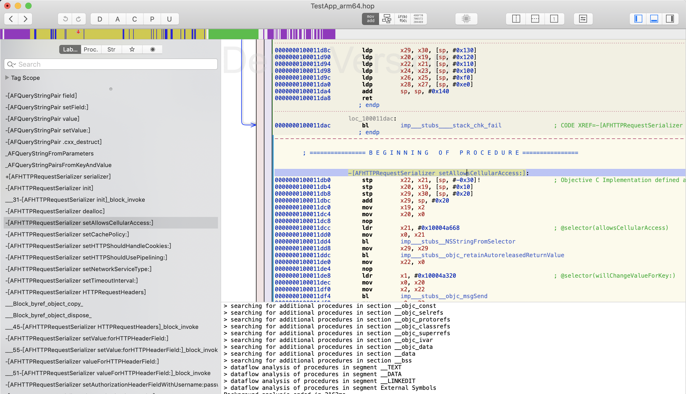
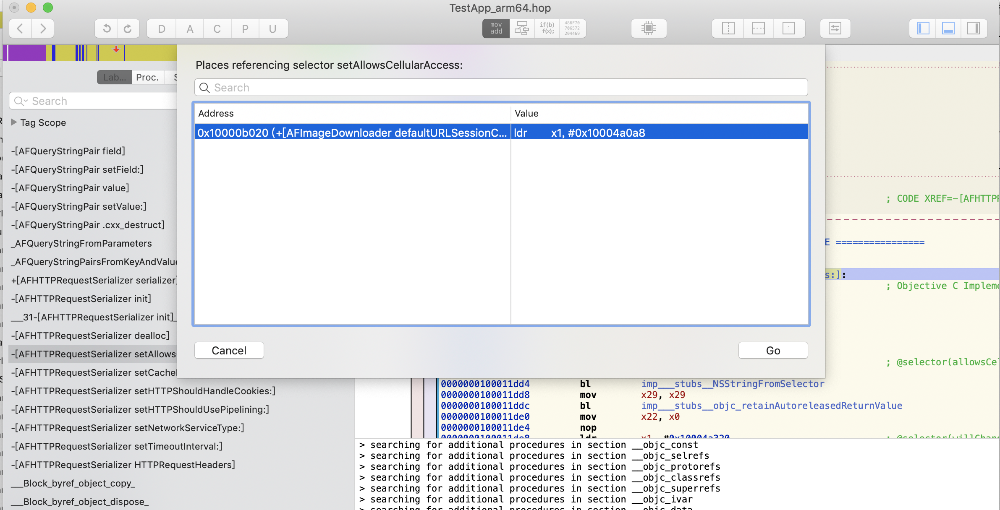
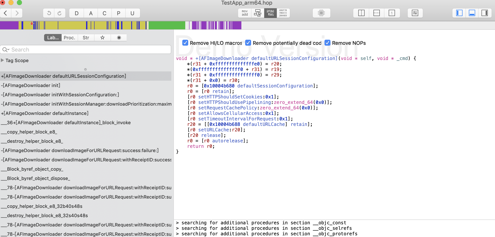

## Mach-O工具

### 逆向App的思路

+ 界面分析
  + Cycript、Reveal
+ 代码分析
  + 对Mach-O文件的静态分析
  + MachOView、class-dump、Hopper Disassembler、ida等
+ 动态调试
  + 对运行中的APP进行代码调试
  + debugserver、LLDB
+ 代码编写
  + 注入代码到APP中
  + 必要时还可能需要重新签名、打包ipa

### class-dump

+ 顾名思义，它的作用就是把Mach-O文件的class信息给dump出来（把类信息给导出来），生成对应的.h头文件
+ 官方地址：http://stevenygard.com/projects/class-dump/
+ 下载完工具包后将class-dump文件复制到Mac的/usr/local/bin目录，这样在终端就能识别class-dump命令了
+ 常用格式
  + class-dump  -H  Mach-O文件路径  -o  头文件存放目录
  + -H表示要生成头文件
  + -o用于制定头文件的存放目录
+ 原理：class-dump通过对Mach-O文件的解析，将类信息，变量和方法等提取出来，组成头文件。

### 代码编译简单过程

+ 代码从源语言，经过编译转换成汇编语言，汇编语言再转为为机器语言

+ 汇编语言和机器语言是可逆的，因为几乎每一条汇编语言都对应着一条机器指令

+ 但汇编语言不能转换为源语言，因为多种形式的源语言的汇编代码可能是一样的

  

### Hopper Disassmbler

+ Hopper Disassmbler能够将Mach-O文件的机器语言代码反编译成汇编代码、OC伪代码或者Swift伪代码

+ 常用快捷键

  + Shift + Option + X ， 找出哪里引用了这个方法

    

    

+ 查看伪代码

  
  
  
