## Mach-O文件

### 逆向App的思路

+ 界面分析
  + Cycript、Reveal
+ 代码分析
  + 对Mach-O文件的静态分析
  + MachOView、class-dump、Hopper Disassembler、ida等
+ 动态调试
  + 对运行中的APP进行代码调试
  + debugserver、LLDB
+ 代码编写
  + 注入代码到APP中
  + 必要时还可能需要重新签名、打包ipa

### class-dump

+ 顾名思义，它的作用就是把Mach-O文件的class信息给dump出来（把类信息给导出来），生成对应的.h头文件
+ 官方地址：http://stevenygard.com/projects/class-dump/
+ 下载完工具包后将class-dump文件复制到Mac的/usr/local/bin目录，这样在终端就能识别class-dump命令了
+ 常用格式
  + class-dump  -H  Mach-O文件路径  -o  头文件存放目录
  + -H表示要生成头文件
  + -o用于制定头文件的存放目录
+ 原理：class-dump通过对Mach-O文件的解析，将类信息，变量和方法等提取出来，组成头文件。

### 代码编译简单过程

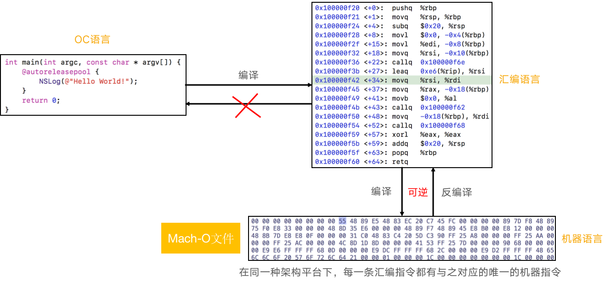

+ 代码从源语言，经过编译转换成汇编语言，汇编语言再转为为机器语言

+ 汇编语言和机器语言是可逆的，因为几乎每一条汇编语言都对应着一条机器指令

+ 但汇编语言不能转换为源语言，因为多种形式的源语言的汇编代码可能是一样的

  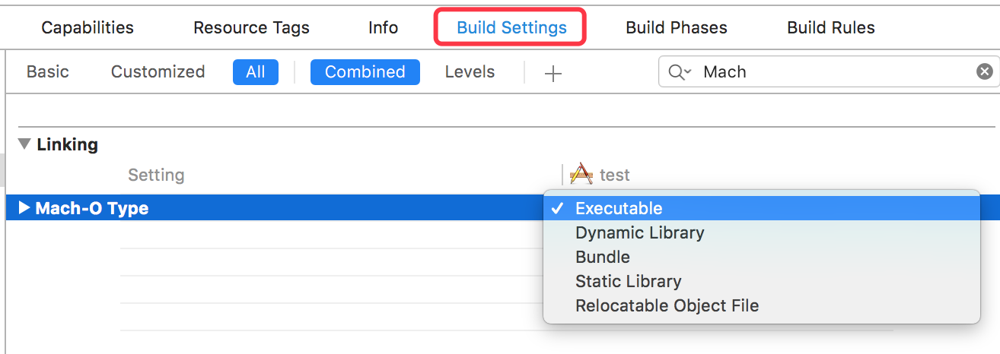


### Hopper Disassmbler

+ Hopper Disassmbler能够将Mach-O文件的机器语言代码反编译成汇编代码、OC伪代码或者Swift伪代码

+ 常用快捷键

  + Shift + Option + X ， 找出哪里引用了这个方法

    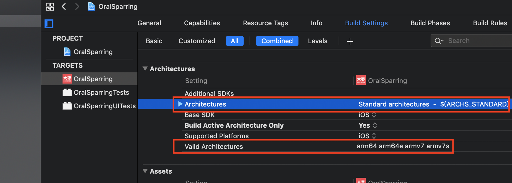

    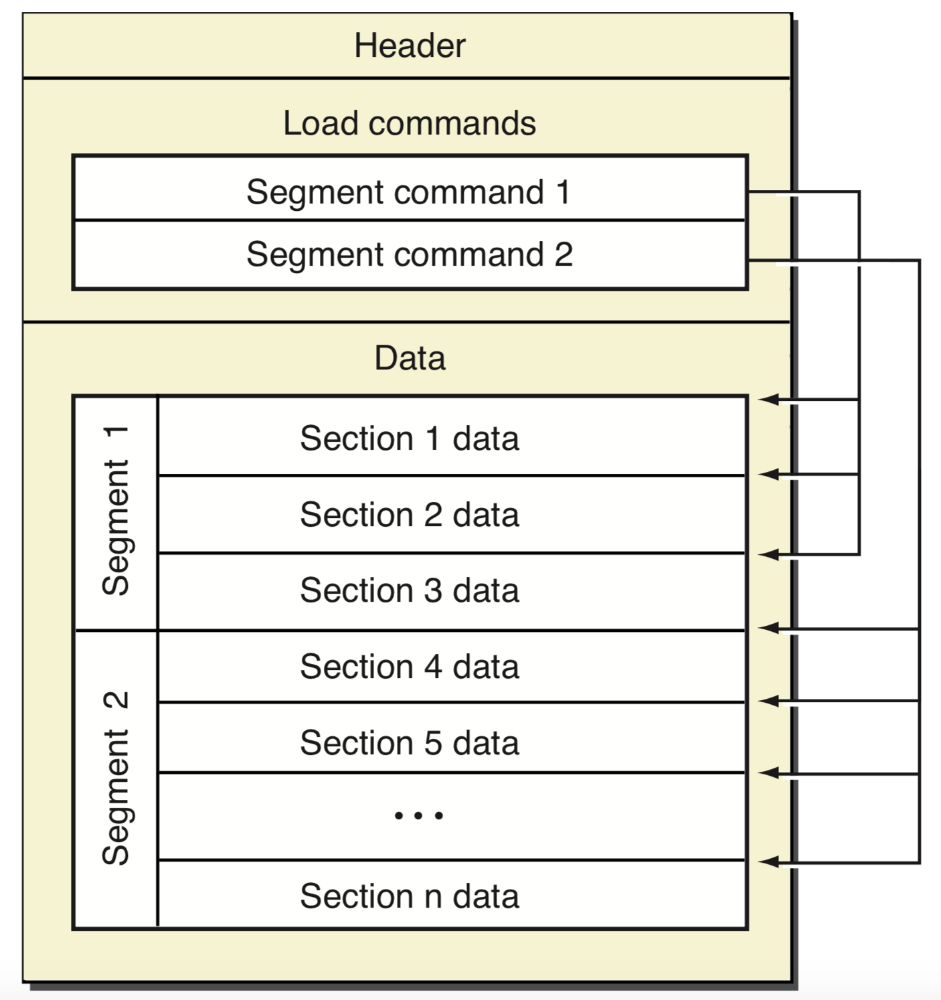

+ 查看伪代码

  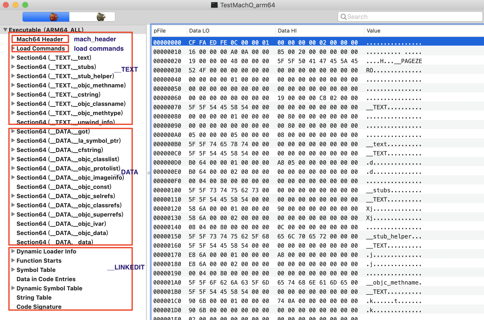


### 查找系统动态库的位置

1. 在xcode中查找 `/Applications/Xcode.app/Contents/Developer/Platforms/iPhoneOS.platform/Developer/SDKs/iPhoneOS.sdk/System/Library/Frameworks/UIKit.framework/UIKit.tbd`

   ```
   其内容如下：
   
   archs:           [ armv7, armv7s, arm64, arm64e ]
   uuids:           [ 'armv7: BEBC4565-E9B4-393F-9F26-8F54D55F29D1', 'armv7s: D3F9ABEB-27BE-3945-8B7F-EF960AC09684', 
                      'arm64: F923805F-AFAF-38D2-9E3F-6E22D60F99E3', 'arm64e: 9C375613-BAAB-35BD-B6FD-56B823CB0895' ]
   platform:        ios
   install-name:    /System/Library/Frameworks/UIKit.framework/UIKit
   current-version: 61000
   objc-constraint: none
   exports:         
     - archs:           [ armv7, armv7s ]
       re-exports:      [ /System/Library/PrivateFrameworks/UIFoundation.framework/UIFoundation ]
       symbols:         [ _CGAffineTransformFromString, _CGPointFromString, _CGRectFromString, 
                          _CGSizeFromString, _CGVectorFromString, _NSLayoutConstraintFailedToFindDefaultResolvedValueForSymbolicConstant, 
                          _NSStringFromCGAffineTransform, _NSStringFromCGPoint, _NSStringFromCGRect
   ....
   ....
   ```

   + 在xcode中的所谓的动态库仅仅只是对手机中真正的动态库的的描述
   + 从`install-name`我们可知, 其描述了真正的动态库的位置

2. 在手机中`/System/Library/Frameworks/UIKit.framework/UIKit`去查找`UIKit`,发现也只是一堆资源文件，并没有`UIKit`

   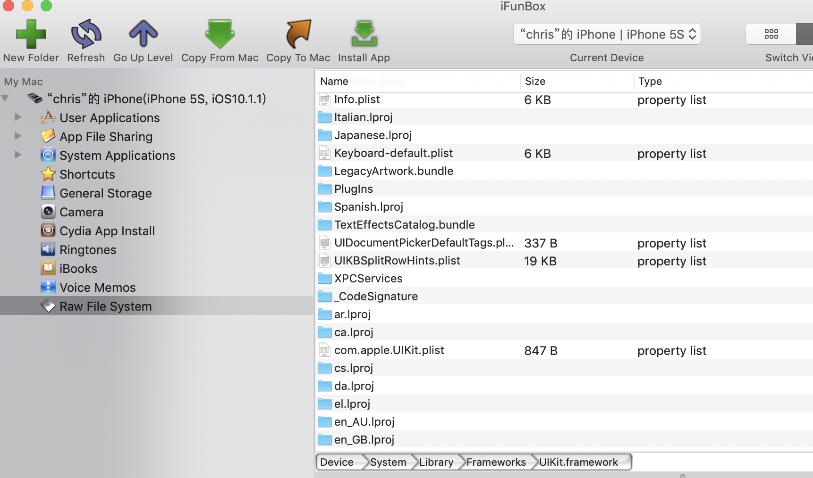

3. 其实iOS将系统的动态库整体打包压缩成一个文件，从而减少其在系统中的体积。其压缩文件的位置在`/System/Library/Caches/com.apple.dyld/`

   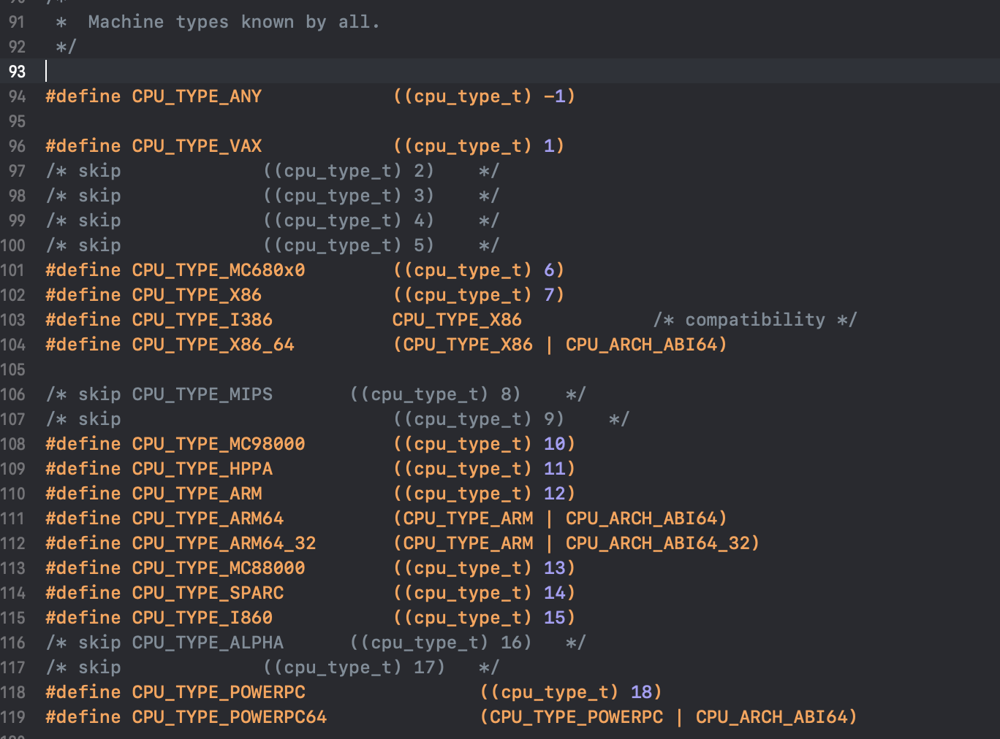

   

### 动态库共享缓存（dyld shared cache）

+ 从iOS3.1开始，为了提高性能，绝大部分的系统动态库文件都打包存放到了一个缓存文件中（dyld shared cache）

  + 缓存文件路径：/System/Library/Caches/com.apple.dyld/dyld_shared_cache_armX

+ dyld_shared_cache_armX的X代表ARM处理器指令集架构

  ```
  v6
  iPhone、iPhone3G
  iPod Touch、iPod Touch2
  
  v7
  iPhone3GS、iPhone4、iPhone4S
  iPad、iPad2、iPad3(The New iPad)
  iPad mini
  iPod Touch3G、iPod Touch4、iPod Touch5
  
  v7s
  iPhone5、iPhone5C
  iPad4
  
  arm64
  iPhone5S、iPhone6、iPhone6 Plus、iPhone6S、iPhone6S Plus
  iPhoneSE、iPhone7、iPhone7 Plus、iPhone8、iPhone8 Plus、iPhoneX
  iPad5、iPad Air、iPad Air2、iPad Pro、iPad Pro2
  iPad mini with Retina display、iPad mini3、iPad mini4
  iPod Touch6
  ```

+ 所有指令集原则上都是向下兼容的

+ 动态库共享缓存一个非常明显的好处是节省内存

  + 通常来讲，系统通过多个app共用同一个动态库，动态库按需加载等等来实现节省内存

  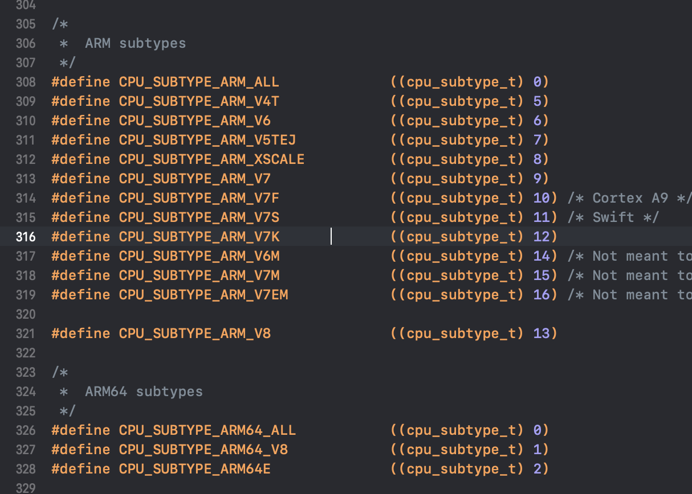

  + iOS系统将所有的动态库压缩到一个动态库共享文件中，这样减少了动态库之间相同的一些内容，更加节省了内存

    

+ 现在的ida、Hopper反编译工具都可以识别动态库共享缓存

  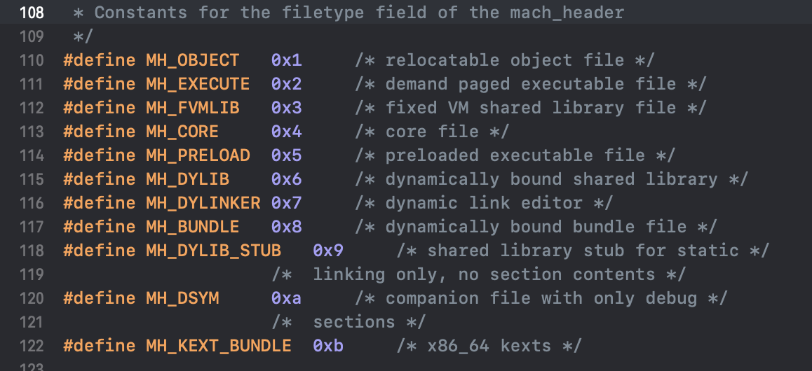

  

### 动态库的加载

+ 在Mac\iOS中，是使用了/usr/lib/dyld程序来加载动态库

+ dyld源码:  https://opensource.apple.com/tarballs/dyld/

  + dynamic link editor，动态链接编辑器
  + dynamic loader，动态加载器

+ 查看源码

  + 在dyld.cpp中,  load-> loadPhase0-> loadPhase1-> loadPhase2 -> loadPhase4

  + loadPhase4中有一段代码如下,表明其是从共享缓存中加载的动态库

    ```c++
    if ( image != NULL ) {
    			// if original path is in the dyld cache, then mark this one found as an override
    			dyld3::SharedCacheFindDylibResults shareCacheResults;
    			if ( dyld3::findInSharedCacheImage(sSharedCacheLoadInfo, path, &shareCacheResults) && (shareCacheResults.image != nullptr) )
    				image->setOverridesCachedDylib(shareCacheResults.image->imageNum());
    		}
    ```

### 从动态库共享缓存抽取动态库

+ 可以使用dyld源码中的launch-cache/dsc_extractor.cpp

  + 将#if 0前面的代码删除（包括#if 0），把最后面的#endif也删掉

    ```c++
    dsc_extractor.cpp内容
      
    // test program
    #include <stdio.h>
    #include <stddef.h>
    #include <dlfcn.h>
    
    
    typedef int (*extractor_proc)(const char* shared_cache_file_path, const char* extraction_root_path,
                                  void (^progress)(unsigned current, unsigned total));
    
    int main(int argc, const char* argv[])
    {
        if ( argc != 3 ) {
            fprintf(stderr, "usage: dsc_extractor <path-to-cache-file> <path-to-device-dir>\n");
            return 1;
        }
    
        //void* handle = dlopen("/Volumes/my/src/dyld/build/Debug/dsc_extractor.bundle", RTLD_LAZY);
        void* handle = dlopen("/Applications/Xcode.app/Contents/Developer/Platforms/iPhoneOS.platform/usr/lib/dsc_extractor.bundle", RTLD_LAZY);
        if ( handle == NULL ) {
            fprintf(stderr, "dsc_extractor.bundle could not be loaded\n");
            return 1;
        }
    
        extractor_proc proc = (extractor_proc)dlsym(handle, "dyld_shared_cache_extract_dylibs_progress");
        if ( proc == NULL ) {
            fprintf(stderr, "dsc_extractor.bundle did not have dyld_shared_cache_extract_dylibs_progress symbol\n");
            return 1;
        }
    
        int result = (*proc)(argv[1], argv[2], ^(unsigned c, unsigned total) { printf("%d/%d\n", c, total); } );
        fprintf(stderr, "dyld_shared_cache_extract_dylibs_progress() => %d\n", result);
        return 0;
    }
    
    ```

  + 编译dsc_extractor.cpp

    ```shell
    $ clang++ -o dsc_extractor dsc_extractor.cpp
    ```

  + 使用dsc_extractor

    ```
    ./dsc_extractor  动态库共享缓存文件的路径   用于存放抽取结果的文件夹
    ```

    

### Mach-O

+ Mach-O是Mach object的缩写，是Mac\iOS上用于存储程序、库的标准格式

+ 属于Mach-O格式的文件类型有

  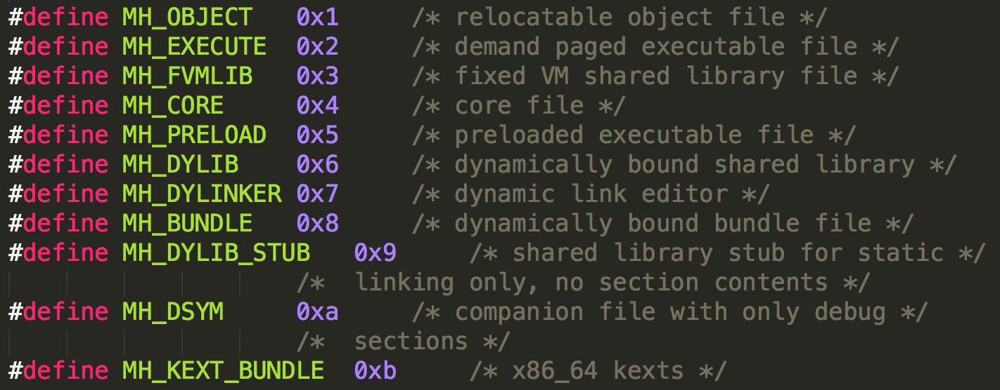

+ 可以在xnu源码中，查看到Mach-O格式的详细定义（https://opensource.apple.com/tarballs/xnu/）

  + EXTERNAL_HEADERS/mach-o/fat.h
  + EXTERNAL_HEADERS/mach-o/loader.h

### 常见的Mach-O文件类型

+ MH_OBJECT
  - 目标文件（.o）
  - 静态库文件(.a），静态库其实就是N个.o合并在一起
+ MH_EXECUTE：可执行文件
  - .app/xx
+ MH_DYLIB：动态库文件
  - .dylib
  - .framework/xx
+ MH_DYLINKER: 动态链接编辑器
  - /usr/lib/dyld
+ MH_DSYM：存储着二进制文件符号信息的文件
  - .dSYM/Contents/Resources/DWARF/xx（常用于分析APP的崩溃信息）  

### 在Xcode中查看target的Mach-O类型

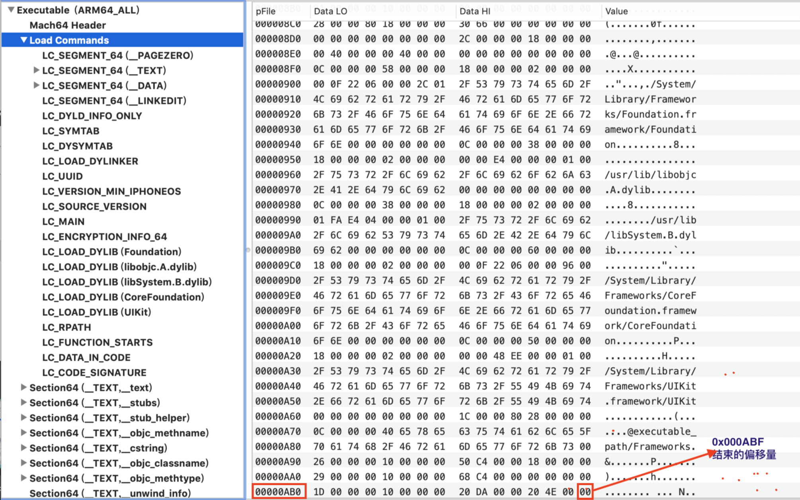


### Universal Binary（通用二进制文件）

+ 通用二进制文件
  - 同时适用于多种架构的二进制文件
  - 包含了多种不同架构的独立的二进制文件
+ 因为需要储存多种架构的代码，通用二进制文件通常比单一平台二进制的程序要大
+ 由于两种架构有共同的一些资源，所以并不会达到单一版本的两倍之多
+ 由于执行过程中，只调用一部分代码，运行起来也不需要额外的内存
+ 因为文件比原来的要大，也被称为“胖二进制文件”（Fat Binary）

### xcode支持多架构


+ 生成的文件的架构，即为Architechtures和Valid Architechtures的交集
+ `$(ARCHS_STANDARD)`即为默认支持的架构

### 窥探Mach-O的结构

+ 命令行工具

  + file：查看Mach-O的文件类型

    ```shell
    $ file  TestApp
    
    TestApp: Mach-O universal binary with 2 architectures: [arm_v7:Mach-O executable arm_v7] [arm64:Mach-O 64-bit executable arm64]
    TestApp (for architecture armv7):	Mach-O executable arm_v7
    TestApp (for architecture arm64):	Mach-O 64-bit executable arm64
    ```

  + otool：查看Mach-O特定部分和段的内容

    ```shell
      -f print the fat headers
    	-a print the archive header
    	-h print the mach header
    	-l print the load commands
    	-L print shared libraries used
    	-D print shared library id name
    	-t print the text section (disassemble with -v)
    	-p <routine name>  start dissassemble from routine name
    	-s <segname> <sectname> print contents of section
    	-d print the data section
    	-o print the Objective-C segment
    	-r print the relocation entries
    	-S print the table of contents of a library (obsolete)
    	-T print the table of contents of a dynamic shared library (obsolete)
    	-M print the module table of a dynamic shared library (obsolete)
    	-R print the reference table of a dynamic shared library (obsolete)
    	-I print the indirect symbol table
    	-H print the two-level hints table (obsolete)
    	-G print the data in code table
    	-v print verbosely (symbolically) when possible
    	-V print disassembled operands symbolically
    	-c print argument strings of a core file
    	-X print no leading addresses or headers
    	-m don't use archive(member) syntax
    	-B force Thumb disassembly (ARM objects only)
    	-q use llvm's disassembler (the default)
    	-Q use otool(1)'s disassembler
    	-mcpu=arg use `arg' as the cpu for disassembly
    	-j print opcode bytes
    	-P print the info plist section as strings
    	-C print linker optimization hints
    	--version print the version of /Applications/Xcode.app/Contents/Developer/Toolchains/XcodeDefault.xctoolchain/usr/bin/otool
    ```
1. 打印fat header : `$  otool -f 文件路径`
    
   ```shell
       $ otool -f TestApp
       
       Fat headers
       fat_magic 0xcafebabe
       nfat_arch 2
       architecture 0
           cputype 12
           cpusubtype 9
           capabilities 0x0
           offset 16384
           size 533456
           align 2^14 (16384)
       architecture 1
           cputype 16777228
           cpusubtype 0
           capabilities 0x0
           offset 557056
           size 623712
           align 2^14 (16384)
       ```
    
2. 打印mach header：` $ otool -h 文件路径`
    
   ```shell
       $   otool -h TestApp
       Mach header
             magic cputype cpusubtype  caps    filetype ncmds sizeofcmds      flags
        0xfeedface      12          9  0x00           2    26       3156 0x00200085
       Mach header
             magic cputype cpusubtype  caps    filetype ncmds sizeofcmds      flags
        0xfeedfacf 16777228          0  0x00           2    26       3736 0x00200085
       ```
    
3. 打印load commands: `$ otool -l 文件路径`
    
   ```shell
       $ otool -l TestApp
       
       TestApp (architecture armv7):
       Mach header
             magic cputype cpusubtype  caps    filetype ncmds sizeofcmds      flags
        0xfeedface      12          9  0x00           2    26       3156 0x00200085
       Load command 0
             cmd LC_SEGMENT
         cmdsize 56
         segname __PAGEZERO
          vmaddr 0x00000000
         ...
         ...
         Load command 24
             cmd LC_DATA_IN_CODE
         cmdsize 16
         dataoff 340376
        datasize 16
       Load command 25
             cmd LC_CODE_SIGNATURE
         cmdsize 16
         dataoff 596848
        datasize 26864
        
        $ otool -l TestApp | grep crypt
       
          cryptoff 16384
           cryptsize 196608
             cryptid 0
            cryptoff 16384
           cryptsize 229376
             cryptid 0
        ## 查看是否加密
       ```
    
4. 打印依赖的动态库: ` $ otool -L 文件路径`
    
   ```shell
       $ otool -L TestApp
       
       TestApp (architecture armv7):
       	/System/Library/Frameworks/CoreGraphics.framework/CoreGraphics (compatibility version 64.0.0, current version 1251.12.0)
       	....
       	/System/Library/Frameworks/CoreFoundation.framework/CoreFoundation (compatibility version 150.0.0, current version 1570.15.0)
       TestApp (architecture arm64):
       	/System/Library/Frameworks/CoreGraphics.framework/CoreGraphics (compatibility version 64.0.0, current version 1251.12.0)
       	.....
       	/System/Library/Frameworks/CoreFoundation.framework/CoreFoundation (compatibility version 150.0.0, current version 1570.15.0)
       ```
    
   
    
+ lipo：常用于多架构Mach-O文件的处理
  
  + 查看架构信息：lipo  -info  文件路径
  
    ```shell
      $ lipo -info  TestApp
      Architectures in the fat file: TestApp are: armv7 arm64
      ```
  
  + 导出某种特定架构：lipo  文件路径  -thin  架构类型  -output  输出文件路径
  
    ```shell
      $ lipo TestApp -thin armv7 -output TestApp_armv7
      $ lipo TestApp -thin arm64 -output TestApp_arm64
      ```
  
  + 合并多种架构：lipo  -create 文件路径1  文件路径2  -output  输出文件路径
  
    ```shell
      $ lipo -create TestApp_armv7 TestApp_arm64 -output TestApp_2
      ```
  
+ GUI工具
  
  - MachOView（https://github.com/gdbinit/MachOView）

### Mach-O的基本结构

+ 官方描述:  https://developer.apple.com/library/content/documentation/DeveloperTools/Conceptual/MachOTopics/0-Introduction/introduction.html

+ 一个Mach-O文件包含3个主要区域

  - Header: 文件类型、目标架构类型等

  - Load commands: 描述文件在虚拟内存中的逻辑结构、布局

  - Raw segment data: 在Load commands中定义的Segment的原始数据

    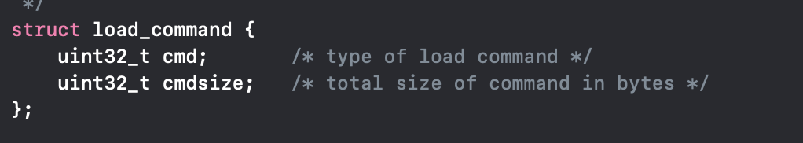


### dyld和Mach-O

+ dyld用于加载以下类型的Mach-O文件

  - MH_EXECUTE
  - MH_DYLIB
  - MH_BUNDLE

+ APP的可执行文件、动态库都是由dyld负责加载的

+ 在dyld的原码的dyld.cpp文件中

  ```c++
  loadPhase6方法中有下面这段代码
   // only MH_BUNDLE, MH_DYLIB, and some MH_EXECUTE can be dynamically loaded
  const mach_header* mh = (mach_header*)firstPages;
  		switch ( mh->filetype ) {
  			case MH_EXECUTE:
  			case MH_DYLIB:
  			case MH_BUNDLE:
  				break;
  			default:
  				throw "mach-o, but wrong filetype";
  }
  
  ```

+ dyld是`MH_DYLINKER`类型的Mach-O文件


 