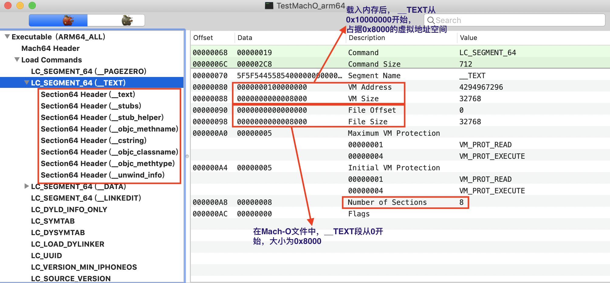
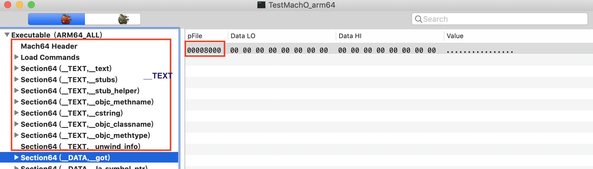
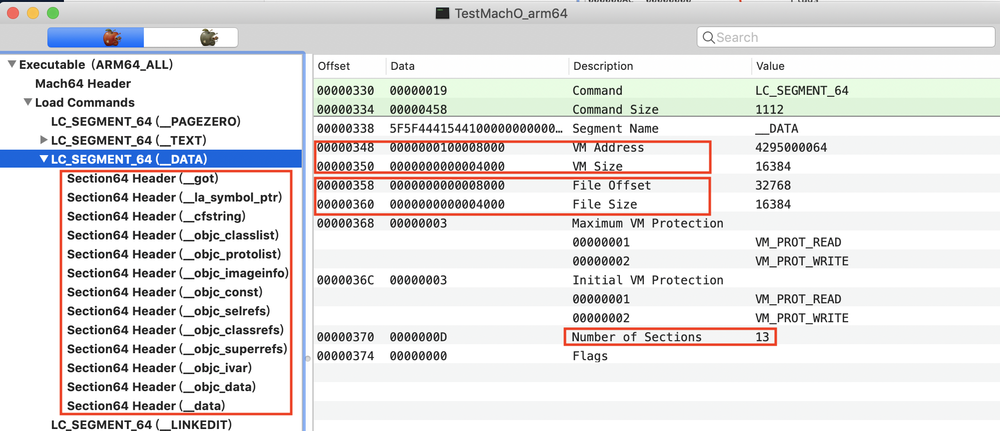
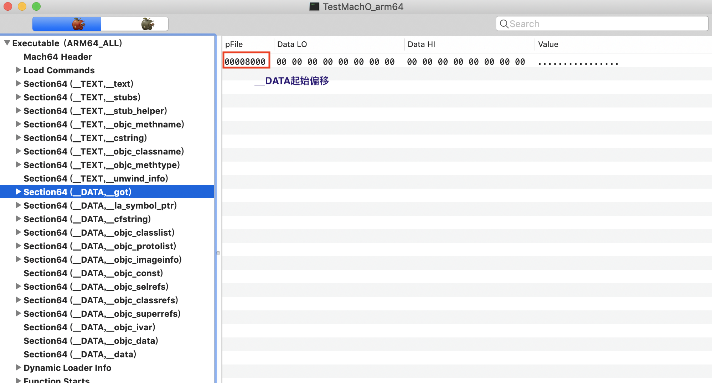
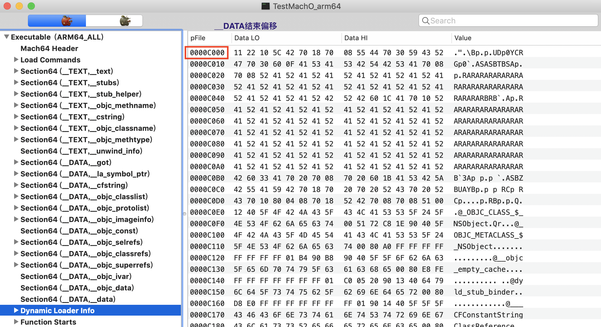
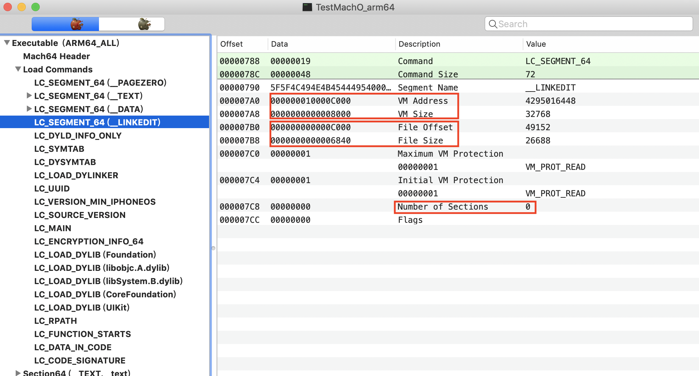
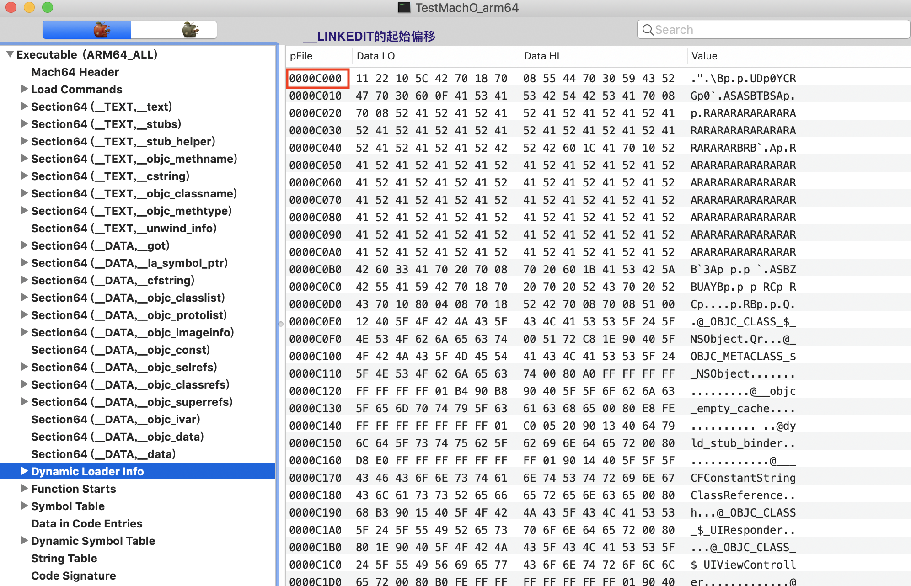
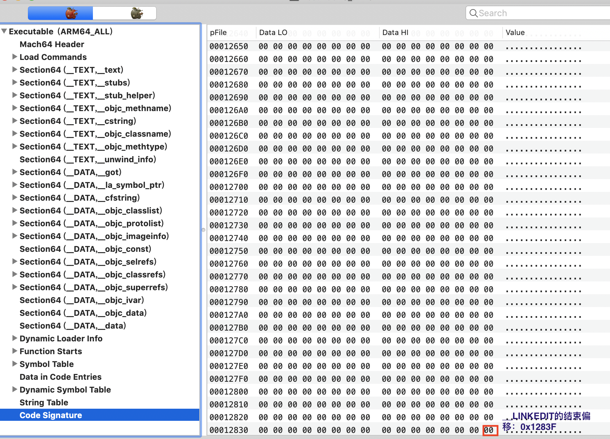

## Mach-O

> 通过MachOView来查看分析Mach-O的基本结构
>
> 我们先以arm64架构来进行分析

### 查看Mach-O基本结构


### MachO header

#### **mach_header**


- 该结构位于`<mach/loader.h>`文件

  

  - magic:魔数，用来真正标识这是一个Mach-O文件

  - cputype:cpu类型, 用来表示cpu规格

  - cpusubtype:cpu子类型,用来标识机器规格

  - filetype: 文件类型

  - ncmds: load commands中段的数量

  - sizeofcmds:所有load commands的大小,即为load commands整个结构的大小

  - flags:标志位，用来保存一些信息。 dyld加载时需要标志位。

  - reserved：保留字段，64位才有

    

#### magic

+ 魔数，用来真正标识这是一个Mach-O文件
+ `MH_MAGIC`和`MH_CIGAM`
  - `MH_MAGIC`:表示这是一个32位，采用小端序列的Mach-O文件
  - `MH_CIGAM`:表示这是一个32位，采用大端序列的Mach-O文件
+ `MH_MAGIC_64`和`MH_CIGAM_64`
  + `MH_MAGIC_64`:表示这是一个64位，采用小端序列的Mach-O文件
  + `MH_CIGAM_64`:表示这是一个64位，采用大端序列的Mach-O文件

#### cputype

+ 类型定义位于` <mach/machine.h>`文件

  

  - `CPU_TYPE_X86_64`： x86_64
  - `CPU_TYPE_X86`:
    - `CPU_SUBTYPE_I386_ALL`:i386
    - `CPU_SUBTYPE_X86_ALL`:x86
  - `CPU_TYPE_ARM64`：arm64
  - `CPU_TYPE_ARM`: 
    - `CPU_SUBTYPE_ARM_V6`: armv6
    - `CPU_SUBTYPE_ARM_V7`: armv7
    - `CPU_SUBTYPE_ARM_V7S`: armv7s

#### cpusubtype

- cpu子类型定义同样位于` <mach/machine.h>`文件

  

  - cpusubstype的类型过多，这里仅仅列出一部分

#### filetype

- 定义在`<mach/loader.h>`中

  

- `MH_OBJECT`:可重定位的目标文件
  -  .o目标文件
  - .a静态库文件
- `MH_EXECUTE`:可执行文件
- `MH_DYLIB`:动态库文件
  - .dylib
  - .framework/xx
- `MH_DYLINKER`: 动态链接编辑器
  
  - /usr/lib/dyld

+ `MH_DSYM`: 存储着二进制文件符号信息的文件
  - .dSYM/Contents/Resources/DWARF/xx（常用于分析APP的崩溃信息)

#### ncmds

- load commands中段的数量

  

  - 正好前面的图中，ncmds的值为22

#### sizeofcmds

+ 所有load commands的大小,即为load commands整个结构的大小

+ 我们从mach_header的图中可知,sizeofcmds为`00000AA0`

  

  

  - 我们从起始偏移和结束偏移，依然可以计算出大小为`0xAA0`

    ```
    0x000ABF - 0x00020 +  0x00001 =  0x00AA0
    ```

#### flags

- 用来保存一些当前Mach-O的一些信息， dyld加载时需要标志位

- 定义在`<mach/loader.h>`中

  

  

  - 定义太多，仅仅截取一小部分
  - `MH_NOUNDEFS`:目标没有未定义的符号，不存在链接依赖
  - `MH_DYLDLINK`:该目标文件是dyld的输入文件,无法被再次的静态链接
  - `MH_PIE`:允许地址空间布局随机化`ASLR`
  - `MH_ALLOW_STACK_EXECUTION`: 栈内存可执行代码，一般是默认关闭的。
  - `MH_NO_HEAP_EXECUTION`: 堆内存无法执行代码

### Load Commands

load commands直接跟在mach_header后面。mach_header中的sizeofcmds给出了load commands总的大小。所有的load command结构必须有两个字段`cmd`和`cmdSize`。` cmd`表示该command的类型。`cmdSize`表示该command的大小。根据cmdSize来不断进行偏移,来找到下一个Command。每一个 command type都有一个指定的结构。32位架构的cmdsize必须是4字节的倍数，对于64位架构必须是倍数8字节。

#### load_command

+ 该结构定义如下

  

  + `cmd`: load command的类型
  + `cmdSize`:command的大小

#### cmd类型

command类型，下面列举类型

```c
#define	LC_SEGMENT	0x1	/* segment of this file to be mapped */
#define	LC_SYMTAB	0x2	/* link-edit stab symbol table info */
#define	LC_SYMSEG	0x3	/* link-edit gdb symbol table info (obsolete) */
#define	LC_THREAD	0x4	/* thread */
#define	LC_UNIXTHREAD	0x5	/* unix thread (includes a stack) */
#define	LC_LOADFVMLIB	0x6	/* load a specified fixed VM shared library */
#define	LC_IDFVMLIB	0x7	/* fixed VM shared library identification */
#define	LC_IDENT	0x8	/* object identification info (obsolete) */
#define LC_FVMFILE	0x9	/* fixed VM file inclusion (internal use) */
#define LC_PREPAGE      0xa     /* prepage command (internal use) */
#define	LC_DYSYMTAB	0xb	/* dynamic link-edit symbol table info */
#define	LC_LOAD_DYLIB	0xc	/* load a dynamically linked shared library */
#define	LC_ID_DYLIB	0xd	/* dynamically linked shared lib ident */
#define LC_LOAD_DYLINKER 0xe	/* load a dynamic linker */
#define LC_ID_DYLINKER	0xf	/* dynamic linker identification */
#define	LC_PREBOUND_DYLIB 0x10	/* modules prebound for a dynamically */
				/*  linked shared library */
#define	LC_ROUTINES	0x11	/* image routines */
#define	LC_SUB_FRAMEWORK 0x12	/* sub framework */
#define	LC_SUB_UMBRELLA 0x13	/* sub umbrella */
#define	LC_SUB_CLIENT	0x14	/* sub client */
#define	LC_SUB_LIBRARY  0x15	/* sub library */
#define	LC_TWOLEVEL_HINTS 0x16	/* two-level namespace lookup hints */
#define	LC_PREBIND_CKSUM  0x17	/* prebind checksum */

/*
 * load a dynamically linked shared library that is allowed to be missing
 * (all symbols are weak imported).
 */
#define	LC_LOAD_WEAK_DYLIB (0x18 | LC_REQ_DYLD)

#define	LC_SEGMENT_64	0x19	/* 64-bit segment of this file to be
				   mapped */
#define	LC_ROUTINES_64	0x1a	/* 64-bit image routines */
#define LC_UUID		0x1b	/* the uuid */
#define LC_RPATH       (0x1c | LC_REQ_DYLD)    /* runpath additions */
#define LC_CODE_SIGNATURE 0x1d	/* local of code signature */
#define LC_SEGMENT_SPLIT_INFO 0x1e /* local of info to split segments */
#define LC_REEXPORT_DYLIB (0x1f | LC_REQ_DYLD) /* load and re-export dylib */
#define	LC_LAZY_LOAD_DYLIB 0x20	/* delay load of dylib until first use */
#define	LC_ENCRYPTION_INFO 0x21	/* encrypted segment information */
#define	LC_DYLD_INFO 	0x22	/* compressed dyld information */
#define	LC_DYLD_INFO_ONLY (0x22|LC_REQ_DYLD)	/* compressed dyld information only */
#define	LC_LOAD_UPWARD_DYLIB (0x23 | LC_REQ_DYLD) /* load upward dylib */
#define LC_VERSION_MIN_MACOSX 0x24   /* build for MacOSX min OS version */
#define LC_VERSION_MIN_IPHONEOS 0x25 /* build for iPhoneOS min OS version */
#define LC_FUNCTION_STARTS 0x26 /* compressed table of function start addresses */
#define LC_DYLD_ENVIRONMENT 0x27 /* string for dyld to treat
				    like environment variable */
#define LC_MAIN (0x28|LC_REQ_DYLD) /* replacement for LC_UNIXTHREAD */
#define LC_DATA_IN_CODE 0x29 /* table of non-instructions in __text */
#define LC_SOURCE_VERSION 0x2A /* source version used to build binary */
#define LC_DYLIB_CODE_SIGN_DRS 0x2B /* Code signing DRs copied from linked dylibs */
#define	LC_ENCRYPTION_INFO_64 0x2C /* 64-bit encrypted segment information */
#define LC_LINKER_OPTION 0x2D /* linker options in MH_OBJECT files */
#define LC_LINKER_OPTIMIZATION_HINT 0x2E /* optimization hints in MH_OBJECT files */
#define LC_VERSION_MIN_TVOS 0x2F /* build for AppleTV min OS version */
#define LC_VERSION_MIN_WATCHOS 0x30 /* build for Watch min OS version */
#define LC_NOTE 0x31 /* arbitrary data included within a Mach-O file */
#define LC_BUILD_VERSION 0x32 /* build for platform min OS version */
#define LC_DYLD_EXPORTS_TRIE (0x33 | LC_REQ_DYLD) /* used with linkedit_data_command, payload is trie */
#define LC_DYLD_CHAINED_FIXUPS (0x34 | LC_REQ_DYLD) /* used with linkedit_data_command */

```

#### segment_command

+ LC_SEGMENT 或 LC_SEGMENT_64

```c
struct segment_command { /* for 32-bit architectures */
	uint32_t	cmd;		/* LC_SEGMENT */
	uint32_t	cmdsize;	/* includes sizeof section structs */
	char		segname[16];	/* segment name */
	uint32_t	vmaddr;		/* memory address of this segment */
	uint32_t	vmsize;		/* memory size of this segment */
	uint32_t	fileoff;	/* file offset of this segment */
	uint32_t	filesize;	/* amount to map from the file */
	vm_prot_t	maxprot;	/* maximum VM protection */
	vm_prot_t	initprot;	/* initial VM protection */
	uint32_t	nsects;		/* number of sections in segment */
	uint32_t	flags;		/* flags */
};
```

```c
struct segment_command_64 { /* for 64-bit architectures */
	uint32_t	cmd;		/* LC_SEGMENT_64 */
	uint32_t	cmdsize;	/* includes sizeof section_64 structs */
	char		segname[16];	/* segment name */
	uint64_t	vmaddr;		/* memory address of this segment */
	uint64_t	vmsize;		/* memory size of this segment */
	uint64_t	fileoff;	/* file offset of this segment */
	uint64_t	filesize;	/* amount to map from the file */
	vm_prot_t	maxprot;	/* maximum VM protection */
	vm_prot_t	initprot;	/* initial VM protection */
	uint32_t	nsects;		/* number of sections in segment */
	uint32_t	flags;		/* flags */
};
```

- cmd: LC_SEGMENT或LC_SEGMENT_64
- cmdsize: 这个command本身的大小
- segname[16]: 段名。 常见的段名如下:
  - __PAGEZORE
  - __TEXT
  - __DATA
  - __LINKEDIT
- vmaddr: 这个段在内存中的起始虚拟地址
- vmsize: 这个段在内存中的大小
- fileoff: 这个段在Mach-O文件中的偏移量
- filesize: 这个段在Mach-O文件中的占据的大小
- nsects: 该segment包含的section的数量
- flags：标志位,具体信息查看`<mach/loader.h>`文件。

##### __PAGEZORE


+ cmd: LC_SEGMENT_64
+ vmaddr: 值为0x0， 说明载入内存后，__PAGEZORE在虚拟内存的0x位置开始
+ vmsize：0x100000000, 说明载入内存后，__PAGEZORE在虚拟内存占据0x100000000的空间。
  - 32位架构下， __PAGEZORE的大小始终为0x4000
  - 64位架构下，__PAGEZORE的大小始终为0x100000000
+ fileoffset和filesize均为0
  - 该segment在Mach-O文件中不存在
  - 当前的结构为segment_command，是对segnment的描述，而不是segment本身的内容。

##### __TEXT



+ vmaddr为0x100000000, vmsize为0x8000

  - __TEXT载入内存后，从虚拟内存地址为0x100000000的位置，占据0x8000的虚拟内存空间
  - 在虚拟内存中起始地址为0x100000000,说明`__TEXT`紧跟着`__PAGEZORE`

+ fileoffset为0x0, filesize为0x8000

  - fileoffset为0x0，说明从Mach-O文件起始开始，一直到0x8000都被当做__TEXT段。
    

  + filesize和vmsize相同，说明__TEXT是在内存中是完全被搬过去的。
    - 也就是到目前为止。内存分布为`__PAGEZORE`下面跟着mach_header,load_command,`__Text`的所有section。

##### __DATA



+ vmaddr为0x100008000, vmsize为0x4000

  - __DATA载入内存后，从虚拟内存地址为0x100008000的位置，占据0x4000的虚拟内存空间
  - 在虚拟内存中起始地址为0x100008000,说明`__DATA`紧跟着`__TEXT`

+ fileoffset为0x8000, filesize为0x4000

  - fileoffset为0x8000说明在Mach-O文件中,`__DATA`紧跟着`__TEXT`

  - filesize为0x4000，也可以通过计算得出。

    

    

    ```
    0xc000 - 0x8000 = 0x4000
    ```

  - 此时filesize和vmsize相等，说明是直接将__DATA整体载入到内存。但是要注意，有可能vmsize会比filesize大。因为载入内存后可能会给数据段分配更大一点的空间。

##### __LINKEDIT



+ vmaddr为0x10000C000, vmsize为0x8000

  - __LINKEDIT载入内存后，从虚拟内存地址为0x10000C000的位置，占据0x8000的虚拟内存空间
  - 在虚拟内存中起始地址为0x10000C000,说明`__LINKEDIT`紧跟着`__DATA`

+ fileoffset为0xC000, filesize为0x6840

  - fileoffset为0xC000说明在Mach-O文件中,`__LINKEDIT`紧跟着`__DATA`

  - filesize为0x6840，通过计算我们可知剩下的都是`__LINKEDIT`的内容

    

    

    ```
    0x1283F - 0xC000 + 0x01 = 0x6840
    ```

#### LC_SYMTAB