## OC对象的本质

###  OC和C/C++的关系

+ 我们平时编写的Objective-C代码，底层实现其实都是C\C++代码

  

  - 平常所写的OC代码先通过编译器转换为C\C++代码，然后编译成汇编语言，进而转换成机器语言

+ 所以Objective-C的面向对象都是基于C\C++的**结构体**实现的

### OC转换为C/C++代码

+ 通过命令行将OC代码转成C/C++代码

  + xcrun  -sdk  iphoneos  clang  -arch  arm64  -rewrite-objc  OC源文件  -o  输出的CPP文件
  + 如果需要链接其他框架，使用-framework参数。比如-framework UIKit

+ 简单使用

  1. 创建Mac的命令行工程，测试代码如下

     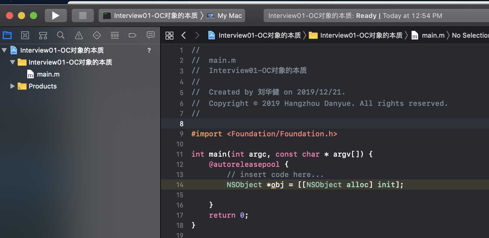

  2. 通过命令行将OC代码转成C/C++代码

     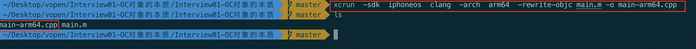

     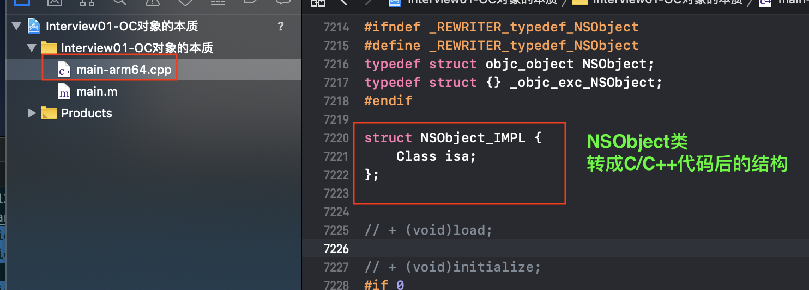

     

     

### NSObject本质

+ NSObject的定义

+ ```objective-c
  @interface NSObject <NSObject> {
      Class isa;
  }
  
  //Class是object_class结构体指针
  typedef Struct object_class *Class;
  ```

  - NSObject对象中，包含一个isa指针，指向所属的类对象

+ NSObject类的底层结构

  ```c
  struct NSObject_IMPL {
  	Class isa;
  };
  ```

### class_getInstanceSize、malloc_size

+ class_getInstanceSize:获取类的实例对象的大小，并且该大小是经过内存对齐的

+ malloc_size:获取操作系统分配给实例对象的大小,实际上查看的就是alloc方法分配的内存

  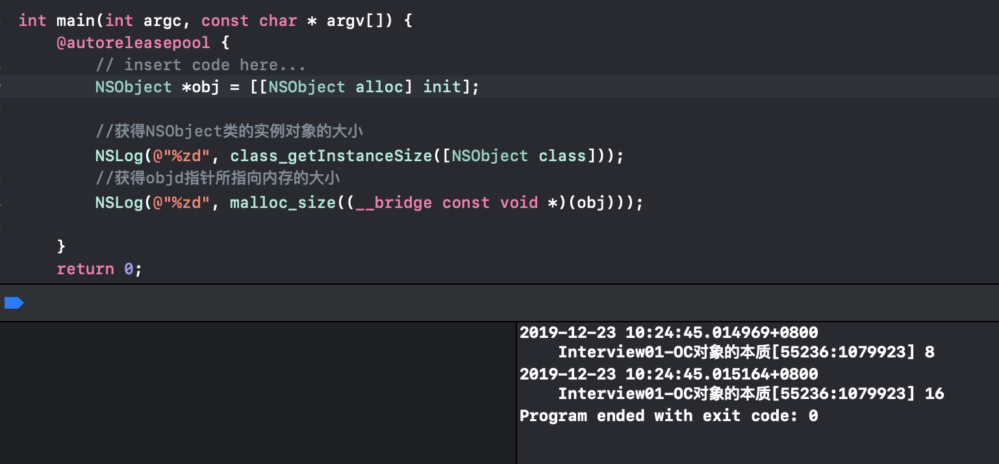

+ 源码地址: https://opensource.apple.com/tarballs/objc4/

+ class_getInstanceSize源码分析

  - class_getInstanceSize-> alignedInstanceSize

  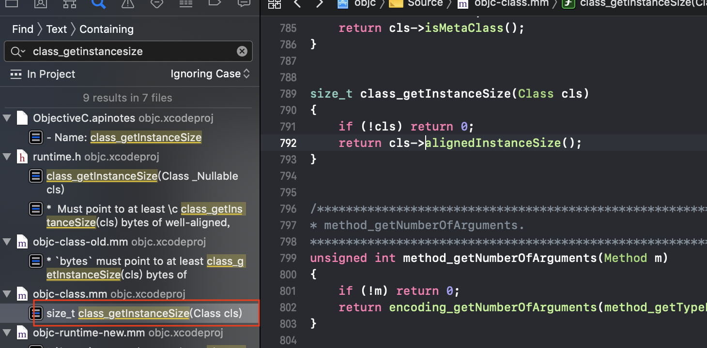

  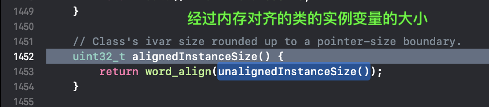

  

+ alloc方法实际上调用allocWithZone，源码分析如下

  - _objc_rootAllocWithZone->class_createInstance-> _class_createInstanceFromZone-> instanceSize->alignedInstanceSize

    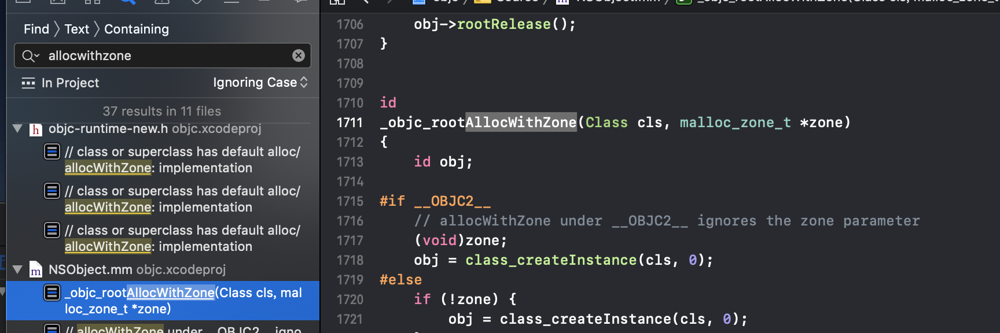

    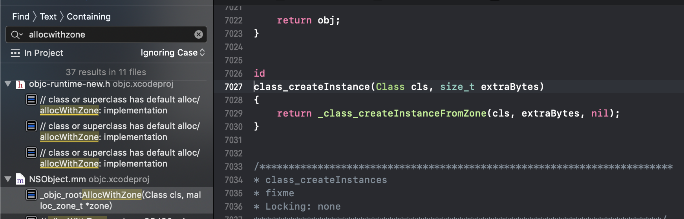

    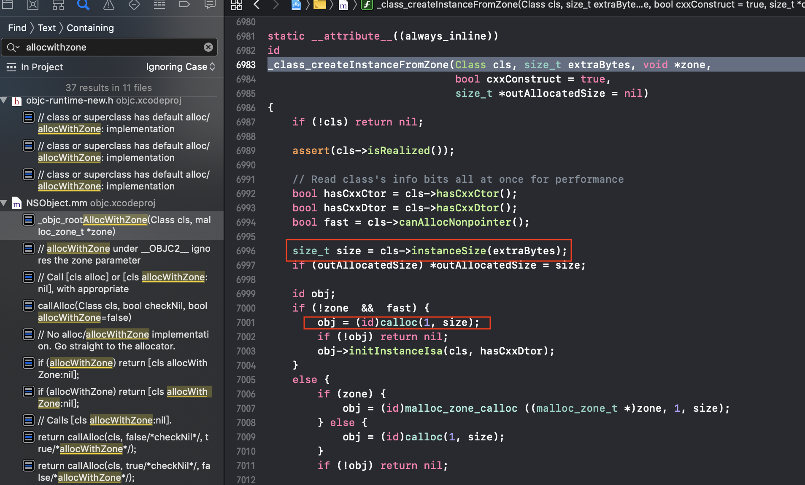

    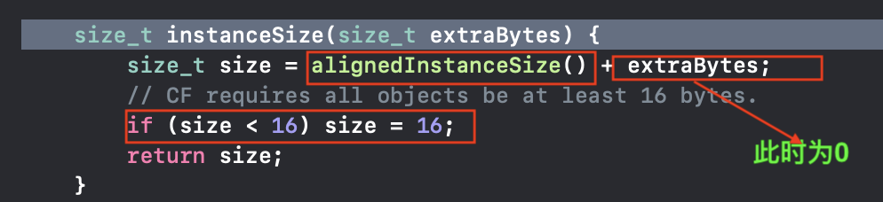

  - 最终都会调用alignedIntanceSize函数，但是真正分配内存时，至少会分配16个字节的内存


+ 结论

  - 创建一个实例对象，至少需要多少内存？

    ```c
    #import <objc/runtime.h>
    class_getInstanceSize([NSObject class]);
    ```

  - 创建一个实例对象，实际上分配了多少内存？

    ```c
    #import <malloc/malloc.h>
    malloc_size((__bridge const void *)obj);
    ```

    

### NSObject对象内存布局

+ 结构体在内存中是线性布局的，isa的地址即为NSObject对象的地址

  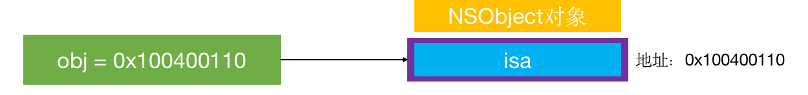

+ 通过Debug->Debug Workflow -> View Memory查看内存

  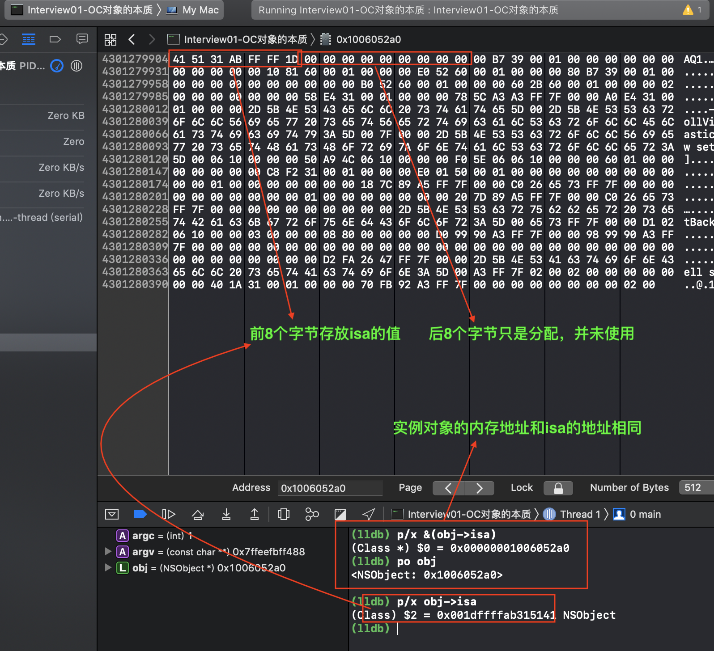

+ 内存图

  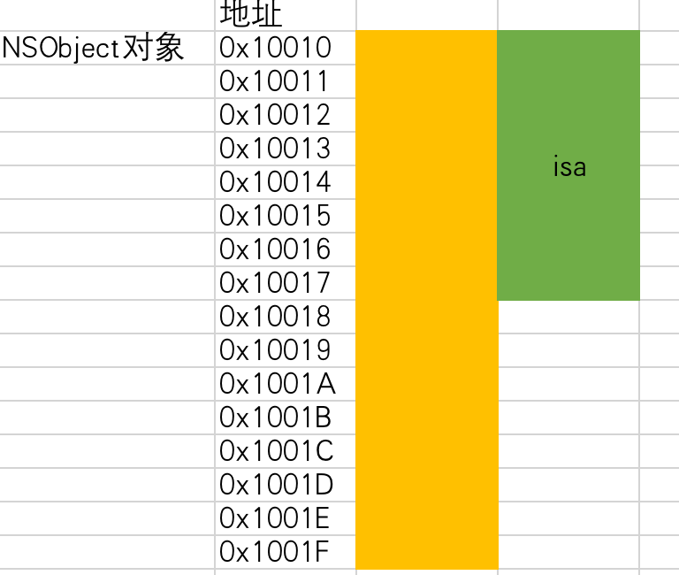

### Student的本质

1. Student类代码如下

   ```objective-c
   @interface Student : NSObject
   {
       @public
       int _no;
       int _age;
   }
   @end
   
   @implementation Student
   
   @end
   ```

2. 其底层结构为

   ```objective-c
   struct Student_IMPL {
   	struct NSObject_IMPL NSObject_IVARS;
   	int _no;
   	int _age;
   };
   ```

3. 测试代码

   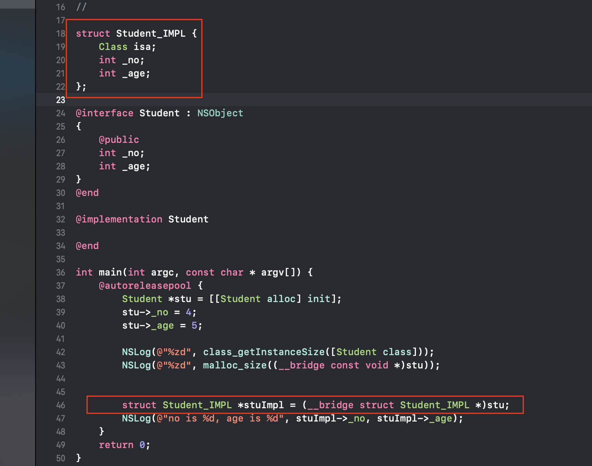

   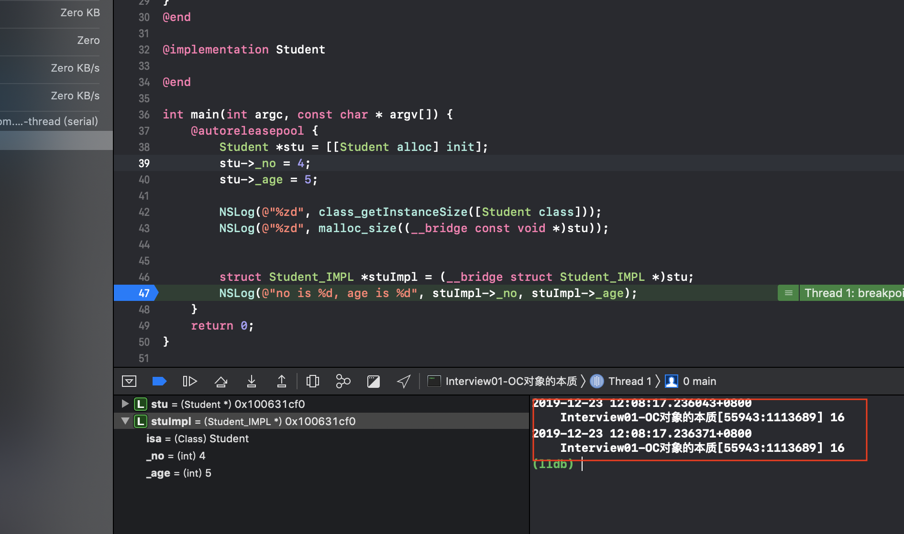

   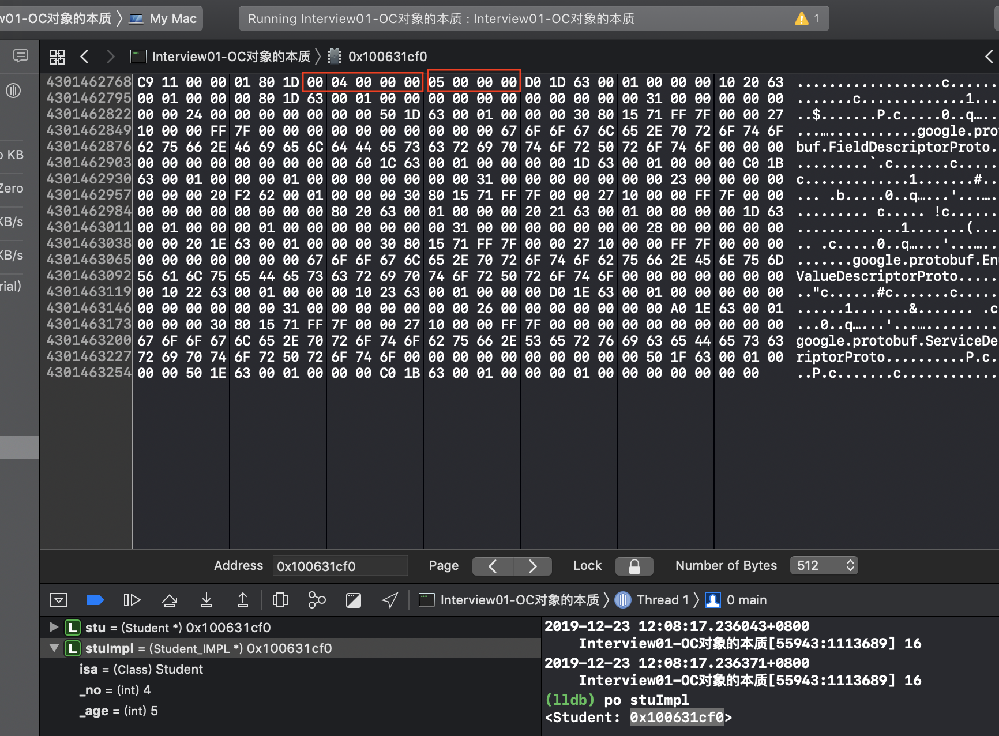

4. Student的内存图

   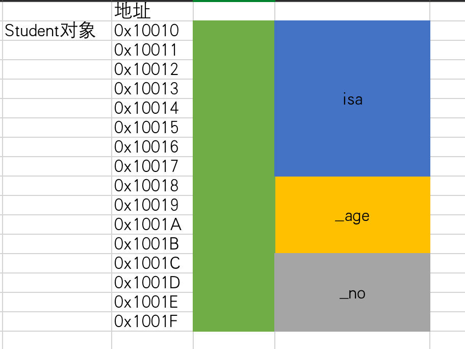

   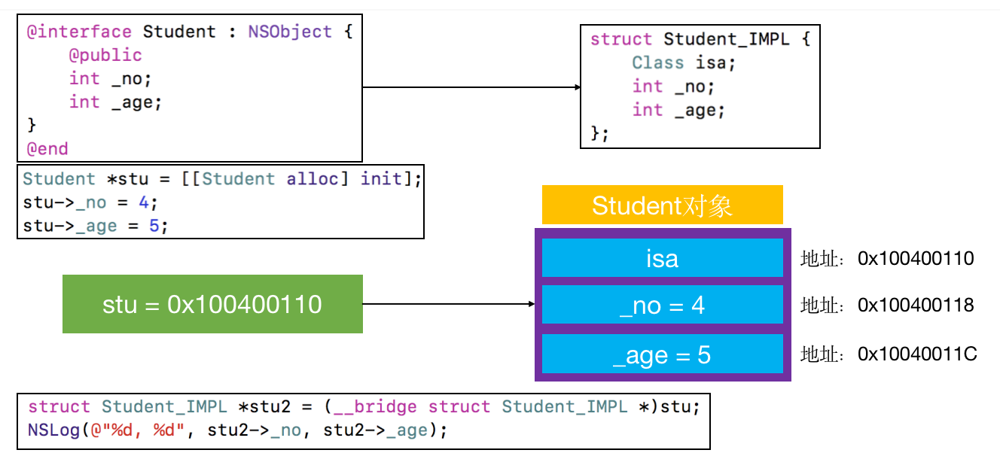

   

### 更复杂的继承结构

+ Person和Student的类如下

  ```objective-c
  // Person
  @interface Person : NSObject
  {
      @public
      int _age;
      int _height
  }
  @end
  
  @implementation Person
  @end
  
  @interface Student : Person
  {
      int _no;
  }
  @end
  
  @implementation Student
  @end
  ```

+ 编译后查看它们的本质结构如下

  ```objective-c
  struct NSObject_IMPL {
      Class isa;//8
  };
  
  struct Person_IMPL {
      struct NSObject_IMPL NSObject_IVARS; // 8
      int _age; //4
      int _height;//4
  };
  
  struct Student_IMPL {
      struct Person_IMPL Person_IVARS; //16
      int _no; //4
  };
  ```

+ class_getInstanceSize和malloc_size

  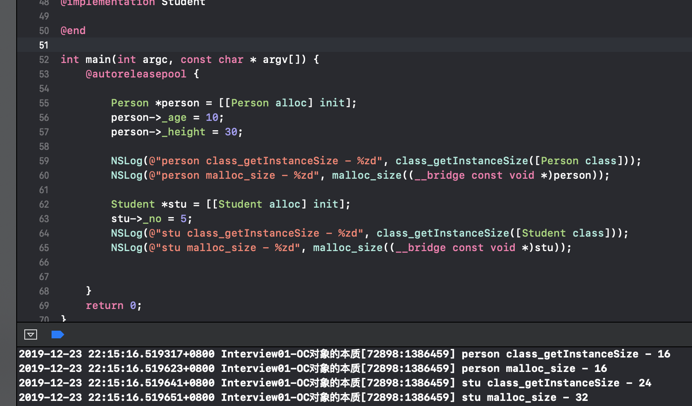

  - **Person_IMPL**中**NSObject_IVARS**占8个字节, **_age**占4个字节, **_height**占4个字节,计算结果为16
    - class_getInstanceSize获得大小是内存对齐的大小，其对齐方式是**结构体的大小必须是最大成员大小的倍数**，所以其值为16
    - malloc_size操作系统分配内存时，至少分配16字节
  - **Student_IMPL**中**Person_IVARS**占16个字节, **_no**占4个字节,计算结果为20
    - class_getInstanceSize获得大小是内存对齐的大小，其对齐方式是**结构体的大小必须是最大成员大小的倍数**，计算结果为20，所以值为24。
    - malloc_size操作系统分配内存时，至少分配16字节。字节对齐的规则是16的倍数，所以值为32。


### libmalloc

+ 从上面的class_getInstanceSize和malloc_size的源码分析来看，在执行`calloc(1,size)`函数之前，class_getInstanceSize的结果和参数size的值是一样的。

+ 所以`calloc(1,size)`函数是操作系统真正用来分配内存的函数

+ 下载源码:[ libmalloc-140.40.1.tar.gz](https://opensource.apple.com/tarballs/libmalloc/libmalloc-140.40.1.tar.gz)

+ 查看路径

  - malloc.c-> calloc->malloc_zone_calloc

    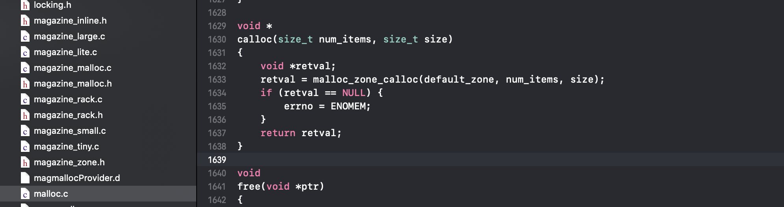

    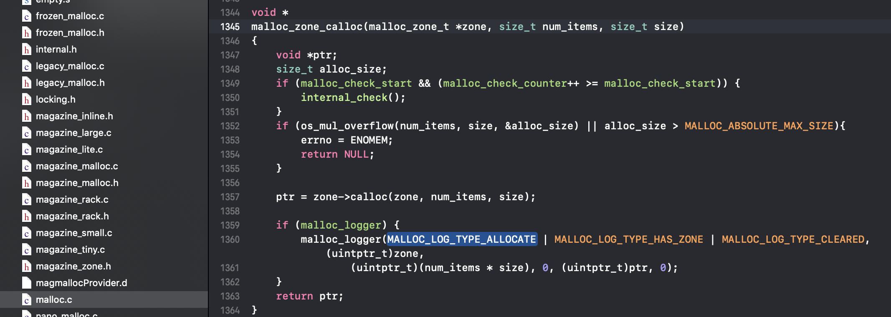

  - calloc开辟内存时，对齐规则是每次开辟的是16的倍数

    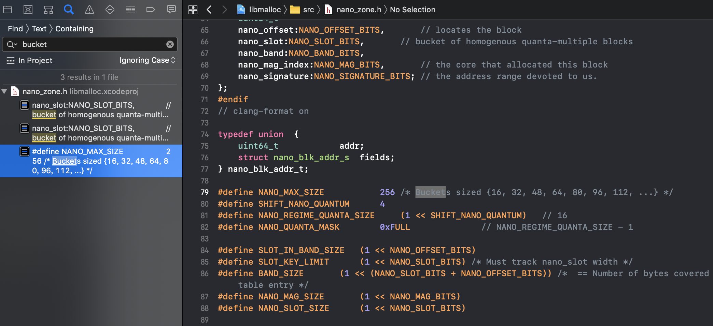


### sizeof

+ sizeof是运算符，在编译时就已经被计算替换成常量

+ class_getInstanceSize和sizeof一样，都是对齐后需要的内存空间

  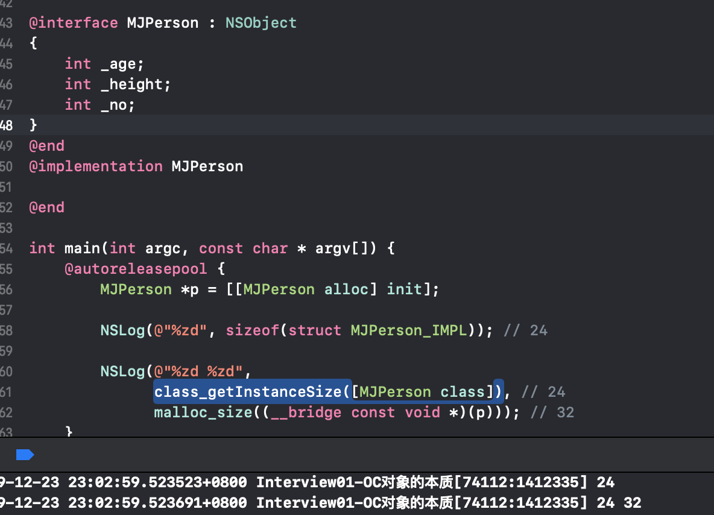

  

### 面试题

+ 一个NSObject对象占用多少内存？
  - 系统分配了16个字节给NSObject对象（通过malloc_size函数获得）
  - 但NSObject对象内部只使用了8个字节的空间（64bit环境下，可以通过class_getInstanceSize函数获得）