## Runtime

### Runtime简介

+ Objective-C是一门动态性比较强的编程语言，跟C、C++等语言有着很大的不同
+ Objective-C的动态性是由Runtime API来支撑的
+ Runtime API提供的接口基本都是C语言的，源码由C\C++\汇编语言编写

### isa简介

+ 要想学习Runtime，首先要了解它底层的一些常用数据结构，比如isa指针

+ 在arm64架构之前，isa就是一个普通的指针，存储着Class、Meta-Class对象的内存地址

+ 从arm64架构开始，对isa进行了优化，变成了一个共用体（union）结构，还使用位域来存储更多的信息

  

  

  


### isa结构理解-通过位设置取值

- 从位取值 

  ```powershell
  例如:二进制数据 0b1010中取出某一位
  
  取出倒数第二位:0
    1010  值
  & 0001  掩码 1 << 0
   -------
    0000 
    
  取出倒数第二位:1
    1010 值
  & 0010 掩码 1 << 1
   -------
    0010 
    
  取出倒数第三位:0
    1010 值
  & 0100 掩码 1 << 2
   -------
    0000 
    
  取出倒数第四位:1
    1010 值
  & 1000 掩码 1 << 3
   -------
    1000
  ```

- 用位存值

  ```powershell
  例如:通过0b1010进行存值
  
  1. 向倒数第一位存值1
    1010 原值
  | 0001 掩码 1 << 0
   -------
    1011 结果
    
  2. 向倒数第一位存值0
    1010 原值
  & 1110 掩码 ~(1 << 0)
   -------
    1010 结果
  
  
  3. 向倒数第二位存值1
    1010 原值
  | 0010 掩码 1 << 1
   -------
    1010 结果
    
  4. 向倒数第二位存值0
    1010 原值
  & 1101 掩码 ~(1 << 1)
   -------
    1000 结果
  
  
  5. 向倒数第三位存值1
    1010 原值
  | 0100 掩码 1 << 2
   -------
    1110 结果
    
  6. 向倒数第三位存值0
    1010 原值
  & 1011 掩码 ~(1 << 2)
   -------
    1010 结果
    
    
  7. 向倒数第四位存值1
    1010 原值
  | 1000 掩码 1 << 3
   -------
    1010 结果
    
  8. 向倒数第四位存值0
    1010 原值
  & 0111 掩码 ~(1 << 3)
   -------
    0010 结果
  
  ```

+ 用位来存储布尔值

  ```objc
  
  @interface MJPerson : NSObject
  - (void)setTall:(BOOL)tall;
  - (void)setRich:(BOOL)rich;
  - (void)setHandsome:(BOOL)handsome;
  
  - (BOOL)isTall;
  - (BOOL)isRich;
  - (BOOL)isHandsome;
  
  @end
  ```

  ```objc
  #import "MJPerson.h"
  
  // &可以用来取出特定的位
  
  // 掩码，一般用来按位与(&)运算的
  //#define MJTallMask 1
  //#define MJRichMask 2
  //#define MJHandsomeMask 4
  
  //#define MJTallMask 0b00000001
  //#define MJRichMask 0b00000010
  //#define MJHandsomeMask 0b00000100
  
  #define MJTallMask (1<<0)
  #define MJRichMask (1<<1)
  #define MJHandsomeMask (1<<2)
  
  @interface MJPerson()
  {
      char _tallRichHansome;
  }
  @end
  
  @implementation MJPerson
  - (instancetype)init
  {
      if (self = [super init]) {
          _tallRichHansome = 0b00000100;
      }
      return self;
  }
  
  - (void)setTall:(BOOL)tall
  {
      if (tall) {
          _tallRichHansome |= MJTallMask;
      } else {
          _tallRichHansome &= ~MJTallMask;
      }
  }
  
  - (BOOL)isTall
  {
      return !!(_tallRichHansome & MJTallMask);
  }
  
  - (void)setRich:(BOOL)rich
  {
      if (rich) {
          _tallRichHansome |= MJRichMask;
      } else {
          _tallRichHansome &= ~MJRichMask;
      }
  }
  
  - (BOOL)isRich
  {
      return !!(_tallRichHansome & MJRichMask);
  }
  
  - (void)setHandsome:(BOOL)handsome
  {
      if (handsome) {
          _tallRichHansome |= MJHandsomeMask;
      } else {
          _tallRichHansome &= ~MJHandsomeMask;
      }
  }
  
  - (BOOL)isHandsome
  {
      return !!(_tallRichHansome & MJHandsomeMask);
  }
  
  @end
  
  ```

  ```objc
  int main(int argc, const char * argv[]) {
      @autoreleasepool {
          MJPerson *person = [[MJPerson alloc] init];
          person.rich = YES;
          person.tall = NO;
          person.handsome = NO;
          NSLog(@"tall:%d rich:%d hansome:%d", person.isTall, person.isRich, person.isHandsome);
      }
      return 0;
  }
  
  ```

### 模仿系统的位运算

```objc
#import "ViewController.h"
typedef enum {
    MJOptionsNone = 0,    // 0b0000
    MJOptionsOne = 1<<0,   // 0b0001
    MJOptionsTwo = 1<<1,   // 0b0010
    MJOptionsThree = 1<<2, // 0b0100
    MJOptionsFour = 1<<3   // 0b1000
} MJOptions;

@interface ViewController ()
@end
@implementation ViewController

- (void)setOptions:(MJOptions)options
{
    if (options & MJOptionsOne) {
        NSLog(@"包含了MJOptionsOne");
    }
    
    if (options & MJOptionsTwo) {
        NSLog(@"包含了MJOptionsTwo");
    }
    
    if (options & MJOptionsThree) {
        NSLog(@"包含了MJOptionsThree");
    }
    
    if (options & MJOptionsFour) {
        NSLog(@"包含了MJOptionsFour");
    }
}

- (void)viewDidLoad {
    [super viewDidLoad];
    [self setOptions: MJOptionsOne | MJOptionsTwo | MJOptionsFour];
}


@end

```


### isa结构理解-位域的基本使用

```objc
@interface MJPerson()
{
    // 位域
    struct {
        char tall : 1; //最低位
        char rich : 1;
        char handsome : 1;
    } _tallRichHandsome;
}
@end
  
@implementation MJPerson

- (void)setTall:(BOOL)tall
{
    _tallRichHandsome.tall = tall;
}

- (BOOL)isTall
{
    return !!_tallRichHandsome.tall;
}

- (void)setRich:(BOOL)rich
{
    _tallRichHandsome.rich = rich;
}

- (BOOL)isRich
{
    return !!_tallRichHandsome.rich;
}

- (void)setHandsome:(BOOL)handsome
{
    _tallRichHandsome.handsome = handsome;
}

- (BOOL)isHandsome
{
    return !!_tallRichHandsome.handsome;
}

@end
```

- `struct _tallRichHandsome`采用了位域的技术，tall，rich，handsome占1位,整个结构体对齐只占一个字节

- `_tallRichHandsome.tall`值为0b0或0b1

  ```
  0b1被扩展为1个字节时，变为0b1111 1111为-1，所以通过`!!`得到真正的结果
  ```


### isa结构理解-共用体和位域

```objc
#define MJTallMask (1<<0)
#define MJRichMask (1<<1)
#define MJHandsomeMask (1<<2)
#define MJThinMask (1<<3)

@interface MJPerson()
{
    union {
        char bits;
        
        struct {
            char tall : 1;
            char rich : 1;
            char handsome : 1;
            char thin : 1;
        };
    } _tallRichHandsome;
}
@end

@implementation MJPerson

- (void)setTall:(BOOL)tall
{
    if (tall) {
        _tallRichHandsome.bits |= MJTallMask;
    } else {
        _tallRichHandsome.bits &= ~MJTallMask;
    }
}

- (BOOL)isTall
{
    return !!(_tallRichHandsome.bits & MJTallMask);
}

- (void)setRich:(BOOL)rich
{
    if (rich) {
        _tallRichHandsome.bits |= MJRichMask;
    } else {
        _tallRichHandsome.bits &= ~MJRichMask;
    }
}

- (BOOL)isRich
{
    return !!(_tallRichHandsome.bits & MJRichMask);
}

- (void)setHandsome:(BOOL)handsome
{
    if (handsome) {
        _tallRichHandsome.bits |= MJHandsomeMask;
    } else {
        _tallRichHandsome.bits &= ~MJHandsomeMask;
    }
}

- (BOOL)isHandsome
{
    return !!(_tallRichHandsome.bits & MJHandsomeMask);
}


- (void)setThin:(BOOL)thin
{
    if (thin) {
        _tallRichHandsome.bits |= MJThinMask;
    } else {
        _tallRichHandsome.bits &= ~MJThinMask;
    }
}

- (BOOL)isThin
{
    return !!(_tallRichHandsome.bits & MJThinMask);
}

@end

```

- 此时结构体位域仅仅是为了增加可读性，没有实际的意义。

- 通过这种结构可以在`bits`中存储更多的信息。

- 共用体`union`

  ```objc
  1. 其大小为内部最大变量的大小
  2. 所有变量占据同一块内存
    
  union Date { 
    int year,
    char month;
    char day;
  }
  year,month,day占据同一块内存
  ```

###  isa结构理解-详解


- nonpointer

  - 0，代表普通的指针，存储着Class、Meta-Class对象的内存地址
  - 1，代表优化过，使用位域存储更多的信息

- has_assoc

  - 是否有**设置过**关联对象，如果没有，释放时会更快

- has_cxx_dtor

  - 是否有C++的析构函数（.cxx_destruct），如果没有，释放时会更快

    ```objc
    //Destroys an instance without freeing memory. 
    //销毁对象时
    void *objc_destructInstance(id obj) 
    {
        if (obj) {
            // Read all of the flags at once for performance.
            bool cxx = obj->hasCxxDtor();
            bool assoc = obj->hasAssociatedObjects();
    
            // This order is important.
            //1. 有析构函数，要先调用析构函数
            if (cxx) object_cxxDestruct(obj);
            //2. 有关联对象，要先调用释放关联对象
            if (assoc) _object_remove_assocations(obj);
            //3. dealloc对象本身
            obj->clearDeallocating();
        }
    
        return obj;
    }
    ```

    

- shiftcls

  - 存储着Class、Meta-Class对象的内存地址信息

  - `bits & ISA_MASK`的到Class、Meta-Class的内存地址

    ```
    ISA_MASK为0x0000000ffffffff8ULL,其最后四位为1000。
    所以，Class、Meta-Class的内存地址的二进制位的最后三位一定为0。
    因此地址的十六表示的最后一位为0或0
    ```

    

- magic

  - 用于在调试时分辨对象是否未完成初始化

- weakly_referenced

  - 是否有被弱引用指向过，如果没有，释放时会更快

- deallocating

  - 对象是否正在释放

- extra_rc

  - 里面存储的值是引用计数器减1

- has_sidetable_rc

  - 引用计数器是否过大无法存储在isa中
  - 如果为1，那么引用计数会存储在一个叫SideTable的类的属性中

### Class结构


- class_rw_t里面的methods、properties、protocols是二维数组，是可读可写的，包含了类的初始内容、分类的内容

  

- class_ro_t里面的baseMethodList、baseProtocols、ivars、baseProperties是一维数组，是只读的，包含了类的初始内容

  


### method_array_t


+ list_array_tt是一个模板类
+ method_array_t继承list_array_tt，是一个二维数组，内部放着method_list_t, method_list_t中放着method_t

### property_array_t


+ property_array_t继承list_array_tt，是一个二维数组，内部放着property_list_t, property_list_t中放着property_t


### protocol_array_t


+ protocol_array_t继承list_array_tt，是一个二维数组，内部放着protocol_array_t, protocol_array_t中放着property_ref_t
+ property_ref_t是指向protocol_t的指针

### Method结构

+ method_t是对方法\函数的封装

  

+ IMP代表函数的具体实现

  ```objc
  typedef id _Nullable (*IMP)(id _Nonull, SEL _Nonull,...)
  ```

+ SEL代表方法\函数名，一般叫做选择器，底层结构跟char *类似

  - 可以通过@selector()和sel_registerName()获得

  - 可以通过sel_getName()和NSStringFromSelector()转成字符串

  - 不同类中相同名字的方法，所对应的方法选择器是相同的

    ```objc
    typedef struct objc_selector *SEL;
    ```

+ types是包含了函数返回值，以及参数类型编码的字符串

### Type Encoding

+ iOS中提供了一个叫做@encode的指令，可以将具体的类型表示成字符串编码

  

+ 为了简单`MJClassInfo`将方法变成了一维数组

  

  ```objc
  方法 -(int)test:(int)age height:(float)height的类型编码为i24@0:8i16f20
  objc_msgSend(person,@selector(test:height:),age,height)
  i表示返回值为int类型
  24表示所有参数的字节总数,self + _cmd + age + height = 8 + 8 + 4 + 4 = 24
  @是id的类型编码
  0是代表self参数的起始偏移
  :是SEL的类型编码
  8是代表_cmd参数的起始偏移
  i是int的类型编码
  16是代表age参数的起始偏移
  f是float的类型编码
  20是代表height参数的起始偏移
    
  @encode(int)可获取类型编码
  ```

###cache_t

+ Class内部结构中有个方法缓存（cache_t），用散列表（哈希表）来缓存曾经调用过的方法，可以提高方法的查找速度

  

  - _buckets是一个散列表, 存储着所有的方法缓存。
  - 等于散列表的长度 -1 
  - _occupied是散列表中已经缓存的方法的数量

### 散列表缓存

- _buckets本质上是一个数组，其内部存放着bucket_t结构体

- bucket_t的_key是方法选择器SEL, _imp是函数的内存地址

- 简单的散列表存储图解

  

  ```
  1. 对于person对象有personTest, personTest2方法
  2. 那么调用personTest方法后要将personTest存储到_buckets中
  3. 在没有缓存时， _buckets是一个具有默认长度的数组，里面存储的都为NULL
  4. @selector(personTest)&_mask的值作为索引，将对应的方法存储到buckets中
  ```

+ 源码解析:`  objc-cache.mm - > bucket_t * cache_t::find(cache_key_t k, id receiver)`

  + 查找方法缓存 bucket_t

    

  + 通过hash获取存储位置

    

  + 获取存储位置，发生hash碰撞时的处理

    

  + 存储容量不够时，扩容

    

    

  + 扩容时，会把原来的缓存直接清空

    

+ 测试代码

  ```objective-c
  @interface MJPerson : NSObject
  - (void)personTest;
  @end
  
  @implementation MJPerson
  - (void)personTest{}
  @end
  
  @interface MJStudent : MJPerson
  - (void)studentTest;
  @end
  
  @implementation MJStudent
  - (void)studentTest{}
  @end
  
  @interface MJGoodStudent : MJStudent
  - (void)goodStudentTest;
  @end
  
  @implementation MJGoodStudent
  - (void)goodStudentTest{}
  @end
  
  int main(int argc, const char * argv[]) {
      @autoreleasepool {
  
          MJGoodStudent *goodStudent = [[MJGoodStudent alloc] init];
          mj_objc_class *goodStudentClass = (__bridge mj_objc_class *)[MJGoodStudent class];
  
          [goodStudent goodStudentTest];
          [goodStudent studentTest];
  //        [goodStudent personTest];
  //        [goodStudent goodStudentTest];
  //        [goodStudent studentTest];
          cache_t cache = goodStudentClass->cache;
          bucket_t *buckets = cache._buckets;
          for (int i = 0; i <= cache._mask; i++) {
              bucket_t bucket = buckets[i];
              NSLog(@" *****  %s %p", bucket._key, bucket._imp);
          }
          
          NSLog(@"123");
      }
      return 0;
  }
  ```

  

  

  

  

### objc_msgSend流程

+ OC中的方法调用，其实都是转换为objc_msgSend函数的调用

+ objc_msgSend的执行流程可以分为3大阶段

  - 消息发送
  - 动态方法解析
  - 消息转发

+ 源码阅读顺序

  - objc-msg-arm64.s

    - ENTRY _objc_msgSend
    - b.le	LNilOrTagged
    - CacheLookup NORMAL
    - .macro CacheLookup
    - .macro CheckMiss
    - STATIC_ENTRY  __objc_msgSend_uncached
    - .macro MethodTableLookup
    - __class_lookupMethodAndLoadCache3

  - objc-runtime-new.mm

    - _class_lookupMethodAndLoadCache3
    - lookUpImpOrForward
    - getMethodNoSuper_nolock、search_method_list、log_and_fill_cache
    - cache_getImp、log_and_fill_cache、getMethodNoSuper_nolock、log_and_fill_cache
    - _class_resolveInstanceMethod
    - _objc_msgForward_impcache

  - objc-msg-arm64.s

    - STATIC_ENTRY __objc_msgForward_impcache
    - ENTRY __objc_msgForward

  - Core Foundation

    - `__forwarding__`（不开源）

    

#### 消息发送


+ receiver通过isa指针找到receiverClass
+ receiverClass通过superclass指针找到superClass
+ 如果是从class_rw_t中查找方法
  - 已经排序的，二分查找
  - 没有排序的，遍历查找

####  动态方法解析


+ 开发者可以实现以下方法，来动态添加方法实现
  - +resolveInstanceMethod:
  - +resolveClassMethod:
+ 动态解析过后，会重新走“消息发送”的流程
  
- “从receiverClass的cache中查找方法”这一步开始执行
  
+ 实例方法和类方法动态解析测试

  ```objc
  #import "MJPerson.h"
  #import <objc/runtime.h>
  
  @interface MJPerson : NSObject
  - (void)test;
  + (void)test;
  @end
    
  @implementation MJPerson
  
  void c_other(id self, SEL _cmd)
  {
      NSLog(@"c_other - %@ - %@", self, NSStringFromSelector(_cmd));
  }
  - (void)other
  {
      NSLog(@"%s", __func__);
  }
  
  //动态添加实例方法
  + (BOOL)resolveInstanceMethod:(SEL)sel
  {
      if (sel == @selector(test)) {
          // 获取其他方法
          Method method = class_getInstanceMethod(self, @selector(other));
          // 动态添加test方法的实现
           class_addMethod(self, sel,
                          method_getImplementation(method),
                          method_getTypeEncoding(method));
           class_addMethod(self, sel,
                          (IMP)c_other,
                          "v@:"); // "v16@0:8"
  
          // 返回YES代表有动态添加方法
          return YES;
      }
      return [super resolveInstanceMethod:sel];
  }
  
  //动态添加类方法
  + (BOOL)resolveClassMethod:(SEL)sel
  {
      if (sel == @selector(test)) {
          // 第一个参数是object_getClass(self)
          class_addMethod(object_getClass(self), sel, (IMP)c_other, "v16@0:8");
          return YES;
      }
      return [super resolveClassMethod:sel];
  }
  
  @end
  
  ```

+ 查看method_t结构

  

#### 消息转发


+ 开发者可以在forwardInvocation:方法中自定义任何逻辑

+ 以上方法都有对象方法、类方法2个版本（前面可以是加号+，也可以是减号-)

+ 消息转发会调用Core Foundation的` __forwarding`__函数

  

+ 如果执行过消息转发的话，下次再执行该方法会直接走消息转发流程

  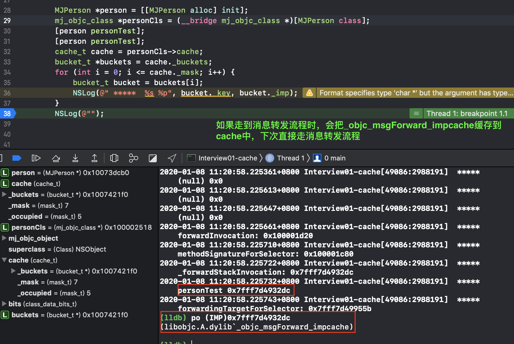
  
+ 其他对象来处理这个消息

  ```objc
  @implementation MJPerson
  
  //处理实例方法
  - (id)forwardingTargetForSelector:(SEL)aSelector
  {
      if (aSelector == @selector(test)) {
          // objc_msgSend([[MJCat alloc] init], aSelector)
          // 返回一个能够处理该消息的对象,
          return [[MJCat alloc] init];
      }
      return [super forwardingTargetForSelector:aSelector];
  }
  
  // 方法签名：返回值类型、参数类型
  - (NSMethodSignature *)methodSignatureForSelector:(SEL)aSelector
  {
      if (aSelector == @selector(test)) {
          return [NSMethodSignature signatureWithObjCTypes:"v16@0:8"];
      }
      return [super methodSignatureForSelector:aSelector];
  }
  
  // NSInvocation封装了一个方法调用，包括：方法调用者、方法名、方法参数
  //    anInvocation.target 方法调用者
  //    anInvocation.selector 方法名
  //    [anInvocation getArgument:NULL atIndex:0]
  - (void)forwardInvocation:(NSInvocation *)anInvocation
  {
  //    anInvocation.target = [[MJCat alloc] init];
  //    [anInvocation invoke];
      [anInvocation invokeWithTarget:[[MJCat alloc] init]];
  }
  
  //处理类方法
  + (id)forwardingTargetForSelector:(SEL)aSelector
  {
      // objc_msgSend([[MJCat alloc] init], @selector(test))
      // [[[MJCat alloc] init] test]
      //即使是类方法，也可以返回一个实例对象处理这个消息
      if (aSelector == @selector(test)) return [[MJCat alloc] init];
  
      return [super forwardingTargetForSelector:aSelector];
  }
  
  + (NSMethodSignature *)methodSignatureForSelector:(SEL)aSelector
  {
    if (aSelector == @selector(test)) return [NSMethodSignature signatureWithObjCTypes:"v@:"];
     
      return [super methodSignatureForSelector:aSelector];
  }
  
  + (void)forwardInvocation:(NSInvocation *)anInvocation
  {
      //可以实现这个方法，来防止找不到方法造成的crash
      NSLog(@"1123");
  }
  @end
  
  ```

#### 源码解析

1. objc_msgSend: x0是receiver, x1是_cmd

   ```objc
     .data
   	.align 3
   	.globl _objc_debug_taggedpointer_classes
   _objc_debug_taggedpointer_classes:
   	.fill 16, 8, 0
   	.globl _objc_debug_taggedpointer_ext_classes
   _objc_debug_taggedpointer_ext_classes:
   	.fill 256, 8, 0
   
   ENTRY _objc_msgSend  //入口  
   	UNWIND _objc_msgSend, NoFrame
   	MESSENGER_START
     //1. x0寄存器存放receiver,  比较x0寄存器和0的差值
   	cmp	x0, #0		
     //2. 如果x0寄存器的值<=0，那么跳转到LNilOrTagged,返回nil结束
   	b.le	LNilOrTagged		
     //3. x0存放receiver, 取receiver的前8个字节(isa)放到x13寄存器
   	ldr	x13, [x0]		
     //4. isa & ISA_MASK = class or meta-class地址, x16为class或meta-class
   	and	x16, x13, #ISA_MASK	
   LGetIsaDone:
     //6. 从缓存中查找imp
   	CacheLookup NORMAL		
   
   LNilOrTagged:
   	b.eq	LReturnZero		// nil check
   
   	// tagged
   	mov	x10, #0xf000000000000000
   	cmp	x0, x10
   	b.hs	LExtTag
   	adrp	x10, _objc_debug_taggedpointer_classes@PAGE
   	add	x10, x10, _objc_debug_taggedpointer_classes@PAGEOFF
   	ubfx	x11, x0, #60, #4
   	ldr	x16, [x10, x11, LSL #3]
     //5. 跳转LGetIsaDone
   	b	LGetIsaDone    
   
   LExtTag:
   	// ext tagged
   	adrp	x10, _objc_debug_taggedpointer_ext_classes@PAGE
   	add	x10, x10, _objc_debug_taggedpointer_ext_classes@PAGEOFF
   	ubfx	x11, x0, #52, #8
   	ldr	x16, [x10, x11, LSL #3]
   	b	LGetIsaDone
   	
   LReturnZero:
   	// x0 is already zero
   	mov	x1, #0
   	movi	d0, #0
   	movi	d1, #0
   	movi	d2, #0
   	movi	d3, #0
   	MESSENGER_END_NIL
   	ret
   	
   	END_ENTRY _objc_msgSend  //结束
   ```

2. CacheLoopUp:从缓存中查找

   ```objc
   .macro CacheLookup
     
     //一些结构:
     //objc_class {  Class isa; Class superclass; cache_t cache; ... }
     //cache_t { bucket_t *_buckets;  mask_t _mask; mask_t _occupied; }
     //bucket_t {cache_key_t _key; IMP _imp;}
     
   	// 1. x1 = SEL, x16 = isa , #CACHE = 0x10
     // 2. 因此 [x16, #CACHE]即为cache
     // 3. 将cache存放到x10, x11中,由cache_t结构可知
     //    3.1 x10: _buckets , x11低32位:_mask, x11高32位:_occupied
   	ldp	x10, x11, [x16, #CACHE]	// x10 = buckets, x11 = occupied|mask
     // 4. w1: SEL  w11:mask  w12 = _cmd & mask
   	and	w12, w1, w11
     // 5. x12 = buckets + ((_cmd & mask)<<4)
     //   buckets为缓存数组的第一个下标的地址
     //   _cmd & mask计算出的该SEL在缓存数组buckets中的位置，所以要获得该位置的地址需要偏移
     //   (_cmd & mask)*sizeof(bucket_t)个字节 
     //   (_cmd & mask)*sizeof(bucket_t) = (_cmd & mask) * 16 == ((_cmd & mask)<<4)
     //   因此 此时x12的值为该方法对应的缓存地址
   	add	x12, x10, x12, LSL #4	
     // 6. 通过x12取出bucket,并将_key放到x9中, 将_IMP放到x17中
   	ldp	x9, x17, [x12]		// {x9, x17} = *bucket
     // 7. 比较x9, x1的差值
   1:	cmp	x9, x1
     // 8. 如果x9不等于x1, 则跳转到到2
   	b.ne	2f			//     scan 
     // 9. 如果x9等于x1，找到缓存,跳转到CacheHit
   	CacheHit $0			// call or return imp
   	
   2:	// not hit: x12 = not-hit bucket
     //10. 没有找到缓存
   	CheckMiss $0			// miss if bucket->sel == 0
   	cmp	x12, x10		// wrap if bucket == buckets
   	b.eq	3f
   	ldp	x9, x17, [x12, #-16]!	// {x9, x17} = *--bucket
   	b	1b			// loop
   
   3:	// wrap: x12 = first bucket, w11 = mask
   	add	x12, x12, w11, UXTW #4	// x12 = buckets+(mask<<4)
   
   	// Clone scanning loop to miss instead of hang when cache is corrupt.
   	// The slow path may detect any corruption and halt later.
   
   	ldp	x9, x17, [x12]		// {x9, x17} = *bucket
   1:	cmp	x9, x1			// if (bucket->sel != _cmd)
   	b.ne	2f			//     scan more
   	CacheHit $0			// call or return imp
   	
   2:	// not hit: x12 = not-hit bucket
   	CheckMiss $0			// miss if bucket->sel == 0
   	cmp	x12, x10		// wrap if bucket == buckets
   	b.eq	3f
   	ldp	x9, x17, [x12, #-16]!	// {x9, x17} = *--bucket
   	b	1b			// loop
   
   3:	// double wrap
   	JumpMiss $0
   	
   .endmacro
   ```

   ```objc
   //找到缓存
   .macro CacheHit
   .if $0 == NORMAL
   	MESSENGER_END_FAST
   	//直接调用实现 x17:imp
   	br	x17			// call imp
   .elseif $0 == GETIMP
   	mov	x0, x17			// return imp
   	ret
   .elseif $0 == LOOKUP
   	ret				// return imp via x17
   .else
   .abort oops
   .endif
   .endmacro
   
   //没有找到缓存
   .macro CheckMiss
   	// miss if bucket->sel == 0
   .if $0 == GETIMP
   	cbz	x9, LGetImpMiss
   .elseif $0 == NORMAL
     //调用__objc_msgSend_uncached方法
   	cbz	x9, __objc_msgSend_uncached
   .elseif $0 == LOOKUP
   	cbz	x9, __objc_msgLookup_uncached
   .else
   .abort oops
   .endif
   .endmacro
   ```

   ```objc
   STATIC_ENTRY __objc_msgSend_uncached
   	UNWIND __objc_msgSend_uncached, FrameWithNoSaves
   
   	// THIS IS NOT A CALLABLE C FUNCTION
   	// Out-of-band x16 is the class to search
     
   	//调用MethodTableLookup
   	MethodTableLookup
   	br	x17
   END_ENTRY __objc_msgSend_uncached
   ```

   ```objc
   
   .macro MethodTableLookup
   	
   	// push frame
   	stp	fp, lr, [sp, #-16]!
   	mov	fp, sp
   
   	// save parameter registers: x0..x8, q0..q7
   	
     //开辟空间
   	sub	sp, sp, #(10*8 + 8*16)
     //寄存器保护
   	stp	q0, q1, [sp, #(0*16)]
   	stp	q2, q3, [sp, #(2*16)]
   	stp	q4, q5, [sp, #(4*16)]
   	stp	q6, q7, [sp, #(6*16)]
   	stp	x0, x1, [sp, #(8*16+0*8)]
   	stp	x2, x3, [sp, #(8*16+2*8)]
   	stp	x4, x5, [sp, #(8*16+4*8)]
   	stp	x6, x7, [sp, #(8*16+6*8)]
   	str	x8,     [sp, #(8*16+8*8)]
   
   	// receiver and selector already in x0 and x1
     // x0: receiver  x1: selector x16: class x2: class
   	mov	x2, x16
   	// 跳转_class_lookupMethodAndLoadCache3函数
     //_class_lookupMethodAndLoadCache3需要三个参数"id obj, SEL sel, Class cls"
     //正好存储在x0，x1,x2中
   	bl	__class_lookupMethodAndLoadCache3
   
   	// imp in x0
   	mov	x17, x0
   	
   	// restore registers and return
   	//寄存器恢复
   	ldp	q0, q1, [sp, #(0*16)]
   	ldp	q2, q3, [sp, #(2*16)]
   	ldp	q4, q5, [sp, #(4*16)]
   	ldp	q6, q7, [sp, #(6*16)]
   	ldp	x0, x1, [sp, #(8*16+0*8)]
   	ldp	x2, x3, [sp, #(8*16+2*8)]
   	ldp	x4, x5, [sp, #(8*16+4*8)]
   	ldp	x6, x7, [sp, #(8*16+6*8)]
   	ldr	x8,     [sp, #(8*16+8*8)]
   
     //恢复堆栈平衡
   	mov	sp, fp
   	ldp	fp, lr, [sp], #16
   
   .endmacro
   ```

3. _class_lookupMethodAndLoadCache3函数

   ```objc
   IMP _class_lookupMethodAndLoadCache3(id obj, SEL sel, Class cls)
   {
       return lookUpImpOrForward(cls, sel, obj, 
                                 YES/*initialize*/, NO/*cache*/, YES/*resolver*/);
   }
   ```

4. lookUpImpOrForward分为三个阶段:`消息发送`，`动态解析`，`消息转发`

   ```c
   IMP lookUpImpOrForward(Class cls, SEL sel, id inst, 
                          bool initialize, bool cache, bool resolver)
   {
       IMP imp = nil;
       bool triedResolver = NO;
   
       runtimeLock.assertUnlocked();
   
       // Optimistic cache lookup
       if (cache) {
           //从缓存中查找方法
           imp = cache_getImp(cls, sel);
           if (imp) return imp;
       }
       runtimeLock.read();
   
       if (!cls->isRealized()) {
           // Drop the read-lock and acquire the write-lock.
           // realizeClass() checks isRealized() again to prevent
           // a race while the lock is down.
           runtimeLock.unlockRead();
           runtimeLock.write();
   
           realizeClass(cls);
   
           runtimeLock.unlockWrite();
           runtimeLock.read();
       }
   
       if (initialize  &&  !cls->isInitialized()) {
           runtimeLock.unlockRead();
           //第一次接收到消息时, 处理initialize
           _class_initialize (_class_getNonMetaClass(cls, inst));
           runtimeLock.read();
           // If sel == initialize, _class_initialize will send +initialize and 
           // then the messenger will send +initialize again after this 
           // procedure finishes. Of course, if this is not being called 
           // from the messenger then it won't happen. 2778172
       }
   
       
    retry:    
       runtimeLock.assertReading();
       // Try this class's cache.
       // 第一阶段:消息发送
       // 从缓存中查找方法
       imp = cache_getImp(cls, sel);
       // 如果找到imp，返回imp
       if (imp) goto done;
   
       // Try this class's method lists.
       // 尝试从类的方法列表中查找方法
       {
           Method meth = getMethodNoSuper_nolock(cls, sel);
           if (meth) {
               //如果查到方法，则将该方法缓存下来
               log_and_fill_cache(cls, meth->imp, sel, inst, cls);
               imp = meth->imp;
               goto done;
           }
       }
   
       // Try superclass caches and method lists.
       // 根据superclass循环从父类中查找
       {
           unsigned attempts = unreasonableClassCount();
           for (Class curClass = cls->superclass;
                curClass != nil;
                curClass = curClass->superclass)
           {
               // Halt if there is a cycle in the superclass chain.
               if (--attempts == 0) {
                   _objc_fatal("Memory corruption in class list.");
               }
               
               // Superclass cache.
               // 先从父类的缓存查找
               imp = cache_getImp(curClass, sel);
               if (imp) {
                   if (imp != (IMP)_objc_msgForward_impcache) {
                       // Found the method in a superclass. Cache it in this class.
                       //查找到方法时，缓存到cls中
                       log_and_fill_cache(cls, imp, sel, inst, curClass);
                       goto done;
                   }
                   else {
                       // Found a forward:: entry in a superclass.
                       // Stop searching, but don't cache yet; call method 
                       // resolver for this class first.
                       break;
                   }
               }
               
               // Superclass method list.
               // 从父类的方法列表中查找
               Method meth = getMethodNoSuper_nolock(curClass, sel);
               if (meth) {
                   //查找到方法时，缓存到cls中
                   log_and_fill_cache(cls, meth->imp, sel, inst, curClass);
                   imp = meth->imp;
                   goto done;
               }
           }
       }
   
       // No implementation found. Try method resolver once.
       // 第二阶段:动态解析
       // 如果没有找到实现，那么尝试一次动态方法解析，并重新走消息转发机制
       if (resolver  &&  !triedResolver) {
           runtimeLock.unlockRead();
           _class_resolveMethod(cls, sel, inst);
           runtimeLock.read();
           // Don't cache the result; we don't hold the lock so it may have 
           // changed already. Re-do the search from scratch instead.
           triedResolver = YES;
           //重新走消息转发机制
           goto retry;
       }
   
       // No implementation found, and method resolver didn't help. 
       // Use forwarding.
       // 第三阶段:消息转发
       // 进入消息转发流程
       imp = (IMP)_objc_msgForward_impcache;
       //将imp缓存到cls中,下次从缓存中取出_objc_msgForward_impcache,直接走消息转发流程
       cache_fill(cls, sel, imp, inst);
    done:
       runtimeLock.unlockRead();
   
       return imp;
}
   
   ```
   
5. 从传入的类的方法列表搜索方法

   ```objc
   static method_t *
   getMethodNoSuper_nolock(Class cls, SEL sel)
   {
       runtimeLock.assertLocked();
   
       assert(cls->isRealized());
       // fixme nil cls? 
       // fixme nil sel?
       // 拿到class_rw_t中的方法列表,进行遍历
       for (auto mlists = cls->data()->methods.beginLists(), 
                 end = cls->data()->methods.endLists(); 
            mlists != end;
            ++mlists)
       {
           method_t *m = search_method_list(*mlists, sel);
           if (m) return m;
       }
   
       return nil;
   }
   ```

6. 将方法缓存到receiver的isa指向的类中

   ```c
   log_and_fill_cache(Class cls, IMP imp, SEL sel, id receiver, Class implementer)
   {
   #if SUPPORT_MESSAGE_LOGGING
       if (objcMsgLogEnabled) {
           bool cacheIt = logMessageSend(implementer->isMetaClass(), 
                                         cls->nameForLogging(),
                                         implementer->nameForLogging(), 
                                         sel);
           if (!cacheIt) return;
       }
   #endif
       //缓存方法到cls中
       cache_fill (cls, sel, imp, receiver);
   }
   
   void cache_fill(Class cls, SEL sel, IMP imp, id receiver)
   {
   #if !DEBUG_TASK_THREADS
       mutex_locker_t lock(cacheUpdateLock);
      //缓存方法到cls中
       cache_fill_nolock(cls, sel, imp, receiver);
   #else
       _collecting_in_critical();
       return;
   #endif
   }
   
   static void cache_fill_nolock(Class cls, SEL sel, IMP imp, id receiver)
   {
       cacheUpdateLock.assertLocked();
   
       // Never cache before +initialize is done
       if (!cls->isInitialized()) return;
   
       // Make sure the entry wasn't added to the cache by some other thread 
       // before we grabbed the cacheUpdateLock.
       if (cache_getImp(cls, sel)) return;
   
       cache_t *cache = getCache(cls);
       cache_key_t key = getKey(sel);
   
       // Use the cache as-is if it is less than 3/4 full
       mask_t newOccupied = cache->occupied() + 1;
       mask_t capacity = cache->capacity();
       if (cache->isConstantEmptyCache()) {
           // Cache is read-only. Replace it.
           cache->reallocate(capacity, capacity ?: INIT_CACHE_SIZE);
       }
       else if (newOccupied <= capacity / 4 * 3) {
           // Cache is less than 3/4 full. Use it as-is.
       }
       else {
           // Cache is too full. Expand it.
           cache->expand();
       }
   
       // Scan for the first unused slot and insert there.
       // There is guaranteed to be an empty slot because the 
       // minimum size is 4 and we resized at 3/4 full.
       // 缓存到cache中
       bucket_t *bucket = cache->find(key, receiver);
       if (bucket->key() == 0) cache->incrementOccupied();
       bucket->set(key, imp);
   }
   
   ```

7. 动态解析

   ```c++
   void _class_resolveMethod(Class cls, SEL sel, id inst)
   {
       if (! cls->isMetaClass()) {
           // try [cls resolveInstanceMethod:sel]
           //实例方法动态解析时，调用_class_resolveInstanceMethod
           _class_resolveInstanceMethod(cls, sel, inst);
       } 
       else {
           // try [nonMetaClass resolveClassMethod:sel]
           // and [cls resolveInstanceMethod:sel]
           // 类方法动态解析时，调用_class_resolveClassMethod
           _class_resolveClassMethod(cls, sel, inst);
           // 如果没有找到方法实现
           if (!lookUpImpOrNil(cls, sel, inst, 
                               NO/*initialize*/, YES/*cache*/, NO/*resolver*/)) 
           {   
               //调用_class_resolveInstanceMethod
               _class_resolveInstanceMethod(cls, sel, inst);
           }
       }
   }
   ```

8. 消息转发流程

   ```c
   	STATIC_ENTRY __objc_msgForward_impcache
   	// Method cache version
   	
   	// THIS IS NOT A CALLABLE C FUNCTION
   	// Out-of-band condition register is NE for stret, EQ otherwise.
   
   	MESSENGER_START
   	nop
   	MESSENGER_END_SLOW
   
   	jne	__objc_msgForward_stret
   	jmp	__objc_msgForward
   	
   	END_ENTRY _objc_msgForward_impcache
       
    __objc_msgForward_impcache最终会调用到__forwarding__方法
   ```

   ```objc
   __forwarding__的伪代码
     
   int __forwarding__(void *frameStackPointer, int isStret) {
       id receiver = *(id *)frameStackPointer;
       SEL sel = *(SEL *)(frameStackPointer + 8);
       const char *selName = sel_getName(sel);
       Class receiverClass = object_getClass(receiver);
   
     // 1. 先调用forwardingTargetForSelector:
       if (class_respondsToSelector(receiverClass, @selector(forwardingTargetForSelector:))) {
           id forwardingTarget = [receiver forwardingTargetForSelector:sel];
           if (forwardingTarget && forwardingTarget != receiver) {
               return objc_msgSend(forwardingTarget, sel, ...);
           }
       }
   
       // 2. 再调用methodSignatureForSelector获取方法签名后再调用 forwardInvocation
       if (class_respondsToSelector(receiverClass, @selector(methodSignatureForSelector:))) {
           NSMethodSignature *methodSignature = [receiver methodSignatureForSelector:sel];
           if (methodSignature && class_respondsToSelector(receiverClass, @selector(forwardInvocation:))) {
               NSInvocation *invocation = [NSInvocation _invocationWithMethodSignature:methodSignature frame:frameStackPointer];
   
               [receiver forwardInvocation:invocation];
   
               void *returnValue = NULL;
               [invocation getReturnValue:&value];
               return returnValue;
           }
       }
   
       //3. 调用doesNotRecognizeSelector:方法,产生crash
       if (class_respondsToSelector(receiverClass,@selector(doesNotRecognizeSelector:))) {
           [receiver doesNotRecognizeSelector:sel];
       }
       // The point of no return.
       kill(getpid(), 9);
   }
   ```

   

### 添加动态方法

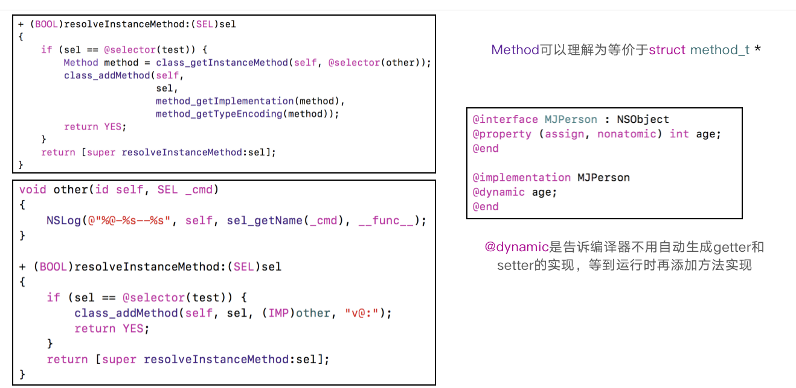

+ `@synthesize age = _age `为age属性生成一个_age的成员变量,并自动生成getter,setter方法

+ @dynamic的用法

  ```objc
  
  // 提醒编译器不要自动生成setter和getter的实现、不要自动生成成员变量
  @dynamic age;
  void setAge(id self, SEL _cmd, int age)
  {
      NSLog(@"age is %d", age);
  }
  
  int age(id self, SEL _cmd)
  {
      return 120;
  }
  
  + (BOOL)resolveInstanceMethod:(SEL)sel
  {
      if (sel == @selector(setAge:)) {
          class_addMethod(self, sel, (IMP)setAge, "v@:i");
          return YES;
      } else if (sel == @selector(age)) {
          class_addMethod(self, sel, (IMP)age, "i@:");
          return YES;
      }
      return [super resolveInstanceMethod:sel];
  }
  ```

  

### 生成NSMethodSignature

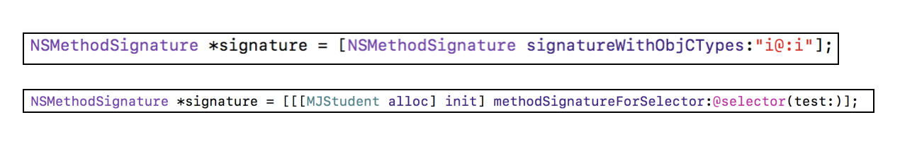

### super的本质

+ super调用方法的本质是，从对象的父类开始中搜索方法

#### 从编译的角度分析

1. 测试代码如下

   ```objc
   //MJPerson.h
   @interface MJPerson : NSObject
   - (void)run;
   @end
   
   //MJPerson.m
   @implementation MJPerson
   - (void)run
   {
       NSLog(@"%s", __func__);
   }
   @end
   
   @interface MJStudent : MJPerson
   
   @end
   
   @implementation MJStudent
   - (void)run
   {
       // super调用的receiver仍然是MJStudent对象
       [super run];
    //  struct objc_super arg = {self, [MJPerson class]};
   //   objc_msgSendSuper(arg, @selector(run));
   }
   @end
   ```

2. clang编译器编译

   ```shell
   $ xcrun  -sdk  iphoneos  clang  -arch  arm64  -rewrite-objc MJStudent.m -o MJStudent-arm64.cpp
   ```

   ```c++
   struct objc_super {
       __attribute__((objc_ownership(none))) _Nonnull id receiver;
       __attribute__((objc_ownership(none))) _Nonnull Class super_class;
   };
   
   static void _I_MJStudent_run(MJStudent * self, SEL _cmd) {
       //整理前
       //((void (*)(__rw_objc_super *, SEL))(void *)objc_msgSendSuper)((__rw_objc_super){(id)self, (id)class_getSuperclass(objc_getClass("MJStudent"))}, sel_registerName("run"));
        //整理后
        objc_super super = {self, class_getSuperclass(objc_getClass("MJStudent"))}
                         = {self，[MJPerson class]}
        objc_msgSendSuper(super, sel_registerName("run"));
   }
   ```

3. _objc_msgSendSuper

   ```objc
     ENTRY _objc_msgSendSuper
   	UNWIND _objc_msgSendSuper, NoFrame
   	MESSENGER_START
   
     //1. x0:real receiver  x16:class, class == receiver对应类的superclass
   	ldp	x0, x16, [x0]		
     //2. 此时从superclass中开始执行消息机制
   	CacheLookup NORMAL
   	END_ENTRY _objc_msgSendSuper
   ```

#### 从汇编的角度分析

1. 对于 student调用run方法,调试时汇编如下

   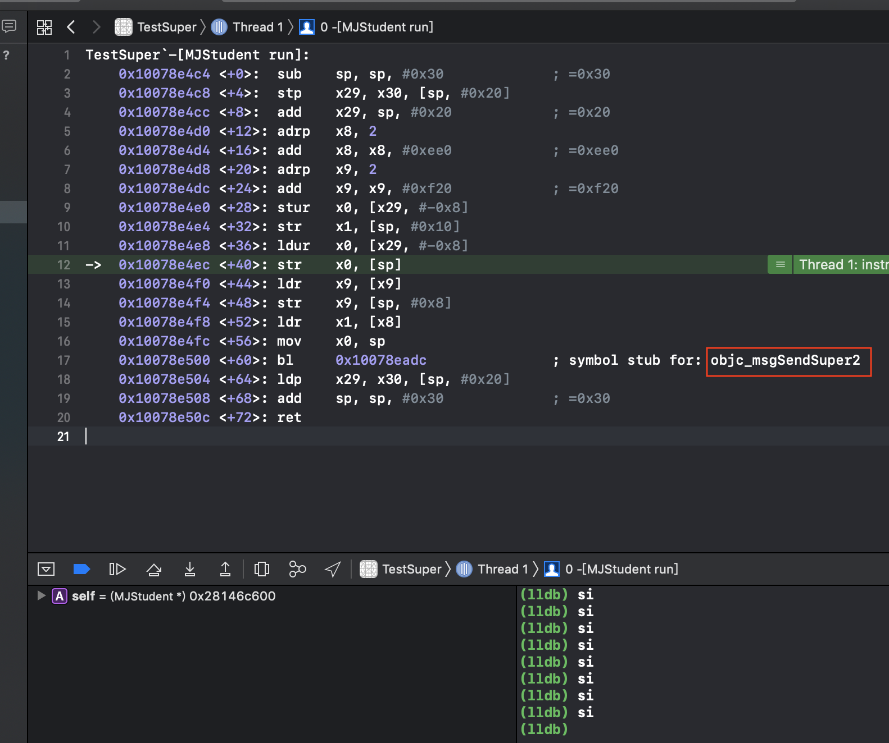

   - 可知，实际调用的objc_msgSendSuper2
   - 手动编译的代码仅供参考，与实际的情况可能会有细微的差异

2. objc_msgSendSuper2的arm64汇编代码如下

   ```objc
     ENTRY _objc_msgSendSuper2
   	UNWIND _objc_msgSendSuper2, NoFrame
   	MESSENGER_START
   
     //1. x0: real receiver, x16 = class
   	ldp	x0, x16, [x0]		
     //2. #SUPERCLASS为#0x8 
     //   x16指向的内存偏移8个字节后，取8个字节放在x16中
     //   此时x16中的值为superclass
   	ldr	x16, [x16, #SUPERCLASS]	
     //3. 此时从superclass中开始执行消息机制
   	CacheLookup NORMAL
   
   	END_ENTRY _objc_msgSendSuper2
   ```

### 消息转发的应用

+ 如果方法找不到，则打印出来上传，但是不crash

  ```objc
  @interface MJPerson : NSObject
  - (void)run;
  - (void)test;
  - (void)other;
  @end
  @implementation MJPerson
  
  - (void)run
  {
      NSLog(@"run-123");
  }
  
  - (NSMethodSignature *)methodSignatureForSelector:(SEL)aSelector
  {
      // 本来能调用的方法
      if ([self respondsToSelector:aSelector]) {
          return [super methodSignatureForSelector:aSelector];
      }
      
      // 找不到的方法
      return [NSMethodSignature signatureWithObjCTypes:"v@:"];
  }
  
  // 找不到的方法，都会来到这里
  - (void)forwardInvocation:(NSInvocation *)anInvocation
  {
      NSLog(@"找不到%@方法", NSStringFromSelector(anInvocation.selector));
  }
  @end
  ```


### LLVM的中间代码

+ Objective-C在变为机器代码之前，会被LLVM编译器转换为中间代码（Intermediate Representation）

+ 可以使用以下命令行指令生成中间代码

  - clang -emit-llvm -S main.m

+ 语法简介

  - @ - 全局变量
  - % - 局部变量
  - alloca - 在当前执行的函数的堆栈帧中分配内存，当该函数返回到其调用者时，将自动释放内存
  - i32 - 32位4字节的整数
  - align - 对齐
  - load - 读出，store 写入
  - icmp - 两个整数值比较，返回布尔值
  - br - 选择分支，根据条件来转向label，不根据条件跳转的话类似 goto
  - label - 代码标签
  - call - 调用函数

+ 具体可以参考官方文档：https://llvm.org/docs/LangRef.html

  

###runtime API-类

+ 动态创建一个类（参数：父类，类名，额外的内存空间）

  ```objc
  Class objc_allocateClassPair(Class superclass, const char *name, size_t extraBytes)
  ```

+ 注册一个类（要在类注册之前添加成员变量）

  ```objc
  void objc_registerClassPair(Class cls) 
  ```

+ 销毁一个类

  ```objc
  void objc_disposeClassPair(Class cls)
  ```

+ 获取isa指向的Class

  ```objc
  Class object_getClass(id obj)
  ```

+ 设置isa指向的Class

  ```objc
  Class object_setClass(id obj, Class cls)
  ```

+ 判断一个OC对象是否为Class

  ```objc
  BOOL object_isClass(id obj)
  ```

+ 判断一个Class是否为元类

  ```objc
  BOOL class_isMetaClass(Class cls)
  ```

+ 获取父类

  ```objc
  Class class_getSuperclass(Class cls)
  ```

### runtime API-成员变量  

+ 获取一个实例变量信息

  ```objc
  Ivar class_getInstanceVariable(Class cls, const char *name)
  ```

+ 拷贝实例变量列表（最后需要调用free释放）

  ```objc
  Ivar *class_copyIvarList(Class cls, unsigned int *outCount)
  ```

+ 设置和获取成员变量的值

  ```objc
  void object_setIvar(id obj, Ivar ivar, id value)
  ```

+ 动态添加成员变量（已经注册的类是不能动态添加成员变量的）

  ```objc
  BOOL class_addIvar(Class cls, const char * name, size_t size, uint8_t alignment, const char * types)
  ```

+ 获取成员变量的相关信息

  ```objc
  const char *ivar_getName(Ivar v)
  const char *ivar_getTypeEncoding(Ivar v)
  ```

### runtime API-属性

+ 获取一个属性

  ```objc
  objc_property_t class_getProperty(Class cls, const char *name)
  ```

+ 拷贝属性列表（最后需要调用free释放）

  ```objc
  objc_property_t *class_copyPropertyList(Class cls, unsigned int *outCount)
  ```

+ 动态添加属性

  ```objc
  BOOL class_addProperty(Class cls, const char *name, const objc_property_attribute_t *attributes,
                    unsigned int attributeCount)
  ```

+ 动态替换属性

  ```objc
  void class_replaceProperty(Class cls, const char *name, const objc_property_attribute_t *attributes,
                        unsigned int attributeCount)
  ```

+ 获取属性的一些信息

  ```objc
  const char *property_getName(objc_property_t property)
  const char *property_getAttributes(objc_property_t property)
  ```

### runtime API-方法    

+ 获得一个实例方法、类方法

  ```objc
  Method class_getInstanceMethod(Class cls, SEL name)
  Method class_getClassMethod(Class cls, SEL name)
  ```

+ 方法实现相关操作

  ```objc
  IMP class_getMethodImplementation(Class cls, SEL name) 
  IMP method_setImplementation(Method m, IMP imp)
  void method_exchangeImplementations(Method m1, Method m2) 
  ```

+ 拷贝方法列表（最后需要调用free释放）

  ```objc
  Method *class_copyMethodList(Class cls, unsigned int *outCount)
  ```

+ 动态添加方法

  ```objc
  BOOL class_addMethod(Class cls, SEL name, IMP imp, const char *types)
  ```

+ 动态替换方法

  ```objc
  IMP class_replaceMethod(Class cls, SEL name, IMP imp, const char *types)
  ```

+ 获取方法的相关信息（带有copy的需要调用free去释放）

  ```objc
  SEL method_getName(Method m)
  IMP method_getImplementation(Method m)
  const char *method_getTypeEncoding(Method m)
  unsigned int method_getNumberOfArguments(Method m)
  char *method_copyReturnType(Method m)
  char *method_copyArgumentType(Method m, unsigned int index)
  ```

+ 选择器相关

  ```objc
  const char *sel_getName(SEL sel)
  SEL sel_registerName(const char *str)
  ```

+ 用block作为方法实现

  ```objc
  IMP imp_implementationWithBlock(id block)
  id imp_getBlock(IMP anImp)
  BOOL imp_removeBlock(IMP anImp)
  ```

  

### Runtime API使用

#### 简单使用类的API

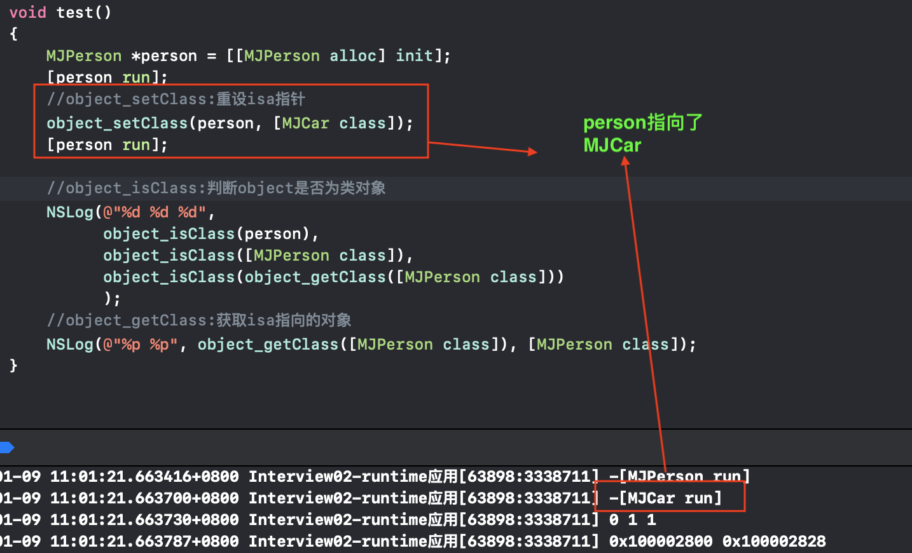

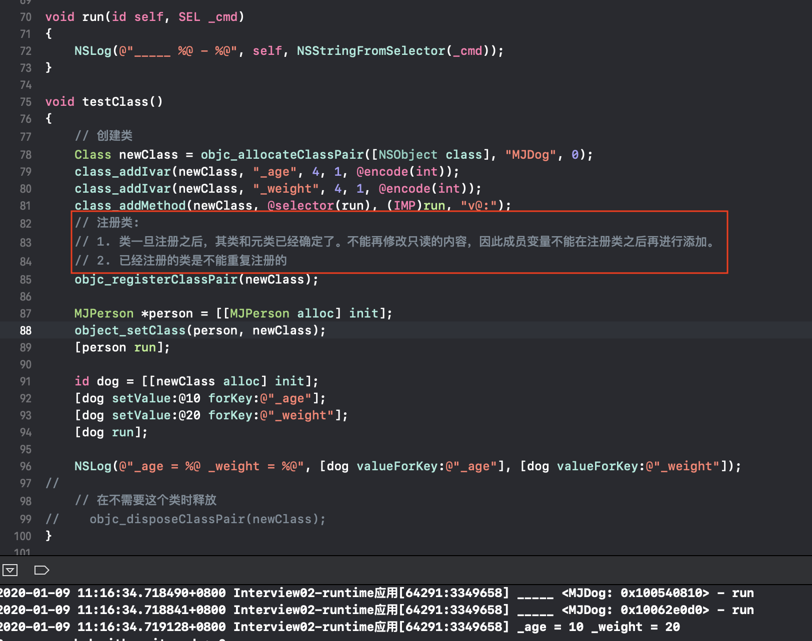

#### 简单使用成员变量的API

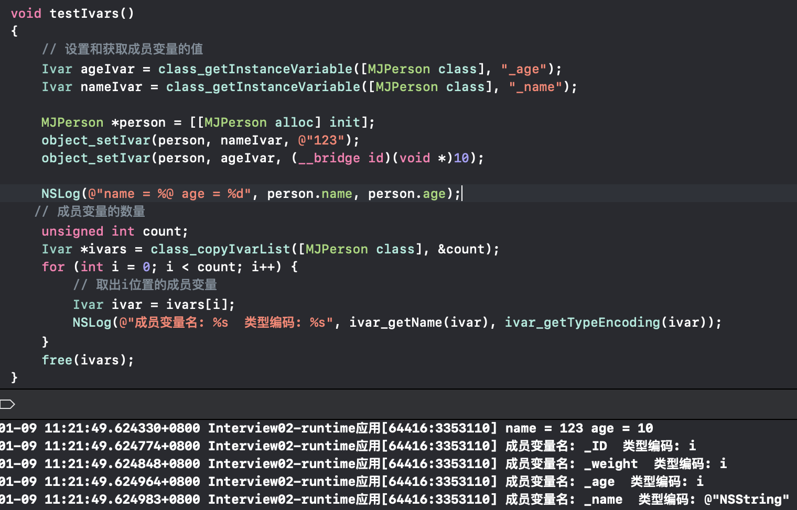

### runtime的应用

#### 查看私有成员变量

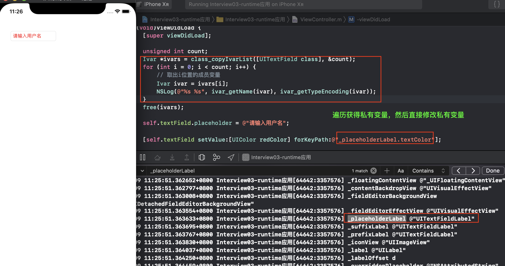

#### 字典转模型

```objc
@implementation NSObject (Json)
+ (instancetype)mj_objectWithJson:(NSDictionary *)json
{
    id obj = [[self alloc] init];
    unsigned int count;
    Ivar *ivars = class_copyIvarList(self, &count);
    for (int i = 0; i < count; i++) {
        // 取出i位置的成员变量
        Ivar ivar = ivars[i];
        NSMutableString *name = [NSMutableString stringWithUTF8String:ivar_getName(ivar)];
        [name deleteCharactersInRange:NSMakeRange(0, 1)];
        // 设值
        id value = json[name];
        if ([name isEqualToString:@"ID"]) {
            value = json[@"id"];
        }
        [obj setValue:value forKey:name];
    }
    free(ivars);
    return obj;
}

@end
```

#### 替换方法实现

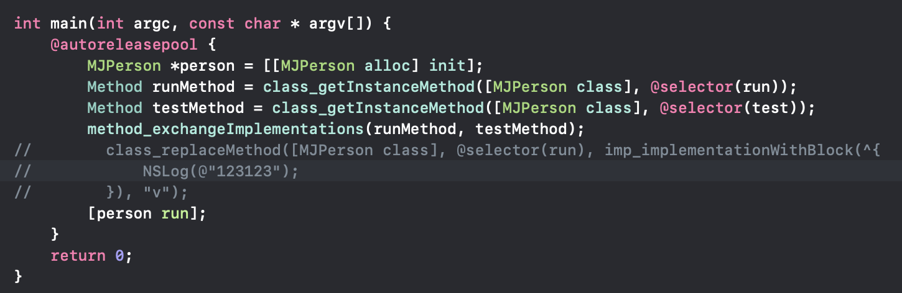

```objc
//hook点击操作，可记录所有点击行为
@implementation UIControl (Extension)

+ (void)load
{
    static dispatch_once_t onceToken;
    dispatch_once(&onceToken, ^{
        // hook：钩子函数
        Method method1 = class_getInstanceMethod(self, @selector(sendAction:to:forEvent:));
        Method method2 = class_getInstanceMethod(self, @selector(mj_sendAction:to:forEvent:));
        //交换实现之前，会清空方法缓存
        method_exchangeImplementations(method1, method2);
    });
}
- (void)mj_sendAction:(SEL)action to:(id)target forEvent:(UIEvent *)event
{
    NSLog(@"%@-%@-%@", self, target, NSStringFromSelector(action));
    
    // 调用系统原来的实现
    [self mj_sendAction:action to:target forEvent:event];
}

@end
```

```objc
@implementation NSMutableArray (Extension)
+ (void)load
{
    static dispatch_once_t onceToken;
    dispatch_once(&onceToken, ^{
        // 类簇：NSString、NSArray、NSDictionary，真实类型是其他类型
        Class cls = NSClassFromString(@"__NSArrayM");
        Method method1 = class_getInstanceMethod(cls, @selector(insertObject:atIndex:));
        Method method2 = class_getInstanceMethod(cls, @selector(mj_insertObject:atIndex:));
        method_exchangeImplementations(method1, method2);
    });
}
- (void)mj_insertObject:(id)anObject atIndex:(NSUInteger)index
{
    if (anObject == nil) return;
    [self mj_insertObject:anObject atIndex:index];
}

@end
```

```objc
@implementation NSMutableDictionary (Extension)

+ (void)load
{
    static dispatch_once_t onceToken;
    dispatch_once(&onceToken, ^{
        Class cls = NSClassFromString(@"__NSDictionaryM");
        Method method1 = class_getInstanceMethod(cls, @selector(setObject:forKeyedSubscript:));
        Method method2 = class_getInstanceMethod(cls, @selector(mj_setObject:forKeyedSubscript:));
        method_exchangeImplementations(method1, method2);

        Class cls2 = NSClassFromString(@"__NSDictionaryI");
        Method method3 = class_getInstanceMethod(cls2, @selector(objectForKeyedSubscript:));
        Method method4 = class_getInstanceMethod(cls2, @selector(mj_objectForKeyedSubscript:));
        method_exchangeImplementations(method3, method4);
    });
}

- (void)mj_setObject:(id)obj forKeyedSubscript:(id<NSCopying>)key
{
    if (!key) return;
    
    [self mj_setObject:obj forKeyedSubscript:key];
}

- (id)mj_objectForKeyedSubscript:(id)key
{
    if (!key) return nil;
    
    return [self mj_objectForKeyedSubscript:key];
}

@end
```


### 面试题

+ 讲一下 OC 的消息机制？

  - OC中的方法调用其实都是转成了objc_msgSend函数的调用，给receiver（方法调用者）发送了一条消息（selector方法名）
  - objc_msgSend底层有3大阶段
    - 消息发送（当前类、父类中查找）、动态方法解析、消息转发

+ 打印结果分别是什么？ 

  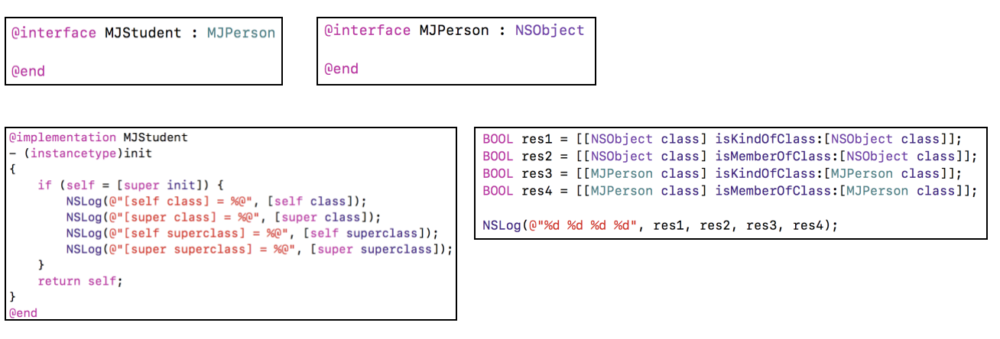

  ```objc
  打印结果为
  [self class] = MJStudent
  [super class] = MJStudent
  [self superclass] = MJPerson
  [super superclass] = MJPerson
  
  1. 实质上，调用方法的receiver都是self
  2. 通过消息发送机制，在NSObject中找到方法实现
  3. NSObject对应的方法实现如下
  
     @implementation NSObject
     - (Class)class
     {
        return object_getClass(self);
     }
     - (Class)superclass
     {
        return class_getSuperclass(object_getClass(self));
     }
     @end
  ```

  ```objc
  打印结果为
  res1:1
  res2:0
  res3:0
  res4:0
    
  @implementation NSObject
  //记住具体的实现
  - (BOOL)isMemberOfClass:(Class)cls {
      return [self class] == cls;
  }
  - (BOOL)isKindOfClass:(Class)cls {
      for (Class tcls = [self class]; tcls; tcls = tcls->superclass) {
          if (tcls == cls) return YES;
      }
      return NO;
  }
  + (BOOL)isMemberOfClass:(Class)cls {
      //1. object_getClass((id)self)为元类
      //2. cls为当前类的元类时，返回值才为YES。否则为NO
      return object_getClass((id)self) == cls;
  }
  + (BOOL)isKindOfClass:(Class)cls {
      //1. object_getClass((id)self)获取self的元类
      //2. 然后遍历获取superclass
      //3. 根据继承体系，元类的superclass指针指向NSObject类
      //4. 所以只要是继承于NSObject的类，返回值都为YES
      for (Class tcls = object_getClass((id)self); tcls; tcls = tcls->superclass) {
          if (tcls == cls) return YES;
      }
      return NO;
  }
  @end
    
  1. 对于[[NSObject class] isKindOfClass:[NSObject class]]?
      //1. object_getClass((id)self)获取NSObject的元类
      //2. 然后遍历获取superclass
      //3. 根据继承体系，元类的superclass指针指向NSObject类
      //4. 所以只要是继承于NSObject的类，返回值都为YES
  2. 对于[[NSObject class] isMemberOfClass:[NSObject class]]?
      //1. object_getClass((id)self)为NSObject的元类
      //2. cls为NSObject的元类时，返回值才为YES。否则为NO
  3. 对于[[MJPerson class] isKindOfClass:[MJPerson class]])?  
      //1. object_getClass((id)self)获取MJPerson的元类
      //2. [MJPerson class]不等于获取MJPerson的元类
      //3. 根据superclass指针遍历后，NSObject != MJPerson,返回值为false
  4. 对于[[MJPerson class] isMemberOfClass:[MJPerson class]]?
      //1. object_getClass((id)self)获取MJPerson的元类
      //2. [MJPerson class]不等于获取MJPerson的元类,直接返回false
  ```

+ 以下代码能不能执行成功？如果可以，打印结果是什么？

  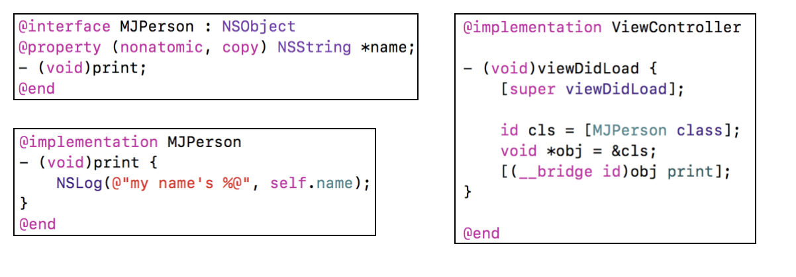

  ```
  打印结果为:
  my name is <ViewController: 0x157e09780>
  
   1.print为什么能够调用成功？
   2.为什么self.name变成了ViewController?
  ```

  + 假如是一个正常的person对象调用print方法

    ```objc
    MJPerson *person =  [[MJPerson alloc] init];
    [person print];
    ```

    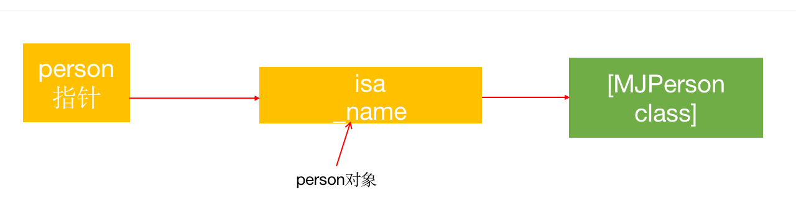

    ```
    1. person内指针存储person对象的地址
    2. 取peson实例对象的前8个字节作为isa去得到MJPerson类的地址，进行方法调用
    ```

    ```objc
    id cls =  [MJPerson class];
    void *objc = &cls;
    [(__bridge id)objc print];
    ```

    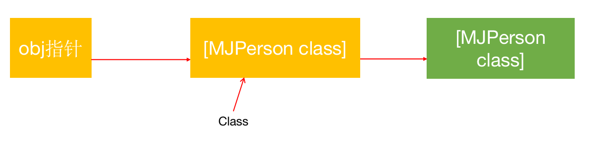

    ```
    1. objc指针存放 Class的地址
    2. cls中存放就是[MJPerson class]的地址
    3. 取cls的前8个字节当做isa，去获取MJPerson类的地址, isa = 类地址, (isa & ISA_MASK) = 类地址
    4. 所以能够找到print方法进行调用
    ```

    ```objc
    [super viewDidLoad]这句代码会转化为下面的形式
    struct abc = {
         self,
         [ViewController class]
    };
    objc_msgSendSuper2(abc, sel_registerName("viewDidLoad"));
    
    因此，栈内存结构为
    ```

    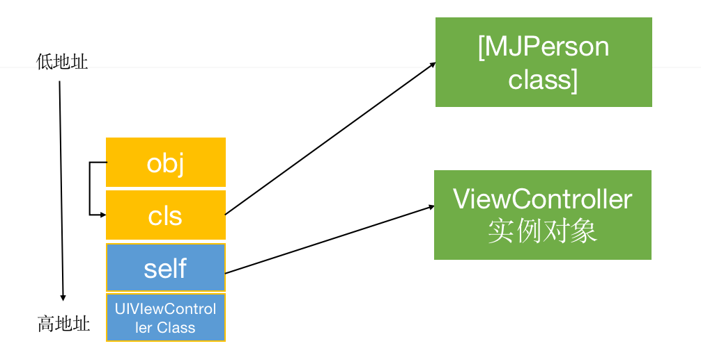

    ```objc
    @implementation MJPerson
    - (void)print
    {
        NSLog(@"my name is %@", self.name);
    }
    @end
    _name的获取就是从第9个字节开始，取8个字节作为name指针的值，因此取得值正好是self指针，因此打印出<ViewController: 0x157e09780>
    ```

    


