## isa和superclass

### isa的作用

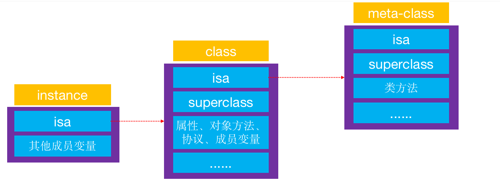

+ instance的isa指向class
  - 当调用对象方法时，通过instance的isa找到class，最后找到对象方法的实现进行调用
+ class的isa指向meta-class
  - 当调用类方法时，通过class的isa找到meta-class，最后找到类方法的实现进行调用

### class的superclass指针

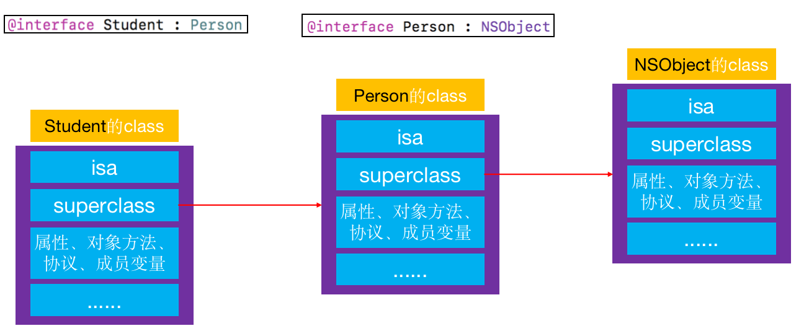

+ 当Student的instance对象要调用Person的对象方法时，会先通过isa找到Student的class，然后通过superclass找到Person的class，最后找到对象方法的实现进行调用

### meta-class的superclass指针

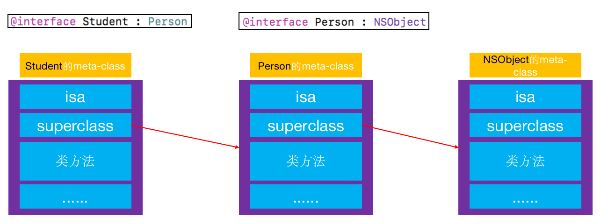

+ 当Student的class要调用Person的类方法时，会先通过isa找到Student的meta-class，然后通过superclass找到Person的meta-class，最后找到类方法的实现进行调用


###  isa和superclass小结

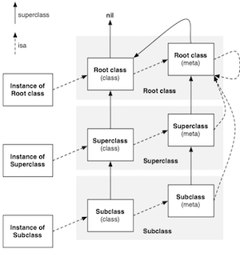

+ instance的isa指向class

+ class的isa指向meta-class

+ meta-class的isa指向基类的meta-class

+ class的superclass指向父类的class

  - 如果没有父类，superclass指针为nil

+ meta-class的superclass指向父类的meta-class

  - 基类的meta-class的superclass指向基类的class

  - 因此如果一个类对象调用方法，但是没有实现该方法时，最终会找到NSObject对象的实例方法

    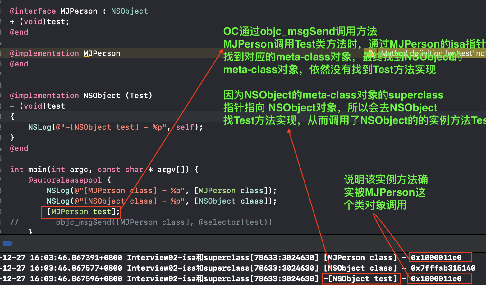

+ instance调用对象方法的轨迹

  - isa找到class，方法不存在，就通过superclass找父类

+ class调用类方法的轨迹

  - isa找meta-class，方法不存在，就通过superclass找父类

### unrecognized selector

+ 找不到方法时的crash信息

  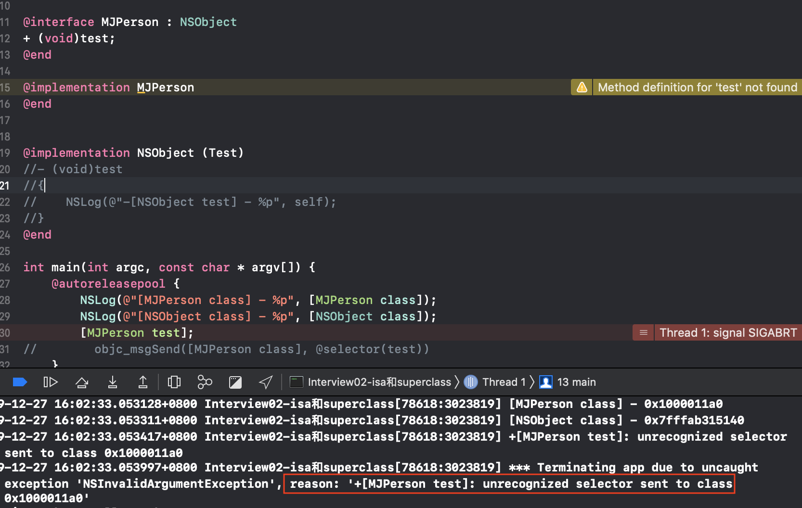

  


### isa细节

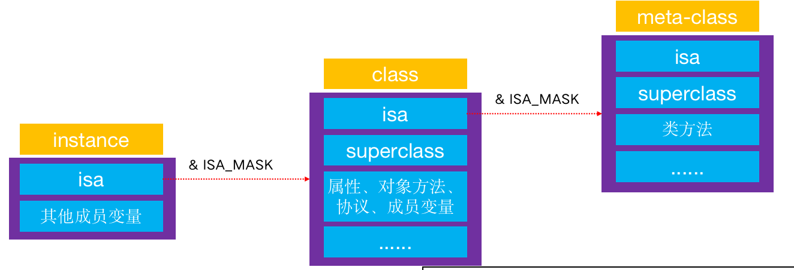


+ 从64bit开始，isa需要进行一次位运算，才能计算出真实地址

  ```shell
  # if __arm64__
  #   define ISA_MASK        0x0000000ffffffff8ULL
  # elif __x86_64__
  #   define ISA             0x00007ffffffffff8ULL
  # endif
  ```

+ 在x86_64环境下

  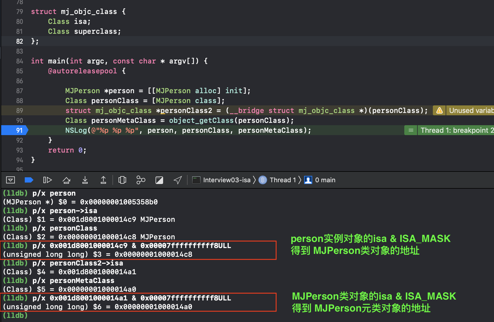

### class和meta-class的结构

- class和meta-class是同一个结构

+ class的结构

  ```objective-c
  //Class的指向结构体objc_class的指针
  typedef struct objc_class *Class;
  
  //objc_object是指向对象的指针
  struct objc_object {
      Class _Nonnull isa  OBJC_ISA_AVAILABILITY;
  };
  
  ```

+ objc_class底层结构: objc-> objc_runtime_new.h

  ```objective-c
  struct objc_object {
  private:
      isa_t isa; //isa
  public:
  
      // ISA() assumes this is NOT a tagged pointer object
      Class ISA();
      // getIsa() allows this to be a tagged pointer object
      Class getIsa();
      ....
      ....
  };
  
  struct objc_class : objc_object {
      // Class ISA;
      Class superclass; 
      cache_t cache;             // 方法缓存
      class_data_bits_t bits;    // 用于获取具体的类信息
  
      class_rw_t *data() { 
          return bits.data();
      }
      void setData(class_rw_t *newData) {
          bits.setData(newData);
      }     
      ....
      ....
  };
  
  struct class_data_bits_t {
      uintptr_t bits;
      class_rw_t* data() {
          return (class_rw_t *)(bits & FAST_DATA_MASK);
      }
      void setData(class_rw_t *newData)
      {
          assert(!data()  ||  (newData->flags & (RW_REALIZING | RW_FUTURE)));
          uintptr_t newBits = (bits & ~FAST_DATA_MASK) | (uintptr_t)newData;
          atomic_thread_fence(memory_order_release);
          bits = newBits;
      }
      .....
  }
  struct class_rw_t {
      uint32_t flags;
      uint32_t version;
    
      const class_ro_t *ro; //只读的信息
    
      method_array_t methods; //方法列表
      property_array_t properties; //属性列表
      protocol_array_t protocols; //协议列表
  
      Class firstSubclass; //第一个子类
      Class nextSiblingClass; //下一个兄弟类
    
      char *demangledName;
      ....
      ....
  };
  
  struct class_ro_t {
      uint32_t flags;
      uint32_t instanceStart;
      uint32_t instanceSize;
  #ifdef __LP64__
      uint32_t reserved;
  #endif
      const uint8_t * ivarLayout;
      
      const char * name; //类名
      method_list_t * baseMethodList; //基本的方法列表
      protocol_list_t * baseProtocols; //基本的协议列表
      const ivar_list_t * ivars; //成员变量
  
      const uint8_t * weakIvarLayout;
      property_list_t *baseProperties; //基本的属性列表
  
      method_list_t *baseMethods() const { 
          return baseMethodList;
      }
  };
  ```

+ objc_class结构关系图

  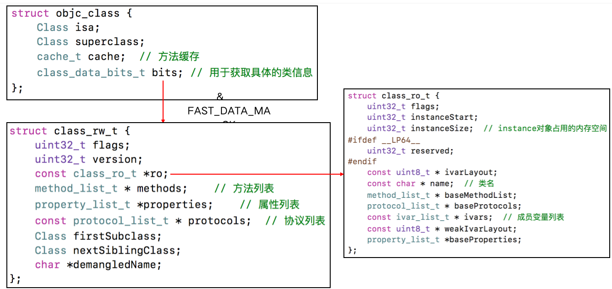

  - 方法列表，属性列表，协议列表都是可变的。例如在category中声明的属性，方法和协议都会在runtime进行初始化的时候合并到methods，properties, protocols中去
  - 成员变量列表是不可变的，在category中不能声明成员变量。


### 工具类MJClassInfo

- 用来查看类的结构

  ```objc
  #import <Foundation/Foundation.h>
  
  #ifndef MJClassInfo_h
  #define MJClassInfo_h
  
  # if __arm64__
  #   define ISA_MASK        0x0000000ffffffff8ULL
  # elif __x86_64__
  #   define ISA_MASK        0x00007ffffffffff8ULL
  # endif
  
  #if __LP64__
  typedef uint32_t mask_t;
  #else
  typedef uint16_t mask_t;
  #endif
  typedef uintptr_t cache_key_t;
  
  struct bucket_t {
      cache_key_t _key;
      IMP _imp;
  };
  
  struct cache_t {
      bucket_t *_buckets;
      mask_t _mask;
      mask_t _occupied;
  };
  
  struct entsize_list_tt {
      uint32_t entsizeAndFlags;
      uint32_t count;
  };
  
  struct method_t {
      SEL name;
      const char *types;
      IMP imp;
  };
  
  struct method_list_t : entsize_list_tt {
      method_t first;
  };
  
  struct ivar_t {
      int32_t *offset;
      const char *name;
      const char *type;
      uint32_t alignment_raw;
      uint32_t size;
  };
  
  struct ivar_list_t : entsize_list_tt {
      ivar_t first;
  };
  
  struct property_t {
      const char *name;
      const char *attributes;
  };
  
  struct property_list_t : entsize_list_tt {
      property_t first;
  };
  
  struct chained_property_list {
      chained_property_list *next;
      uint32_t count;
      property_t list[0];
  };
  
  typedef uintptr_t protocol_ref_t;
  struct protocol_list_t {
      uintptr_t count;
      protocol_ref_t list[0];
  };
  
  struct class_ro_t {
      uint32_t flags;
      uint32_t instanceStart;
      uint32_t instanceSize;  // instance对象占用的内存空间
  #ifdef __LP64__
      uint32_t reserved;
  #endif
      const uint8_t * ivarLayout;
      const char * name;  // 类名
      method_list_t * baseMethodList;
      protocol_list_t * baseProtocols;
      const ivar_list_t * ivars;  // 成员变量列表
      const uint8_t * weakIvarLayout;
      property_list_t *baseProperties;
  };
  
  struct class_rw_t {
      uint32_t flags;
      uint32_t version;
      const class_ro_t *ro;
      method_list_t * methods;    // 方法列表
      property_list_t *properties;    // 属性列表
      const protocol_list_t * protocols;  // 协议列表
      Class firstSubclass;
      Class nextSiblingClass;
      char *demangledName;
  };
  
  #define FAST_DATA_MASK          0x00007ffffffffff8UL
  struct class_data_bits_t {
      uintptr_t bits;
  public:
      class_rw_t* data() {
          return (class_rw_t *)(bits & FAST_DATA_MASK);
      }
  };
  
  /* OC对象 */
  struct mj_objc_object {
      void *isa;
  };
  
  /* 类对象 */
  struct mj_objc_class : mj_objc_object {
      Class superclass;
      cache_t cache;
      class_data_bits_t bits;
  public:
      class_rw_t* data() {
          return bits.data();
      }
      
      mj_objc_class* metaClass() {
          return (mj_objc_class *)((long long)isa & ISA_MASK);
      }
  };
  
  #endif /* MJClassInfo_h */
  ```

  

+ 测试MJClassInfo

  1. 创建MJPerson类

     ```objective-c
     // MJPerson
     @interface MJPerson : NSObject <NSCopying>
     { @public
          int _age;
     }
     @property (nonatomic, assign) int no;
     - (void)personInstanceMethod;
     + (void)personClassMethod;
     @end
       
     @implementation MJPerson
     - (void)test{}
     - (void)personInstanceMethod{}
     + (void)personClassMethod{}
     - (id)copyWithZone:(NSZone *)zone{return nil;}
     @end
     ```

  2. 使用MJClassInfo探究其结构

     ```
     int main(int argc, const char * argv[]) {
         @autoreleasepool {
             mj_objc_class *personClass = (__bridge mj_objc_class *)([MJPerson class]);
             class_rw_t *personClassData = personClass->data();
             class_rw_t *personMetaClassData = personClass->metaClass()->data();
         }
         return 0;
     }
     ```

  3. 结构信息为

     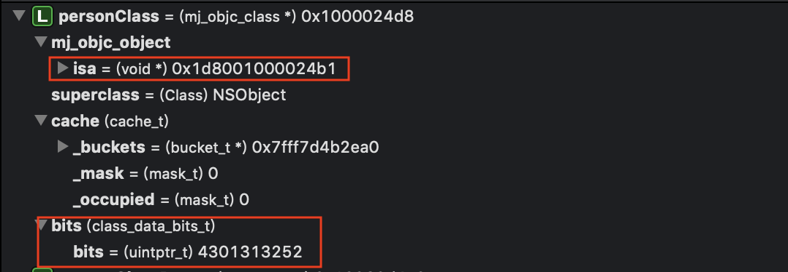

     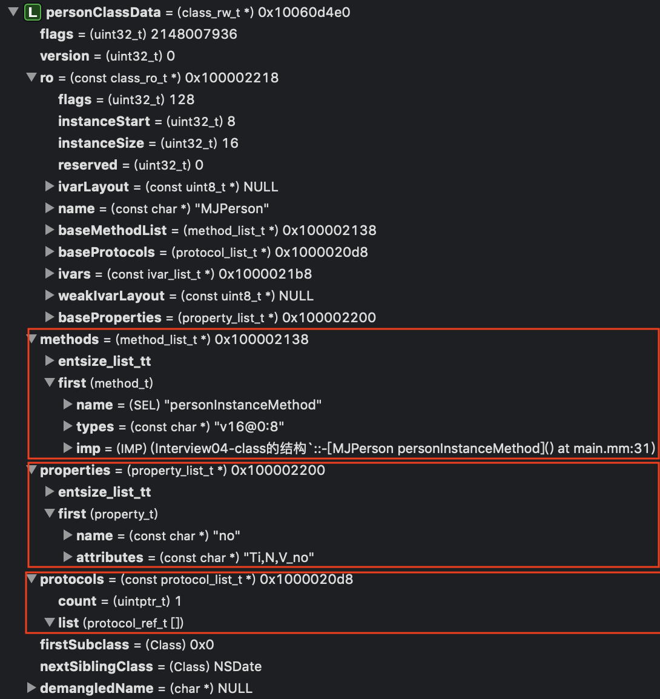

     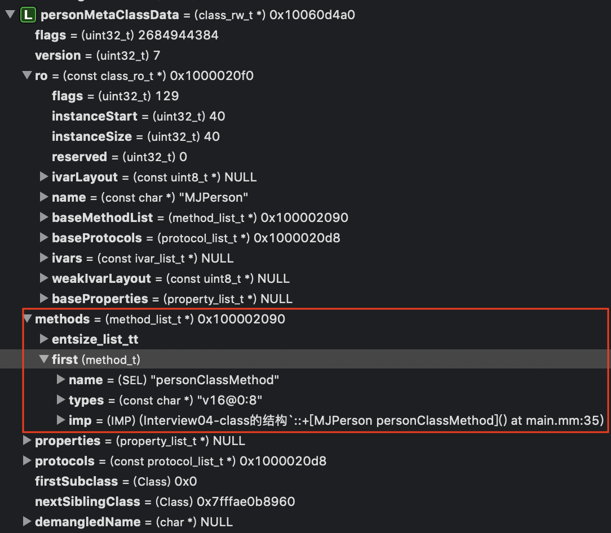

     + 实例方法信息放在class结构体的methods中
     + 类方法信息放在meta_class的methods中

### 面试题

+ 对象的isa指针指向哪里？
  - instance对象的isa指向class对象
  - class对象的isa指向meta-class对象
  - meta-class对象的isa指向基类的meta-class对象
+ OC的类信息存放在哪里？
  - 对象方法、属性、成员变量、协议信息，存放在class对象中
  - 类方法，存放在meta-class对象中
  - 成员变量的具体值，存放在instance对象


