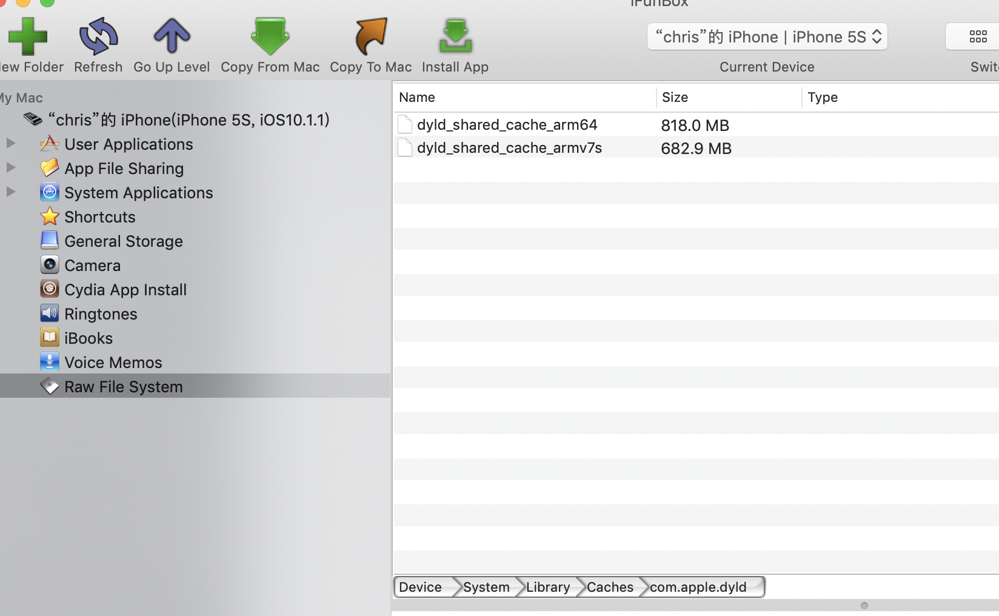
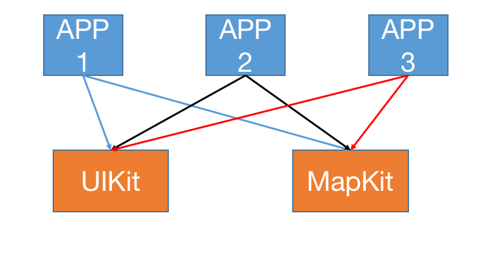
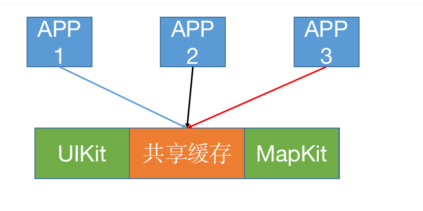
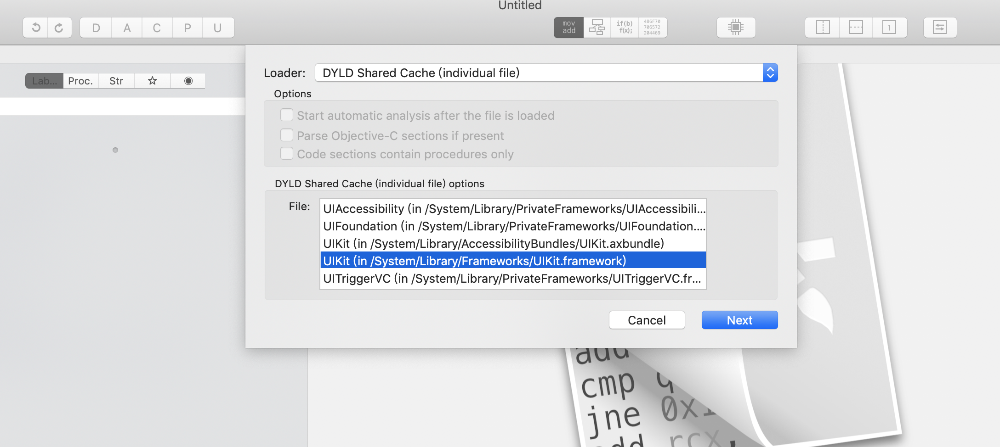
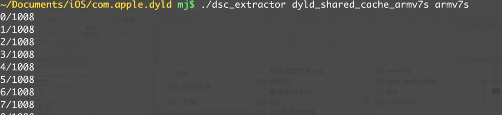

## 动态库共享缓存

### 查找系统动态库的位置

1. 在xcode中查找 `/Applications/Xcode.app/Contents/Developer/Platforms/iPhoneOS.platform/Developer/SDKs/iPhoneOS.sdk/System/Library/Frameworks/UIKit.framework/UIKit.tbd`

   ```
   其内容如下：
   
   archs:           [ armv7, armv7s, arm64, arm64e ]
   uuids:           [ 'armv7: BEBC4565-E9B4-393F-9F26-8F54D55F29D1', 'armv7s: D3F9ABEB-27BE-3945-8B7F-EF960AC09684', 
                      'arm64: F923805F-AFAF-38D2-9E3F-6E22D60F99E3', 'arm64e: 9C375613-BAAB-35BD-B6FD-56B823CB0895' ]
   platform:        ios
   install-name:    /System/Library/Frameworks/UIKit.framework/UIKit
   current-version: 61000
   objc-constraint: none
   exports:         
     - archs:           [ armv7, armv7s ]
       re-exports:      [ /System/Library/PrivateFrameworks/UIFoundation.framework/UIFoundation ]
       symbols:         [ _CGAffineTransformFromString, _CGPointFromString, _CGRectFromString, 
                          _CGSizeFromString, _CGVectorFromString, _NSLayoutConstraintFailedToFindDefaultResolvedValueForSymbolicConstant, 
                          _NSStringFromCGAffineTransform, _NSStringFromCGPoint, _NSStringFromCGRect
   ....
   ....
   ```

   + 在xcode中的所谓的动态库仅仅只是对手机中真正的动态库的的描述
   + 从`install-name`我们可知, 其描述了真正的动态库的位置

2. 在手机中`/System/Library/Frameworks/UIKit.framework/UIKit`去查找`UIKit`,发现也只是一堆资源文件，并没有`UIKit`

   

3. 其实iOS将系统的动态库整体打包压缩成一个文件，从而减少其在系统中的体积。其压缩文件的位置在`/System/Library/Caches/com.apple.dyld/`

   

   

### 动态库共享缓存（dyld shared cache）

+ 从iOS3.1开始，为了提高性能，绝大部分的系统动态库文件都打包存放到了一个缓存文件中（dyld shared cache）

  + 缓存文件路径：/System/Library/Caches/com.apple.dyld/dyld_shared_cache_armX

+ dyld_shared_cache_armX的X代表ARM处理器指令集架构

  ```
  v6
  iPhone、iPhone3G
  iPod Touch、iPod Touch2
  
  v7
  iPhone3GS、iPhone4、iPhone4S
  iPad、iPad2、iPad3(The New iPad)
  iPad mini
  iPod Touch3G、iPod Touch4、iPod Touch5
  
  v7s
  iPhone5、iPhone5C
  iPad4
  
  arm64
  iPhone5S、iPhone6、iPhone6 Plus、iPhone6S、iPhone6S Plus
  iPhoneSE、iPhone7、iPhone7 Plus、iPhone8、iPhone8 Plus、iPhoneX
  iPad5、iPad Air、iPad Air2、iPad Pro、iPad Pro2
  iPad mini with Retina display、iPad mini3、iPad mini4
  iPod Touch6
  ```

+ 所有指令集原则上都是向下兼容的

+ 动态库共享缓存一个非常明显的好处是节省内存

  + 通常来讲，系统通过多个app共用同一个动态库，动态库按需加载等等来实现节省内存

  

  + iOS系统将所有的动态库压缩到一个动态库共享文件中，这样减少了动态库之间相同的一些内容，更加节省了内存

    

+ 现在的ida、Hopper反编译工具都可以识别动态库共享缓存

  

  

### 动态库的加载

+ 在Mac\iOS中，是使用了/usr/lib/dyld程序来加载动态库

+ dyld源码:  https://opensource.apple.com/tarballs/dyld/

  + dynamic link editor，动态链接编辑器
  + dynamic loader，动态加载器

+ 查看源码

  + 在dyld.cpp中,  load-> loadPhase0-> loadPhase1-> loadPhase2 -> loadPhase4

  + loadPhase4中有一段代码如下,表明其是从共享缓存中加载的动态库

    ```c++
    if ( image != NULL ) {
    			// if original path is in the dyld cache, then mark this one found as an override
    			dyld3::SharedCacheFindDylibResults shareCacheResults;
    			if ( dyld3::findInSharedCacheImage(sSharedCacheLoadInfo, path, &shareCacheResults) && (shareCacheResults.image != nullptr) )
    				image->setOverridesCachedDylib(shareCacheResults.image->imageNum());
    		}
    ```

### 从动态库共享缓存抽取动态库

+ 可以使用dyld源码中的launch-cache/dsc_extractor.cpp

  + 将#if 0前面的代码删除（包括#if 0），把最后面的#endif也删掉

    ```c++
    dsc_extractor.cpp内容
      
    // test program
    #include <stdio.h>
    #include <stddef.h>
    #include <dlfcn.h>
    
    
    typedef int (*extractor_proc)(const char* shared_cache_file_path, const char* extraction_root_path,
                                  void (^progress)(unsigned current, unsigned total));
    
    int main(int argc, const char* argv[])
    {
        if ( argc != 3 ) {
            fprintf(stderr, "usage: dsc_extractor <path-to-cache-file> <path-to-device-dir>\n");
            return 1;
        }
    
        //void* handle = dlopen("/Volumes/my/src/dyld/build/Debug/dsc_extractor.bundle", RTLD_LAZY);
        void* handle = dlopen("/Applications/Xcode.app/Contents/Developer/Platforms/iPhoneOS.platform/usr/lib/dsc_extractor.bundle", RTLD_LAZY);
        if ( handle == NULL ) {
            fprintf(stderr, "dsc_extractor.bundle could not be loaded\n");
            return 1;
        }
    
        extractor_proc proc = (extractor_proc)dlsym(handle, "dyld_shared_cache_extract_dylibs_progress");
        if ( proc == NULL ) {
            fprintf(stderr, "dsc_extractor.bundle did not have dyld_shared_cache_extract_dylibs_progress symbol\n");
            return 1;
        }
    
        int result = (*proc)(argv[1], argv[2], ^(unsigned c, unsigned total) { printf("%d/%d\n", c, total); } );
        fprintf(stderr, "dyld_shared_cache_extract_dylibs_progress() => %d\n", result);
        return 0;
    }
    
    ```

  + 编译dsc_extractor.cpp

    ```shell
    $ clang++ -o dsc_extractor dsc_extractor.cpp
    ```

  + 使用dsc_extractor

    ```
    ./dsc_extractor  动态库共享缓存文件的路径   用于存放抽取结果的文件夹
    ```

    
