## 命令行工具开发

### MJAppTools

#### 安装&使用

+ 地址: https://github.com/CoderMJLee/MJAppTools

+ 下载后，release编译，然后在release文件夹中找到MJAppTools

+ 将MJAppTools拖到手机的/usr/bin目录

+ mac终端连接到手机，然后执行下面的命令

  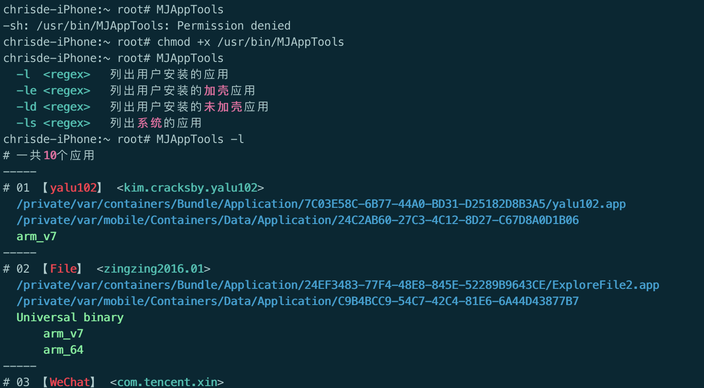

  - MJAppTools支持正则表达式搜索，列出了应用的路径，架构信息，以及是否加壳

+ 由上图可知，MJAppTools列出了应用的一些信息

  

### 简单命令行工具开发

1. 创建一个oc工程，删除各种资源文件，只保留main.m

   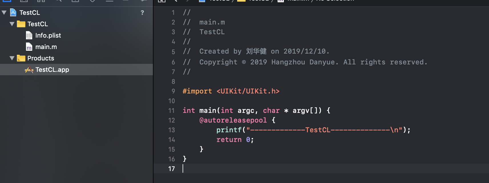

   - argc: 参数的个数

   - argv: 存放参数的数组

   - argv[0]:当前可执行文件的路径

   - xcode中调试时传递参数

     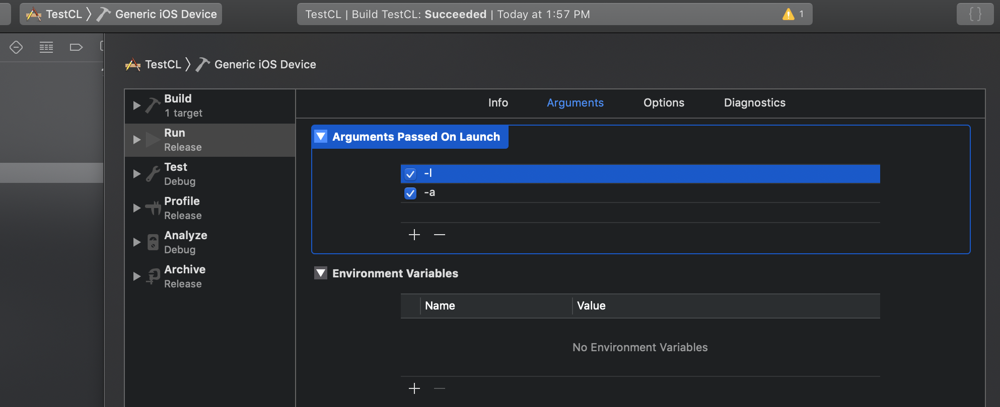

2. 真机编译后，将TestCL放到手机的`/usr/bin`目录

   

   - 因为签名的描述性文件是有**有效期的**，所以该工具在一定的期限后会失效

3. 修改main.m去读取某个应用的架构信息

   ```objective-c
   int main(int argc, char * argv[]) {
       @autoreleasepool {
           printf("-------------TestCL--------------\n");
           NSString *path = @" /private/var/containers/Bundle/Application/334EF5DF-016B-4050-BF52-0734D076BD0E/WeChat.app/WeChat";
           NSFileHandle *handle = [NSFileHandle fileHandleForReadingAtPath:path];
           
           printf("handle %@\n", handle);
   
           int length = sizeof(uint32_t);
           //读取最前面的4个字节(magic number 用来标识文件类型)
           NSData *magicData =  [handle readDataOfLength:length];
           //magic
           uint32_t magicNumber;
           [magicData getBytes:&magicNumber length:length];
           
           if (magicNumber == FAT_MAGIC || magicNumber == FAT_CIGAM) {
               printf("fat文件\n");
           } else if (magicNumber == MH_MAGIC || magicNumber == MH_CIGAM) {
               printf("非64位架构文件\n");
           } else if (magicNumber == MH_MAGIC_64 || magicNumber == MH_CIGAM_64) {
               printf("64位架构文件\n");
           } else {
               printf("读取文件失败\n");
           }
           printf("magicNumber = 0x%x\n",magicNumber);
   
           [handle closeFile];
           return 0;
       }
   
   ```

   - 编译后将TestCL安装到手机上，执行TestCL。
   - 有可能会读取执行失败。之所以读取失败，因为权限不够。

4. 利用ldid修复权限问题

   - 安装:`brew install ldid`

   - 查看TestCL的权限

     

     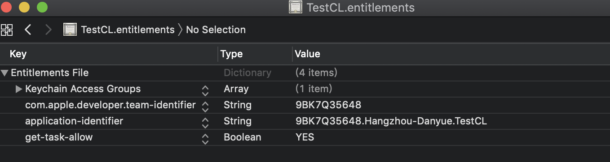

   - SpringBoard权限足够大，查看SpringBoard权限

     

     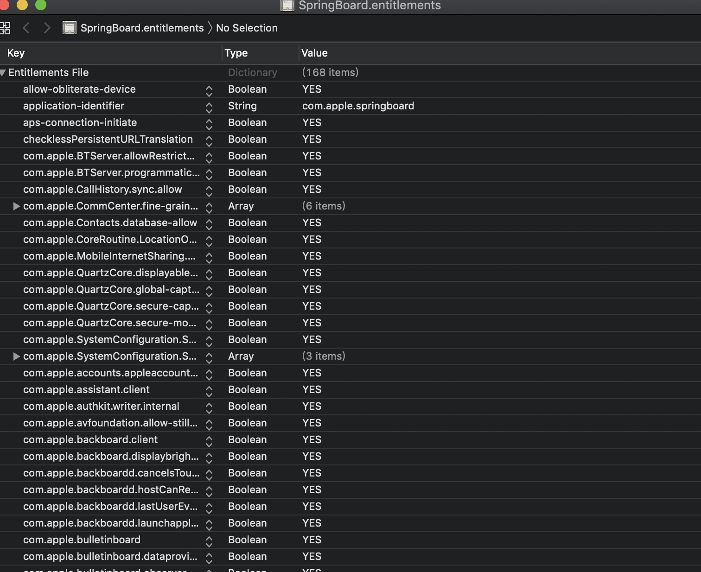

   - 将SpringBoard的权限导入到TestCL中

     ```shell
     $ ldid -SSpringBoard.entitlements TestCL
     
     ###再次查看TestCL权限
     $ ldid -e TestCL > TestCL.entitlements
     ```

     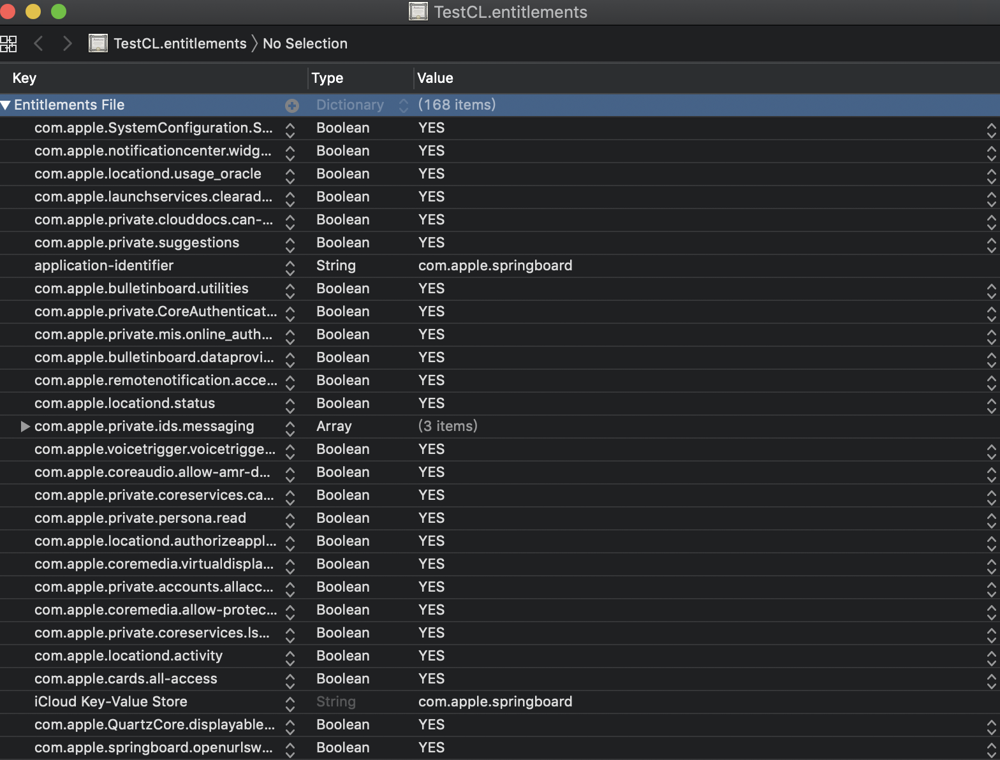

5. 将新的TestCL导入到手机/usr/bin，继续执行,发现正常执行

   

   

### MJAppTools核心原理

1. 利用iOS系统的一些头文件，获取手机中所有应用程序基本信息

   

2. 读取可执行文件，并解析

   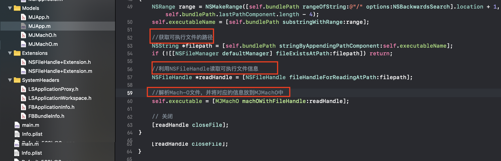

3. 解析Mach-O文件的具体过程

   - 根据magic来区分是fat，还是单架构的mach-o

     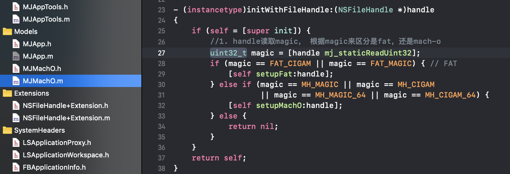

   - 处理fat 

     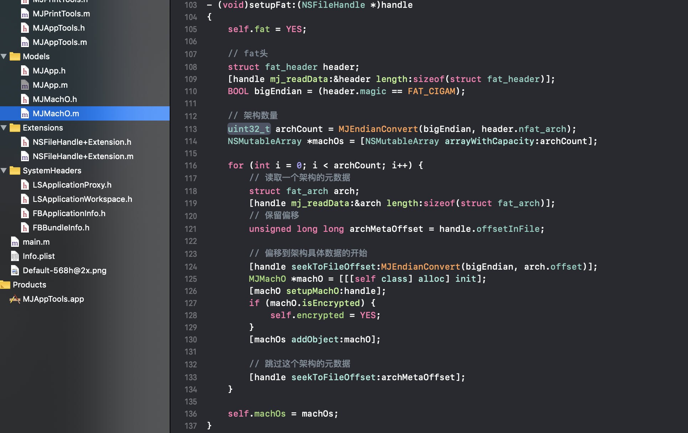

     - 先处理fat_header
     - fat_header后面跟着多个fat_arch

   - 处理mach-o

     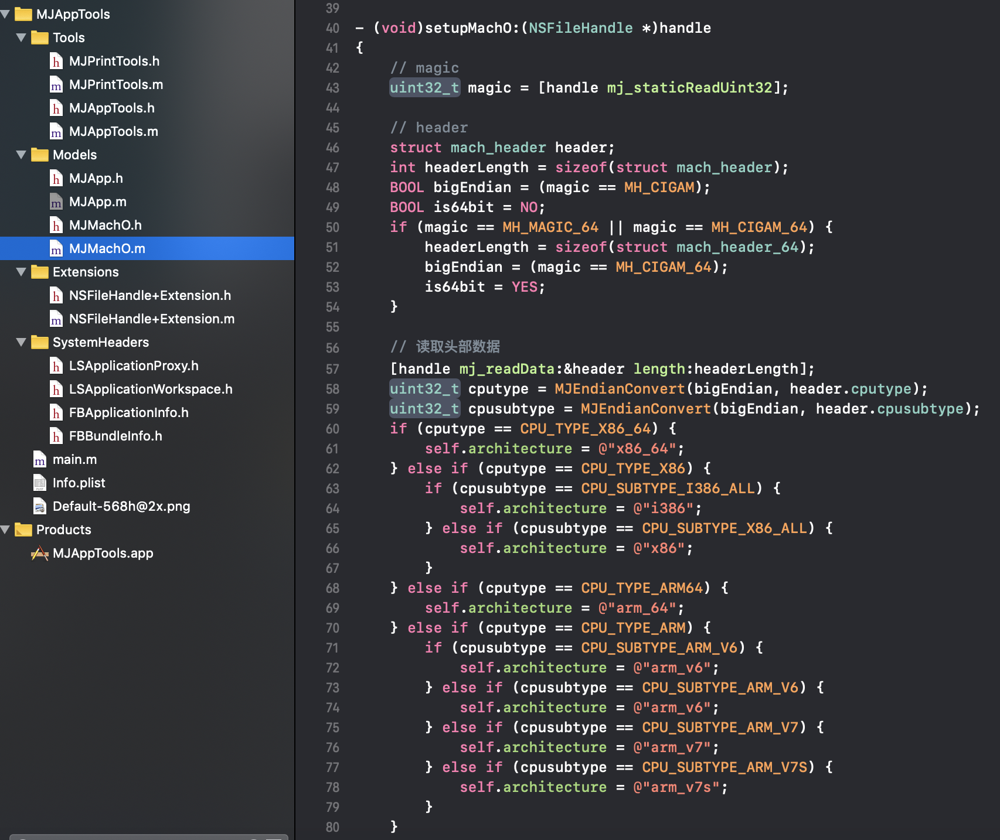

     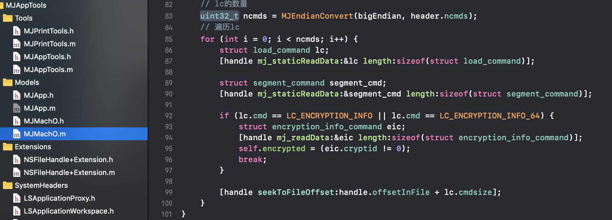

     - 先处理mach_header或mach_header_64
     - 然后处理load commands,遍历load commands找到加密段，查看是否加密

   4. Makefile文件

      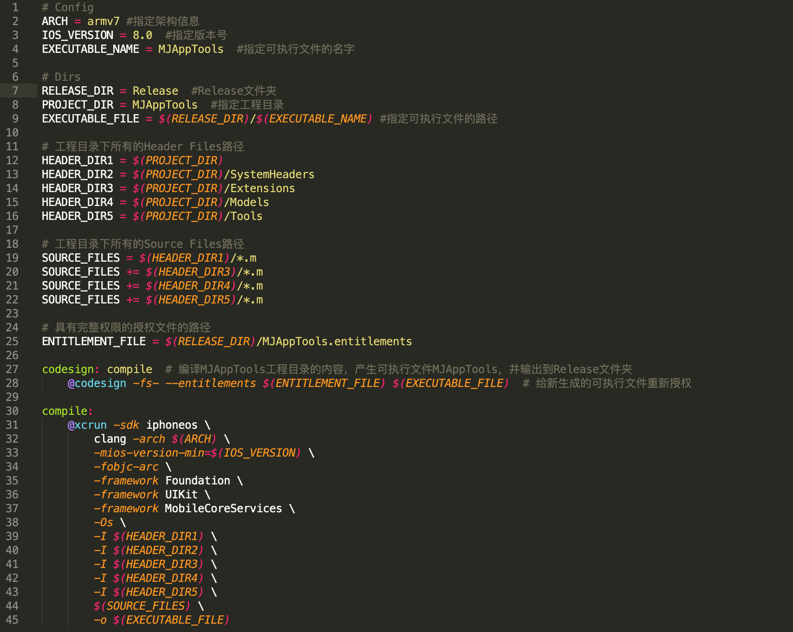

      

   5. xcode编译时，执行make操作。所以在Release文件夹生成的MJAppTools的权限是没有问题的

      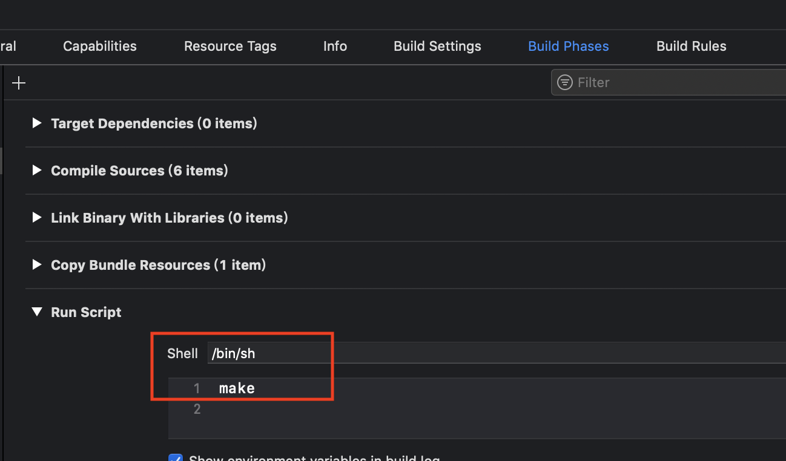

      

   

