## Theos

> 参考越狱常见问题，解决插件安装到根目录的问题

### 安装签名工具ldid

- 先确保安装了brew

  ```shell
   $ /usr/bin/ruby -e "$(curl -fsSL
  https://raw.githubusercontent.com/Homebrew/install/master/install)"
  ```

- 利用brew安装ldid

  ```shell
  $ brew install ldid
  ```

- theos是利用ldid进行签名的

### 修改环境变量

- 􏰕􏰖􏰍􏰗􏰘􏰙􏰚􏰛􏰜 编辑用户端的配置文件􏰕􏰖􏰍􏰗􏰘􏰙􏰚􏰛􏰜 

  ```shell
  $ vim ~/.bash_profile
  ```

- 在.bash_profile文件后面加入以下两行

  ```shell
  export THEOS=~/theos
  export PATH=$THEOS/bin:$PATH
  ```

- 让.bash_profile立即生效

  ```shell
  $ source ~/.bash_profile
  ```

### 下载theos

+ 在~/theos目录

  ```
  $ git clone --recurisive https://github.com/theos/theos.git $THEOS
  ```

### 新建tweak项目

+ cd到一个存放代码的文件夹

  ```shell
  $ cd ~/desktop
  $ nic.pl
  ```

  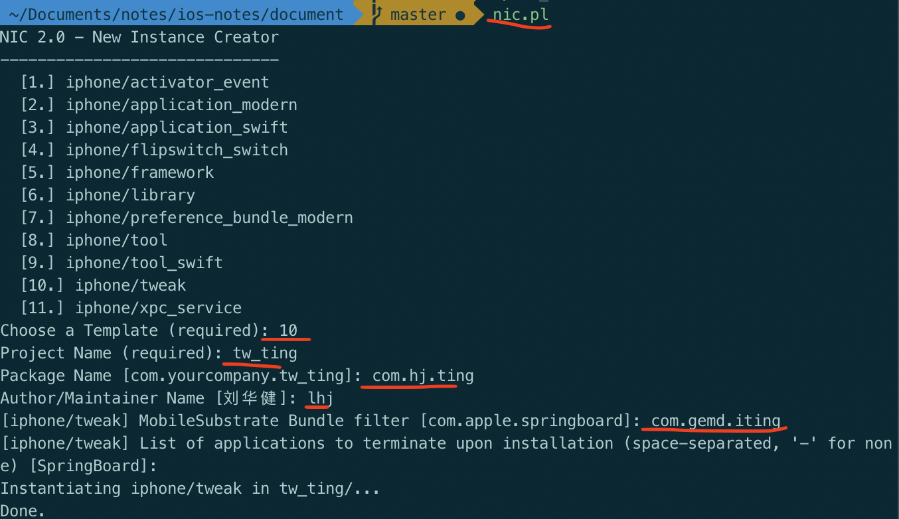

  + choose a Template: 选择模板
  + Project Name: 项目名称
  + Package Name:项目ID(随便写)
  + Author/Maintainer Name: 作者，直接回车即为默认
  + [iphone/tweak] MobileSubstrate Bundle filter
    + 需要修改的App的Bundle Identifier，即为该插件作用于哪个app上
    + 可以通过Cycript查看App的Bundle Identifier
  + [iphone/tweak] List of applications to terminate upon installation
    + 直接敲回车按照默认做法就行

### 编辑Makefile

+ 在Makefile文件中添加环境变量

  - THEOS_DEVICE_IP

  - THEOS_DEVICE_PORT

    ```shell
    export THEOS_DEVICE_IP=127.0.0.1
    export THEOS_DEVICE_PORT=10010
    
    INSTALL_TARGET_PROCESSES = ting
    include $(THEOS)/makefiles/common.mk
    TWEAK_NAME = tweak_landi
    
    tweak_landi_FILES = Tweak.x
    tweak_landi_CFLAGS = -fobjc-arc
    
    include $(THEOS_MAKE_PATH)/tweak.mk
    ```

    - INSTALL_TARGET_PROCESSES即为插件起作用的app可执行文件的名字

+ 如果不希望每个项目的Makefile都配置ip和port

  ```shell
  $ vim ~/.bash_profile
  
  export THEOS=~/thos
  export PATH=$THEOS/bin:$PATH
  export THEOS_DEVICE_IP=127.0.0.1
  export THEOS_DEVICE_PORT=10010
  
  $ source ~/.bash_profile
  ```

### 编写代码

> 去除喜马拉雅部分广告

+ 打开Tweak.x

  ```objective-c
  %hook XMAdAnimationViewThree
  - (id)init {
     return nil;
  }
  - (void)initUI {
  } 
  - (id)initWithFrame:(struct CGRect)arg1
  {
    return nil; 
  } 
  %end
  
  %hook XMAdAnimationViewTwo
  - (id)initWithFrame:(struct CGRect)arg1
  {
    return nil; 
  } 
  
  - (void)initUI {
  
  }
  %end 
  
  %hook XMSoundPatchImageView
  - (id)initWithFrame:(struct CGRect)arg1
  {
    return nil; 
  } 
  
  - (void)initUI {
  
  }
  %end 
  ```

  - 利用Reveal或Cycript定位广告控件的名字
  - 利用class-dump查看对应控件的方法

### 编译-打包-安装

- 编译

  ```shell
  $ make 
  ```

- 打包成deb

  ```shell
  $ make package   ##其实make package已经包含了make的操作
  ```

- 安装(默认会自动重启SpringBoard)

  ```shell
  $ make install
  ```

- 清除缓存

  ```shell
  $ make clean
  ```

### SpringBoard插件

> 1. SpringBoard不能用Reveal进行界面分析，因为Reveal要对某个应用进行界面分析时，必须打开其列表中的某个应用对应的开关。
>
> 2. 只能对SpringBoard使用Cycript进行分析
>
> 3. 位置: /System/Library/CoreServices/SpringBoard.app
>
> 4. SpringBoard默认是没有加密的
> 5. 该插件用来去掉红点


1. 通过usb连接手机

2. 通过cycript查看SpringBoard

   ```shell
    cycript -p SpringBoard
   ```

3. 导入mjcript

   ```powershell
    @import mjcript
   ```

4. 查找对应的控件

   + 查看控制器

   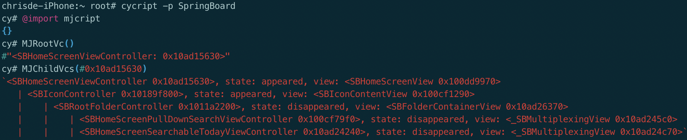

   - 控制器下的子视图

   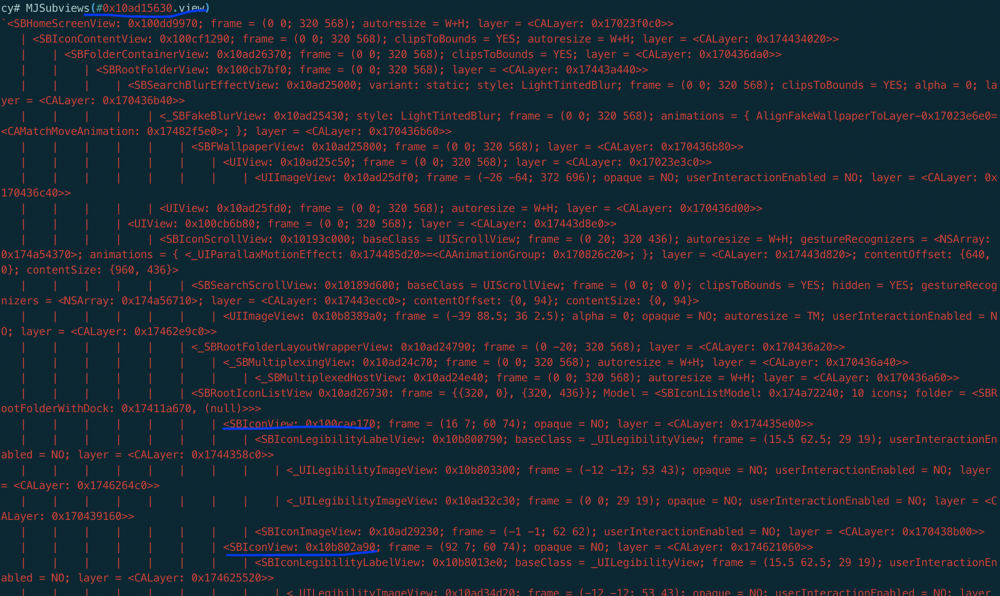

   - 定位到对应的view, 最终定位到的`SBIconParallaxBadgeView`

   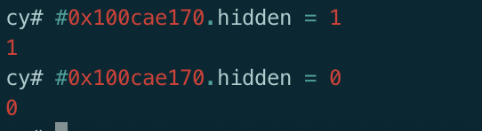

   

5. 利用class-dump导出头文件查看`SBIconParallaxBadgeView`,将init方法返回nil

   ```
   SpringBoard从 /System/Library/CoreServices/SpringBoard.app获取
   $ class-dump -H SpringBoard -o SpringBoardHeaders
   ```

   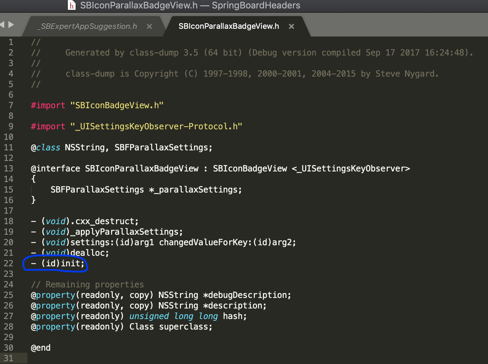

6. 开发tweak插件,然后修改Tweak.x文件

   ```objective-c
   
   %hook SBIconParallaxBadgeView
   
   - (id)init
   {
   	return nil;
   }
   
   %end
   ```

7. 编译打包安装到手机上即可

### 微信插件

+ Tweak.x代码

  ```
  #import "Model/MJPerson.h"
  #define MJDefaults [NSUserDefaults standardUserDefaults]
  #define MJAutoKey @"mj_auto_key"
  #define MJFile(path) @"/Library/Caches/MJWeChat/" #path
  
  @interface  FindFriendEntryViewController
  - (long long)numberOfSectionsInTableView:(id)tableView;
  @end
  
  @class FindFriendEntryViewController;
  
  %hook FindFriendEntryViewController
  // 一共有多少组
  - (long long)numberOfSectionsInTableView:(id)tableView
  {
  	return %orig + 1;
  }
  // 每一组有多少行
  - (long long)tableView:(id)tableView numberOfRowsInSection:(long long)section
  {
  	if (section == [self numberOfSectionsInTableView:tableView] - 1) {
  		return 2;
  	} else {
  		return %orig;
  	}
  }
  // 监听自动抢红包的开关(新方法需要添加%new)
  %new
  - (void)mj_autoChange:(UISwitch *)switchView
  {
  	[MJDefaults setBool:switchView.isOn forKey:MJAutoKey];
  	[MJDefaults synchronize];
  }
  
  // 返回每一行的cell
  - (id)tableView:(id)tableView cellForRowAtIndexPath:(id)indexPath
  {
  	if ([indexPath section] != 
  		[self numberOfSectionsInTableView:tableView] - 1) {
  		return %orig;
  }
  
  	// 最后一组cell的公共代码
  	NSString *cellId = ([indexPath row] == 1) ? @"exitCellId" : @"autoCellId";
  	UITableViewCell *cell = [tableView 
  			dequeueReusableCellWithIdentifier:cellId];
  	if (cell == nil) {
  		cell = [[UITableViewCell alloc] 
  				initWithStyle:UITableViewCellStyleDefault 
  				reuseIdentifier:cellId];
  		cell.backgroundColor = [UIColor whiteColor];
  		// 图片
  		cell.imageView.image = [UIImage imageWithContentsOfFile:MJFile(skull.png)];
  	}
  
  	// 最后一组cell的具体代码
  	if ([indexPath row] == 0) {
  		cell.textLabel.text = @"自动抢红包";
  
  		// 开关
  		UISwitch *switchView = [[UISwitch alloc] init];
  		switchView.on = [MJDefaults boolForKey:MJAutoKey];
      	[switchView addTarget:self 
      		action:@selector(mj_autoChange:) 
      		forControlEvents:UIControlEventValueChanged];
  		cell.accessoryView = switchView;
  	} else if ([indexPath row] == 1) {
  		cell.textLabel.text = @"退出微信";
  	}
  
  	return cell;
  }
  // 每一行的高度
  - (double)tableView:(id)tableView heightForRowAtIndexPath:(id)indexPath
  {
  	if ([indexPath section] != 
  		[self numberOfSectionsInTableView:tableView] - 1) {
  		return %orig;
  	}
  	return 44;
  }
  // 点击的监听
  - (void)tableView:(id)tableView didSelectRowAtIndexPath:(id)indexPath
  {
  	if ([indexPath section] != 
  		[self numberOfSectionsInTableView:tableView] - 1) {
  		%orig;
  		return;
  	}
  
  	[tableView deselectRowAtIndexPath:indexPath animated:YES];
  
  	if ([indexPath row] == 1) {
  		// exit(0);
  		// 终止进程
  		abort();
  	}
  
  	MJPerson *p = [[MJPerson alloc] init];
  	p.age = 10;
  	NSLog(@"age is %d", [p age]);
  }
  %end
  ```

  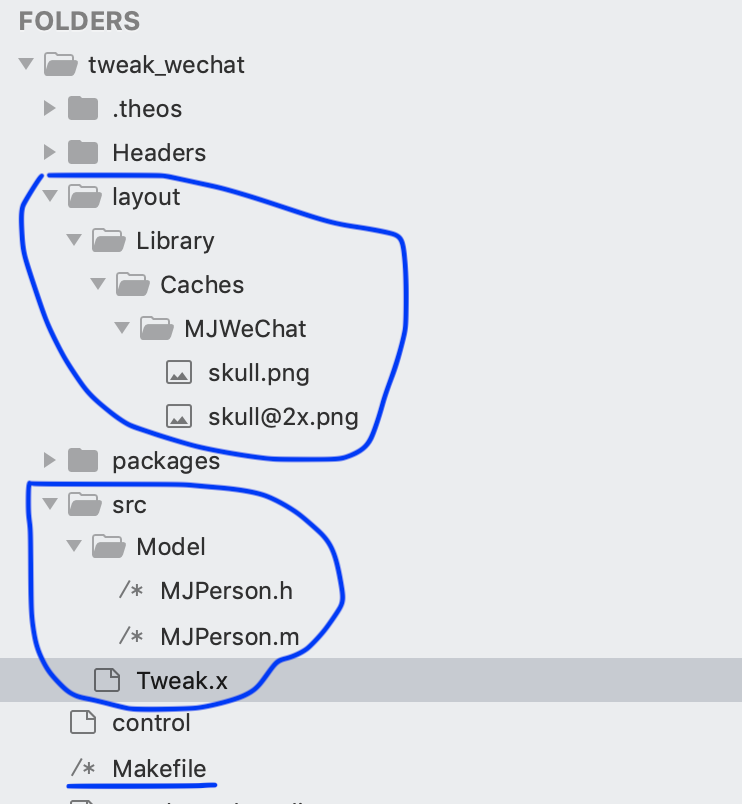

  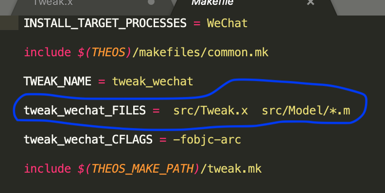

  1. %orig是对原来方法的调用

  2. %new是表明这个方法是新添加的方法

  3. 数据存储

     ````objective-c
     宏定义
     #define MJDefaults [NSUserDefaults standardUserDefaults]
     #define MJAutoKey @"mj_auto_key"
     
     
     //存储
     %new
     - (void)mj_autoChange:(UISwitch *)switchView
     {
     	[MJDefaults setBool:switchView.isOn forKey:MJAutoKey];
     	[MJDefaults synchronize];
     }
     
     //取出
     switchView.on = [MJDefaults boolForKey:MJAutoKey];
     ````

  4. 图片资源

     ```
     1. 在tweak工程中定义layout文件夹，该文件夹内的路径即为图片资源放置在手机中的路径
     2. 使用时， 宏定义路径 path前面加'#'表明传递过来的path会被自动加上双引号
     #define MJFile(path) @"/Library/Caches/MJWeChat/" #path
     ```

  5. 多文件开发

     ```
     定义src目录，并在Makefile的tweak_xxx_files路径来配置
     ```

### theos-tweak原理

1. 编写Tweak代码

2. $ make: 编译Tweak代码为动态库

3. $ make package: 将dylib打包为deb文件

4. $ make install: 将deb文件传动到手机上，通过Cydia进行安装

5. 插件将会被安装在/Library/MobileSubstrate/DynamicLibraries文件夹

   - *.dylib：编译后的Tweak代码
   - *.plist: 存放着需要hook的APP ID

6. 当打开APP时

   - Cydia Substrate(Cydia已安装的插件)会让app去加载对应的dylib
   - 修改APP内存中的代码逻辑，去执行dylib中的代码函数

7. 所以， tweak并不会对app原来的可执行文件进行修改，仅仅是修改了内存中的执行逻辑

8. release版本

   ```shell
   $ make package debug=0
   ```

9. 疑问

   - 未脱壳的APP是否支持tweak?
     - 支持，因为tweak是在内存中实现的，并没有修改可执行文件
   - tweak效果是否是永久性的？
     - 取决于tweak用到的代码是否在新版的app中被修改
   - 未越狱的手机是否支持tweak？
     + 不支持
   - 能不能对Swift/C函数进行tweak?
     - 可以，方式跟oc不一样
   - 能不能对游戏项目进行tweak?
     - 可以，但是游戏大多数是C++、C#编写的，而且类名函数名会进行混淆

#### 开发过程  

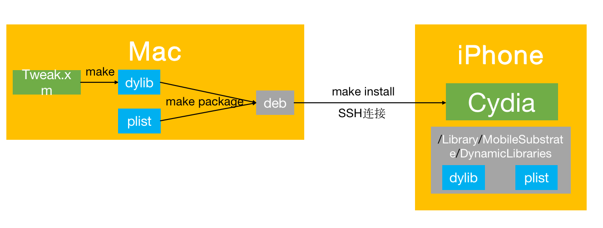

1. 在Tweak.x文件中开发代码
2. 通过make生成dylib和plist
3. 通过make package将dylib和plist打包生成deb
4. 通过make install将deb按照Makefile文件的描述安装到iPhone
5. Cydia将插件安装到/Library/MobileSubstrate/DynamicLibraries文件夹

#### 运行过程

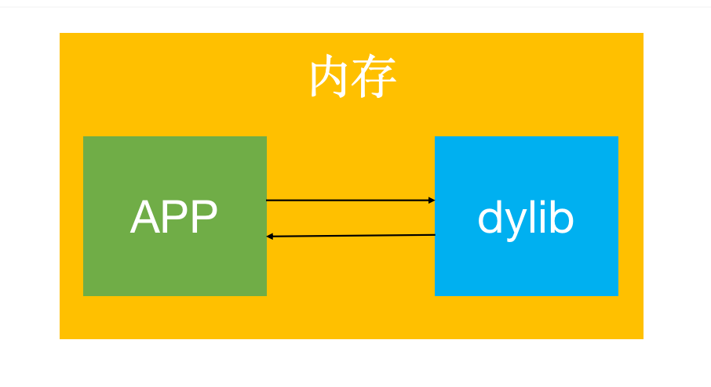

1. 将app载入内存
2. 同时CydiaSubstrate将dylib载入内存，当调用app的方法时dylib拦截对应的方法，执行自己的实现。


### 从汇编角度来分析

1. 创建测试工程

   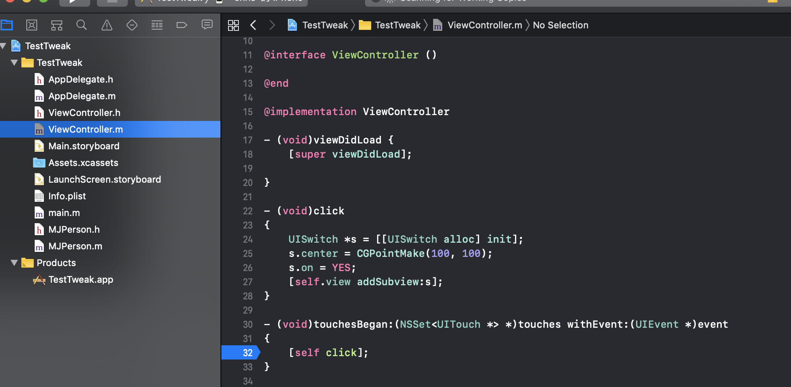

2. 在xcode中,勾选` Debug->Debug Workflow-> Always Show Disassembly`

3. 没有安装插件之前,断点进入汇编

   

4. 创建插件，并安装插件

   ```objective-c
   在Tweak.x中
   @interface  ViewController
   - (id)view;
   @end
   
   %hook ViewController
   - (void)click
   {
   	UIView *view = [[UIView alloc] init];
   	view.frame = CGRectMake(100, 100, 100, 100);
   	view.backgroundColor = [UIColor redColor];
   	[[self view] addSubview:view];
   }
   
   %end
   
   没有向上面一样显式声明view方法时， 可能会出现下面找不到view方法的错误
   > Making all for tweak tweak_click…
   ==> Preprocessing Tweak.x…
   ==> Compiling Tweak.x (armv7)…
   Tweak.x:8:4: error: receiver type 'ViewController' for instance message is a forward declaration
           [[self view] addSubview:view];
             ^~~~
   Tweak.x:22:8: note: forward declaration of class here
   @class ViewController;
          ^
   1 error generated.
   ```

5. 安装debug版本插件之后，断点进入汇编

   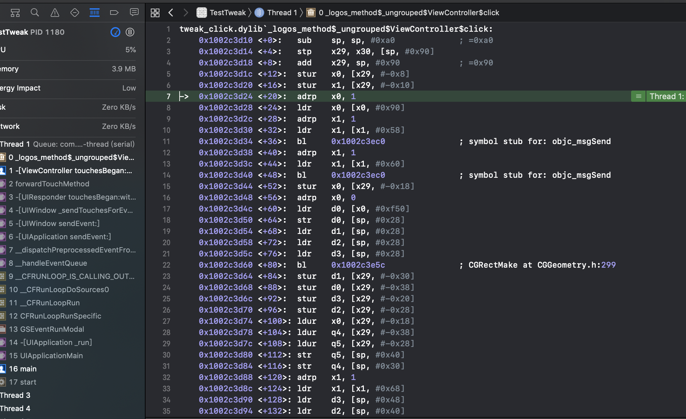


### theos资料查询

+ 􏰸􏰹􏱈􏱉􏱊目录结构: https://github.com/theos/theos/wiki/Structure 
+ 环境变量: http://iphonedevwiki.net/index.php/Theos 

### Logos语法

+ 文档: http://iphonedevwiki.net/index.php/Logos 

  - `%hook`, `%end`:hook一个类的开始和结束

  - `%log`： 打印方法调用详情

    - 可以通过`Xcode -> Window -> Devices and Simulators-> open console􏱆􏱚􏱛􏱜 `查看打印

  - `HBDebugLog`: 跟NSLog类似

  - `%new`: 添加一个新方法

    ```objective-c
    # 编译的时候可能会报找不到方法的错误,将找不到的方法在定义的方法集合声明一下即可
    @interface MethodSet
    - (void)newMethodName;
    @end
    ```

  - %c(className)： 生成一个class对象,类似于NSClassFromString(), objc_getClass()

  - %orig: 函数原来的代码逻辑

  - %ctor: 在App加载动态库插件的时候调用,定义在`%hook`, `%end`之外

  - %dtor: 在程序退出的时候调用，定义在`%hook`, `%end`之外

    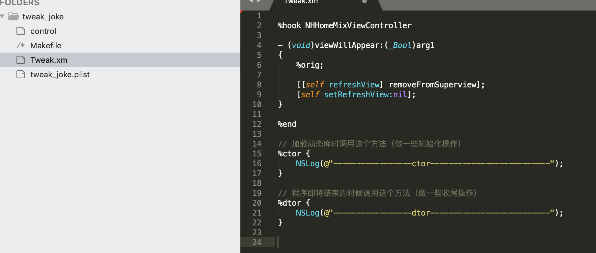

### logify.pl

> 将一个头文件快速转换成已经包含打印信息的.x文件

1. 监控微信的红包界面，通过Reveal可知，该界面的控制器为BaseMsgContentViewController

2. 通过dumpdecrypted脱壳得到解密的WeChat

3. 通过class-dump导出头文件

   ```
   $ class-dump -H WeChat -o Headers
   ```

4. 通过logify.pl将BaseMsgContentViewController.h转换为BaseMsgContentViewController.x

   ```
   $ logify.pl BaseMsgContentViewController.h > BaseMsgContentViewController.x
   ```

   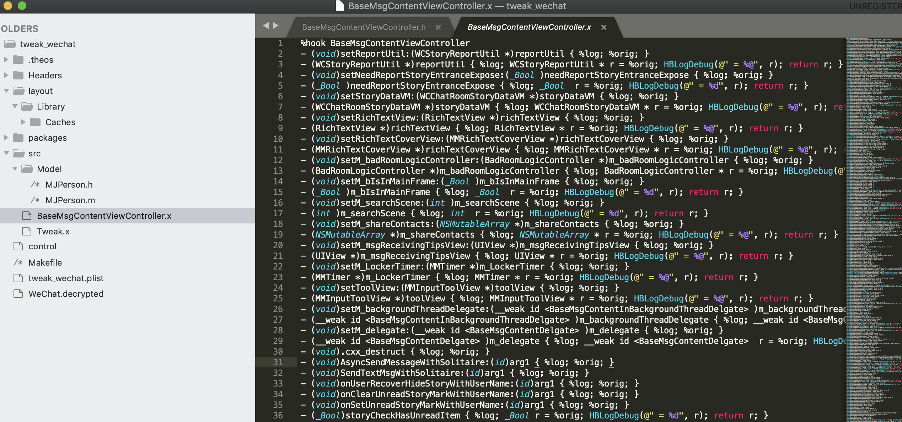

5. make编译的时候有一些语法错误要解决一下
   - 删掉__weak
   - 删掉inout
   - 声明一下协议信息 @protocol xxxDelegate; 
     - 或者删掉协议，比如<xxxDelegate>
   - 删掉-(void).cxx_destruct{%log; %orig; }
   - 􏳕􏳚替换 HBLogDebug(@" = 0x%x", (unsigned int)r); 为HBLogDebug(@" = 0x%@", r); 
   - 声明一下类信息 @class XXPersion
     - 或者替换类名为void, 比如将Person *替换为 void *