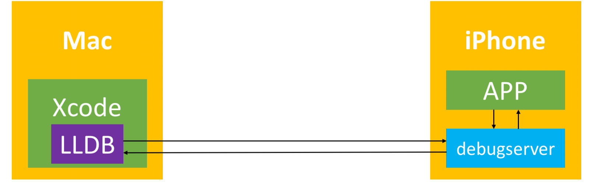
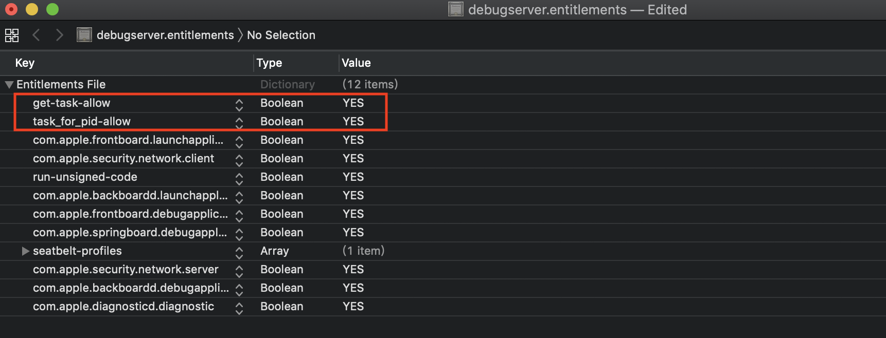
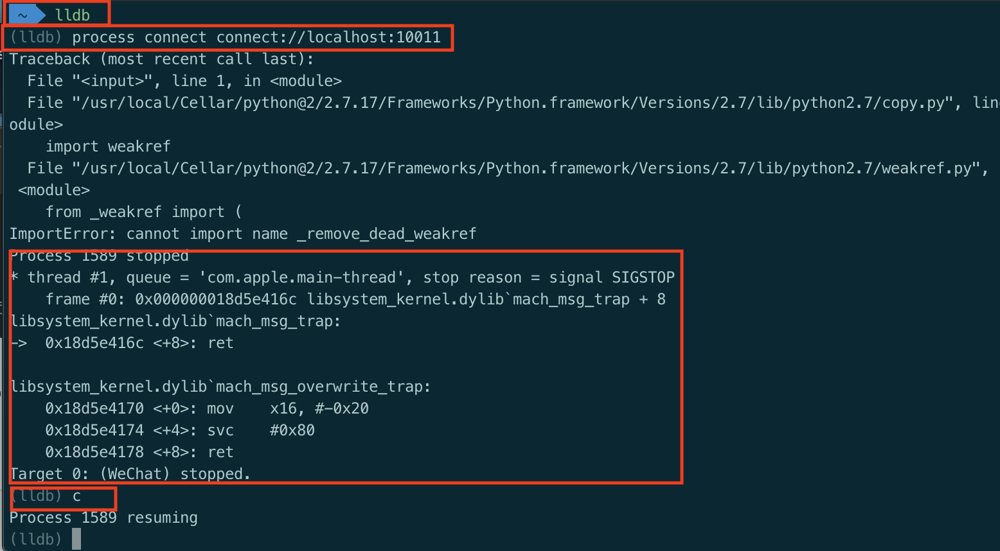

## 动态调试

### 什么叫动态调试

将程序运行起来，通过下断点，打印等方式，查看参数，返回值，函数调用流程。主要用来调试别人的App。

### Xcode的动态调试原理

+ 关于GCC、LLVM、GDB、LLDB

  - Xcode的编译器发展历程:[ GCC](https://www.gnu.org/software/gcc/) -> [LLVM](https://llvm.org/)
  - Xcode的调试器发展历程:[GDB](https://www.gnu.org/software/gdb/) -> [LLDB](https://lldb.llvm.org/)

+ debugserver一开始放在Mac的xcode中

  ```
  /Applications/Xcode.app/Contents/Developer/Platforms/iPhoneOS.platform/DeviceSupport/13.0/DeveloperDiskImage.dmg/usr/bin/debugserver
  ```

+ 当xcode识别到手机设备时，Xcode会自动将debugserver安装到iphone上的`/Developer/usr/bin/`目录

+ Xcode调试的局限性：一般清空下只能调试通过xcode运行到手机上的App

+ Xcode调试App的流程

  

  1. xcode通过打断点进入LLDB环境，然后将在LLDB中输入的调试指令通过usb传送到debugserver。
  2. debugserver对app执行调试指令，app将调试结果返回给debugserver
  3. debugserver再将调试结果返回给LLDB

+ 从上面的流程可知，要调试app，需要:
  1. 将LLDB于debugserver建立连接
  2. 将debugserver与要调试的app建立连接

### 动态调试任意App

+ 要动态调试任意App，需要解决两个问题

  

  1. 将debugserver与App建立连接
  2. 在终端手动启动LLDB，并将LLDB与debugserver建立连接

#### 将debugserver与App建立连接

1. debugserver调试其他app有权限问题

   - 默认情况下，`/Developer/usr/bin/debugserver`缺少一定的权限，只能调试通过Xcode安装的App，无法调试其他App。
   - 如果希望调试其他App，需要对debugserver重新签名，签上两个调试相关的权限
     - get-task-allow
     - task_for_pid-allow

2. 如何给debugserver签上权限

   1. iPhone上的`/Developer`目录是只读的,无法直接对`/Developer/usr/bin/debugserver`文件签名，需要先把debugserver复制到Mac上

   2. 通过ldid命令导出文件以前的权限

      ```shell
      $ ldid -e debugserver > debugserver.entitlements
      ```

      

   3. 添加`get-task-allow`和`task_for_pid-allow`权限

      

   4. 通过ldid重新签名

      ```shell
      $ ldid -Sdebugserver.entitlements debugserver
      ```

   5. 将已经签好权限的debugserver放到手机的/usr/bin目录，便于找到debugserver指令

   6. 关于权限的签名也可以使用codesign

      ```shell
      # 查看权限信息
      $ codesign -d --entitlements - debugserver
      
      # 签名权限
      $ codesign -f -s - --entitlements  debugserver.entitlements debugserver
      #或者简写为
      $ codesign -fs- --entitlements  debugserver.entitlements debugserver
      ```

3. 让debugserver附加到某个App进程

   

   ```
   # 先WeChat启动
   # debugserver *:端口号 -a 进程ID或进程名
   
   $ debugserver *:10011 -a WeChat 
   ```

   + `*:端口号`:使用iPhone的某个端口启动debugserver服务
   + `-a 进程名/进程ID`: 输入APP的进程信息(进程ID或进程名)

#### 在终端手动启动LLDB，并将LLDB与debugserver建立连接

1. 在usb.sh中，将mac上的端口10011映射到iPhone上的端口10011

   ```shell
   #!/bin/bash
   python tcprelay.py -t 22:10010 10011:10011
   ```

2. 启动LLDB，并连接debugserver服务

   

   + 启动lldb

     ```shell
     $ lldb
     ```

   + 连接debugserver服务，连接成功后程序被暂停

     ```shell
     (lldb) process connnect connect://localhost:10011
     
     ## 在lldb上执行的所有指令都被转发到手机的10011端口，然后被debugserver监听到
     ```

   + 使用LLDB的c命令让程序继续运行

     ```shell
     (lldb) c
     ```

   + 接下来就可以使用LLDB来调试APP了


### 通过debugserver启动App

```
$ debugserver -x auto *:端口号 app的可执行文件路径
```


