## ASLR

### 什么是ASLR

+ Address Space Layout Randomization，地址空间布局随机化
+ 是一种针对缓冲区溢出的安全保护技术，通过对堆、栈、共享库映射等线性区布局的随机化，通过增加攻击者预测目的地址的难度，防止攻击者直接定位攻击代码位置，达到阻止溢出攻击的目的的一种技术
+ iOS4.3开始引入了ASLR技术

### 如何调试别人的app

1. 我们可以通过`breakpoint set -a 地址`来调试别人app中的函数

2. 核心问题在于我们如何得到内存中方法真正的地址。

   ```
   函数未使用ASLR时内存地址 = __PAGEZERO的大小 + 该函数在Mach-O文件中的偏移
   函数真正的地址 =  函数使用ASLR后的__PAGEZERO偏移地址 + 函数未使用ASLR时内存地址
   函数真正的地址 = 函数使用ASLR后的__PAGEZERO偏移地址 + __PAGEZERO的大小 + 该函数在Mach-O文件中的偏移
   ```

3. 用hopper分析别人的对应架构的二进制文件，可以查看到对应函数未使用ASLR时的内存地址
4. 通过 `image list -f -o`查看ASLR偏移，即可计算得到真正的内存地址

### 直接用函数名无法打断点

1. 准备调试环境,mac通过usb连接手机 。debugserver连接到微信，lldb连接带debugserver。

   ```
   root# debugserver *:10011 -a WeChat
   
   (lldb) process connect connect://localhost:10011
   ```

   

   

2. 利用hopper分析WeChat的函数，随便找到一个函数，后面用来尝试打断点

   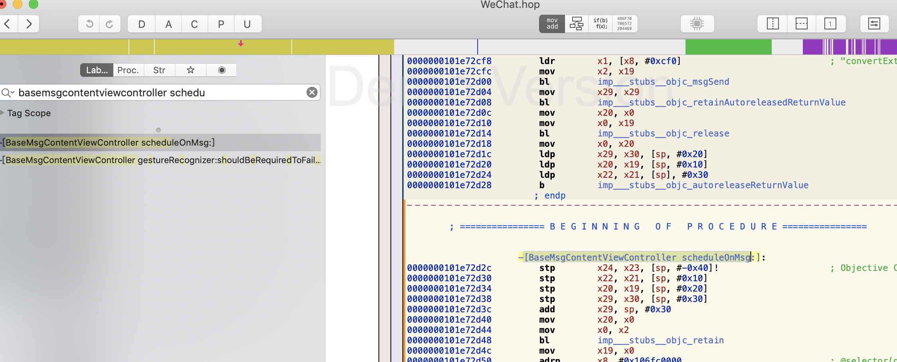

3. 利用breakpoint来打断点，如下图，打断点失败。

   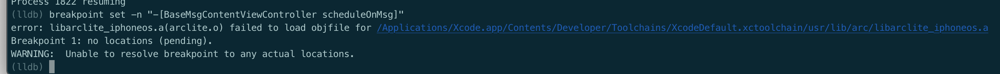

   - 我们在hopper中看到的` scheduleOnMsg的地址`缺少ASLR的偏移地址,所以不能直接用`scheduleOnMsg的地址`来打断点

### 查看Mach-O文件的内存分布

> 1. 查看的是Mach-O文件载入内存之前，在Mach-O文件里存储的内存分布信息。（vmaddr, vmsize）
> 2. 载入内存时，根据存储的vmaddr和vmsize进行内存分配
>
> 3. 相当于未使用ASLR时，可执行文件在虚拟内存中的内存布局

```shell
$ size -l -m -x TestMachO_arm64
```

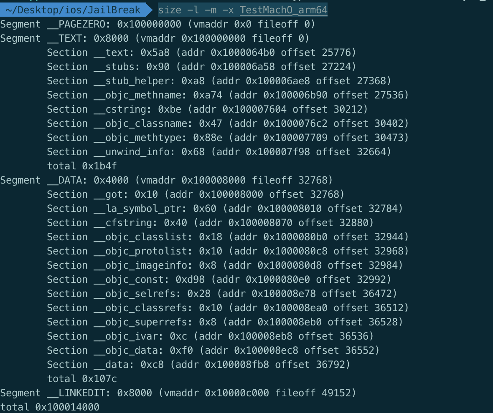


### 未使用ASLR

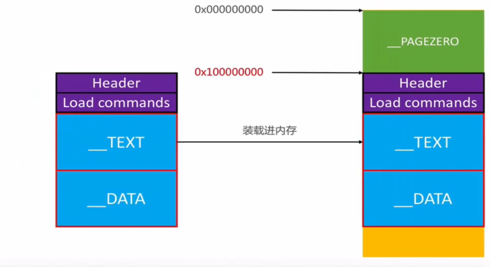

1. 由[mach-o文件](./ios底层原理-mach-o文件2.md)这篇文章可知，对于64位的机器。当Mach-O可执行文件载入内存后，最开始为`__PAGEZORE段`。
   - PAGEZORE段在内存中的起始地址是0x0，大小为0x100000000
2. 代码段的在内存中的起始地址即为0x100000000
3. 紧接着是Header和Load Commands,` __TEXT`的sections和`__DATA`的sections
4. __DATA的sections放到内存中的时候可能会有拉伸的操作,即在内存占据的空间会比在Mach-O文件中占据的空间大。
5. 全局变量都是放在`__DATA`段的`__data`中
6. 可执行的文件的起始内存地址是0x0

### 使用了ASLR

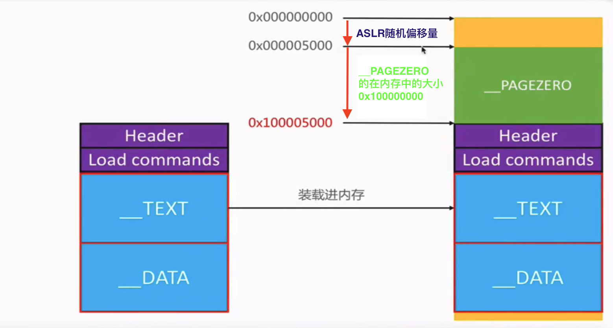

+ 由图可知，使用了ASLR比未使用ASLR，在内存布局的前面有一个随机偏移量。
+ 这就导致，别人无法单纯的通过分析我们的可执行文件，猜测出我们函数和全局变量等载入内存后的地址，从而达到防止攻击的目的。

### 函数的内存地址

+ 函数内存地址计算公式

  ```
  VM Address = File Offset + ASLR offset + __PAGEZORE Size
  ```

+ Hopper，IDA中的地址都是未使用ASLR的VM Address


### 调试微信

> 前期准备
>
> 1. 调试微信打开红包的函数
> 2. 通过砸壳得到微信二进制文件
> 3. 通过class-dump分析后，点击红包后，微信会调用 -[BaseMsgContentViewController touchesBegan_TableView:withEvent:]函数


1. 准备调试环境, 通过debugserver连接微信，通过lldb连接debugserver。

   ```shell
   # debugserver连接微信
   root# debugserver *:10011 -a WeChat
   
   # lldb连接debugserver
   process connect connect://localhost:10011
   ```

2. hopper分析砸壳后的WeChat，找到` -[BaseMsgContentViewController touchesBegan_TableView:withEvent:]函数`

   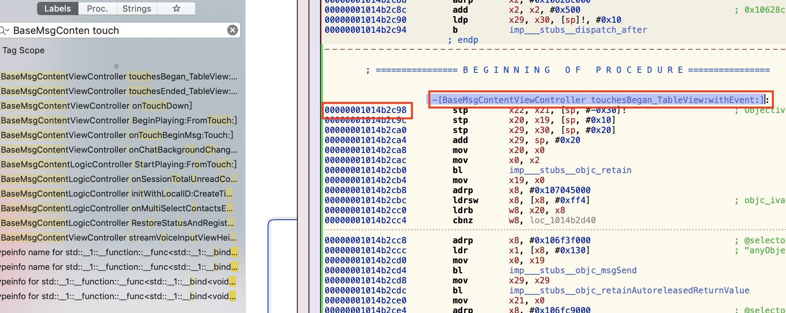

3. 通过`image list -f -o`得到该函数的ASLR偏移量

   

   - 首先加载的是可执行文件WeChat， 然后加载dyld,通过dyld加载一系列的动态库
   - ALSR offset为 `0x3c000`。可执行文件在内存中的起始地址为`0x10003c00`

4. 计算出函数真实的地址，给函数打断点

   ```
   #0x3c000+0x1014b2c98 = 0x1014eec98
   breakpoint set -a 0x000000000003c000+0x00000001014b2c98
   ```

   

5. 点击红包界面，进入断点

   

   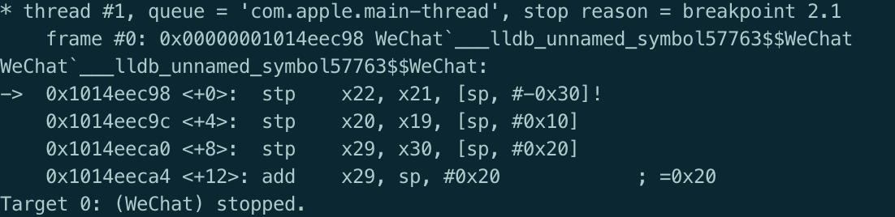

6. 通过`bt`, 查看调用栈

   

   - 通过上图可知，**调用**`touchesBegan_TableView:withEvent:函数`的函数地址为`0x1023ca14c`

   - 通过计算我们可以得出该函数hopper中地址，以及在Mach-O文件中的偏移。

     ```
     ### 公式
     VM Address = File Offset + ASLR offset + __PAGEZORE Size
     Hopper Address  = File Offset  + __PAGEZORE Size
     
     ### 计算过程
     Hopper Address = VM Address - ASLR offset
                    = 0x1023ca14c - 0x3c000 
                    = 0x10238e14c
                    
     File Offset = Hopper Address - __PAGEZORE Size
                 = 0x10238e14c - 0x100000000
                 = 0x00238e14c
     ```

     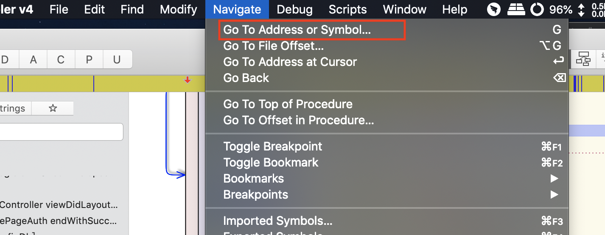

     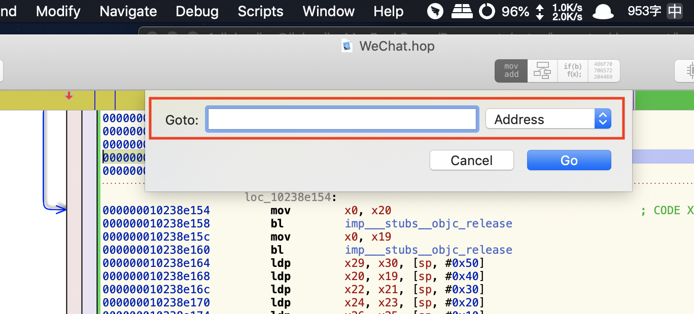

     - 跳转后

     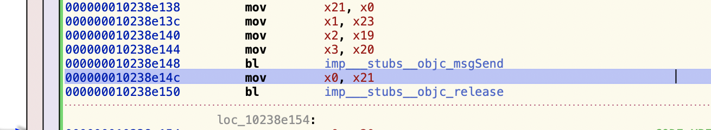

     

     - 可以定位到其上一个函数应该是`-[MMTableView touchesBegan:withEvent:]`

     - 其计算出的函数在文件中的偏移地址，肯定位于`__TEXT`的`__text`的section内
     
       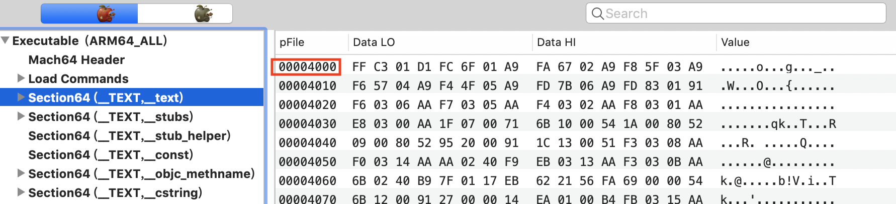
     
       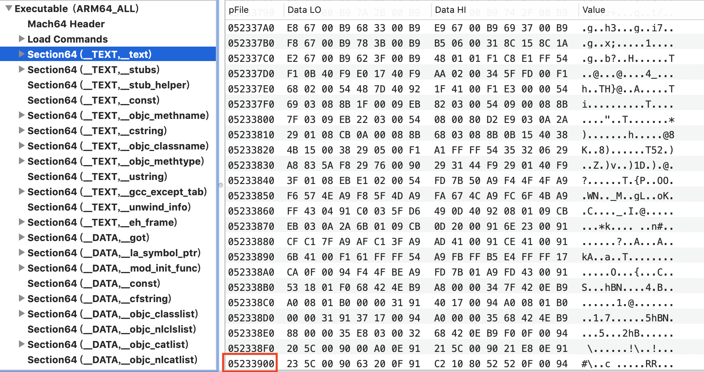
     
       - `0x00238e14c` 在`0x4000~ 0x05233910`中

7. 通过其他lldb指令调试， n, s, c等


### 全局变量和静态变量在文件中的位置

1. 建立测试工程，代码如下

   ```objective-c
   #import "ViewController.h"
   
   int a0 = 10;
   int a1 = 0;
   int a2;
   static int b0 = 20;
   static int b1 = 0;
   static int b2;
   @interface ViewController ()
   
   @end
   
   @implementation ViewController
   
   - (void)viewDidLoad {
       [super viewDidLoad];
       
       NSLog(@"a0 = %p",&a0);
       NSLog(@"a1 = %p",&a1);
       NSLog(@"a2 = %p",&a2);
       
       NSLog(@"b0 = %p",&b0);
       NSLog(@"b1 = %p",&b1);
       NSLog(@"b2 = %p",&b2);
       
       int c0 = 30;
       int c1 = 0;
       int c2;
       NSLog(@"c0 = %p",&c0);
       NSLog(@"c1 = %p",&c1);
       NSLog(@"c2 = %p",&c2);
   
       static int d0 = 40;
       static int d1 = 0;
       static int d2;
       NSLog(@"d0 = %p",&d0);
       NSLog(@"d1 = %p",&d1);
       NSLog(@"d2 = %p",&d2);
   }
   
   - (void)touchesBegan:(NSSet<UITouch *> *)touches withEvent:(UIEvent *)event {
       NSLog(@"1111");
   }
   ```

2. 运行工程打印如下

   ```
   2019-12-13 16:47:39.706085 TestData[2339:401441] a0 = 0x100068ef0  10 
   2019-12-13 16:47:39.706200 TestData[2339:401441] a1 = 0x100068fc0  0
   2019-12-13 16:47:39.706243 TestData[2339:401441] a2 = 0x100068fc4  0
   2019-12-13 16:47:39.706281 TestData[2339:401441] b0 = 0x100068ef4  20
   2019-12-13 16:47:39.706319 TestData[2339:401441] b1 = 0x100068fc8  0
   2019-12-13 16:47:39.706356 TestData[2339:401441] b2 = 0x100068fcc  0
   2019-12-13 16:47:39.706391 TestData[2339:401441] c0 = 0x16fd9de8c  30
   2019-12-13 16:47:39.706427 TestData[2339:401441] c1 = 0x16fd9de88  0
   2019-12-13 16:47:39.706462 TestData[2339:401441] c2 = 0x16fd9de84  0
   2019-12-13 16:47:39.706498 TestData[2339:401441] d0 = 0x100068ef8  40
   2019-12-13 16:47:39.706576 TestData[2339:401441] d1 = 0x100068fd0  0
   2019-12-13 16:47:39.706655 TestData[2339:401441] d2 = 0x100068fd4  0
   ```

3. 进入lldb环境, 得到ASLR偏移

   ```
   image list -o -f | grep TestData
   
   [  0] 0x0000000000060000 /Users/liuhuajian/Library/Developer/Xcode/DerivedData/TestData-bxnczdvzbuclucdmuscfocwjpjxp/Build/Products/Debug-iphoneos/TestData.app/TestData
   ```

   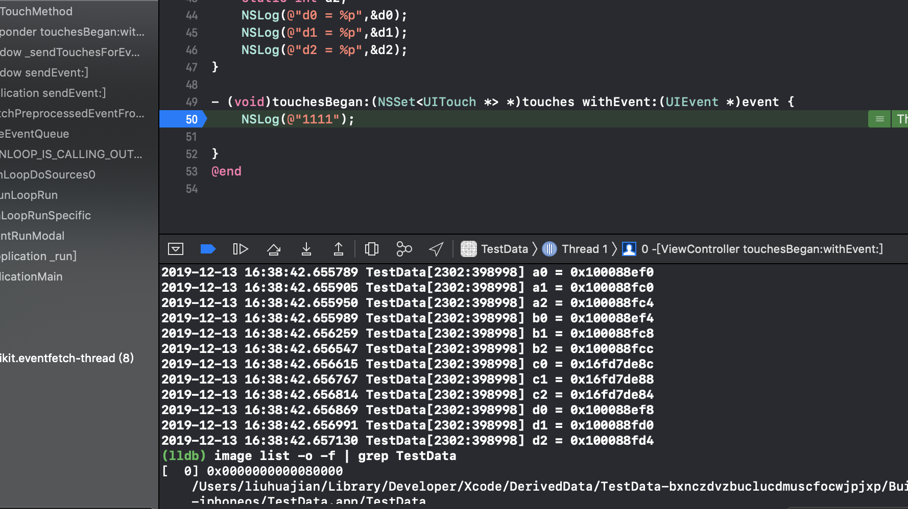

4. 计算出变量的位置

   ```
   全局变量
   a0: 0x8ef0
   a1: 0x8ec0
   a2: 0x8ec4
   
   b0: 0x8ef4
   b1: 0x8fc8
   b2: 0x8fcc
   
   d0: 0x8ef8
   d1: 0x8fd0
   d2: 0x8fd4
   局部变量
   c0, c1, c2在栈内存中，是动态分配的，在文件中不存在。
   ```

   

   - 所以a0和b0,d0在`__DATA`的`__data`section中。

   - 查看`__data`的section描述可知，其范围0x8EF0~0x8FBF。

     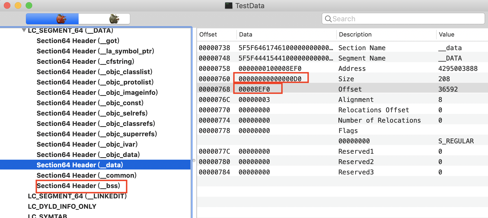

   - 所以a1,a2,b1,b2,d1,d2这些未初始化以及初始化为0的数据没有放在`__DATA`的`__data`section中。

   - 而是紧挨着`__DATA`的`__data`section放置的。