## mach-o与动态链接

### RIP-relative 寻址

```assembly
0000000000001fcd  jmpq  0x2d(%rip)
0000000000001fd3  nop
# 第一行代码 jmpq 的跳转目标地址是：0x1fd3 + 0x2d = 0x2000。
```


### 间接寻址

```assembly
0000000000001fcd  jmpq  *0x2d(%rip)
0000000000001fd3  nop
# 第一行代码 jmpq 的跳转目标地址是 0x2000 (0x1fd3 + 0x2d) 里存储的地址，并非 0x2000 本身。
```

### 引子

静态链接比较简单，原理上也容易理解，实践上却存在很多问题，典型问题有两点

- 极大浪费磁盘和内存空间

- 给程序的更新、部署和发布带来很多麻烦

  ```
  比如程序 Program1 所使用的 Lib.o 是由一个第三方厂商提供的，当该厂商更新了 Lib.o 的时候，那么 Program1 的开发者就要拿到最新版的 Lib.o，然后将其与 Program1.o 链接后，将新的 Program1 整个发布给用户。即一旦程序有任何模块的更新，整个程序就得重新链接、发布给用户。
  ```

### 动态链接例子

+ 动态链接是对这两个问题的解决方案。所谓动态链接，简单地讲，就是不对那些组成程序的目标文件进行链接，等到程序要运行时才进行链接。也就是说，把链接这个过程推迟到运行时再进行，这就是动态链接（Dynamic Linking）的基本思想。

+ 本文以一个具体的 case 引出 Mach-O 动态链接中值得我们关心的问题。

  ```c
  // say.c
  #include <stdio.h>
  
  char *kHelloPrefix = "Hello";
  
  void say(char *prefix, char *name)
  {
      printf("%s, %s\n", prefix, name);
  }
  ```

  该模块很简单，定义了两个符号：常量字符串`kHelloPrefix`，以及函数`say`。使用 gcc 把 say.c 编译成 dylib：

  ```shell
  $ gcc -fPIC -shared say.c -o libsay.dylib
  # 生成 libsay.dylib
  ```

  再定义一个使用 say 模块的 main.c：

  ```c
  void say(char *prefix, char *name);//外部符号
  extern char *kHelloPrefix;//外部符号
  
  int main(void)
  {
      say(kHelloPrefix, "Jack");
      return 0;
  }
  ```

  把 main.c 编译成可重定位中间文件（只编译不链接）：

  ```shell
  $ gcc -c main.c -o main.o
  # 生成可重定位中间文件：main.o
  ```

  此时的 main.o 是不可执行的，需要使用链接器 ld 将 sayHello 链接进来：

  ```shell
  $ ld main.o -macosx_version_min 10.14 -o main.out -lSystem -L. -lsay
  # -macosx_version_min 用于指定最小系统版本，这是必须的
  # -lSystem 用于链接 libSystem.dylib
  # -lsay 用于链接 libsay.dylib
  # -L. 用于新增动态链接库搜索目录
  # 生成可执行文件：main.out
  ```

  这样就生成了可执行文件 main.out，执行该文件，打印「Hello, Jack」。此时若使用`xcrun dyldinfo -dylibs`查看 main.out 的依赖库，会发现有两个依赖库：

  ```shell
  $ xcrun dyldinfo -dylibs main.out
  attributes     dependent dylibs
                  /usr/lib/libSystem.B.dylib
                  libsay.dylib
  ```

  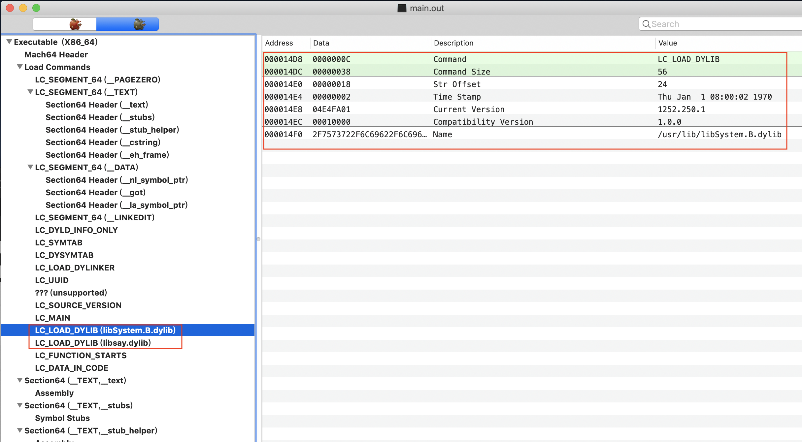

  - `LC_LOAD_DYLIB`命令的顺序和 ld 的链接顺序一致。

+ `LC_LOAD_DYLIB`的结构

  ```c
  struct dylib {
      union lc_str  name;			/* library's path name */
      uint32_t timestamp;			/* library's build time stamp */
      uint32_t current_version;		/* library's current version number */
      uint32_t compatibility_version;	/* library's compatibility vers number*/
  };
  
  struct dylib_command {
  	uint32_t	cmd;		/* LC_ID_DYLIB, LC_LOAD_{,WEAK_}DYLIB,
  					   LC_REEXPORT_DYLIB */
  	uint32_t	cmdsize;	/* includes pathname string */
  	struct dylib	dylib;		/* the library identification */
  };
  ```

### 动态链接需要重定位的符号

无论是静态链接，还是动态链接，符号都是最重要的分析对象；来看看 main.out 的符号表（symbol table

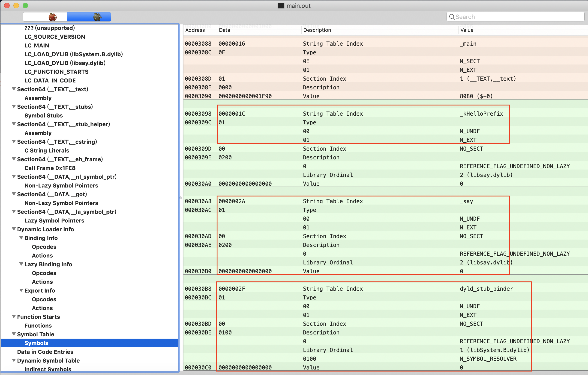

可以看到，symbol table 中有三个未绑定的外部符号：`_kHelloPrefix`、`_say`、`dyld_stub_binder`；本文接下来对 Mach-O 文件结构的分析将围绕这 3 个符号进行展开

### 结构分析

先将 Mach-O 中与动态链接相关的结构给罗列出来

+ load commands

  - LC_SEGMENT_64
  - Section_Header

  - LC_LOAD_DYLIB
  - LC_SYMTAB
  - LC_DYSYMTAB

+ Symbol Table

+ Dynamic Symbol Table

+ Dynamic Loader Info

  - Binding Info
  - Lazy Binding Info

### 动态符号表(Dynamic Symbol Table)

+ 本质上，indirect symbol table 是数组, 每个元素是一个4字节的值， 该元素代表动态符号在符号表中的位置

  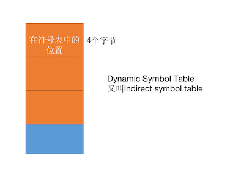

+ Indirect symbol table 由`LC_DYSYMTAB`定义（Load Command）

  ```c
  struct dysymtab_command {
      uint32_t cmd;           /* LC_DYSYMTAB */
      uint32_t cmdsize;       /* sizeof(struct dysymtab_command) */
      ...
      ...
      //indirect symbol table在整个文件中的偏移
      uint32_t indirectsymoff; /* file offset to the indirect symbol table */
      //indirect symbol table元素的数量
      uint32_t nindirectsyms;  /* number of indirect symbol table entries */
      ...
      ...
  };	
  ```

  + 目前只关心**indirectsymoff**和**nindirectsyms**
  + **indirectsymoff**代表 indirect symbol table在整个文件中的**偏移**
  + **nindirectsyms**代表 indirect symbol table中entry的**数量**

+ 在main.out中的indirect symbol table

  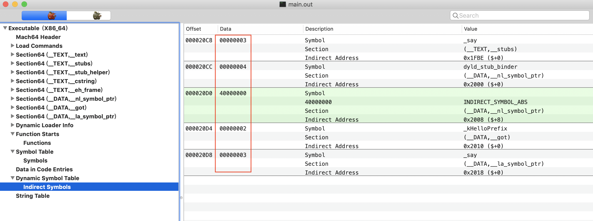

### Section(\_\_TEXT, \_\_text 里的外部符号

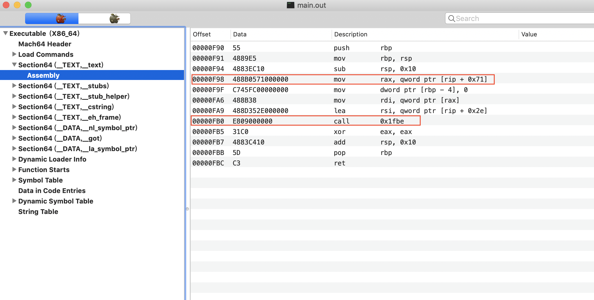

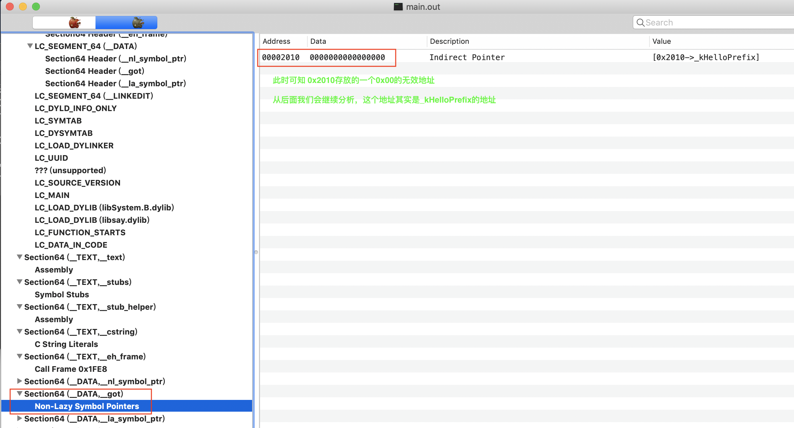

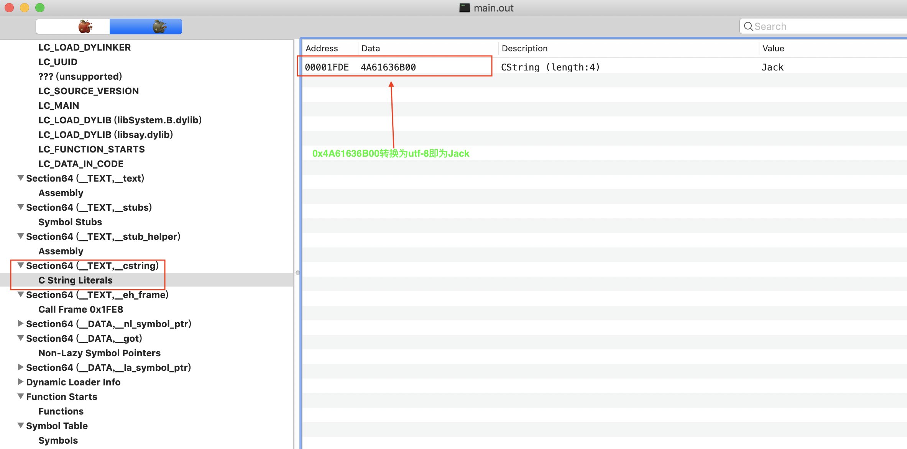

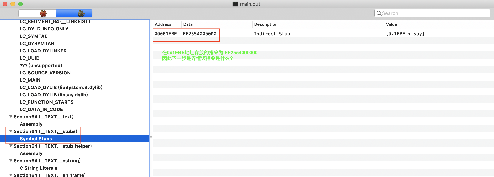

```assembly
## main.c
void say(char *prefix, char *name);
extern char *kHelloPrefix;
int main(void)
{
    say(kHelloPrefix, "Jack");
    return 0;
}

# main函数的汇编代码
#保存rbp到栈中，此时rsp往上
push rbp
#让rbp指向rsp
mov  rbp, rsp
#开辟栈空间,rsp向上移动16个字节
sub  rsp, 0x10
#rip存放下一条指令的地址, rip为0x00001F9F
#[rip + 0x71] = [0x2010], 即为将0x2010位置的存放的值放到rax
# 通过后面分析可知,0x2010位置放的是_kHelloPrefix的地址
#应该这句指令即为将_kHelloPrefix的地址放在rax寄存器
mov  rax, qword ptr [rip + 0x71]
# 从rbp指向的位置，往低地址移动4个字节，这四个字节存放0
mov  dword ptr [rbp -4], 0
# 将_kHelloPrefix的值放在rdi寄存器中
mov  rdi, qword ptr [rax]
# rip此时为0x1FB0, [rip + 0x2e] = [0x1FDE] 
# 由上图可知0x1FDE，存放的是Jack
# lea指令即为将rip + 0x2e赋值给rdi, rdi存放0x1FDE
lea  rdi, qword ptr [rip + 0x2e]
# 该指令本应该调用的是say函数的地址
# 此时跳转到0x1fbe，0x1fbe位置的指令是什么?
call 0x1fbe
# main函数返回值为int类型的0，rax存放返回值，所以rax的低4个字节为0,因此eax存放为0
xor  eax, eax
# 回收栈空间
add  rsp, 0x10
# 恢复rbp寄存器
pop  rbp
ret
```

- 从上面的分析我们可知，跟Section(_TEXT, _text)重定位相关的信息位于section(__DATA __got) 和 section(__TEXT __stubs)

- Mach-O 的代码段对 dylib 外部符号的引用地址，要么指向到`__got`，要么指向到`__stubs`

- 什么时候指向到前者，什么时候指向到后者呢？
  - 站在逻辑的角度，符号有两种：数据型和函数型；前者的值指向到全局变量/常量，后者的值指向到函数。
  - 在动态链接的概念里，对这两种符号的绑定称为：
    - non-lazy binding:  在程序加载时 (真正运行前)就会被绑定。
    - lazy binding: 在符号被第一次使用时（运行时）绑定。

### section(\__DATA，\_\_got)

+ 对于程序段`__text`里的代码，对数据型符号的引用，指向到了`__got`；可以把`__got`看作是一个数组，每个条目是一个地址值。

+ 在符号绑定（binding）前，`__got`里所有条目的内容都是 0，当镜像被加载时，dyld 会对`__`got每个条目所对应的符号进行重定位，将其真正的地址填入，作为条目的内容。换句话说，`__got`各个条目的具体值，在加载期会被 dyld 重写，这也是为啥这个 section 被分配在 __DATA segment 的原因。

+ 问题来了，dyld 是如何知道`__got`中各个条目对应的符号信息（譬如符号名字、目标库等）呢？在section header中描述了该section对应的符号信息的位置

  ```c
  struct section_64 { /* for 64-bit architectures */
      char      sectname[16];    /* name of this section */
      char      segname[16];     /* segment this section goes in */
      
      //其reserved1描述了该list中第一个条目在indirect symbol table 中的偏移量。
      uint32_t  reserved1;       /* reserved (for offset or index) */
      uint32_t  reserved2;       /* reserved (for count or sizeof) */
      uint32_t  reserved3;       /* reserved */
  };
  ```

  - 对于`__got`、、`__nl_symbol_ptr`、`__la_symbol_ptr` 、`__stubs`这几个 section，其reserved1描述了该 list 中条目在 indirect symbol table 中的偏移量。

    ```c
    //伪代码如下
    
    //对于Section(__DATA,__got)， 其每个条目对应的符号如下，当动态链接完成时，符号的地址确定，此时更新对应的条目的内容为对应符号的地址
    __got[0]->symbol = symbolTable[indirectSymbolTable[__got.sectionHeader.reserved1]]
    __got[1]->symbol = symbolTable[indirectSymbolTable[__got.sectionHeader.reserved1]]
    ....
    ....
     
    //对于Section(__DATA,__nl_symbol_ptr), 其每个条目对应的符号如下，当动态链接完成时，符号的地址确定，此时更新对应的条目的内容为对应符号的地址
    __nl_symbol_ptr[0]->symbol = symbolTable[indirectSymbolTable[__nl_symbol_ptr.sectionHeader.reserved1]]
    __nl_symbol_ptr[1]->symbol = symbolTable[indirectSymbolTable[__nl_symbol_ptr.sectionHeader.reserved1]]
    ....
    ....
      
    //对于Section(__DATA,__la_symbol_ptr), 其每个条目对应的符号如下，当动态链接完成时，符号的地址确定，此时更新对应的条目的内容为对应符号的地址
    __la_symbol_ptr[0]->symbol = symbolTable[indirectSymbolTable[__la_symbol_ptr.sectionHeader.reserved1]]
    __la_symbol_ptr[1]->symbol = symbolTable[indirectSymbolTable[__la_symbol_ptr.sectionHeader.reserved1]]
    ....
    ....
    
    //对于Section(__TEXT,__stubs),其每个条目对应的符号如下，当动态链接完成时，符号的地址确定，此时更新对应的条目的内容为对应符号的地址
    __stubs[0]->symbol = symbolTable[indirectSymbolTable[__stubs.sectionHeader.reserved1]]
    __stubs[1]->symbol = symbolTable[indirectSymbolTable[__stubs.sectionHeader.reserved1]]
    ....
    ....
    ```

    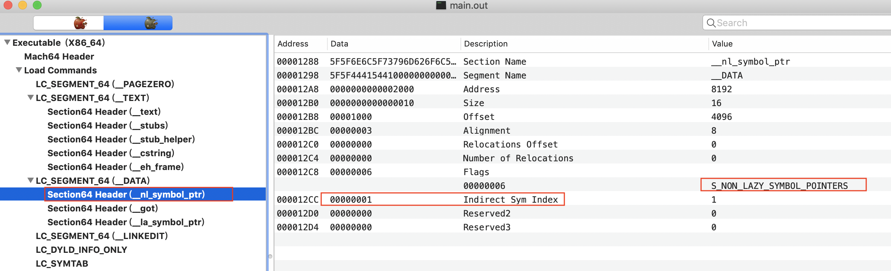

    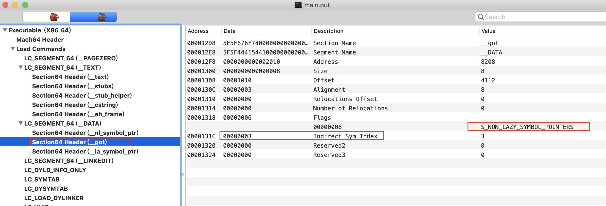

    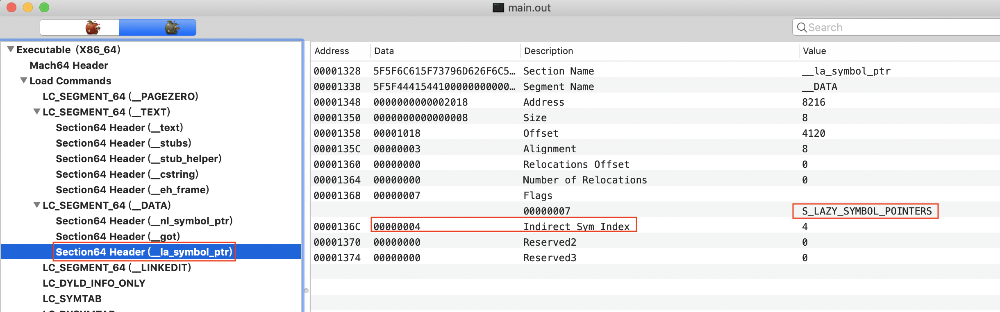

    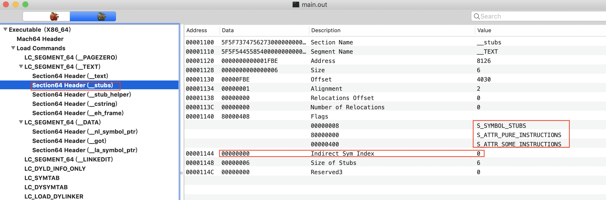

    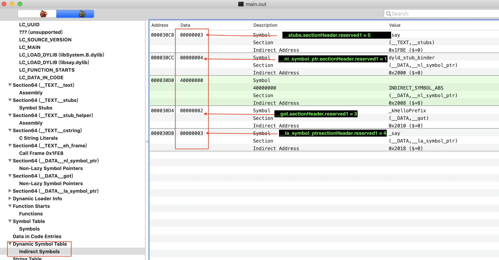

### section(\_\_TEXT， \_\_stubs)

+ 对于程序段`__text`里的代码，对函数型符号的引用，指向到了`__stubs`。和`__got`一样，`__stubs`也是一个表，每个表项是一小段`jmp`代码，称为「符号桩」。和`__got`不同的是，`__stubs`存在于 __TEXT segment 中，所以其中的条目内容是不可更改的。

+ 在前面遗留了一个问题， `此时跳转到0x1fbe，0x1fbe位置的指令是什么?`

  

  - 根据前面的分析`__stubs.sectionHeader.reserved1 = 0`, 通过上面分析，该位置存储的应该是_say函数的地址

+ 查看`__stubs`里的反汇编内容

  ```shell
  $ otool -v main.out -s __TEXT __stubs
  
  main.out:
  Contents of (__TEXT,__stubs) section
  0000000000001fbe	jmpq	*0x54(%rip)
  
  ## 计算跳转的位置
  ## 0x0000000000001fbe地址存放的指令是FF2554000000 即为jmpq	*0x54(%rip), 共占用6个字节
  ## %rip即为0x0000000000001fbe + 0x06 = 0x1FC4
  ## jmpq	*0x54(%rip) = jmpq [0x1FC4 + 0x54 ] = jmpq [0x2018]
  
  ## 结论是跳转的地址是0x2018存储的内容
  ```

### section(\_\_DATA ,\_\_la_symbol_ptr)

+ `0x2018`位于section(\_\_DATA ,\_\_la_symbol_ptr)区域

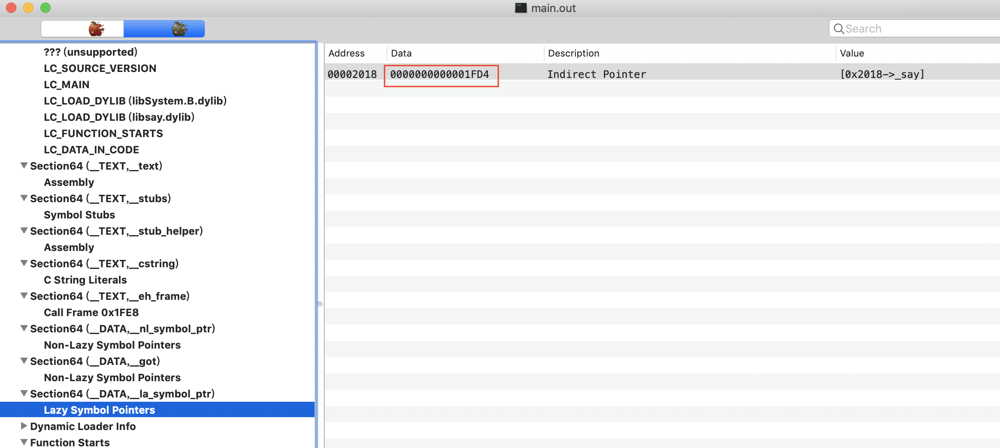

+ 在`0x2018`位置存储的是`0x1FD4`，因此上面的指令跳转`0x1FD4`到位置

### section(\_\_TEXT ，\_\_stub_helper)

+ `0x1FD4`位置位于section(\_\_TEXT ，\_\_stub_helper)内, 其最终`jmp [0x2000]`

  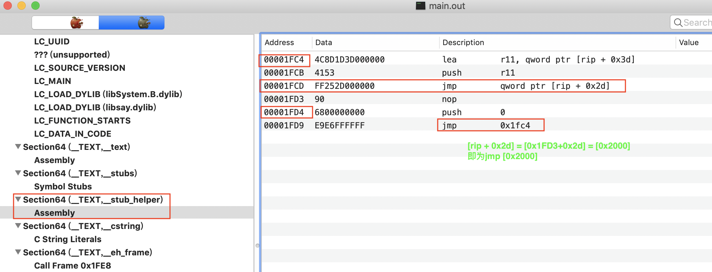

### Section64(\_\_DATA, \_\_nl_symbol_ptr)

+ `0x2000`位于Section64(\_\_DATA, \_\_nl_symbol_ptr)内

  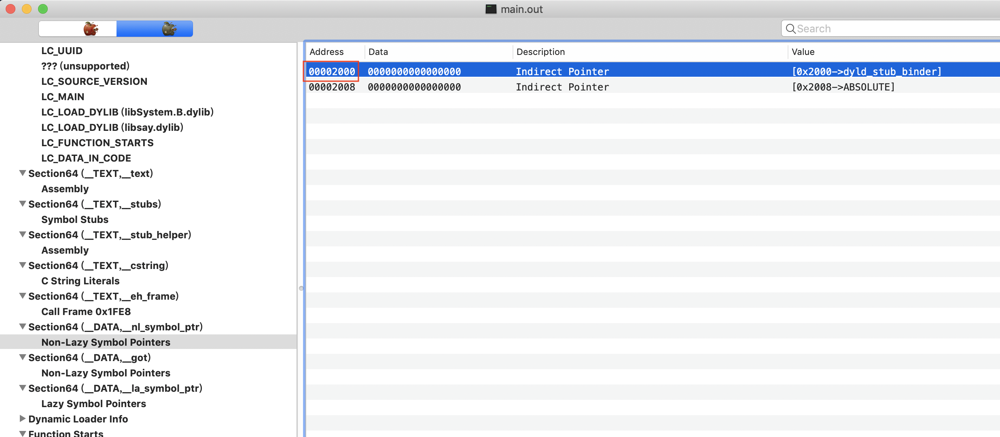

  - `Section64(__DATA, _nl_symbol_ptr)`存放的是一系列地址， `__nl_symbol_ptr.sectionHeader.reserved1 = 1`,通过经过上面的分析， `0x2000`位置对应的符号为`dyl_stub_binder`
  - 因此要找到say函数的地址，先要调用dyld的`dyl_stub_binder`函数，然后获得得到say函数的地址，更新到section(\_\_DATA ,\_\_la_symbol_ptr)的对应的条目中

### Lazy Binding 分析

+ 上文结合 main.out 实例，对 Mach-O 与动态链接相关的结构做了比较全面的分析。Non-lazy binding 比较容易理解，这里稍微对如上内容进行整合，整体对 lazy binding 基本逻辑进行概述。

+ 对于`__text`代码段里需要被 lazy binding 的符号引用（如上文 main.out 里的_say），访问它时总会跳转到 stub 中，该 stub 的本质是一个 jmp 指令，该 stub 的跳转目标地址坐落于`__la_symbol_ptr`。

+ 首次访问_say时：

  0. _say对应的stubs的条目，该条目存放的指令所需要的跳转地址位于`__la_symbol_ptr`对应条目中

     ```assembly
     # 在main.c中要调用_say
     call 0x1fbe
     
     # stubs第一个条目
     # 0x1fbe: ff2554000000
     # ff2554000000对应的指令为
     0000000000001fbe	jmpq	*0x54(%rip) => jmpq [0x2018]
     
     ## 0x2018位于__la_symbol_ptr区域中
     ```

  1. _say`对应的`__la_symbol_ptr`条目内容指向到`__stub_helper

     ```assembly
     # __la_symbol_ptr第一个条目
     # 0x2018: 0x1FD4
     
     #0x1FD4 位于stub_helper
     ```

  2. __stub_helper`里的代码逻辑，通过各种辗转最终调用`dyld_stub_binder`函数`

  3. `dyld_stub_binder`函数通过调用 dyld 内部的函数找到`_say`符号的真实地址

  4. `dyld_stub_binder`将地址写入`__la_symbol_ptr`条目

     ```
     为什么是写到section(_DATA, __la_symbol_ptr)中, 而不是写到section(_TEXT, __stub)中？
     因为section(_TEXT, __stub)位于代码段，是只读的
     ```

  5. `dyld_stub_binder`跳转到`_say`符号的真实地址

+ 再次访问`_say`时
  - stub 里的 jmp 指令直接跳转符号的真实地址，因为该地址已经被写到`__la_symbol_ptr`条目中。

### 总结

+ 寻找`section(__TEXT, __text)`中使用的**外部变量**的地址的过程

  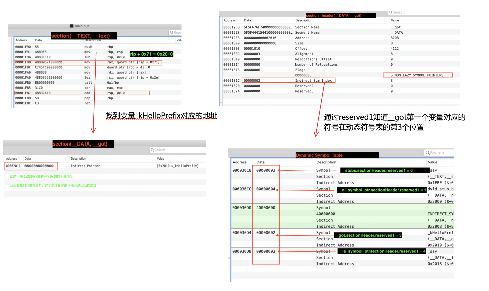

  - 当dyld加载对应的动态库后，确定了符号`_kHelloPrefix`在符号表中该符号对应的地址，更新到__got对应的条目中
  - `section(__DATA, __got)`保存的是`外部变量的地址`

+ 寻找`section(__TEXT, __text)`中使用的**外部函数**的地址的过程

  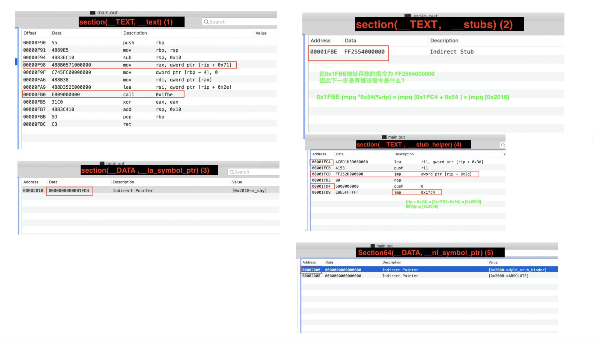

  - 当dyld加载动态库时，通过dyld_stub_binder去找到say的函数地址, 并更新dyld_stub_binder的地址到`Section(__DATA, __nl_symbol_ptr)`的第一个条目

  - 当找到say的地址后，更新到`Section(__DATA, __la_symbol_ptr)`对应的条目

  - `Section(__DATA, __la_symbol_ptr)`保存的是`外部函数的地址`

    ```
    某个条目对应哪个符号的寻找过程，跟__got的一样
    ```

