##mach-o与静态链接

> 疑问?
>
> 用machoView查看时，发现并不是AT&T汇编，而是Intel汇编。Mach-O文件不应该都是AT&T汇编吗?
>
> 不过这个并不影响接下来的分析过程

### 静态链接

+ 所谓静态链接，其本质是把程序各个模块的中间文件粘在一起，拼装成一个整体；换句话说，以模块的中间文件为输入，产生一个新的 Mach-O 文件（往往是可执行文件）

+ 静态链接主要过程包括 
  - 地址和空间分配（Address and Storage Allocation）
  - 符号决议（Symbol Resolution）
  - 重定位（Relocation）
+ 其中最核心是「重定位」过程。静态链接的重定位是围绕符号进行的，搞清楚了 Mach-O 文件中的符号，也就搞清楚了静态链接。

### 目标文件的符号分析

+ 使用下面两个源代码文件 a.c 和 b.c 作为例子展开分析

  ```c
  /* a.c */
  extern int shared;
  void swap(int *a, int *b);
  int main() {
      int a = 100;
      swap(&a, &shared);
      return 0;
  }
  
  /* b.c */
  int shared = 42;
  void swap(int *a, int *b) {
      int temp = *a;
      *a = *b;
      *b = temp;
  }
  ```

+ 从代码中可以看到:

  - b.c 总共定义了两个全局符号，一个是变量`shared`，另外一个是函数`swap`；
  - a.c 里面定义了一个全局符号`main`；后者引用了前者的俩符号。

+ 使用 gcc 将这俩文件分别编译成目标文件 a.o 和 b.o

  ```shell
  # 生成 a.o 和 b.o
  $ gcc -c a.c b.c
  ```

+ 通过MachOView查看`a.o`的汇编代码

  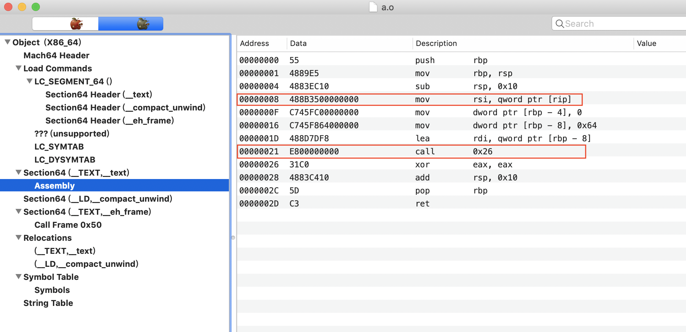

  - `48 8B35 00000000`: 其中`48`是 movq 的操作码，`00000000`描述`_shared`的符号值（地址值）
  - `E8 00000000`: 其中`E8`是 callq 的的操作码，`00000000`描述`_swap`的符号值（地址值）
  - 那么问题来了？ 我们怎么知道这两个位置对应的符号应该是`_shared`和`_swap`的地址呢?

### 通过section_header找到重定位表

+ 对于load_commands有`segment_command_64`

  ```C
  struct segment_command_64 { /* for 64-bit architectures */
  	uint32_t	cmd;		/* LC_SEGMENT_64 */
  	uint32_t	cmdsize;	/* includes sizeof section_64 structs */
  	char		segname[16];	/* segment name */
  	uint64_t	vmaddr;		/* memory address of this segment */
  	uint64_t	vmsize;		/* memory size of this segment */
  	uint64_t	fileoff;	/* file offset of this segment */
  	uint64_t	filesize;	/* amount to map from the file */
  	vm_prot_t	maxprot;	/* maximum VM protection */
  	vm_prot_t	initprot;	/* initial VM protection */
  	uint32_t	nsects;		/* number of sections in segment */
  	uint32_t	flags;		/* flags */
  };
  ```

+ cmdsize长度的`segment_command_64`包含的内容有

  - `sizeof(struct segment_command_64)`: segment_command_64结构体本身的大小

  - 一系列的`section_64`(**section64 header**)结构大小

    ```c
    struct section_64 { /* for 64-bit architectures */
    	char		sectname[16];	/* name of this section */
    	char		segname[16];	/* segment this section goes in */
    	uint64_t	addr;		/* memory address of this section */
    	uint64_t	size;		/* size in bytes of this section */
    	uint32_t	offset;		/* file offset of this section */
    	uint32_t	align;		/* section alignment (power of 2) */
    	//通过reloff来确定某个section重定位信息在整个文件中的偏移
    	uint32_t	reloff;		/* file offset of relocation entries */
    	//通过nreloc来确定某个section重定位信息的数量
    	uint32_t	nreloc;		/* number of relocation entries */
    	uint32_t	flags;		/* flags (section type and attributes)*/
    	uint32_t	reserved1;	/* reserved (for offset or index) */
    	uint32_t	reserved2;	/* reserved (for count or sizeof) */
    	uint32_t	reserved3;	/* reserved */
    };
    ```

+ 通过reloff来确定某个section重定位信息的位置, 通过nreloc来确定某个section重定位信息的数量

  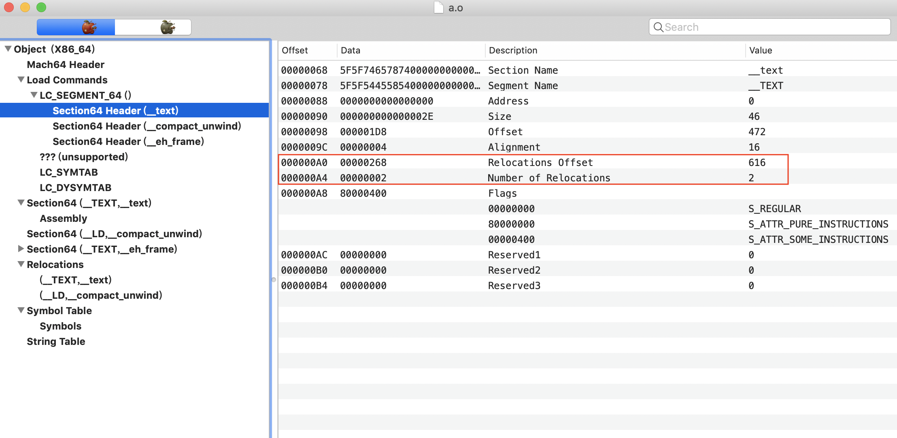

  + reloff为`0x0000268`,表示section(_text)的重定位信息在整个文件中的偏移为`0x0000268`
  + nreloc为2, 表示section(_text)共有2个需要重定位的位置

+ 查看对应的重定位表

  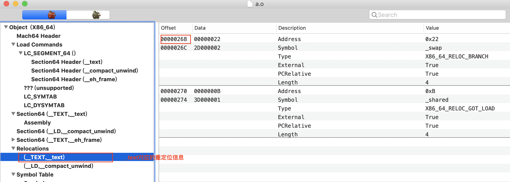

### 重定位表 (Relocation Symbol Table)

- 在每个可重定位的 Mach-O 文件中，有一个叫重定位（Relocation）的区域，专门用来保存这些和重定位相关的信息。

- 某个 section 如果内含需要被重定位的字节，就会有一个 relocation table 与此对应：

  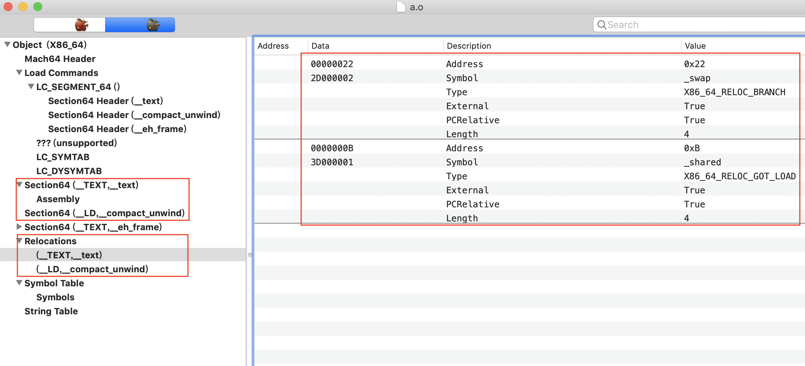


+ Relocation table可以看作是一个 relocation entry 的数组，每个 relocation entry 占 8 个字节, 对应结构体是`relocation_info`:

  ```java
  struct relocation_info {
      int32_t   r_address;      /* offset in the section to what is being relocated */
      uint32_t  r_symbolnum:24, /* symbol index if r_extern == 1 or section ordinal if r_extern == 0 */
                r_pcrel:1,      /* was relocated pc relative already */
                r_length:2,     /* 0=1 byte, 1=2 bytes, 2=4 bytes, 3=8 bytes */
                r_extern:1,     /* does not include value of sym referenced */
                r_type:4;       /* if not 0, machine specific relocation type */
  };
  ```

  + `r_address`表示相对于 section 的偏移量
  + `r_length`表示需要被 relocation 的字节范围， 0=1 byte, 1=2 bytes, 2=4 bytes, 3=8 bytes
  + `r_pcrel`表示地址值是否是 PC 相对地址值
  + `r_extern`标记该符号是否是外部符号
  + `r_symbolnum`，index 值，对于外部符号，它描述了符号在 symbol table 中的索引（从0开始）；如果是内部符号，它描述了符号所在的 section 的索引（按照LC_SEGMENT load commands加载顺序排序，范围是1~255）
  + `r_type`，符号类型

+ 以刚才的 a.o 为例：

  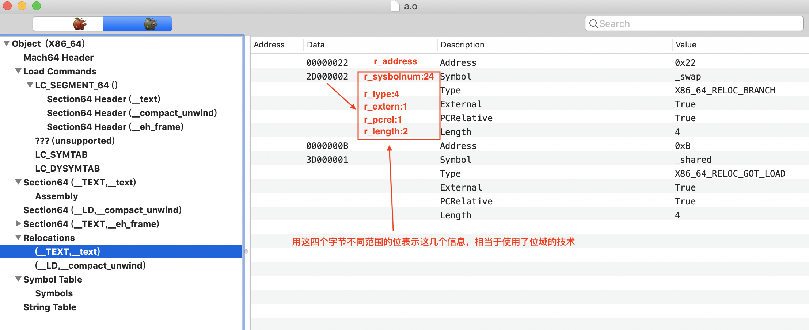

  ```
  这里解析第一个元素
  
  0x00000022:ra_address, 表明该符号在section中的偏移为0x22
   
  0x2D000002:
  
  低位的24位(r_symbolnum:24)，值为 0x000002，即为2
  
  2D转为2进制:0010 1101 
  
  第25位(r_pcrel:1)，值为1，表示该地址是相对于PC的相对地址 
  26~27位(r_length:2)，值为 0b10，即2，也就是4 bytes
  28位(r_extern:1)，值为 1，表示该符号是外部符号
  29~32位(r_type:4)，值为 0b0010。
  
  
  这里因为r_extern值为1，表示是外部符号，所以这里的r_symbolnum表示在symbol表中的索引（从0开始）。
  根据后面的Symbol Table可以找到索引为1的符号，也就是_swap
  ```

### 符号表(Symbol Table)

+ 从上文的`r_symbolnum`可以看出，`relocation_info`并未完整描述符号信息，它只是告诉链接器哪些指令需要调整地址。符号的具体信息（包括符号名等）在 symbol table 中：

  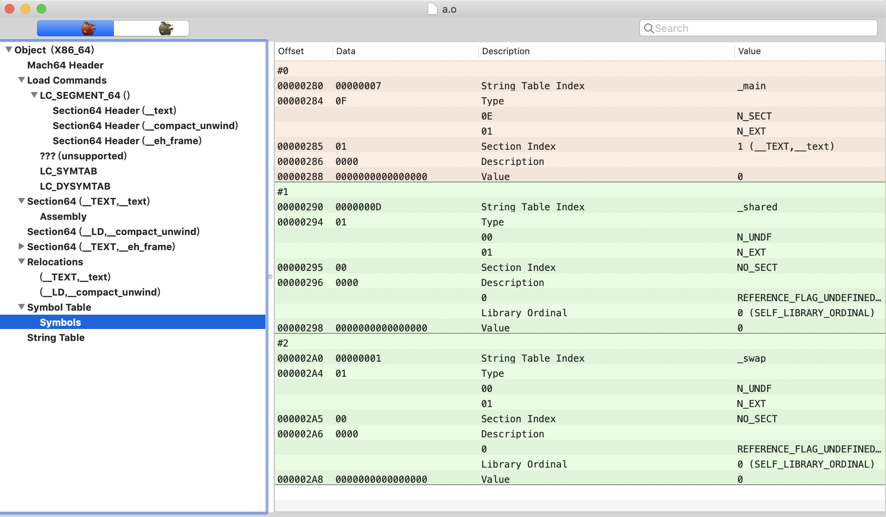

+ 链接器是通过 `LC_SYMTAB` 这个 load command 找到 symbol table 的，LC_SYMTAB 对应的 command 结构体如下：

  ```c
  struct symtab_command {
      uint32_t cmd;     /* LC_SYMTAB */
      uint32_t cmdsize; /* sizeof(struct symtab_command) */
      //symoff:符号表在文件中的偏移
      uint32_t symoff;  /* symbol table offset */
      //nsyms:符号表的entry数量
      uint32_t nsyms;   /* number of symbol table entries */
      //stroff:字符串表在文件中的偏移
      uint32_t stroff;  /* string table offset */
      //strsize:字符串表的大小
      uint32_t strsize; /* string table size in bytes */
  };
  ```

+ 符号表是以nlist_64结构体为元素的数组

  ```c
  struct nlist_64 {
      union {
          uint32_t n_strx;   /* index into the string table */
      } n_un;
      uint8_t  n_type;       /* type flag, see below */
      uint8_t  n_sect;       /* section number or NO_SECT */
      uint16_t n_desc;       /* see <mach-o/stab.h> */
      uint64_t n_value;      /* value of this symbol (or stab offset) */
  };
  ```

  - `n_un`，符号的名字（在一个 Mach-O 文件里，具有唯一性），**其值为在 String Table 中的索引值**，String Table 实际是一个 char 类型的数组，即一个大字符串。根据`n_un`的值在 String Table中开始，到遇到 00 字节结束。
  - `n_sect`，符号所在的 section index（有效值从 1 开始，最大为 255，同上文）
  - `n_value`，**符号的地址值（在链接过程中，会随着其 section 发生变化）**
  - `n_type`和`n_desc`表达的意思稍微复杂点；都是多功能组合字段，主要参考[kernel/nlist_64](https://links.jianshu.com/go?to=https%3A%2F%2Fdeveloper.apple.com%2Fdocumentation%2Fkernel%2Fnlist_64%2F)。`n_type`是一个 8 bit的复合字段，由4种mask组成
  - `N_STAB` (0xe0，即0b 1110 0000)，即最高三位，如果不为 0，表示这是一个与调试有关的符号，值意义类型详见参考。
  - `N_PEXT` (0x10，即0b 0001 0000)，即第4位，若为 1，则表示该符号是有限全局范围(`__private_extern__`)，当静态链接时会清除`N_EXT`位的设置。
  - `N_TYPE` (0x0e，即0b 0000 1110)，5~7位，定义了符号的类型（详细定义见参考）。
  - `N_EXT` (0x01，即0b 0000 0001)，第8位，若为1，表示符号为外部符号，即该符号要么定义在外部，要么定义在本地但是可以被外部使用。

### 字符串表

+ 字符串表相当于是一个char类型的数组

+ 在符号表中，对于下标为2的符号，其在字符串表中的偏移为1，此时该符号对应的字符串为`_swap`

  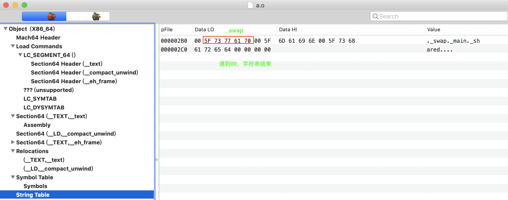

  可以看到，查询到的结果为：`_ (0x5F）s（0x73）w（0x77）a（0x61）p（0x70)`。从ASCII码查表即可得到结果，即我们这里的符号名`_swap`。

### 确定重定位符号在Section(_TEXT, _text)指令中的位置


+ 对于第一个重定位符号,其在Section(_TEXT, _text)中的位置为0x22

+ 对于第二个重定位符号,其在Section(_TEXT, _text)中的位置为0xB

  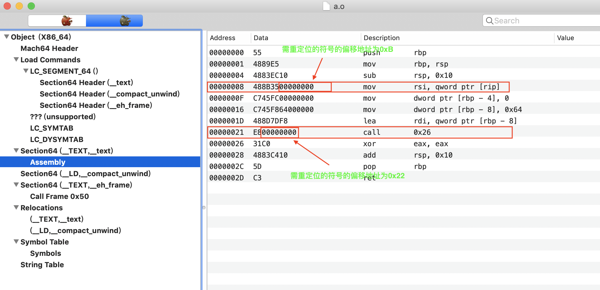

  

+ 当进行静态链接后，从符号表中得到符号正确的地址，然后重定位对应指令中的符号地址。

### 可执行文件的符号分析

+ 先使用`ld`工具（静态链接器）对如上 a.o、b.o 进行链接，生成可执行文件：

  ```shell
  # 生成可执行文件 ab.out
  ld a.o b.o -macosx_version_min 10.14 -o ab.out -lSystem
  ```

+ 此时查看我们的`ab.out`文件的代码段

  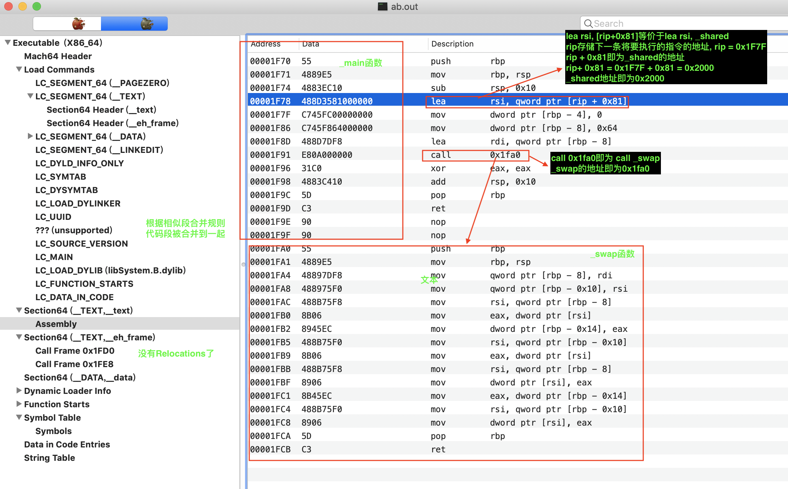

+ 查看符号表

  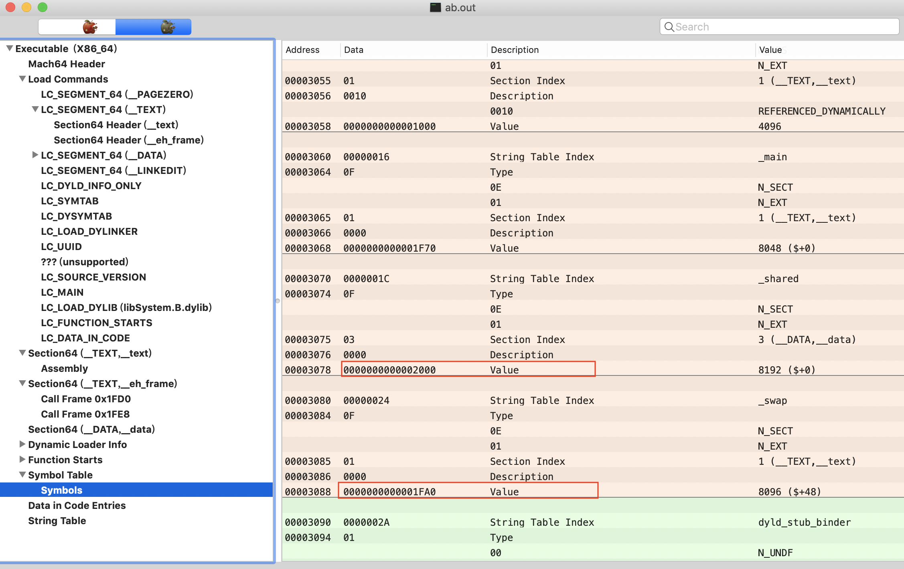

  - 符号表中`_swap`和`_shared`对应的地址值确实跟代码段中的地址一致

+ 查看`_shared`对应的值

  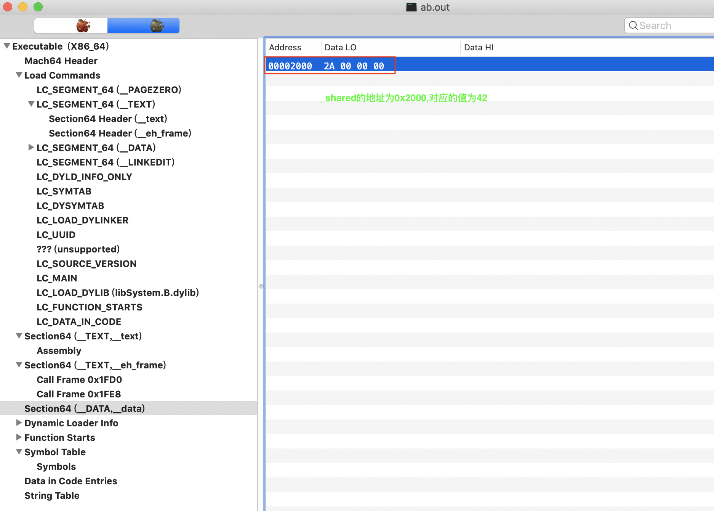

  

### 总结

+ 可重定向的`.o文件`中存在重定位信息, 通过对应section的header的reloff和nreloc可以找到对应的重定位信息
+ 重定位信息包含需要重定位的符号在指令中的位置以及在在符号表中的位置
+ 通过符号表可以该符号在字符串表中的位置
+ 当链接器ld将多个可重定向的`.o`链接成可执行文件时，其相似段合并。将字符串表合并，将符号表合并成一个全局符号表，此时符号表中的所有符号的地址都可以确定了
+ 再根据重定位信息更新相应指令中符号的地址即可

### 参考

+ https://www.jianshu.com/p/92b4f611170a
+ https://zhangbuhuai.com/post/macho-static-link.html