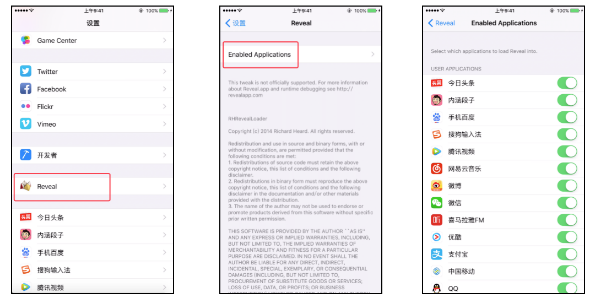
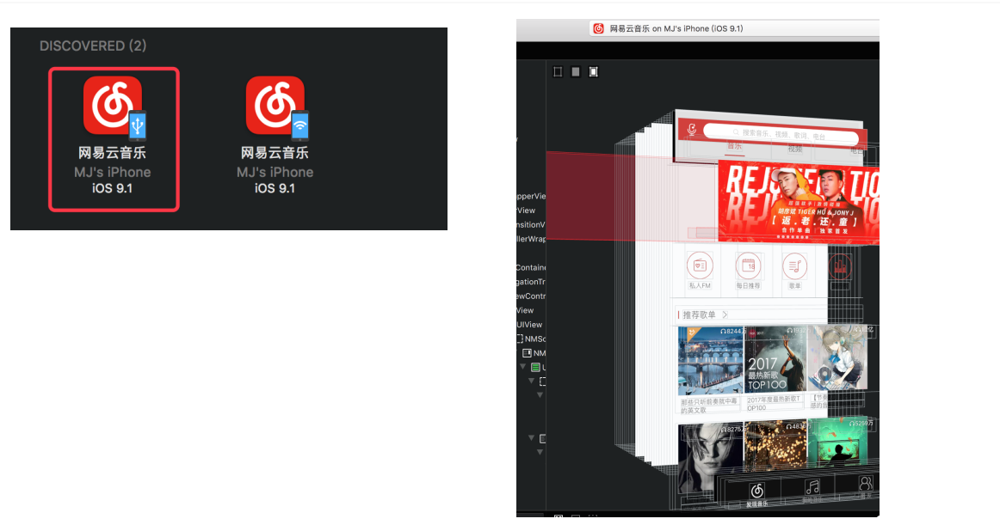

## Reveal

> 安装遇到问题，参考越狱常见问题
>
> Reveal请下载破解版的，我的百度网盘"软件"目录有

### Reveal概述

+ Reveal是一款调试iOS程序UI界面的神器
+ 官网：https://revealapp.com
+ 下载：https://revealapp.com/download/
  + 建议下载至少Reveal4版本，支持USB连接调试，速度快。低版本的只能WiFi连接调试

### 调试环境配置1

+ iPhone上安装Reveal Loader

  + 软件源：http://apt.so/codermjlee

  + 不要安装其他源的版本，有可能不支持新版Reveal

    

  + 如果不能安装, 在课件的工具中提供了一个Reveal Loader安装包

### 调试环境配置2

+ 安装完Reveal Loader后，打开【设置】，选择需要调试的APP

+ 新下载的app，一定要记得去打开开关

  

### 调试环境配置3

+ 找到Mac的Reveal中的RevealServer文件，覆盖iPhone的/Library/RHRevealLoader/RevealServer文件

  

+ 重启SpringBoard或者重启手机，可以在iPhone上输入终端命令
  + 重启SpringBoard：killall SpringBoard
  + 重启手机：reboot

### 选择USB方式开始调试

+ 从右侧可以看到该控制器的名字NMDiscoverRecommendViewController以及当前的虚拟内存0x106104600

