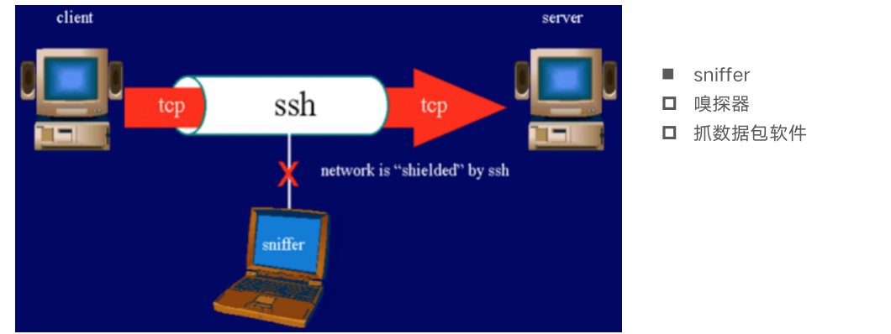
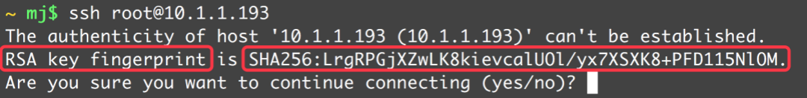
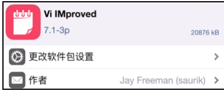

## SSH登录iPhone

### Mac远程登录到iPhone

+ 我们经常在Mac的终端上，通过敲一些命令行来完成一些操作

+ iOS和Mac OS X都是基于Darwin（苹果的一个基于Unix的开源系统内核），所以iOS中同样支持终端的命令行操作

  + 在逆向工程中，我们经常会通过命令行来操纵iPhone

+ 为了能够让Mac终端中的命令行能作用在iPhone上，我们得让Mac和iPhone建立连接

  + 通过Mac远程登录到iPhone的方式建立连接

    

  + Mac登录到iPhone后，在Mac敲终端执行传输到iPhone中执行

### SSH、OpenSSH

+ SSH

  + Secure Shell的缩写，意为“安全外壳协议”，是一种可以为远程登录提供安全保障的协议
  + 使用SSH，可以把所有传输的数据进行加密，“中间人”攻击方式就不可能实现，能防止DNS欺骗和IP欺骗

  

+ OpenSSH

  + 是SSH协议的免费开源实现
  + 可以通过OpenSSH的方式让Mac远程登录到iPhone

### OpenSSH安装

+ 在iPhone上通过Cydia安装OpenSSH工具（软件源http://apt.saurik.com）

  

+ OpenSSH的具体使用步骤可以查看Description中的描述

  

### OpenSSH远程登录步骤

+ SSH是通过TCP协议通信，所以要确保Mac和iPhone在同一局域网下，比如连接着同一个WiFi

  + 在Mac的终端输入ssh 账户名@服务器主机地址
  + 比如ssh root@10.1.1.168（这里的服务器是手机）
  + 初始密码alpine

+ 登录成功后就可以使用终端命令行操作iPhone

+ 退出登录命令是exit

  

### root、mobile账户

+ iOS下有2个常用账户：root、mobile

  + root：最高权限账户，$HOME是/var/root
  + mobile：普通权限账户，只能操作一些普通文件，不能操作系统级别的文件，$HOME是/var/mobile

+ 登录mobile用户：root mobile@服务器主机地址

+ root和mobile用户的初始登录密码都是alpine

  

+ 最好修改一下root和mobile用户的登录密码（登录root账户后，分别通过passwd、passwd mobile完成）

  

### SSL、OpenSSL

+ 很多人会将SSH、OpenSSH、SSL、OpenSSL搞混

+ SSL

  + Secure Sockets Layer的缩写，是为网络通信提供安全及数据完整性的一种安全协议，在传输层对网络连接进行加密

+ OpenSSL

  + SSL的开源实现
  + 绝大部分HTTPS请求等价于：HTTP + OpenSSL

+ OpenSSH的加密就是通过OpenSSL完成的

  

### SSH的版本

+ SSH协议一共2个版本
  + SSH-1
  + SSH-2
+ 现在用的比较多的是SSH-2，客户端和服务端版本要保持一致才能通信
+ 查看SSH版本（查看配置文件的Protocol字段）
  + 客户端：/etc/ssh/ssh_config
  + 服务端：/etc/ssh/sshd_config

### SSH的通信过程

+ SSH的通信过程可以分为3大主要阶段
  1. 建立安全连接
  2. 客户端认证
  3. 数据传输

### 建立安全连接

+ 在建立安全连接过程中，服务器会提供自己的身份证明

  

+ 如果客户端并无服务器端的公钥信息，就会询问是否连接此服务器

  

### 服务器身份信息变更

+ 在建立安全连接过程中，可能会遇到以下错误信息：提醒服务器的身份信息发生了变更

+ 如果确定要连接此服务器，删除掉之前服务器的公钥信息就行

  ```shell
  $ ssh-keygen -R 服务器IP地址
  ```

+ 或者直接打开known_hosts文件删除服务器的公钥信息就行

  ```shell
  $ vim ~/.ssh/known_hosts
  ```

### SSH的客户端认证方式

+ SSH-2提供了2种常用的客户端认证方式
  + 基于密码的客户端认证
    + 使用账号和密码即可认证
  + 基于密钥的客户端认证
    + 免密码认证
    + 最安全的一种认证方式
+ SSH-2默认会优先尝试“密钥认证”，如果认证失败，才会尝试“密码认证”

### SSH - 基于密钥的客户端认证


+ 在客户端生成一对相关联的密钥（Key Pair）：一个公钥（Public Key），一个私钥（Private Key）

  ```
  $ ssh-keygen
  一路敲回车键（Enter）即可
  OpenSSH默认生成的是RSA密钥，可以通过-t参数指定密钥类型
  生成的公钥：~/.ssh/id_rsa.pub
  生成的私钥：~/.ssh/id_rsa
  ```

+ 把客户端的公钥内容追加到服务器的授权文件（~/.ssh/authorized_keys）尾部

  ```
  $ ssh-copy-id root@服务器主机地址
  需要输入root用户的登录密码
  ssh-copy-id会将客户端~/.ssh/id_rsa.pub的内容自动追加到服务器的~/.ssh/authorized_keys尾部
  ```

+ 注意：由于是在~文件夹下操作，所以上述操作仅仅是解决了root用户的登录问题（不会影响mobile用户）

### 公钥 >> 授权文件

+ 可以使用ssh-copy-id将客户端的公钥内容自动追加到服务器的授权文件尾部，也可以手动操作
  + 复制客户端的公钥到服务器某路径
    + $ scp ~/.ssh/id_rsa.pub root@服务器主机地址:~
    + scp是secure copy的缩写，是基于SSH登录进行安全的远程文件拷贝命令，把一个文件copy到远程另外一台主机上
    + 上面的命令行将客户端的~/.ssh/id_rsa.pub拷贝到了服务器的~地址
  + SSH登录服务器
    + ssh root@服务器主机地址
    + 需要输入root用户的登录密码
  + 在服务器创建.ssh文件夹
    + mkdir .ssh
  + 追加公钥内容到授权文件尾部
    + cat ~/id_rsa.pub >> ~/.ssh/authorized_keys
  + 删除公钥
    + rm ~/id_rsa.pub

### 文件权限问题

+ 如果配置了免密码登录后，还是需要输入密码，需要在服务器端设置文件权限
  + chmod 755 ~
  + chmod 755 ~/.ssh
  + chmod 644 ~/.ssh/authorized_keys

### 22端口

+ 端口就是设备对外提供服务的窗口，每个端口都有个端口号（范围是0~65535，共2^16个）

+ 有些端口号是保留的，已经规定了用途，比如

  + 21端口提供FTP服务
  + 80端口提供HTTP服务
  + 22端口提供SSH服务（可以查看/etc/ssh/sshd_config的Port字段）
  + 更多保留端口号： https://baike.baidu.com/item/%E7%AB%AF%E5%8F%A3%E5%8F%B7/10883658#4_3

+ iPhone默认是使用22端口进行SSH通信，采用的是TCP协议

  

### 通过USB进行SSH登录

+ 默认情况下，由于SSH走的是TCP协议，Mac是通过网络连接的方式SSH登录到iPhone，要求iPhone连接WiFi

  

+ 为了加快传输速度，也可以通过USB连接的方式进行SSH登录

  + Mac上有个服务程序usbmuxd（它会开机自动启动），可以将Mac的数据通过USB传输到iPhone

  + /System/Library/PrivateFrameworks/MobileDevice.framework/Resources/usbmuxd

    

### usbmuxd的使用1

+ 下载usbmuxd工具包（下载v1.0.8版本，主要用到里面的一个python脚本：tcprelay.py）

  + https://cgit.sukimashita.com/usbmuxd.git/snapshot/usbmuxd-1.0.8.tar.gz

+ 将iPhone的22端口（SSH端口）映射到Mac本地的10010端口

  + cd ~/Documents/usbmuxd-1.0.8/python-client

  + python tcprelay.py -t 22:10010

  + 加上-t参数是为了能够同时支持多个SSH连接

    

+ 注意：要想保持端口映射状态，不能终止此命令行（如果要执行其他终端命令行，请新开一个终端界面）

+ 不一定非要10010端口，只要不是保留端口就行

### usbmuxd的使用2

+ 端口映射完毕后，以后如果想跟iPhone的22端口通信，直接跟Mac本地的10010端口通信就可以了

  + 新开一个终端界面，SSH登录到Mac本地的10010端口（以下方式2选1）

    + ssh root@localhost -p 10010

    + ssh root@127.0.0.1 -p 10010
    + localhost是一个域名，指向的IP地址是127.0.0.1，本机虚拟网卡的IP地址

  + usbmuxd会将Mac本地10010端口的TCP协议数据，通过USB连接转发到iPhone的22端口

+ 远程拷贝文件也可以直接跟Mac本地的10010端口通信

  + scp -P 10010 ~/Desktop/1.txt root@localhost:~/test
  + 将Mac上的~/Desktop/1.txt文件，拷贝到iPhone上的~/test路径
  + 注意：scp的端口号参数是大写的-P

### iOS终端的中文乱码问题

+ 默认情况下，iOS终端不支持中文输入和显示

+ 解决方案：新建一个~/.inputrc文件，文件内容是

  ```
  #不将中文字符转化为转义序列
  set convert-meta off
  
  #允许向终端输出中文
  set output-meta on
  
  #允许向终端输入中文
  set meta-flag on
  set input-meta on
  ```

+ 如果是想在终端编辑文件内容，可以通过Cydia安装一个vim（软件源http://apt.saurik.com）

  


### 两个脚本文件

+ usb.sh: 建立usb端口映射

  ```shell
  #!/bin/bash
  python tcprelay.py -t 22:10010
  ```

+ login.sh: 登录手机root用户

  ```shell
  #!/bin/bash
  ssh root@localhost -p 10010
  ```

  