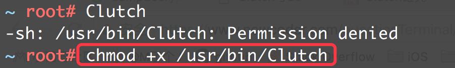

## 脱壳

### 加壳概述

+ 当我们把ipa文件上传到appstore后，苹果会对我们的应用进行加壳
+ 从appstore下载的ipa文件是经过苹果进行加壳的
+ 加壳:利用特殊的算法，对可执行文件的编码进行改变（比如压缩、加密），以达到保护程序代码的目的


1. 加壳前: 可执行文件直接装载到内存中
2. 加壳后: 壳程序内部包含着加密的可执行文件，将壳程序加载到内存中后，壳程序对可执行文件进行解密操作。

### 脱壳概述

+ 摘掉壳程序，将未加密的可执行文件还原出来（有些人也称为“砸壳”）

+ 脱壳主要有2种方法：硬脱壳、动态脱壳

  

  1. 硬脱壳: 直接对壳程序执行解密算法，获取解密后的可执行文件
  2. 动态脱壳: 将壳程序装载到内存中后，壳程序会自动对可执行文件进行解密，我们只需要从内存中导出即可。

### 脱壳工具-Cluth

#### 1 配置

+ 下载最新的Release版： https://github.com/KJCracks/Clutch/releases

+ 建议去掉版本号，改名为Clutch

+ 将Clutch文件拷贝到iPhone的/usr/bin目录

+ 如果在iPhone上执行Clutch指令，权限不够，赋予“可执行的权限”

  

#### 2 使用

+ 列出已安装的APP：Clutch -i

  

+ 输入APP序号或者Bundle Id进行脱壳操作：Clutch -d APP序号或BundleId

  

  

+ 脱壳成功后会生成一个ipa文件

  

### 脱壳工具-dumpdecrypted

#### 1 配置 

+ 地址: https://github.com/stefanesser/dumpdecrypted/

+ 下载源代码，然后在源代码目录执行make指令进行编译，获得dylib动态库文件

  

  

+ 将dylib文件拷贝到iPhone上（如果是root用户，建议放/var/root目录）

#### 2. 使用

+ 终端进入dylib所在的目录

+ 通过`ps -A`查看获取可执行文件路径（app必须运行起来）

+  使用环境变量DYLD_INSERT_LIBRARIES将dylib注入到需要脱壳的可执行文件`DYLD_INSERT_LIBRARIES=dumpdecrypted.dylib   可执行文件路径`

  

+ .decrypted文件就是脱壳后的可执行文件

  

  

### 脱壳工具-frida-ios-dump

#### 0 参考链接

+ https://www.jianshu.com/p/e3936eb2084c
+ https://juejin.im/post/5d31e95cf265da1b7a4baf62

#### 1. 配置

##### 手机端配置

+ 越狱手机打开cydia 添加源： https://build.frida.re
+ 查找安装插件frida

##### Mac端配置

+ 安装`Python`

  ```shell
  $ brew install python
  
  //注意:可能会需要更改mac默认版本
  ```

+ 安装`wget`

  ```shell
  $ brew install wget
  ```

+ 安装`pip`

  ```shell
  $ wget https://bootstrap.pypa.io/get-pip.py
  $ sudo python get-pip.py
  ```

+ 安装`frida`

  ```shell
  $ sudo pip install frida –upgrade –ignore-installed six
  可能安装不上，先不用管，继续操作
  Invalid requirement: '\xe2\x80\x93upgrade'
  ```

+ 安装脚本依赖环境

  ```shell
  $ sudo pip install -r requirements.txt --upgrade
  ```

+ 安装`usbmuxd`与手机通信

  ```
  $ brew install usbmuxd
  ```

+ github下载并配置frida-ios-dump

  ```shell
  $ sudo mkdir /opt
  $ sudo mkdir /opt/dump 
  $ cd /opt/dump 
  $ sudo git clone https://github.com/AloneMonkey/frida-ios-dump
  ```

+ 修改/opt/dump/frida-ios-dump/dump.py内容

  ```python
  User = 'root'
  Password = 'alpine'
  Host = 'localhost'
  Port = 2222
  
  ## 1 如果密码有修改，请改成自己设置的密码
  ## 2 如果因权限问题不能修改内容，那么在外面修改dump.py后，重新覆盖dump.py
  ```

+ 在~/.bash_profile配置别名

  ```shell
  $ alias dump.py="/opt/dump/frida-ios-dump/dump.py"
  $ source ~/.bash_profile
  ```

+ 在mac端查看是否可以工作

  ```shell
  $ frida-ps -U
  ```

  

#### 2. 使用

+ 通过`USB`使用`ssh`连接设备，将`22`映射到电脑上的`2222端口`

  ```shell
  $ iproxy 2222 22
  ```

+ mac另开终端通过ssh连接iphone

  ```shell
  $ssh -p 2222 root@127.0.0.1
  ```

+ mac再开终端进行砸壳,在当前路径会生成对应已经被砸壳过的ipa文件

  ```shell
  $ dump.py 微信
  
  ## dump.py 应用程序名
  ```

  

### 三个工具的区别

+ Cluth:属于硬脱壳，不需要应用程序运行，只能解密可执行文件，但砸壳经常失败
+ dumpdecrypted: 属于动态脱壳，需要应用程序运行，只能解密可执行文件
+ frida-ios-dump: 属于动态脱壳, 需要应用程序运行, 不但能解密可执行文件，还能解密应用中动态库，扩展插件，以及watch应用等（推荐使用）

### 验证是否已经脱壳

+ 通过otool命令行也可以：otool   -l   可执行文件路径   |   grep   crypt 

+ MachOView查看mach-o文件, Load Commands -> LC_ENCRYPTION_INFO -> Crypt ID的值，0代表未加密

  

  